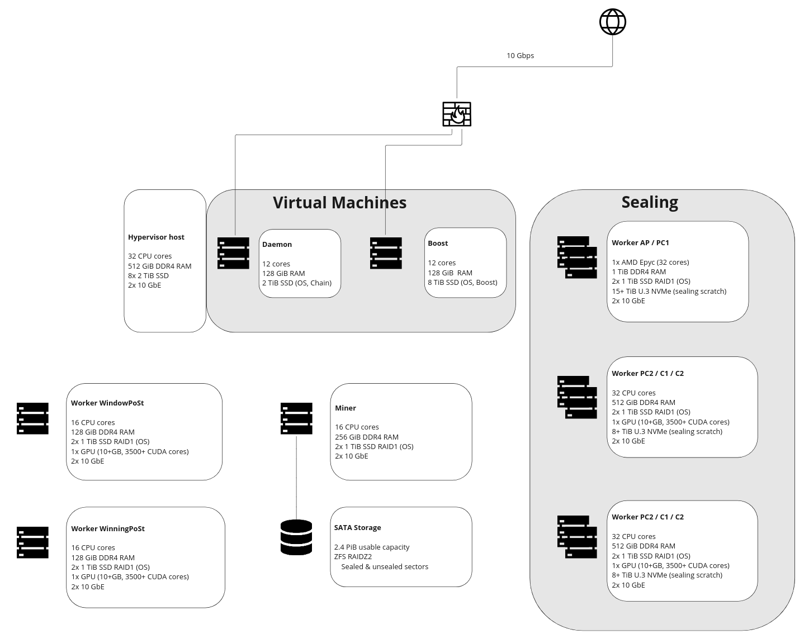

## 1 PiB raw architecture

The following reference architecture is designed for 1PiB of raw sectors or raw data to be stored. Let's discuss the various design choices of this architecture.

### Virtual machines

- 32 CPU Cores
- 512 GB RAM
- 8x 2TB SSD
- 2x 10GbE


Lotus daemon and Boost run as Virtual Machines in this architecture. The advantages of virtualization are well-known nowadays, including easy reconfiguration of parameters (CPU, memory, disk) and portability. The daemon is not a very intensive process by itself but must be available at all times. We recommend having a second daemon running as another VM or on the backup infrastructure to which you can fail over.

Boost is a resource intensive process, especially when deals are being ingested over the internet. It also feeds data of the deals into the Lotus miner.

We recommend 12-16 cores per VM and 128GiB of memory. Lotus daemon and Boost need to run on fast storage (SSD or faster). The capacity requirements of Boost depend on the size of deals you are accepting as a Storage Provider. Its capacity must serve as a landing space for deals until the data can be processed by your sealing cluster in the backend.

Both Lotus daemon and Boost require public internet connectivity. In the case of Boost you also need to consider bandwidth. Depending on the deal size you are accepting, you might require 1Gbps or 10Gbps internet bandwidth.

### Lotus miner

- 16 CPU Cores
- 256 GB RAM
- 2x 1TB SSD
- 2x 10GbE


Lotus miner becomes less of an intensive process with dedicated PoST workers separated from it (as we did in this design). If you use a dedicated storage server or NAS system as the storage target for your sealed and unsealed sectors, Lotus miner eventually could also become a VM. This requires additional CPU and memory on the hypervisor host.

We opted for a standalone Lotus miner in this design and gave it 256GiB of memory. This is because we operate ZFS at the storage layer, which requires a lot of memory for caching. Lotus miner has enough with 128GiB of memory when you choose for a dedicated storage server or NAS system for your storage.

### SATA Storage
In this architecture we have attached storage shelves to the Lotus miner with 2.4 PiB of usable capacity. This is the capacity after the creation of a RAIZ2 filesystem (double parity). We recommend vdevs of 12 disks wide. In RAIDZ2 this results in 10 data disks and 2 parity disks. Storage systems also don't behave well at 100% used capacity, so we designed for 20% extra capacity.

### PoST workers

- 16 CPU Cores
- 128 GB RAM
- 2x 1TB SSD
- 1x GPU 24+ GB memory, 6000+ CUDA cores
- 2x 10GbE


We have split off the Winning and Window PoST tasks from the Lotus miner. Using dedicated systems for those processes increase the likelyhood of winning block rewards and reduces the likelyhood of missing a proving deadline. For redundancy you can run a standby WindowPoST worker on the WinningPoST server and vice versa.

PoST workers require 128GiB of memory at the minimum and require a capable GPU with 24GB of memory and 6000 or more CUDA cores.

### Sealing workers
The sealing workers require the most attention during the design of a solution. Their performance as a whole will define the sealing rate of your setup, and how fast you can onboard client deals.

Keep in mind that using [Sealing-as-a-Service]() reduces the requirements to have a fast performing sealing setup considerably. In this design however we plan for an on-premise sealing setup of maximum 7TiB/day. This theoretical sealing capacity means that the entire sealing setup runs at full speed for 24 hrs/day.

#### AP / PC1 worker

- 32 CPU Cores **with SHA-extensions**
- 1 TB RAM
- 2x 1TB SSD
- 15+ TB U.3 NVMe
- 2x 10GbE (or faster)


We put the AddPiece and PreCommit1 tasks together on a first worker. This makes sense because AddPiece prepares the scratch space that will be used by the PC1 tasks thereafter.
The first critical hardware component for PC1 is the CPU. This must be a CPU with SHA-256 extensions. Most Storage Providers opt for AMD Epyc (Rome, Milan or Genova) processors, although the latest Intel Xeon processors (Ice Lake and newer) also support these extensions.

To verify if your CPU has the necessary extensions, run:

    cat /proc/cpuinfo | grep --color sha_ni

PC1 is a single-threaded process so we require enough CPU cores to run multiple PC1 tasks in parallel. This reference architecture has 32 cores in a PC1, which would allow for ~30 parallel PC1 processes.

For this we also need 1TB of memory in the PC1 server.

Every PC1 processes requires ~450GiB of sealing scratch space. This scratch space is vital to the performance of the entire sealing setup. It requires U.2 or U.3 NVMe media. For 30 parallel PC1 processes we then need ~15TiB of scratch space. RAID protection on this volume is not mandatory, however losing 30 sectors during sealing and having to start over does have an impact on your sealing rate.

#### PC2 / C1 / C2 workers

- 32 CPU Cores
- 512 GB RAM
- 2x 1TB SSD
- 1x GPU 24+ GB memory, 6000+ CUDA cores
- 2x 10GbE (or faster)


The next step in the sealing pipeline is PreCommit2 (PC2). You could decide to keep it together with PC1 but given the size of our setup (1PiB) and the likelyhood to scale beyond that, we split off PC2 in this archicture.

We plan for twice the amount of PC2 workers compared to PC1, as explained under [sealing rate](). Apart from the memory requirements this process specifically requires a capable GPU with preferably 24GB of memory and 6000 or more CUDA cores.

The scratch space from PC1 is copied over to the PC2 worker. This PC2 worker also requires fast NVMe scratch space. Since we plan for 2 PC2 workers against 1 PC1 worker, the capacity of the scratch space per PC2 worker is half of the total scratch space capacity of the PC1 worker, 8TiB in our case.

C1 doesn't require much attention for our architecture. C2 however requires a capable GPU again.

<!--
## Beginner's corner
Angelo to write a section on the use of refurbished hardware
-->
## Community suggestions

Hardware requirements and architecture configurations evolve continually, based on evolving tech and software, market demands and available hardware. Because of this, we do not list any recommendations or examples on this page. Instead, look at the [example miner hardware profiles](https://github.com/filecoin-project/lotus/discussions/6071) in the Lotus project GitHub discussions.

## Solo storage providing

Please take a look at the presentation Benjamin Hoejsbo <!--TODO STEF who? where from? why should I trust him? Bob: existing text, probably to be removed--> gave where they examine solo storage provider setups.




We are working to improve this section. If you would like to share your mining setup, please create an issue in the [Filecoin Docs Github repository](https://github.com/filecoin-project/filecoin-docs/issues)!
