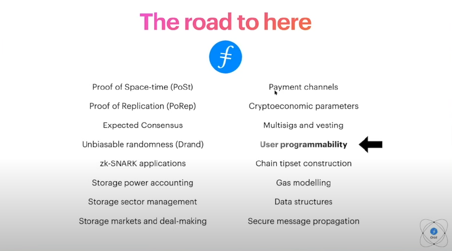
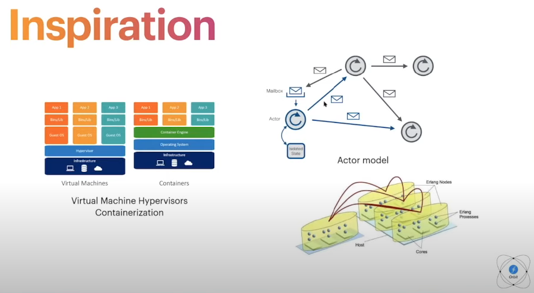
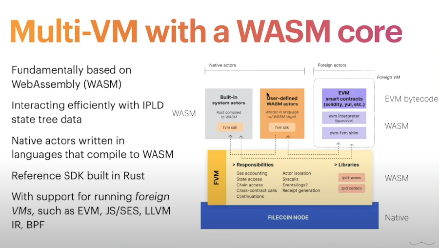
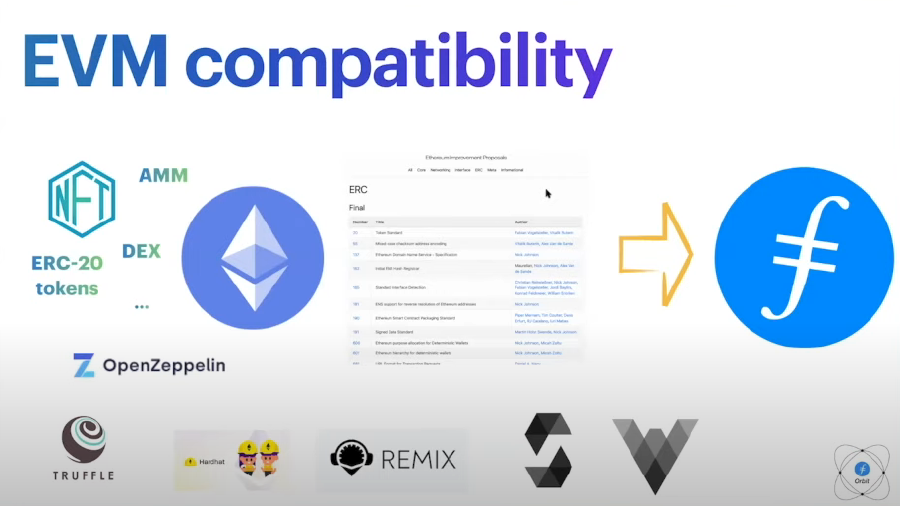
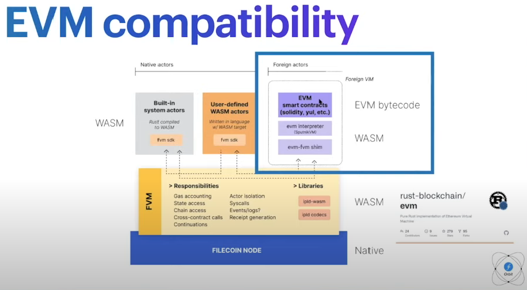
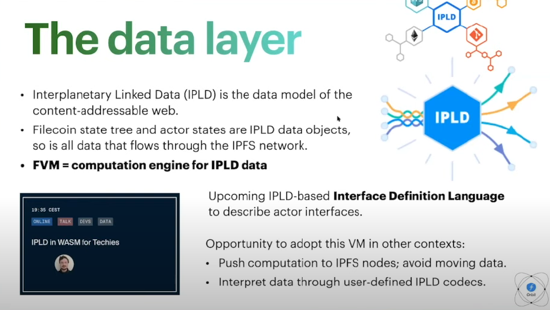
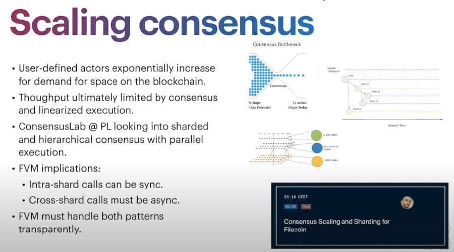

The Filecoin Virtual Machine brings general programmability and EVM-compatible smart contacts to the Filecoin blockchain! Join Raul Kripalani from Protocol Labs and learn about the vision, the thousands of opportunities the FVM unlocks, the implementation roadmap, and how to join the action (October 2021).



Today, the Filecoin network is a storage and retrieval network. Together, these two primitivesact as layer 0 of the stack. Filecoin is able to provide reliable storage and retrieval for humanities most important data. The Filecoin blockchain now contains 12.6 EiB of data and capacity with over 3400 storage providers (at the time of recording).

### Storage is only the start

The goal of the Filecoin Virtual Machine (FVM) is to enable to deploy their own smart contracts on the Filecoin blockchain. We call them actors in the Filecoin programming model. 

This introduces the ability to perform on-chain computations, or computations over state. This can be thought of as resolving layer 1 of the stack. Once you have layer 0, which is storage and layer 1, you enable many more use cases downstream. 

There are a lot of use cases for FVM. Things like auto-renewal of storage deals, data DAOs, storage bounties, and defi over storage. 

Use cases, like those seen above are almost if not entirely impossible with traditional cloud storage providers. This is where Filecoin and the FVM are really going to shine. We are going to do a deep dive on a few of these use cases over the next few slides. 

### Dataverse and Data DAOs

Imagine kickstarting the dataset economy by tokening datasets in order to capture and represent a value of those datasets to society. Imagine if those tokens were harvested and exchanged between peers to request things like computation, validation, transformations, machine learning and a lot more. Now chain these processes together and you will end up compounding the value of those datasets. Now imagine deploying  self converting entities on chain to steward, maintain, curate, and preserve those datasets that are really valuable to humanity. 

### Replication Workers

Replication workers are able automatically replicate N times across the network. They could use user defined policy to specify things like region, price, latency and more. This solves a current issue with the network where a client needs to upload its data to every single provider. Replication workers would offload this data to an actor in a trustless manner. 

### Layer 2 Commitments

Another really exciting thing is the ability to have layer 2 systems commit to the layer 1 of the Filecoin blockchain. This provides consensus backed commitment for solutions like bridges. Bridges with protocols like Flow, Near, Polygon, Ethereum, and others who are currently operating without a layer 1 commitment to the Filecoin blockchain is commendable, but to really make this process end to end provable, we need layer 1 medium where layer 2 processes can commit to is extremely important. 

### Smarter Storage Markets

FVM can bring richer functionality to storage markets.

- Auto-renewing deals
- Self repairing deals (if sectors fail and data needs recovery)
- Time-locked retrieval where data cannot be retrieved until a certain time
- Trustless reputation systems where you can find reputable storage providers

### Decentralized and Verifiable Computation

Once we have computation added to the Filecoin blockchain, you end up in a space where you have both computation and storage under one roof. I think that is one of the strengths and differentiators of the Filecoin network. 

There are boundless opportunities for innovation once FVM is fully implemented on the Filecoin network.

### The Filecoin Virtual Machine

This is the technical part of the talk. We are limited on time, but you can find more information in the FVM GitHub repo. 

FVM and layer 1 programmability have been on the roadmap for a very long time. It was kickstarted by FIP 113, where an overwhelmingly positive conversation highlighted the desire and interest for layer 1 programmability.

Filecoin was in development for six years prior to the mainnet launch. We had to solve a variety of difficult problems to get to a reliable storage and retrieval network. 

Just to give you a little bit of the inspiration of the FVM has been. The virtual machine hypervisor model inspired the architecture of FVM. The ability to host isolated runtimes over a common base layer was also an inspiration. Another concept from computing that really resonates with us is the actor model. We particularly like the functional approach, the self healing mechanisms, and the messaging model. 

The FVM is fundamentally built on Web Assembly (WASM). We looked at other options, but ended up settling on WASM. We believe that joining other communities and solidifying on WASM will increase collaborations across the blockchain community. 

One key aspect of the FVM is that it needs to interact in IPLD state tree data efficiently. Native actors can be written in languages that compiles to WASM, however you to be aware of overhead and runtime costs with any language consideration. One language that we think produces really good WASM outcomes is Rust so we are building the SDK in Rust.

One thing we wanted to make sure of was that the FVM supported the EVM out of the box. This makes a lot of sense as the Ethereum community has amassed a very solid collection of smart contracts. Now those contracts can be run over the Filecoin network. 

We plan to make this happen by adopting a EVM bytecode and WASM approach instead of working with Solidity directly. We are looking at adopting the sputnik VM project, which has emerged as the best WASM compatible EVM implementation in the industry. 

### The Data Layer

We can consider the FVM a computation engine for IPLD data. The Filecoin state tree and the actors state are IPLD objects and FVM executes computations on those inputs to produce outputs. Building primitives to interact with IPLD must be a core priority. 

We are also going to be implementing an IPLD based interface description language to describe actor interfaces. This will power tools for clients in cross actor causes.

### Scaling Consensus

User defined contracts will exponentially increase demand for space on the blockchain. Protocol Labs is currently looking into sharded and hierarchical consensus with parallel execution. 

