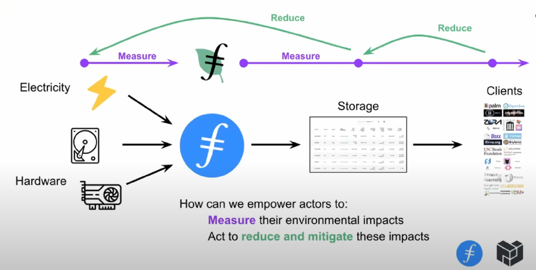
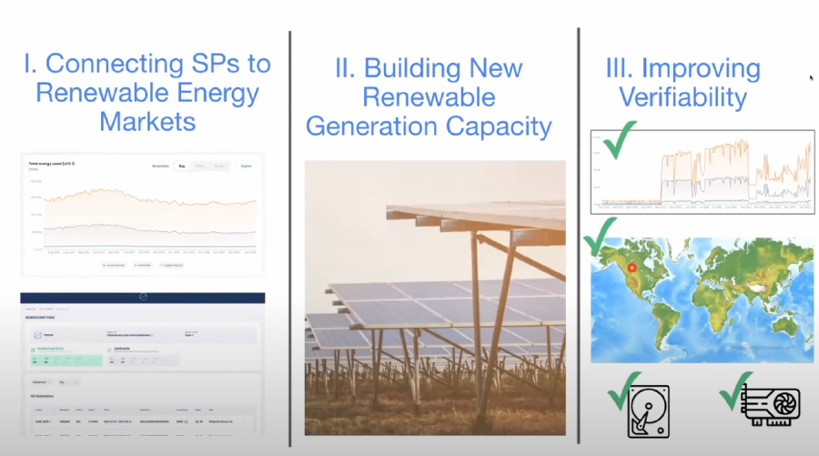

Alan Ransil (Team Lead) with Protocol Labs discusses the vision of Filecoin Green at the Enterprise Storage Provider Accelerator (ESPA) in March 2022.



## How can we make Filecoin verifiably sustainable?

Blockchains track and record all account information. In the case of energy, there isn’t a system to verify and track where energy comes from and what consumes that energy. We aim to make tracking the energy source and consumption of a storage provider a Filecoin capability. 

If you are a storage provider, you consume electricity and hardware and those count as inputs. Everyone in the chain below can and should measure their environmental impacts to reduce and mitigate their carbon footprint.

There are three elements that we focus on to move towards a environmentally friendly and carbon negative blockchain. 

- Connecting SPs to renewable energy markets
- Building new renewable generation capacity
- Improving Verifiability

## Energy Attribute Certificates

If you are a end user of energy, how do you show that you are using renewable energy. With multiple inputs to the power grid, how do you verify that your power comes from a green energy source? Energy Attribute Certificates (EACs) are effectively receipts that prove you paid a renewable energy provider for a certain amount of power. If your company or product purchases a EAC, then you can verify that your energy consumption is from a renewable source. 

## Storage Provider Energy Consumption

To better understand a storage provider’s energy consumption, we worked with PikNik via Github and came up with ways to estimate the energy usage of any storage provider. You can go to [filecoin.energy](http://filecoin.energy) to review the network energy consumption as a whole, or drill down to an individual SP to see their energy consumption. This will help data providers make more informed decisions when selecting storage providers. It will also help storage providers validate that their energy is produced in a renewable way and that the amount of renewable energy they consume is covered by the EACs they purchased. 

We are also working with a company called Zerloabs that takes EACs and maps them to storage providers. Using Zerolabs, we can see how many EACs were purchased by a given storage provider and where that energy comes from. 

## Building New Renewable Generation Capacity

Its great to buy renewable energy from an existing source, but its even better to help build new renewable energy sources for use. Storage providers are already starting to do this. PikNik started with solar energy and Protocol Labs has given out grants to establish new solar farms for SP use. 

## Improving Verifiability

Storage providers who are working with clients or investors can use their EACs to validate and verify their energy consumption. However, there are new tools being built to help show how your energy is used. When do you use your energy? There are a lot of questions that could be asked and answered if the tools were available. 

Right now, we are trying out some of these tools and require just a little bit of information to get some basic data. The inputs would be minerIDs, power bills, documentation of setup. The outputs could be minerIDs, electrical use, approximate location (like city), and embodied emissions. 

If you want to try using some of the tools, contact alan@protocol.ai.

