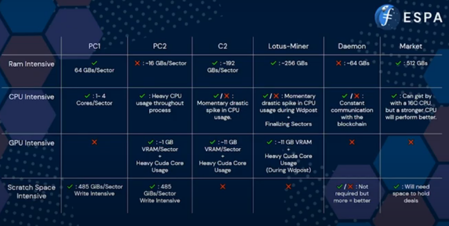
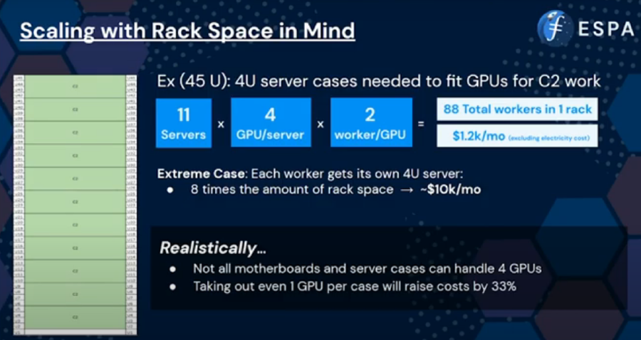
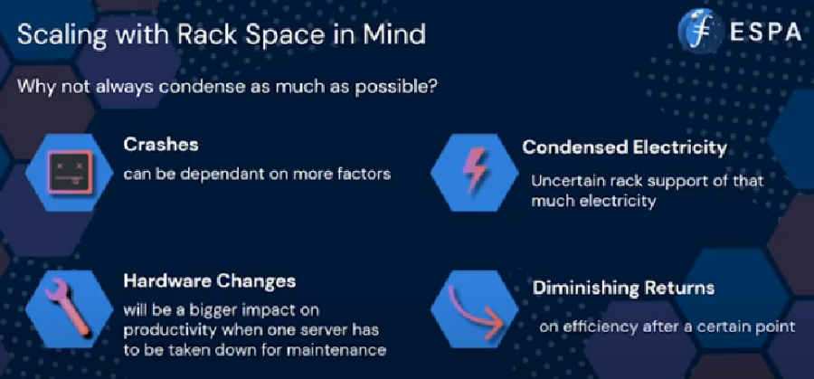
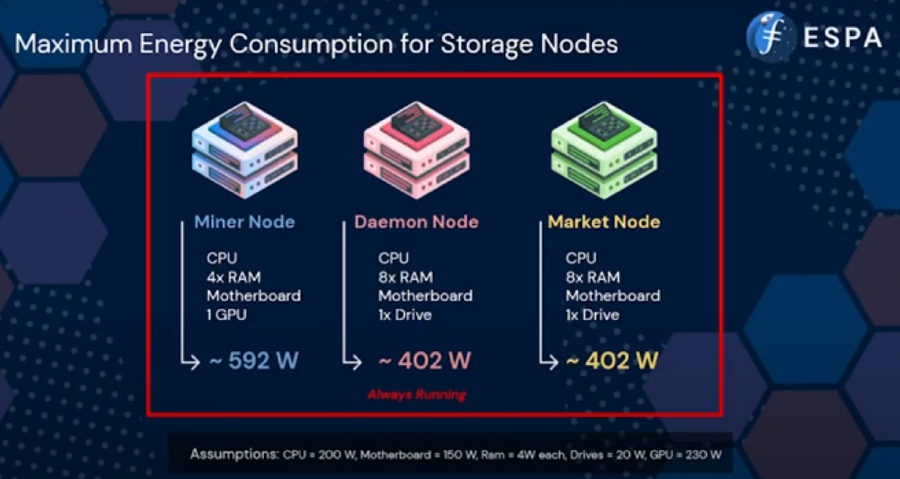
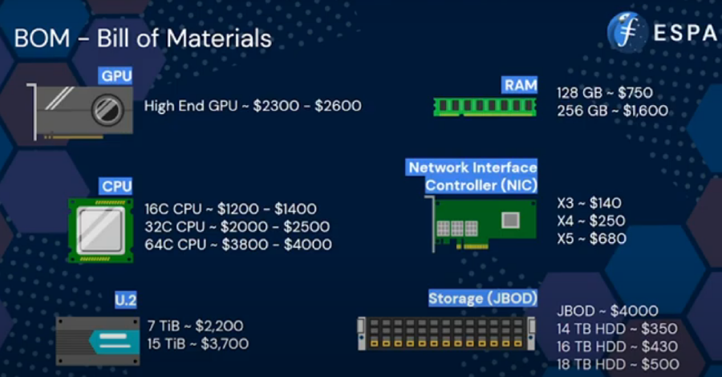

Joe Hoang (Software Engineer) with PiKNiK discusses hardware requirements at the Enterprise Storage Provider Accelerator (ESPA) bootcamp week that took place in February 2022. This discussion includes environmental variables, hardware architecture, examples, what scales and what doesn’t, deal and data flow, racks and power.



### Lotus Environmental Variables

Lotus is dependent on many environmental variables. These will be relevant to any hardware discussion. Please see the description of each in the [Lotus docs.](https://lotus.filecoin.io/storage-providers/setup/configuration/)

- Some variables alter how Lotus works
- Some will fix unexpected behaviors
- There are Lotus specific environmental variables but some are not inherently related to lotus.

The required variables will be dependent on the server type and what work it will be doing. 

### Hardware Architecture

The main consideration for hardware selections depend on the type of work the server will be doing. The image below shows the sealing process on the left and the storage miner process on the right. These metrics are based off of 32 GB sectors. 64 GB sectors will roughly double the requirements for any given type of work. 

Generally, all hardware should be enterprise-level hardware. Enterprise storage and compute components have longer life spans, are meant to run 24/7, and have a lot of tooling built to manage and troubleshoot them. Consumer grade hardware is meant for leisure use and is not scalable. 

Scratch space for sealing will need fast and reliant drives. Spinning disks will not have the performance to keep the pipeline open long term. CPUs for workers requires at least eight cores and support for intel SHA extensions. GPUs for workers require as many Cuda cores as possible and needs to be Bellperson compatible. 

### Examples of PikNik Hardware

**PC1 Server**

- 8 X 128 GB of RAM (Total 1024 GB)
- 64 Core CPU (using Multicore-SDR ENV)
- 7.6 TB U.2 Scratch Space
- GPU is not needed.

**PC2 Server**

PikNik uses GPUs capable of hosting two workers on a singular GPU. A single PC2 server can hold three GPUs and therefore six worker processes. 

- 4 X 32 GB RAM (Total of 128 GB)
- 32 Core CPU
- 3X 7.6 TB U.2 Storage Scratch space
- 3X GPUs with over 6000 CUDA cores and 10 GB of VRAM each

**C2 Server**

PikNik uses a large amount of RAM on this server to allow for 8 C2 worker threads. 

- 6X 256 GB of RAM (Total 1536 GB)
- 32 Core CPU
- 4X GPUs
- No scratch space required

**Miner Node**

- 8 X 32 GB (Total 256 GB)
- 16 Core CPU
- GPU (WindowPoST uses the GPU intensively)
- No scratch space required.

**Lotus Node**

The Lotus node can often run on the same hardware as the miner node. PikNik uses stand alone hardware for the Lotus node as its less work for the miner node to do and it allows for multiple miner nodes to connect to one Lotus node.

- 8 X 32 GB (Total 256 GB)
- 16 Core CPU
- Scratch Space varies based on desired chain retention.
- No GPU needed

**Market Node**

- 1 TB of RAM
- 16 Core CPU
- 7.6 TiB U.2
- No GPU needed

These are just examples of how PikNik chooses to do things. Your setup could combine workers, raise or lower requirements, or be tuned to meet your requirements. 

### What scales and what doesn’t

Ensuring that your builds, both from a configuration perspective and a hardware perspective is a requirement for any organization to be efficient. Your hardware stack will have electrical requirements and stacking the servers correctly can help you save on costs. 

You could combine more into each server, but that means more downtime in the case of changes and more troubleshooting in the case of failure. 

The energy consumption of our hardware configurations vary based on the server in question. The important thing to note is that depending upon your processes, some of these servers can be turned off or not running electrically or computationally intensive processes 24/7. 

### BOM - Bill of Materials

As of the time of recording (~March 2022) the prices for each piece of hardware can be seen below. Keep in mind that demands and shortages will cause these prices to fluctuate. 

