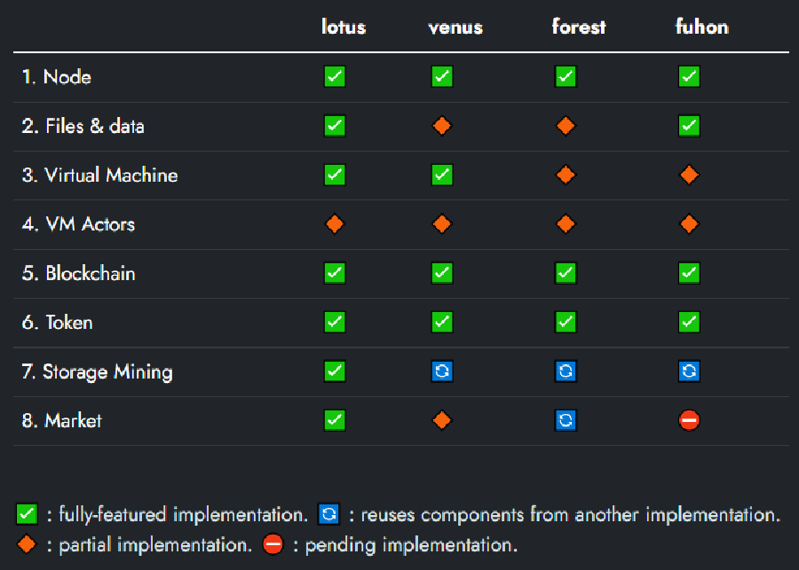

## Filecoin Implementations

Storage providers and data owners use multiple implementations to interact with the Filecoin network. In this video, James describes what an implementation is, and the functions, characteristics, and advantages of each. 



### Why do we need implementations?

 An implementation is a piece of software installed on your local computer that allows you to interact with the Filecoin network. Another way to think of an implementation is to imagine it as the steering wheel in your car. In this example, the car is the network and you interact with it using your steering wheel. An implementation allows you to interact and control what you do on the filecoin network. 

### Four variants of Filecoin Implementation.

There are four primary implementations of Filecoin. Lotus, designed by Protocol Labs, is the most mature. Fuhon, Forest, and Venus are also robust Implementations of Filecoin, each with their own unique characteristics. 

- Fuhon
    - Uses cmake to download the required libraries.
    - Uses Rust Libraries and C++
    - Supported by Soramitsu
- Forest
    - Written in Rust
    - Supported by ChainSafe
    - Process metrics and monitoring built in
- Vensus
    - More developed than Fuhon or Forest
    - Heavily focused on deal-making
    - Reward pooling is a method of sharing block rewards across a large pool of participants to ensure more predictable rewards.
    - Supported by IPFS Force Community
- Lotus
    - Created and supported by Protocol Labs
    - Written in Go, requires Rust
    - Most mature
    - Modular by design

### Conclusion

The Filecoin network relies on these implementations to function in a secure and diverse manner. ESPA recommends Lotus, as it is the most mature and feature rich implementation currently being developed. 

### References and related content

---

[Lotus Docs](https://lotus.filecoin.io/)

[Venus Docs](https://venus.filecoin.io/intro/#preface)

[Forest Docs](https://chainsafe.github.io/forest/)

[Forest Github](https://github.com/chainsafe/forest)

[Venus Github](https://github.com/filecoin-project/venus)

[Lotus Github](https://github.com/filecoin-project/lotus)

[Fuhon Github & Docs](https://github.com/filecoin-project/cpp-filecoin)
