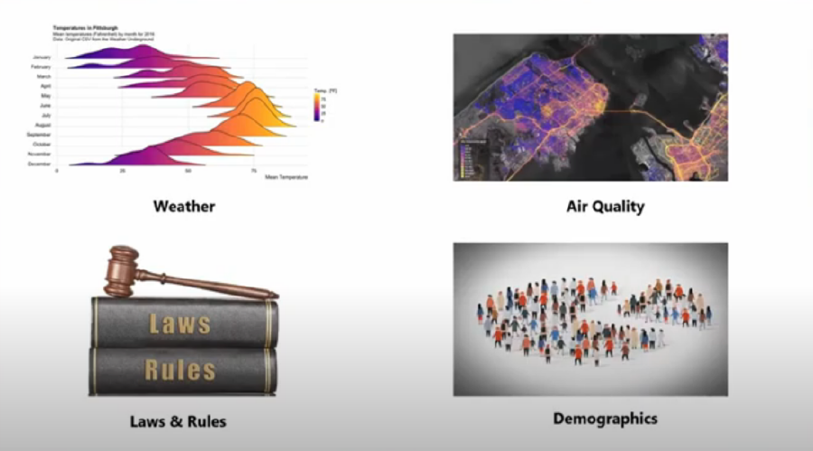
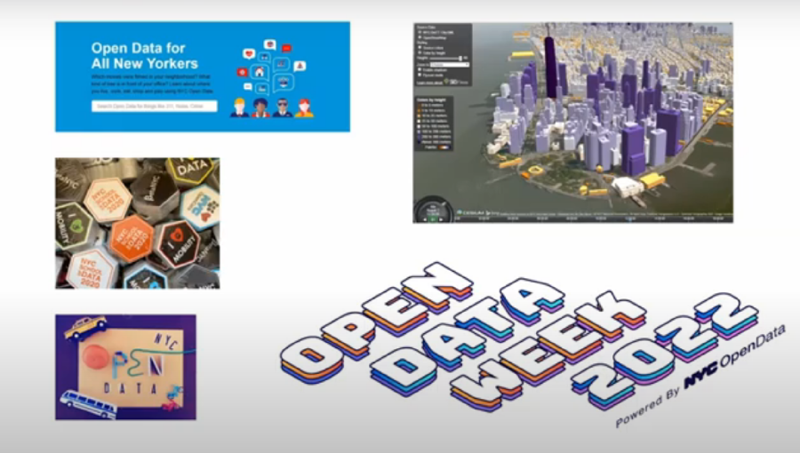
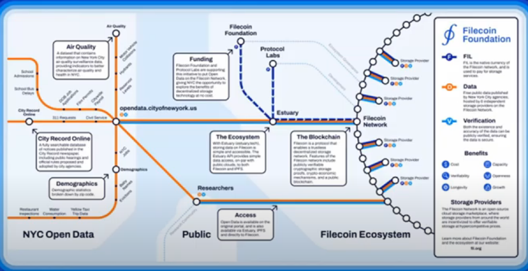

John Paul Farmer, previous CTO with the City of New York discusses why public datasets are stored on Filecoin at the Enterprise Storage Provider Accelerator (March 2022).



### Public Data Examples

There is a lot of data. Typically, businesses will control a substantial amount of the overall data stored globally. However, public sector agencies also keep massive amounts of data. Governments and public agencies also have increasing requirements to keep a lot of this data open and public. 

Governments keep a lot of PII (Personally Identifiable Information) data. Information like names, addresses, physical attributes, and health status has to remain private to some degree, given its sensitivity. The government also keeps large amounts of public data, which is increasingly granular. 

Data like longitudinal weather data, which the government has been keeping for a long time, is public data. The weather channel is backed by data collected and stored in this way. Block by block air quality is also generating a lot of public data. Laws and rules are constantly changing and historical copies are always kept. Demographic data needs to be widely distributed and stored so that censorship is not an issue. 

### Open Data

Some governments are starting to default to an open data standard. NY city created a law in 2013 that requires data to be open by default. This was considered a gold standard for other cities to follow. 

Today, there is 4 billion lines of data across thousands of data sets stored for NY city. There are communities developing to encourage governments to store data in an open and timely manner. 

Cities across the world are storing data publicly but the data itself is stored on one of the big cloud providers. Amazon, Microsoft, and Google being the big three in the US. This is where Filecoin comes into play. 

### Filecoin and Open Data

Filecoin provides a decentralized alternative to the big cloud providers. NY city ran and Filecoin ran an experiment to determine what happens when certain types of public data are stored on the Filecoin network. We focused on three types of public and open data. 

- Air Quality
- City Demographics
- Public Hearings

Protocol Labs put together a roadmap showing how NYC open data integration with the Filecoin network. 

We found that storing on Filecoin was .02% of the cost vs traditional cloud providers. We also found more positive outcomes as seen below. 

- Lower Cost
- Lower Latency
- More Resilient
- Censorship Resistant

These results caused cities to start asking questions about their data sets and how they can manage the ever increasing amount of public and open data. Storage providers should look at governments as potential customers, especially governments that are introducing laws that require data to be open.
