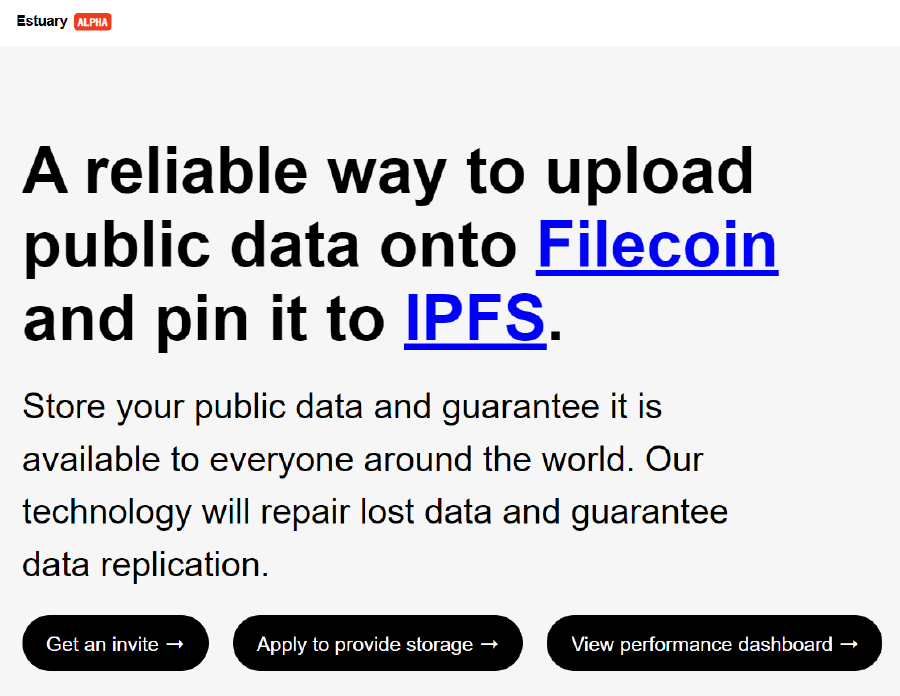
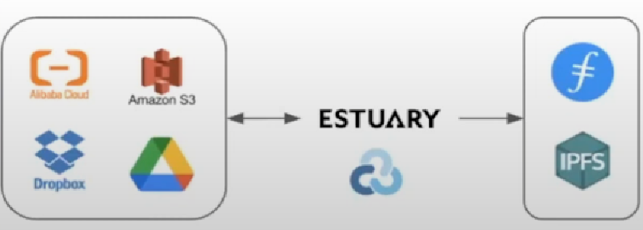

Longfei Wang with Protocol Labs discusses Rclone and Managing files on Cloud Storage with a demo, at the Enterprise Storage Provider Accelerator (ESPA) bootcamp week that took place in April 2022.



Estuary is a decentralized storage service, built on top of IPFS and Filecoin. It provides a very reliable way to upload your data to IPFS for fast retrieval while also backing up your data to the Filecoin network. 

Its designed for the user and the developer with a UI and API. A user can create an account and upload data. Developers can create an account and get access to APIs and even run their own Estuary node. 

Estuary is free for data upload as it uses the Fil+ storage model to negotiate deals with storage providers. At the time of recording, over 20 collaborators using and building on Estuary. This includes organizations and teams such as Textile, NFTstorage, and New York City Open Data. 154 storage providers are storing the 15 million files stored through Estuary. These files have come in over 150,000 storage deals. 

### Rclone

Estuary is great, but its even better if you can easily get your files onto it. This is where Rclone comes in. Rclone is a feature rich cloud storage management tool that you can use to manage your data across various cloud storage providers. 

- Provides powerful Unix file system equivalents for most major cloud platforms (i.e rsync, cp, ls, mv, mount)
- Over 40 cloud storage providers supported
- Bridge between different cloud storage providers, now also Filecoin and IPFS
- You can sync, backup, restore, migrate, and mount files between Sps
- Configuration only requires your Estuary API token

To use Rclone and Estuary, you can follow the [Estuary documentation](https://docs.estuary.tech/tutorial-managing-files-with-rclone) to complete the following tasks.

- Install Estuary Node & rclone (or use a Estuary public node)
- Install and configure Rclone
- Sync files from local to Estuary
- Sync files from Google drive to Estuary
