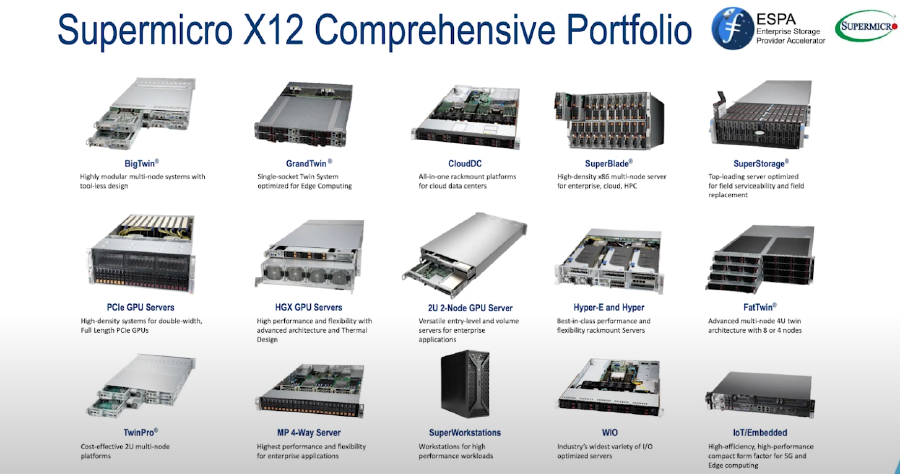
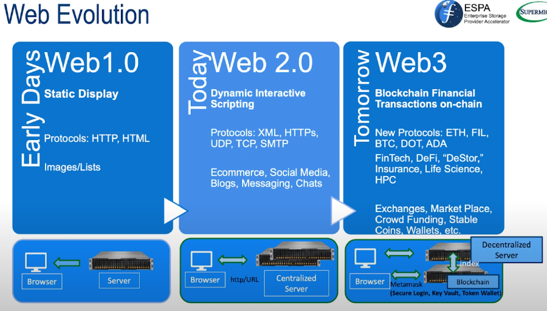
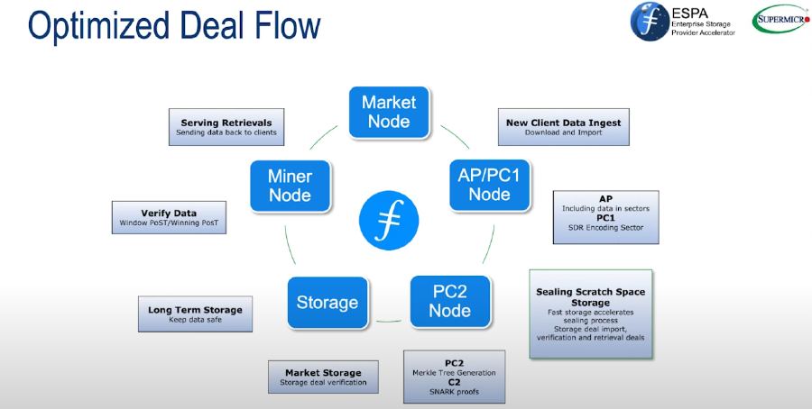
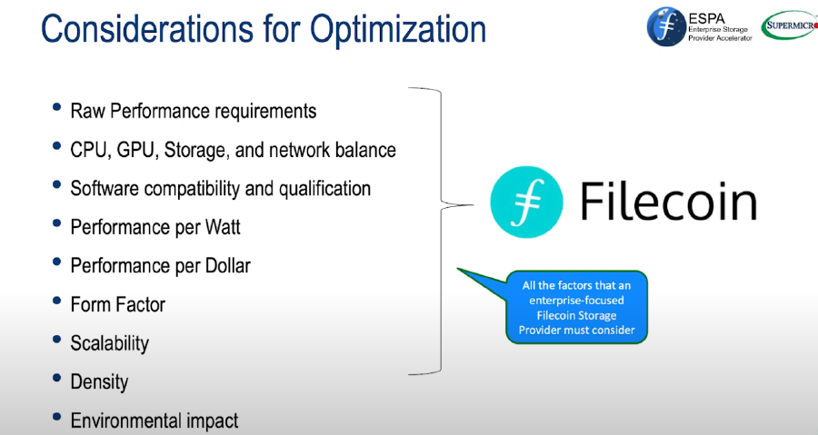
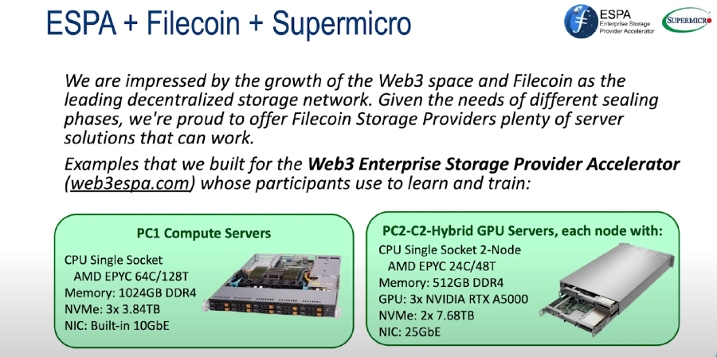
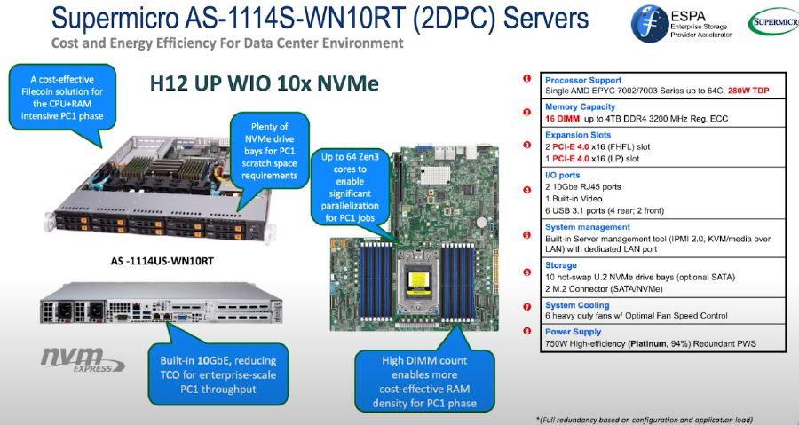
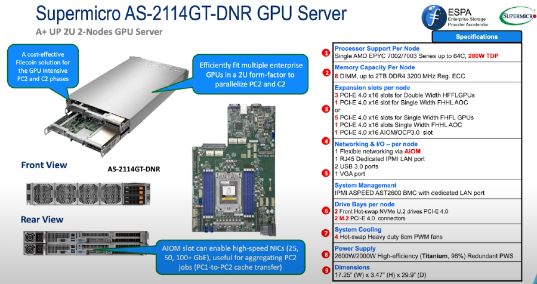
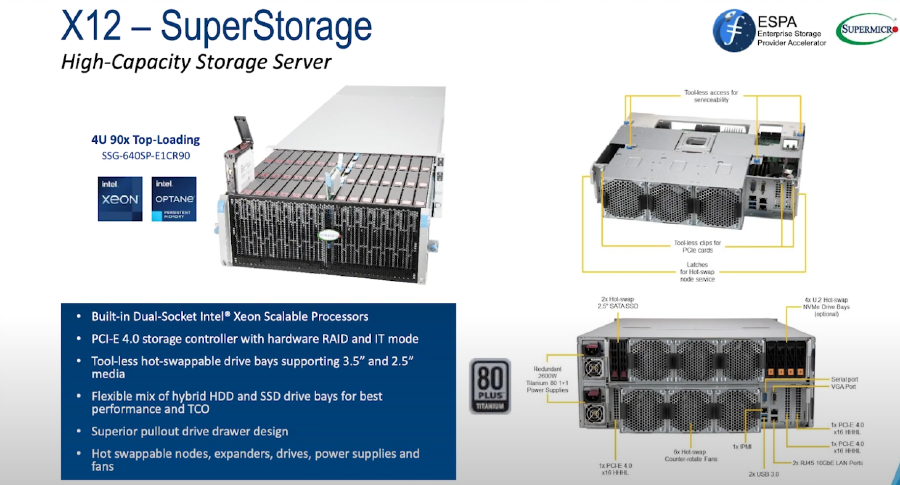
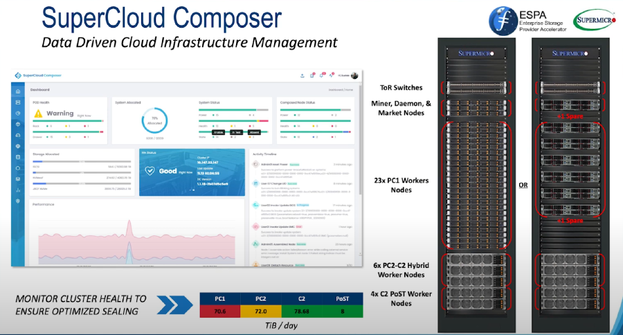
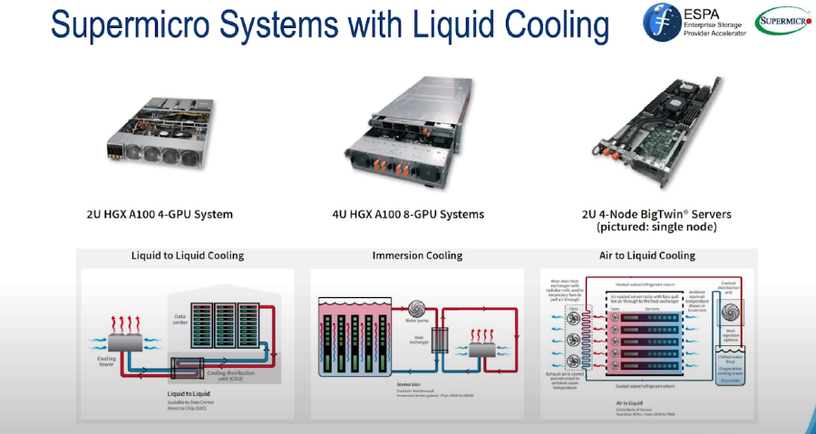

Michael Ocampo (Sr. Product and Solutions Manager) with Supermicro presents on Optimized Servers for Web3 & Filecoin at the Enterprise Storage Provider Accelerator (ESPA) boot camp week that took place in April 2022.



### Supermicro Product Portfolio

Supermicro produces and supports servers of all types, each tailored for specific workload models. We have blade servers, storage servers, and GPU superservers amongst other configurations. We offer a lot of different products, often including AMD chipsets. In fact, Supermicro is the largest distributer of AMD processers. 

Supermicro provides enterprise grade systems. Not only do we offer great hardware, but also the tools and support to keep those systems healthy over the long term.

### Web Evolution

Our systems were initially built for centralized computing. They had monolithic designs and were not focused on scaling out and distribution. Now, we build servers with decentralization being a consideration and often a focal point. 

In context for optimizing hardware for deal flows within the Filecoin ecosystem, we are focusing on producing hardware specifically for each part of the deal process. There are a lot of considerations to take into account when designing platforms for storage providers. We care about optimization to help SPs generate the most income possible. 

We can look at each phase of the sealing and storage process and pick out the areas we can optimize with appropriate hardware. 

### ESPA + Filecoin + Supermicro

Supermicro now has recommended server configurations available for storage providers. By teaming up with the PikNik team and other storage providers, we are able to pinpoint the best configuration for the job. 

Our PC1 server is pretty basic, but very powerful. PC1 is very intensive on the CPU and memory so we want to include serious hardware to perform under those peak times. PC2/C2 is a dual enclosure, where there is a shared chassis and therefore has a lower power draw (vs two 1 U servers). It can multiple GPUs in each server, two for PC2 and one GPU for c2.

For storage providers looking to expand their storage, we have a standalone server just for storage. Its a 4U top loading server with support for 3.5 and 2.5 media. All hardware is hot-swappable and ready to provide redundant and fast storage access.

### Value Added Services

Plug-nPlay rack integration capability is something Supermicro has been offering for a while. We have global factories, high performance and high density compute racks with RDHx (Rear door heat exchange ) and DTC (Direct-to-Chip) liquid cooling technologies. We offer full in house and onsite full solution integration (OS, networking, and middleware) with multi-level quality control (L10/L11/L12 testing). 

We also have a software product called SuperCloud composer, which helps you make data driven infrastructure decisions. 

### Liquid Cooling

We offer assistance and hardware for liquid cooling. There are different types of liquid cooling options, from liquid to liquid cooling to immersion cooling and air to liquid cooling. The datacenter has to be prepared for liquid cooling, and it if it and your budget includes liquid cooling, we can handle getting you the right hardware.

