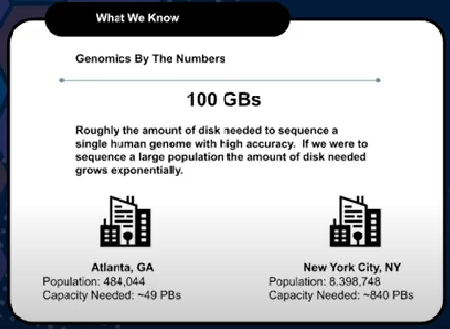
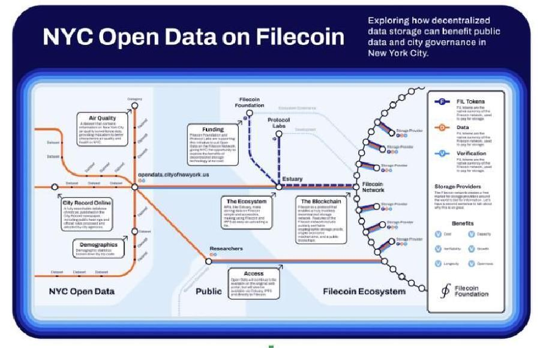

Bill Schreckenstein with the Filecoin Foundation discusses the many Filecoin use cases at the Enterprise Storage Provider Accelerator (ESPA) bootcamp week that took place in April 2022.



### Storage Ecosystem

We are going to talk about the three tiers of storage. Tier 0 or 1 is ideal for hot data, where the active workload operates. Everyone loves flash, but it gets pricey and probably isn’t suited for long term storage. Then theirs tier 2, which is best suited for warm workloads, active user data, and artifacts modified somewhat recently. 

We focus on Tier N, which is ideal for cool, cold, or archived unstructured data. Tier N is also ideal as a backup target of the tier 0-2 storage infrastructure. Tier N could easily contain 80% of the ecosystem’s data when properly tiered. Tier N is typically the glue of a robust storage infrastructure and should be scalable, durable, and secure. 

### Why are we bullish on use cases

We care about tier N the most as it contains the best data for the Filecoin network. Companies need a way to store long term data in a fashion that is protected from changes. Things like ransomware protection are offered by various vendors, but not like the Filecoin network can. We provide large amounts of storage space for companies to store data that simply cannot be changed. 

- Critical data needs native immutability
    - Not all platforms offer this, or do so with elevated cost
    - Verifiable content is essential for the research communities
- Geographic distribution
    - The ability to place data geographically aids collaboration
    - Multiple copies with unique SPs enhance durability
- Cost
    - Storing data in the public cloud across multiple regions means higher cost
    - Filecoin provides storage at a fraction of public cloud costs
- Scalability
    - Consumers don’t have to manage on-premises archives (this can be costly).

This isn’t just about large amounts of storage. Filecoin is about providing a network to meet the demand of these use cases. Direct TV was keeping about two exabytes in size. They had a lot of storage to manage, backup, and maintain. That is a large cost to any organization.

### Lifesciences & Genomics - Use Case

Did you know that on the Filecoin network, all 3000 types of rice have been sequenced? I didn’t know people cared about rice that much, but they do and it is stored on the Filecoin network, persistently.  Genomic sequencing is expensive. That is a process by which you only want to do it once. 

How many people here know that if you have a child get an X-ray it has to be kept for seven years past that child’s 18th birthday. Think about the amount of data processes like this generate.

Oil and gas industries keep seismic data all the way back to the 1970s. They do this so when new algorithms come out, they can run it against old data to find any anomalies.  

- Genomic sequencing is expensive
    - Sequenced data needs to be verifiable (re-running a sequence is time consuming)
    - Large data sets can be expensive to maintain and distribute
    - Global research collaboration requires CDN like capabilities
- Data persistence
    - Most medical archives need to exist for an extended period of time
    - PACS, X-Rays and other data typically have a required retention period
- Scaling to meet the demands of sequencing growth
    - Exabytes of data expected to be generated
    - Difficult to scale traditional enterprise solutions to meet growth

### Public Archive - Use Case

A common problem for municipalities is ransomware. We constantly hear about this city or that city getting hit by ransomware. The Filecoin network can store multiple copies, in multiple locations, with immutability over multiple physical networks. In fact, the only way to even get near the data on Filecoin is to get the addresses for each storage provider.  You can present this as not only cheaper and safer storage, but also that you have redundancy for insurance reasons. 

- A common problem solved
    - State/Local governments are a common ransomware target
    - Filecoin immutability is a great hedge against ransomware
- Scalability to match
    - Long term retention requires an extremely scalable storage solution

NYC Open Data on Filecoin is one example of a major metropolitan area using the Filecoin network to store its public data. 

### Scientific Archive - Use Case

The average flight recorder will generate approximately 1 TB of data per flight. Atlanta, as a single airport, has thousands of flights daily. Climate research data, autonomous driving data, Google open images, seismic data, Udacity, its all being stored on Filecoin. 

- Research data preservation is critical
    - Data needs to persist for long periods of time
    - Data needs to be verifiable
    - Content distribution for research collaboration can enhance the efforts of the scientific community
- Filecoin already hosts a number of scientific research archives
    - The Boxy Vehicles dataset
    - AVSpeech: Large scale audio-visual speech dataset
    - Google Open Images
    - Udacity Self-Driving car data
- Targeting these large datasets can be a windfall, there is significant opportunities around data sets like the following:
    - Climate research data
    - Autonomous driving data
    - Flight data
    - Seismic data

### Media Archive - Use Case

The demand for media is exploding. Transcoding alone requires a lot of storage. Think about how many Disney movies have been made and changed for various cultures and languages. It all has to be stored somewhere in the world. NFTs and the metaverse are both alive and well, each consuming storage forever. 

- The global media and entertainment storage market size was valued at 6.6357 billion in 2019 and is projected to reach 17.8795 by 2027, registering a CAGR of 13.7% from 2020 to 2027 - Alliedmarketresearch.com
- The media industry generates large amounts of data
    - Transcoding
    - Need for fan out support (the DVR problem)
    - Multiple movie renders (language adaptions, scene changes, etc)
- NFTs and the metaverse are exploding
    - Immutability prevents manipulation of author content
    - Blockchain shows chain of custody and ownership
    - Nearly 41 billion in crypto was spent on NFTs on 2021
        - Most valuable was $91.8 million
    
### Analytics & AI Archive - Use Case
    

For those of you that saw some of the footage from South by Southwest, a gentlemen from Seed AI spoke about how important Filecoin is to AI. We want to be able to store datasets and use new algorithms against those datasets in the future. We have that capability and as we grow and our tools grow, this will get better and better. 

- Major challenges facing the industry
    - Ensuring we have the datasets archived
        - Data integrity is key
    - Properly index datasets together over time
        - Having this consistency helps to detect anomalies
        - The blockchain gives us a record we can audit
- The amount of data captured grows exponentially
    - Autonomous vehicles
    - Climate data
    - Machine learning data
- Algorithm evolve
    - Legacy sets will need to persist to re-run new algorithms
    - New output data will need to be collected, indexed and archived

### Opportunities Exist

At my previous job, we were working with a customer who had a single NAS device. The administrator was making $70K a year and when another company tried to poach him, the original company increased his salary by $40 or $50K just to keep him. There is a real shortage growing within the storage community where employers have a hard time finding enough help.  

“Citizen science technology revolves around data analysis. The workflows need to be intuitive, visial, clear and even inviting. Business intelligence and analytics vendors building tools for the data warehouses, data lakes, and data management solutions are working on automated cloud-based solutions and simple intuitive interfaces. This work is essential for addressing the talent shortage.” -Eweek

Be that cloud!

Protect and preserve data!

Supply a response to the growing talent shortage in the storage market.
