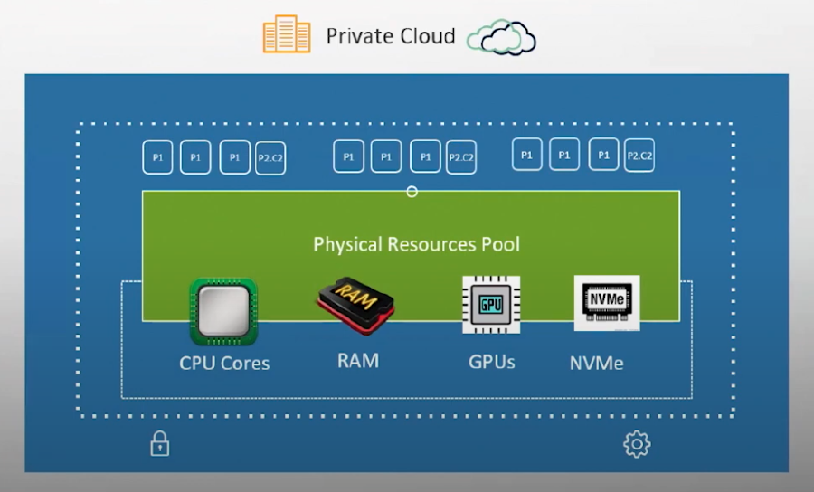
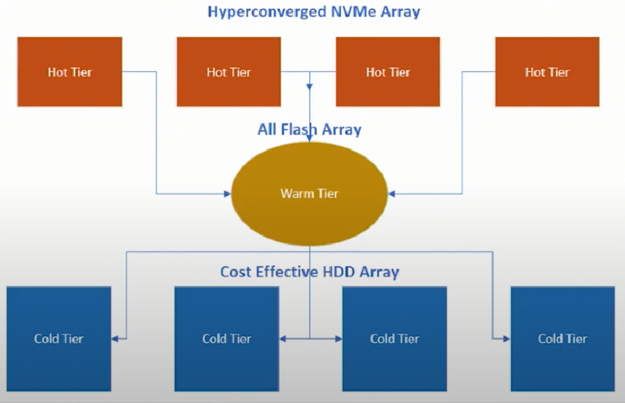
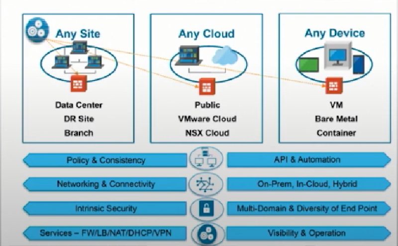
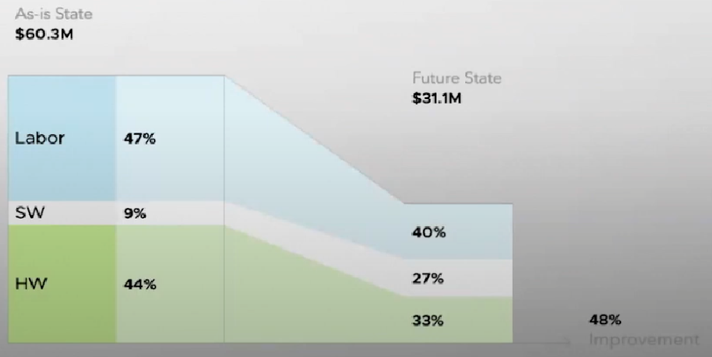
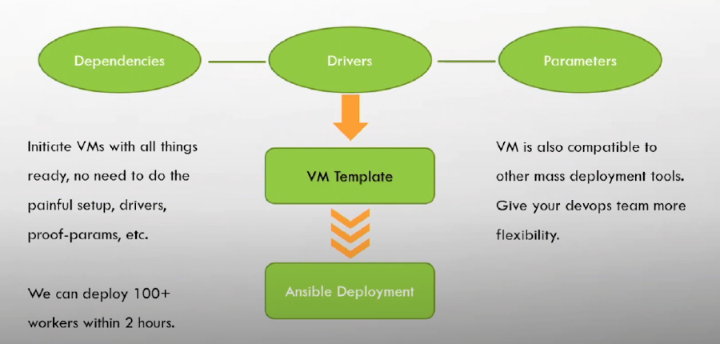

### Growing Large Filecoin Implementations

Tao Tao, the CEO of Acrontech discusses scaling and deployment of large Filecoin Implementations at the Enterprise Storage Provider Accelerator (ESPA) boot camp week that took place in April 2022.



## Filecoin Scalability Challenges

First, we want to talk about the challenges of managing 600+ petabytes of storage consistently and efficiently. That amount of storage is likely bigger than most fortune 100 companies so how do you run a storage provider with that amount of storage, likely across multiple datacenters. Lets look at the footprint of an average 100 PB miner for perspective. 

- 200 - 400 servers (hundreds of GPUs, thousands of SSD and or NVMes)
- 200 - 400 storage devices
- 5000 - 10000 HDDs
- 50 - 200 switches
- 50 - 200 cabinets
- Hundreds of millions of dollars worth of equipment

This is a mid to large size enterprise datacenter for a typical fortune 500 company. All of that equipment needs to be:

- Procured in the most cost effective way
- Provisioned and setup rapidly
- Running at the highest possible utilization (compute, network I/O, storage, throughput, etc)
- Maintain full stack compatibility and inter-operability throughout the lifecycle

From this point, how do you grow your capacity without proportionally growing your operations expenses? 

## Heterogenous Infrastructure

Most storage providers procure equipment over time. This causes the environment to be heterogenous as different hardware and software will be purchased over that time. 

- Sealing Compute
    - Inconsistency on CPU and their architecture (# of cores, caches, CCds, etc)
    - Inconsistency on GPU model (# of cores, memory, etc)
    - Inconsistent hardware supply due to market availability and supply chain challenges
- Storage Model
    - Lotus requires two tier storage model
        - Hot tier for sealing storage
        - Cold tier for long term sector storage
- Complex network topology and deployment
    - Multiple nodes in each DC
    - High performance throughput for aggregated IO
    - Balance between performance, resilience and cost
- Multiple DC scale mode
    - Compound complexity due to inconsistent infrastructure at each DC

Traditional “bare-metal” architecture is “set in stone” once the hardware provision is complete. If hardware changes are required, the server must be taken offline for the changes to occur. This lowers your total usage of the hardware and contributes to differences between servers across the install. 

Security also becomes more difficult when different hardware and software vendors are used. You cannot implement a standard security policy when each server has different requirements. A rigid system such as this can be managed, its just more difficult and time consuming, leading to higher costs and manhours. 

The IT industry has faced the same issues in the past. Storage providers can use the lessons learned from the IT industry to better streamline their 

## AcronTech Mission Statement

AcronTech believes that scalability challenges can be addressed through the Cloud Operating Model based on the industry best practices. We are trail-blazing Filecoin Implementations through enterprise level architectural design, deployment and operations. AcronTech is positioned to be a leader of large scale Filecoin implementations leveraging private cloud technologies. We have proven that our architecture and roadmap can effectively address challenges through POC/Pilot and Initial production for:

- Consistent infrastructure
    - Hardware Utilization
    - Compatibility and Inter-operability
- Consistent Operation - Operational Efficeiency
    - Deployment
    - Upgrade, full lifecycle management
    - Cost efficiency
- Intrinsic security and holistic resilience

## Software Defined Infrastructure - Consistent Infrastructure

The underlying hardware capacity (CPU, RAM, GPU, NVMe, etc) was pooled into a common resource pool, then abstracted into virtual computing power and allocated to VM guests. This allows for dynamic resources allocation, rapid deployment and full redundancy against single points of failure.  

We can allocate resources as will, so all phases of the sealing process can be adjusted on the fly. For example, a GPU can be sliced virtually and a single slice can be given to a VM. Other VMs that need a strong GPU can have the other slices assigned as needed. This process can be replicated across any type of hardware (CPU, RAM, etc).

## Hot Tier Architecture

Hot Tier storage calls for high performance I/O drives and enterprise level resilience. With virtualization, you can add capacity at will, scale up by adding drives, scale out by adding hosts and implement cost-effective cluster designs. 

Tiered storage brings balance of performance to the sealing process. You can have a hot tier for fast I/O and another warm tier to ensure a smooth fast flow to the cold tier. This will help buffer the flow into the cold tier.

## Security Architecture

Our security model leverages:

- Centralized LDAP based directory for user management, authentication and authorization.
    - RADIUS compatible
    - Open for SAML based integration
- Role and Policy based access control through Software Defined Network (SDN)
- Citrix based remote access
- Anti-malware and Intrusion Detection

Our virtual model allows for consistency across the environment. This consistency allows for the application of a standard security policy. Since all machines are managed through a single pane of glass, these security enhancements can be rolled out together. 

## Operational Efficiency Yields lower TCO

Below is a 3 year Total Cost of Ownership (TCO) comparison of 1000 PB Filecoin storage provider with 500 TB a day of sealing capacity (based on cost model created in 2021). Savings come from reduced labor cost, higher hardware utilization, higher system resilience and less downtime. 

As-Is State is a traditional bare metal operation. Future state is completely software defined including equipment procurement, provision, deployment, DC operation, uptime, maintenance, and full lifecycle management. 

Deployment automation also becomes easier and more cost effective when all things are the same and virtualized. If you have the same GPU, CPU, and storage for all nodes, then its just a consideration as to what each VM needs. This can be adjusted as required as its not rigid like bare metal builds.

## AcronTech Service Offering

AcronTech offers a portfolio of services to storage consumers and storage providers. We offer operational management, virtual layer management, and physical hardware services. We cover all aspects of data storage so we are always ready to help. We can own the hardware or you can own your own hardware.