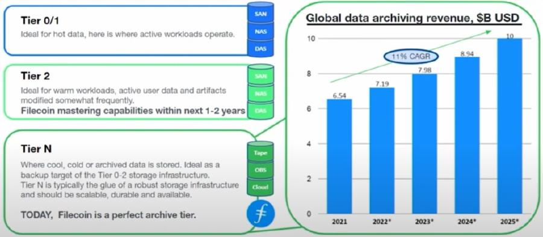
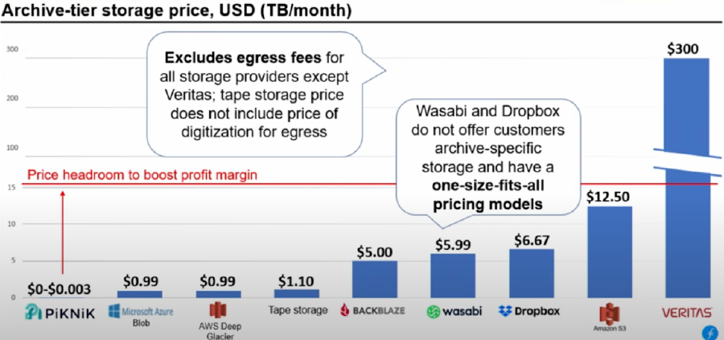
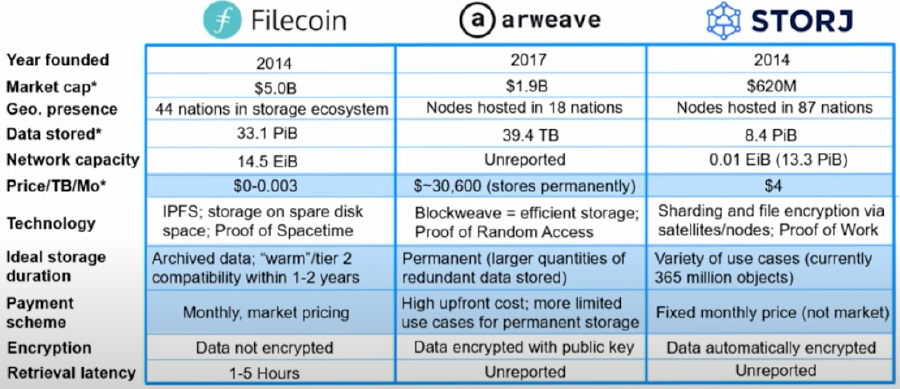

### Why Filecoin and what are we solving?

Stu Berman (CTO) with PiKNiK discusses why Filecoin and the problem we are solving at the Enterprise Storage Provider Accelerator (ESPA) bootcamp week that took place in February 2022. 



### Blockchains and Filecoin

Blockchain technology is a different way to do a common process, record information. Using blockchain technology, we can have immediate, shared, transparent, and immutable ledger to record transactions. These transactions are recorded in a ledger shared across a decentralized set of computers, run by users across the world. In the case of filecoin, storage transactions are recorded on the ledger and storage providers are held accountable to storage deals made in this fashion.

### Web2 vs Web3

 In earlier versions of web, centralized organizations (google cloud, amazon, etc) kept their own ledger of transactions and provided a centralized location for information processing and storage. They set the prices, security controls, and privacy standards. Web3 is a new form of web management and structure, powered by blockchain technology. It functions in a decentralized fashion for storage, compute, and information. There is no longer a need to use centralized Web2 products as Web3 products and networks are providing the resources required to run services in a decentralized manner.

| Web2 | Web3 |
| --- | --- |
| Centralized | Decentralized |
| Data unaudited and exposed | Data audited via blockchain |
| Highly concentrated | Limitless flexibility |
| Costly | Affordable |
| Rigid | Customizable |

We can look across the Web2 companies and see the Web3 technologies that are challenging the incumbents.

| Service | Web2 | Web3 |
| --- | --- | --- |
| IOT | AT&T / Verizon | Helium |
| Storage | AWS / Azure | Filecoin |
| VPN | NordVPN | Orchid |
| Compute | AWS/Azure | Akash |
| Mobile | AT&T / Verizon | Telcoin |
| Video | Youtube | Livepeer |

### Customer Interest

If these technologies are to be adopted in mass, there has to be a demand. In the case or storage, experts believe there is roughly sixty four zettabytes of data stored in various ways around the world. This includes private datasets in datacenters, the cloud, USB drives, private computers and tape drives. This number is expected to double roughly every two years. All industries are now using large datasets.

Filecoin is a ideal archive-tier storage destination for end users ranging from enterprise to NGOs and governments. As the Filecoin retrieval network grows and expands, Filecoin will become a great option for most datasets.

### Example Use Cases

From a customer standpoint, there are various use cases for Filecoin.

- The Shoah Foundation, which is the worlds largest archive of testimonies from the Holocaust and other genocides. 8+ PiB
- Slingshot, a community competition with the mission to preserve real, valuable, and usable public datasets on the Filecoin network. 21+ PiB

### Pricing and Economics

Storage providers on the network determine their own pricing, however we can look at the average across storage providers versus traditional Web2 storage alternatives.

Archive-tier Price Comparison

| Storage Providers on Filecoin | Web2 |
| --- | --- |
| $0-$0.003 / TB / Month | $0.99 / TB / Month |

The economics incentives for storage providers come in the form of block rewards. Block rewards are rewards for providing storage on the Filecoin network and the subsidize market rates for storage. These rewards decrease over time and incentive early adopters to mine and retrieve on the Filecoin network. This is how Filecoin keeps storage costs low for the data owner and incentivizes storage providers.

### Competition

There are other networks also providing storage and file retrieval in the Web3 ecosystem. Filecoin is the largest network, but still has limitations in encryption and retrievals. The other storage networks have higher costs for storage and limitations of their own.

### Marta Belcher’s Congressional Testimony

Head of policy and board chair of the Filecoin Foundation spoke before the US Senate Banking Committee in July of 2021. She presented her view of crypto and shaping the future internet. Marta compared the early days of the internet to the growing cryptocurrency and Web3 industry. She encouraged the committee to look at this without blinders, arguing that the good introduced by the cryptocurrency and web3 industry outweighs the bad. You can review the entire interview here, including commentary from other industry experts.



### Conclusion

The Filecoin network is positioned in a market with high demand and that demand is only expected to grow. The permissionless and decentralized nature of Filecoin means that it is never controlled by a centralized authority and can withstand changes in the ecosystem. As time moves on, the need to store data in a secure and verifiable way will become ever more important. Filecoin stands ready to not only take on new data, but supply the world with unaltered access to it’s most important data.
