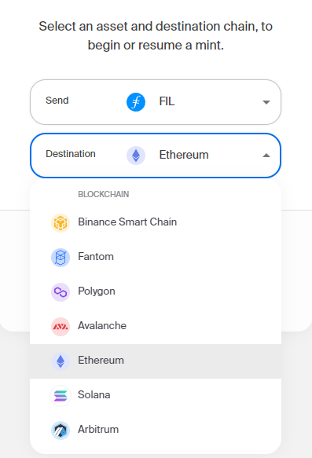
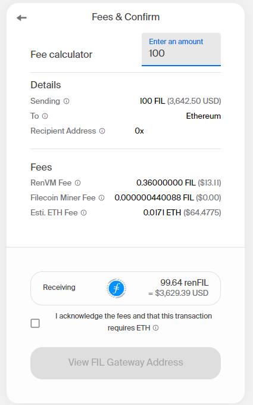

# Wrapped Filecoin

## What is a wrapped token?

Wrapped tokens allow tokens from one blockchain to be used natively on another chain. The wrapping process usually involves locking the original tokens in a smart contract, which then mints an equivalent amount of wrapped tokens on another blockchain. 

Users can transact confidently because the wrapped token value is preserved by a smart contract that backs each token one-to-one with the underlying assets. This gives users greater flexibility — such as the ability to write smart contracts with assets across multiple networks without waiting for both chains to update, to create greater liquidity for decentralized finance, or to optimize block confirmation times or gas fees by choosing different networks.

::: callout
Although Filecoin tokens (FIL) cannot be directly used on Ethereum (ETH) or other networks due to different standards, **wrapped FIL** offer the ability to use FIL tokens 1:1 within other blockchain networks including Ethereum, Polygon, Solana, Celo, and more.
:::

## Where can I use wrapped FIL?

Wrapped FIL is available in the following networks:

- Ethereum (renFIL, wFIL)
- Binance Smart Chain (renFIL, BFIL)
- Fantom (renFIL)
- Polygon (renFIL)
- Avalanche (renFIL)
- Solana (renFIL)
- Arbitrum (renFIL)
- Celo (wFIL)
- STACKS (coming soon wFIL)
- KADENA (coming soon wFIL)
- etc.

## Custodial or non-custodial wrapping solution?

- **Non-custodial designs** (renFIL, vFIL) are governed only by on-chain, immutable smart contracts. No single or collective entity has a master key that could force trades, transactions, or other operations to follow one direction or the other.
- **Custodial designs** (wFIL, BFIL, eFIL, HFIL) are managed by a single third party. They may have services always have a counter-party risk from their operator but could have some other advantages like insurance, guaranteed backing, support, etc.

## Wrapping your FIL process

There are several web-based applications for token wrapping. Here is an overview of the steps:

1. **Choose your wrapped FIL type.** Depending on the chain where you want to use your wrapped FIL, different types are available.
2. **Open the web app and connect your wallet.** Most apps require a web or mobile wallet.
3. **Choose the amount.** Double-check the fee structure, which may vary by network and application.
4. **Click to mint.** You may need to wait several minutes for the target network to confirm the transaction.

For example, here’s how it works in RenBridge, a decentralized application (dApp) that allows users to mint real FIL (as well as BTC, ZEC, and more) on Ethereum as an ERC20 token (renFIL):

- Asset selection process

- Fees and confirmation

## Wrapping solutions comparison table

<table class="comparison">
    <tr>
        <th>Name</th>
        <th>Project</th>
        <th>Infrastructure</th>
        <th>Custodian</th>
        <th>Main Blockchain</th>
        <th>Link</th>
    </tr>
    <tr>
        <td>renFIL</td>
        <td>renBridge</td>
        <td>Decentralized</td>
        <td>Decentralized</td>
        <td>Etherium, Binance, Polygon</td>
        <td>https://bridge.renproject.io/mint</td>
    </tr>
    <tr>
        <td>wFIL</td>
        <td>WRAPPED</td>
        <td>Centralized</td>
        <td>Anchorage</td>
        <td>Etherium</td>
        <td>https://www.wrapped.com/</td>
    </tr>
    <tr>
        <td>BFIL</td>
        <td>Binance</td>
        <td>Centralized</td>
        <td>Binance</td>
        <td>Etherium via Binance Token Canal </td>
        <td>https://www.binance.com/</td>
    </tr>
    <tr>
        <td>vFIL</td>
        <td>Venus</td>
        <td>Decentralized</td>
        <td>Decentralized</td>
        <td>Binance Smart Chain </td>
        <td>https://www.venus.io/</td>
    </tr>
    <tr>
        <td>eFIL</td>
        <td>Gemini</td>
        <td>Decentralized</td>
        <td>Gemini</td>
        <td>Etherium </td>
        <td>https://www.gemini.com/</td>
    </tr>
    <tr>
        <td>HFIL</td>
        <td>Huobi</td>
        <td>Decentralized</td>
        <td>Huobi</td>
        <td>Etherium</td>
        <td>https://www.huobi.com</td>
    </tr>
</table>
*available on the moment of publication
