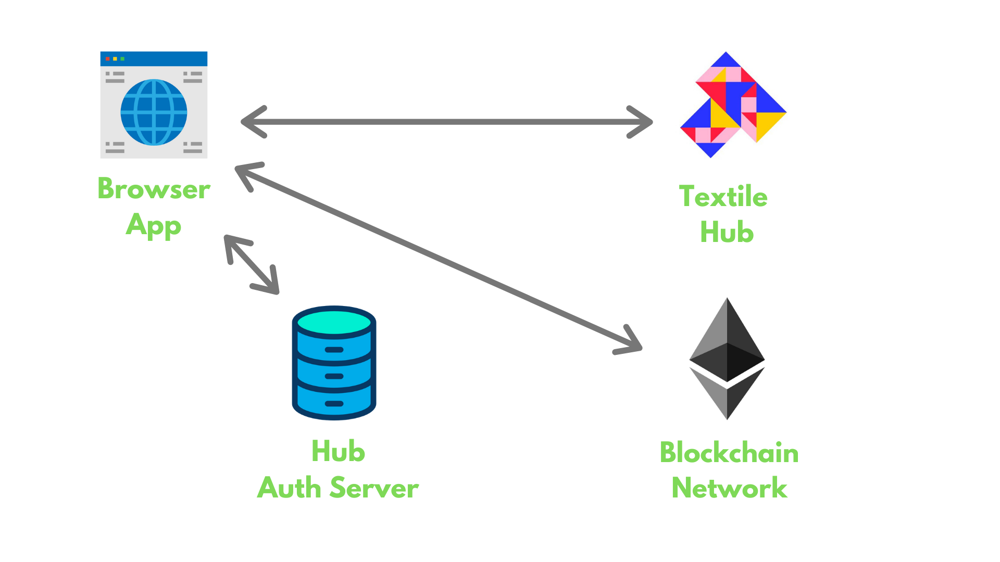
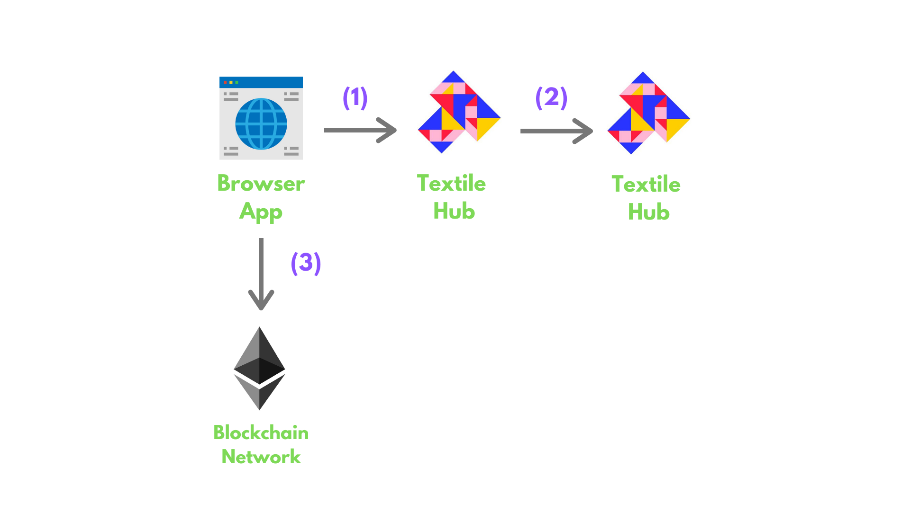
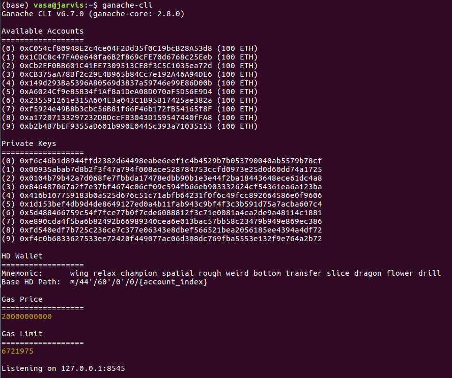
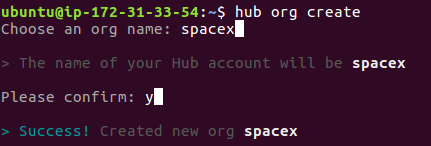
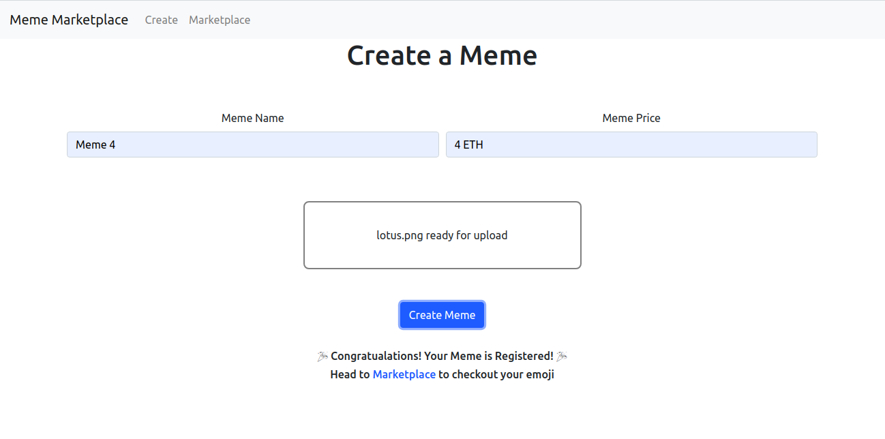
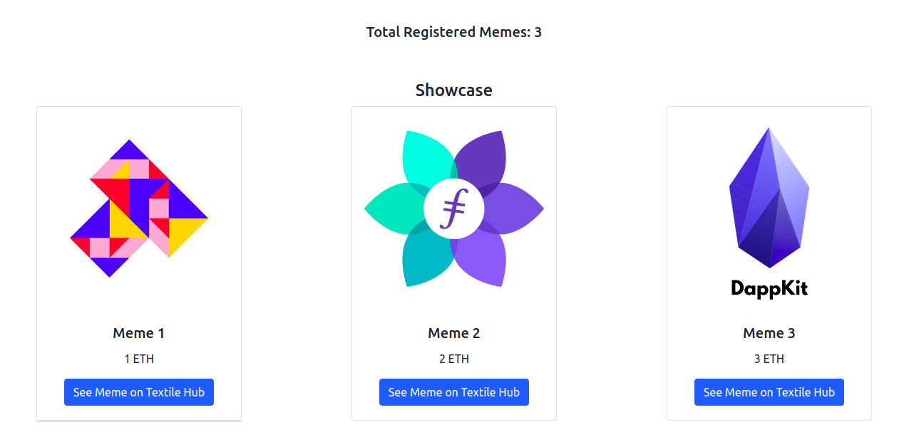

# Meme marketplace

In this tutorial, we will build a [meme marketplace](https://github.com/filecoin-shipyard/meme-marketplace) using [Textile Hub](https://docs.textile.io/hub/), which is a [Filecoin-backed IPFS Pinning Service](../tools/filecoin-backed-pinning), and Ethereum ERC 721 standard.

You will be able to upload memes to Textile Hub using a dashboard and register the memes with ERC 721 Non-fungible tokens, which will help anyone uniquely identify the memes and their owners in a decentralized way!

## Overview

After completing this tutorial, you will be able to:

1. Write and deploy an ERC 721 standard contract to create and issue Non-fungible tokens (NFTs).
2. Use javascript libraries to connect to remote Textile Hub to add and retrieve data from Textile Buckets.
3. Use javascript libraries to connect to ethereum blockchain to interact with the deployed smart contract.

The app you'll build in the tutorial includes three pages:

1. Login page to authenticate with an authentication server to access Textile Hub.
2. Create a Meme page that uses Textile Hub to upload meme images to the Textile Bucket, and then creates a token for the uploaded meme on the local Ethereum blockchain.
3. Marketplace page listing details of all the memes by fetching data from the blockchain and Textile Bucket.

Here is a sneak-peek of how the final application will look:

@[youtube](https://youtu.be/UaTr0JSg4ZQ)

To complete the application, you'll need the following repositories:

- [Repository](https://github.com/filecoin-shipyard/meme-nft-token) for ERC 721 smart contract.
- [Repository](https://github.com/filecoin-shipyard/meme-marketplace/tree/master/hub-browser-auth-app) for the authentication server.
- [Repository](https://github.com/filecoin-shipyard/meme-marketplace/tree/master/marketplace) for meme marketplace app.

The high-level overview of the application architecture:

- A remote server hosts Textile Hub.
- The ERC 721 token smart contract resides on a local (private) blockchain network.
- A Textile Hub authentication server runs locally.
- Your browser application interacts with the remote Textile hub server, local authentication server, the blockchain network for storing memes, and creating NFTs.



Before diving into the tutorial for this sample application, the following section provides an understanding of Textile Hub and ERC 721 standard token contract.

### Textile Hub

[Textile Hub](https://docs.textile.io/hub/) is a portal where teams and individual developers can access IPFS and _soon_ Filecoin resources easily. The Hub makes it simple to manage and update [Buckets](https://docs.textile.io/hub/buckets/) on IPFS, persist data for your users on IPFS, deploy and scale [Threads databases](https://docs.textile.io/threads/) for your app users, and collaborate on all of it with your team!

You can find more about Textile Hub in their [documentation](https://docs.textile.io/hub/).

### Textile Buckets

If you've used cloud storage, you'll find buckets easy to understand. Buckets perform like cloud services or containers, but, unlike traditional cloud services, buckets are built on open, decentralized protocols including the IPFS and Libp2p. You can serve websites, data, and apps from buckets.

Buckets are packed with useful features, including:

- Explore Buckets on the [Hub gateway](https://docs.textile.io/buckets/#explore-on-the-gateway).
- Render web content in a Bucket on a persistent [website](https://docs.textile.io/buckets/#render-on-a-website).
- Automatically distribute updates [on IPFS using IPNS](https://docs.textile.io/buckets/#render-on-ipfs-gateways).
- Collaboratively manage Buckets as an [organization](https://docs.textile.io/buckets/#organization-buckets).
- Create private Buckets where [app users can store data](https://docs.textile.io/buckets/#app-user-buckets).
- (Soon) Archive Bucket data on Filecoin to ensure long-term security and access to files.

### ERC 721 Token

If you are familiar with [smart contracts](https://blockgeeks.com/guides/smart-contracts/) and [Ethereum](https://ethereum.org/), then you probably know that the [ERC20](https://docs.openzeppelin.com/contracts/2.x/erc20) token standard can be used to create other _fungible_ tokens. A fungible token is a token that is exchangeable for any other token issued, just like a Euro is exchangeable for any other Euro. There is no significance to the picture on the Euro coin that makes it “different” from others. It’s still one Euro. In the same way, fungible tokens are identical to one another.

The Ethereum network also enables the creation of _non-fungible_ _tokens_ (NFT) using a standard called ERC 721. A non-fungible token is more like a baseball card or other collectible item. There may be one original or a limited number of issued originals that are distinguishable from one another. NFTs are used in art, collectibles, or to denote unique assets such as real estate. The sample application creates NFTs that can represent memes, where each meme is an item that can be distinguished from the others.

To create these NFTs, this tutorial uses [smart contracts](https://github.com/OpenZeppelin/openzeppelin-contracts/) written by [OpenZeppelin](https://openzeppelin.com/), an organization that provides tools to write, deploy, and operate decentralized applications.

### Textile Hub, Bucket, and ERC 721 token interactions

The data (memes) will be stored on IPFS using Textile Buckets. The Hub makes it simple to manage and update Buckets on IPFS, persist data for your users on IPFS.

An ERC 721 token will be created for each meme file stored on Textile Buckets, to uniquely identify the meme on a blockchain network.

The following diagram explains the data flow in the application.



1. The data (meme) is sent from the Frontend to the Textile Hub.
2. Textile Hub stores the data in a Textile Bucket.
3. The CID of the data stored in Textile Bucket is registered on the Blockchain network.

Here are some resources you can dive into:

- [More on Textile Hub](https://docs.textile.io/hub/)
- [More on Textile Buckets](https://docs.textile.io/buckets/)
- [More on Textile ERC 721](https://docs.openzeppelin.com/contracts/2.x/erc721)

## Step 1 - Starting a blockchain network and deploying contracts

To create the Meme Marketplace, you first set up three components:

1. Ethereum blockchain and smart contract
2. React app
3. Authentication server

This section takes you through the setup of the blockchain network.

### Blockchain and Smart Contract Setup

The ERC 721 token contract can be written and deployed in [Truffle](https://www.trufflesuite.com/docs/truffle/getting-started/installation) or [Remix IDE](https://remix.ethereum.org/#optimize=false&evmVersion=null&version=soljson-v0.6.6+commit.6c089d02.js). This tutorial uses Truffle. If you wish to use Remix IDE, refer to their [documentation](https://remix-ide.readthedocs.io/en/latest).

1. Make sure you have a server with the Node Package Manager (NPM) installed. If you don't have NPM, install [Node.js](https://nodejs.org/)
2. Install Truffle on your system using the Node Package Manager (NPM). Type the following command to install and setup remix.

```bash
npm install -g truffle
```

::: tip
Mac and Linux users may have to use `sudo` for installing the Truffle globally. If you are on Windows, you may encounter some naming conflicts. Refer to this [documentation](https://www.trufflesuite.com/docs/truffle/getting-started/installation#recommendations-for-windows) for resolving the issue.
:::

3. Clone the Truffle project from Github. Run the following command to clone and go to the project folder.

```bash
git clone https://github.com/filecoin-shipyard/meme-nft-token
cd meme-nft-token
```

The contract lives in [contract/MemeMarketplace.sol](https://github.com/filecoin-shipyard/meme-nft-token/blob/master/contracts/MemeMarketplace.sol).

::: tip
To learn more about the truffle project structure, see Truffle's [documentation](https://www.trufflesuite.com/docs/truffle/getting-started/creating-a-project).
:::

4. Install the OpenZeppelin contracts library by running the following command to install the `@openzeppelin/contracts` library.

```bash
npm i
```

5. You can deploy the [MemeMarketplace.sol](https://github.com/filecoin-shipyard/meme-nft-token/blob/master/contracts/MemeMarketplace.sol) contract to any network. For development purposes, this tutorial uses [ganache-cli](https://www.npmjs.com/package/ganache-cli), a CLI-based local blockchain client built for development purposes.

Install [ganache-cli](https://www.npmjs.com/package/ganache-cli) using the Node Package Manager (NPM). Run the following command to install and start the local development blockchain.

```bash
npm i -g ganache-cli
ganache-cli
```

As you can see below, the ganache-cli creates ten funded accounts (100 ETH in each account address). This tutorial uses one of these addresses and private key-pair for transactions.

::: tip
Mac and Linux users may have to use `sudo` for installing the ganache-cli globally.
:::

If everything went as it should, your terminal displays messages like those below.



6. For use later in this tutorial, copy the _mnemonic_ and save that somewhere you can refer to it later as needed.

In the above screenshot, the _mnemonic_ is:

```bash
congress elder barrel spice tent advance head manual dragon spice boring bone
```

::: tip
NOTE: The _mnemonic_ will be different for you, so use yours. Read this [article](https://kb.myetherwallet.com/en/security-and-privacy/what-is-a-mnemonic-phrase/) to learn more about mnemonics.
:::

7. Note that the local blockchain exposes an RPC endpoint at `127.0.0.1:8545`. Copy this as well where you can save it, so you can use this endpoint to deploy the contract and interact with the smart contract deployed on the blockchain via this RPC endpoint.

Now, as you have the local blockchain running, you need to point your Truffle to the local blockchain RPC URL. In our case, the endpoint is `127.0.0.1:8545` (as shown in the above image). This is already configured on the project in the [truffle-config.js](https://github.com/filecoin-shipyard/meme-nft-token/blob/master/truffle-config.js) file.

8. To deploy the smart contract, open your terminal, and go into the root folder of the project. Run the following command:

```bash
truffle migrate
```

::: tip
To learn more about [compiling](https://www.trufflesuite.com/docs/truffle/getting-started/compiling-contracts) and [deploying](https://www.trufflesuite.com/docs/truffle/getting-started/running-migrations) contracts, refer to Truffle’s documentation.
:::

If everything went as it should, your terminal returns something similar to the screen below:


The thing to note here is the "contract address", which is `0x69137609f09bE9eA3C82022D2122642a27a1d7a8` in our case. **This will be different for you.**

9. Copy **and save the contract address somewhere safe**. You will need it in the next sections of the tutorial.

10. To manage the keys and sign transactions, we will use [Metamask](http://metamask.io/). [Download and install Metamask](https://metamask.io/download.html) from their website.

The following video explains how to:

- Download and install the Metamask plugin.
- Importing an existing wallet (using the mnemonic that we saved above).
- Configuring the Metamask plugin to connect to the local blockchain network (`127.0.0.1:8545`)

@[youtube](https://youtube.com/watch?v=vbcy55J5xlU)

This completes the creation and deployment of the smart contract on a local blockchain.

## Step 2 - Run the React app

### Requirements

1. [Node.js](https://nodejs.org/en/download/)
2. [Xcode CommandLineTools](https://developer.apple.com/library/archive/technotes/tn2339/_index.html#//apple_ref/doc/uid/DTS40014588-CH1-WHAT_IS_THE_COMMAND_LINE_TOOLS_PACKAGE_)

### Steps

1. Clone the React app:

```bash
git clone https://github.com/filecoin-shipyard/meme-marketplace
```

2. Open the [meme-marketplace](https://github.com/filecoin-shipyard/meme-marketplace) project in a text editor.

3. Run the following commands to start the app:

```bash
cd marketplace
npm install
npm start
```

The meme marketplace app starts.

::: tip
This tutorial uses [React](https://reactjs.org/) as the UI library and [Redux](https://redux.js.org/) for application state management. You can use any other library or framework to build such an app.
:::

## Step 3 - Run the Hub Auth Server

### Requirements

1. [Node.js](https://nodejs.org/en/download/)
2. [Xcode CommandLineTools](https://developer.apple.com/library/archive/technotes/tn2339/_index.html#//apple_ref/doc/uid/DTS40014588-CH1-WHAT_IS_THE_COMMAND_LINE_TOOLS_PACKAGE_)

### Steps

Before starting the setup for the authentication server, you need to create API credentials to access the endpoints of the remote Textile hub.

To do that, you'll need:

- [An account](https://docs.textile.io/hub/accounts/). This is your developer account on the hub.
- [A user group key](https://docs.textile.io/hub/app-apis/). This is how your users will be able to access your Hub APIs. Consider creating the key in an organization, not as your personal account, so that you can invite collaborators later. You only need to create one _user group key_ for all the users of your app.
- [Typescript](https://webpack.js.org/guides/typescript/). The server is written in typescript.

Once you have set up these resources, you can start the server. The directions below walk you through this process.

1. Create an Account

Follow the [Textile documentation](https://docs.textile.io/hub/accounts/) to download, install, and initialize the latest Hub CLI.

2. Create an organization

Execute the following command to create an organization.

```bash
hub org create
```

The command line will prompt you to add an organization name. For example: `spacex`.
Confirm your input by pressing `y`.

::: tip
You need to use the organization name other than `spacex`.
:::



Your org is now created.

3. Create a user group key

After you have successfully created an organization, run the following command to create a user group key for your org:

```bash
hub keys create --org spacex
```

1. You will be prompted to select either `account` or `user group`. Select the `user group`.
2. You will be prompted to select if you require Signature Authentication—Press `y` and enter.
3. If everything goes as expected, you will receive a `KEY` and a `SECRET`.
4. **Copy and save these details somewhere safe**. You will need them to start the authentication server.

::: tip
You need to use the organization name that you created above.
:::


::: tip
Do not share any API Key Secrets. This includes User Group Key secret and account key Secrets. Be sure you never commit them into public repos or share them in published apps.
:::

4. Install Typescript

Run the following command to install typescript:

```bash
npm i -g typescript
```

::: tip
Linux and Mac users will have to use sudo
:::

4. Clone the Hub Auth Server app:

```bash
git clone https://github.com/filecoin-shipyard/meme-marketplace
```

5. Open the _hub-browser-auth-app_ folder of the [meme-marketplace](https://github.com/filecoin-shipyard/meme-marketplace) project in a text editor.

```bash
cd meme-marketplace/hub-browser-auth-app

## now open the hub-browser-auth-app folder
```


6. Start the Server

Now that the resources are set up, you can start the server.

Run the following command to create a copy of _example.env_ file:

```bash
cp example.env .env
```

Replace the `your_api_key` and `your_api_secret` with `KEY` and `SECRET` generated by the hub CLI.

Run the following command to start the server:

```bash
npm run build:server
npm run start:server
```

The hub auth server is now up and running. The rest of this tutorial shows the functionality available in the Meme Marketplace app.

## Step 4: Starting and Connecting the Authentication Server

This section covers how the React app authenticates with the Hub auth server. This tutorial uses a custom private-key identity in the React app to manage users. The Textile Hub supports public-key infrastructure (PKI), allowing your app to support different user identity providers based on PKI (e.g., 3Box, uPort, Blockstack), or derive your own.

Users get access to the Hub APIs easily using this configuration. The hub uses encryption to verify that the users are who they claim to be.

The general flow of authentication is as follows:

1. A user attempts to sign-in by providing their _public key_.
2. Your app creates a one-time challenge for the users.
3. The user signs the challenge with their _private key_ to generate _credentials_.
4. Your app verifies the credentials.

The steps below simplify the flow with the hub's token generation endpoint, which includes credential validation.

### Generating an identity

Generate an identity by using the following code from [marketplace/src/redux/actions/hub.js](https://github.com/filecoin-shipyard/meme-marketplace/blob/master/marketplace/src/redux/actions/hub.js#L17) in React app, using the `@textile/threads-core` library.

You can install `@textile/threads-core` using the Node Package Manager (NPM):

```bash
npm i @textile/threads-core
```

You can use the `Libp2pCryptoIdentity` utility exported from `@textile/threads-core` to generate random new identities (private and public keys) and later, to sign challenges to prove private key ownership.

```js
import { Libp2pCryptoIdentity } from '@textile/threads-core'

const getIdentity = async () => {
  const queryString = window.location.search
  const urlParams = new URLSearchParams(queryString)
  try {
    if (urlParams.get('force')) {
      window.history.replaceState({}, document.title, '/')
      throw new Error('Forced new identity')
    }
    var storedIdent = localStorage.getItem('identity')
    if (storedIdent === null) {
      throw new Error('No identity')
    }
    const restored = Libp2pCryptoIdentity.fromString(storedIdent)
    return restored
  } catch (e) {
    /**
     * If any error, create a new identity.
     */
    try {
      /** Random new identity */
      const identity = await Libp2pCryptoIdentity.fromRandom()

      /** Convert to string. */
      const identityString = identity.toString()

      /** Storing identity for later use */
      localStorage.setItem('identity', identityString)
      return identity
    } catch (err) {
      return err.message
    }
  }
}
```

The example above creates a new identity using `Libp2pCryptoIdentity.fromRandom()` and then converts it into a string format to store it in the browser `localStorage` for later use when the user returns to the app.

::: tip
`localStorage` isn't guaranteed and may be cleared by the browser, the system, or the users. Even more important, localStorage isn't a secure place to store secrets. You should provide alternative storage mechanisms if maintaining persistent identity (and therefore, data ownership and access) over time is important. (from [Textile's documentation](https://docs.textile.io/tutorials/hub/libp2p-identities/#caching-user-identity))
:::

### Signing Challenges

Challenges are designed to validate that a user is who they claim to be, by signing the challenge with a private key.

To sign data, use the `identity.sign` method exposed by the `Libp2pCryptoIdentity` object. This will be [used by the React app](https://github.com/filecoin-shipyard/meme-marketplace/blob/master/marketplace/src/redux/actions/hub.js#L95) to sign random challenges from the server to verify the ownership of the user's identity (user's private key).

```js
import { Libp2pCryptoIdentity } from '@textile/threads-core'

async function sign(identity) {
  const challenge = Buffer.from('Sign this string')
  const credentials = identity.sign(challenge)
  return credentials
}
```

This way, the app can support PKI and can prove the user's identity to a server. The app only needs to expose its public key, which will be used by the server as a way to uniquely identify a user. But as the public key is "public" in nature, anybody can mock any user if we don't have any way to prove to the server that we are who we claim to be. To prove our identity, the server will ask us to sign a challenge with our private key, and on successful verification, provide us with a token that can be used for a limited period of time to access the Hub APIs.

### Creating and connecting the Authentication server

To identify users, the server needs to handle two-way communication with the client during identity verification. The flow is as follows:

1. The **client** initiates a login request.
2. The **server** receives the request and contacts the **Hub** APIs to get a challenge for the requesting **client**.
3. The **server** passes the challenge to the **client**.
4. The **client** uses the private key to **sign** the challenge to prove their identity and sends the signed challenge back to the **server**.
5. The **server** passes the signed challenge to the **Hub**.
6. If successful, the **server generates API credentials and passes credentials, token, and API key back to the client**.
7. The **client** can use the Hub APIs directly.

Look at:

- [marketplace/src/pages/Login/index.js](https://github.com/filecoin-shipyard/meme-marketplace/blob/master/marketplace/src/pages/Login/index.js#L41): To understand how Login UI works. Involved in Step 1.
- [marketplace/src/redux/actions/hub.js](https://github.com/filecoin-shipyard/meme-marketplace/blob/master/marketplace/src/redux/actions/hub.js#L322) To understand how the React app connects and communicates with the hub auth server using Websockets to complete the login process. Involved in Step 1,4,7.
- [hub-browser-auth-app/src/server/index.ts](https://github.com/filecoin-shipyard/meme-marketplace/blob/master/hub-browser-auth-app/src/server/index.ts): To understand different modules used in the hub auth server.
- [hub-browser-auth-app/src/server/wss.ts](https://github.com/filecoin-shipyard/meme-marketplace/blob/master/hub-browser-auth-app/src/server/wss.ts): Creates WebSocket endpoint for the client-side token challenge. Involved in Step 2,3,5,6.

#### Step 1: The client initiates a login request

In [marketplace/src/pages/Login/index.js](https://github.com/filecoin-shipyard/meme-marketplace/blob/master/marketplace/src/pages/Login/index.js#L41), `loginAndCreateBucket` is called if the Metamask plugin is available.

```js
export const loginAndCreateBucket = () => async dispatch => {
  document.getElementById('login').innerHTML = 'Creating Hub Identity...'

  // Logging In
  await hubClient.setupIdentity()
  const auth = await hubClient.login()

  dispatch({
    type: types.LOGIN,
    payload: auth
  })

  document.getElementById('login').innerHTML = 'Creating a Bucket...'

  // Creating & Opening a Bucket
  const bucket = await hubClient.createBucket()

  dispatch({
    type: types.CREATE_BUCKET,
    payload: bucket
  })
}
```

In [marketplace/src/redux/actions/hub.js](https://github.com/filecoin-shipyard/meme-marketplace/blob/master/marketplace/src/redux/actions/hub.js#L198), `loginAndCreateBucket`:

- Initiates login request with the hub auth server by:

  - Calling `hubClient.setupIdentity()` which calls `getIdentity()` (discussed above) to create PKI identity for the app user. `this.id` is a `Libp2pCryptoIdentity` object containing the user identity including user's private key. `this.id` is converted into string format to create `identity`. The `setupIdentity` function returns `publicKey` which is the public key in string format.

  ```js
  setupIdentity = async () => {
    /** Create or get identity */
    this.id = await getIdentity()
    /** Contains the full identity (including private key) */
    const identity = this.id.toString()

    /** Get the public key */
    const publicKey = this.id.public.toString()

    /** Return the publicKey short ID */
    return publicKey
  }
  ```

  - Calling `hubClient.login()` which first checks if `this.id` is defined or not. `this.id` is passed into the `loginWithChallenge` function.

  ```js
  /**
   * Provides a full login where
   * - pubkey is shared with the server
   * - identity challenge is fulfilled here, on client
   * - hub api token is sent from the server
   *
   * see index.html for example running this method
   */
  login = async () => {
    if (!this.id) {
      throw Error('No user ID found')
    }

    /** Use the identity to request a new API token */
    this.auth = await loginWithChallenge(this.id)

    console.log('Verified on Textile API')

    /* Return auth details */
    return this.auth
  }
  ```

The `loginWithChallenge` function in [marketplace/src/redux/actions/hub.js](https://github.com/filecoin-shipyard/meme-marketplace/blob/master/marketplace/src/redux/actions/hub.js#L56) uses Websockets to communicate with the hub authentication server.

The react app connects to the `socketUrl = ws://localhost:3001/ws/userauth`. After the socket connection is open, the public key is stringified using `id.public.toString()`, and a token request is sent to the hub auth server.

```js
/**
 * More secure method for getting token & API auth.
 *
 * Keeps private key locally in the app.
 */
const loginWithChallenge = async id => {
  return new Promise((resolve, reject) => {
    /**
     * Configured for our development server
     *
     * Note: this should be upgraded to wss for production environments.
     */
    const socketUrl = `ws://localhost:3001/ws/userauth`

    /** Initialize our WebSocket connection */
    const socket = new WebSocket(socketUrl)

    /** Wait for our socket to open successfully */
    socket.onopen = () => {
      /** Get public key string */
      const publicKey = id.public.toString()

      /** Send a new token request */
      socket.send(
        JSON.stringify({
          pubkey: publicKey,
          type: 'token'
        })
      )

      /** Listen for messages from the server */
      socket.onmessage = async event => {
        const data = JSON.parse(event.data)
        switch (data.type) {
          /** Error never happen :) */
          case 'error': {
            reject(data.value)
            break
          }
          /** The server issued a new challenge */
          case 'challenge': {
            /** Convert the challenge json to a Buffer */
            const buf = Buffer.from(data.value)
            /** User our identity to sign the challenge */
            const signed = await id.sign(buf)
            /** Send the signed challenge back to the server */
            socket.send(
              JSON.stringify({
                type: 'challenge',
                sig: Buffer.from(signed).toJSON()
              })
            )
            break
          }
          /** New token generated */
          case 'token': {
            resolve(data.value)
            break
          }
        }
      }
    }
  })
}
```

#### Step 2: Hub auth server contacts the Hub APIs

In [hub-browser-auth-app/src/server/index.ts](https://github.com/filecoin-shipyard/meme-marketplace/blob/master/hub-browser-auth-app/src/server/index.ts), to facilitate this two-way communication between the server and the client, we use Websockets as follows:

```js
/** Provides nodejs access to a global WebSocket value, required by Hub API */
(global as any).WebSocket = require("isomorphic-ws");

import koa from "koa";
import websockify from "koa-WebSocket";

import dotenv from "dotenv";

import wss from "./wss";

dotenv.config();

if (!process.env.USER_API_KEY || !process.env.USER_API_SECRET) {
  process.exit(1);
}

const PORT = parseInt(process.env.PORT, 10) || 3001;

const app = websockify(new koa());

/**
 * Create WebSocket endpoint for client-side token challenge
 *
 * See ./wss.ts
 */
app.ws.use(wss);

/** Start the server! */
app.listen(PORT, () => console.log("Server started."));
```

Here we import multiple modules:

- [`isomorphic-ws`](https://www.npmjs.com/package/isomorphic-ws): Isomorphic implementation of WebSocket. It uses:
  - `ws` on Node
  - `global.WebSocket` in browsers
- [`koa`](https://www.npmjs.com/package/koa): Expressive HTTP middleware framework for node.js to make web applications and APIs.
- [`koa-WebSocket`](https://www.npmjs.com/package/koa-WebSocket): Light wrapper around Koa providing a WebSocket middleware handler that is koa-route compatible.
- [`dotenv`](https://www.npmjs.com/package/dotenv): Dotenv is a zero-dependency module that loads environment variables from a _.env_ file into `process.env`.

You can install these modules using the Node Package Manager (NPM):

```bash
npm i isomorphic-ws koa koa-WebSocket dotenv
```

We also import the following WebSocket file, [wss.ts](https://github.com/filecoin-shipyard/meme-marketplace/blob/master/hub-browser-auth-app/src/server/wss.ts) which creates WebSocket endpoint for the client-side token challenge.

`dotenv.config()` loads the environment variables from a _.env_ file into `process.env`. If `process.env.USER_API_KEY` or `process.env.USER_API_SECRET` is not defined; then the application exits automatically.

The `PORT` variable is set to `process.env.PORT` if present, otherwise defaults to `3001`.

`websockify(new koa())` wraps koa object providing WebSocket middleware handler that is `koa-route` compatible.

The server is started using the `app.listen` method which listens on the port: `PORT`.

::: tip
This example uses `koa` web framework, but you can use `express` too.
:::

In the code above, the second to last section reads `Create WebSocket endpoint for the client-side token challenge`. That section points to the [hub-browser-auth-app/src/server/wss.ts](https://github.com/filecoin-shipyard/meme-marketplace/blob/master/hub-browser-auth-app/src/server/wss.ts) file which contains functionality to:

- Handle the public key supplied by the client and request a challenge for the public key from the hub. (Step 2)
- Send the challenge back to the client via WebSocket. (Step 3)
- Handle the response from the client with the signed challenge, which is passed to the hub for verification. (Step 5)
- Create credentials and store client details for future logins to the app after successful validation. (Step 6)

```js
import route from "koa-route";
import Emittery from "emittery";
import { UserAuth } from "@textile/hub"

import {newClientDB, getAPISig} from "./hub-helpers"

interface UserModel {
  pubkey: string
  lastSeen: Date
}

/**
 * In a real system you might have a real user-singup flow
 * Here, we just stub in a basic user "database".
 * Users are added by their Public Key.
 * Users will only be added if they prove they hold the private key.
 * Proof is done using the hub's built in token challenge API.
 */
const UserDB: {[key: string]: UserModel} = {}

/**
 * This login includes a more thorough identity verification step.
 *
 * It leverages the hub's public key verification via challenge.
 * The challenge is issued server-side by fulfilled here, client-side.
 * This has several benefits.
 * - User private key never needs to leave the user/client.
 * - The server will leverage the Hub verification in the process of user registration.
 * - The server can maintain a record of: user public key and user token in list of users.
 */
const wss = route.all('/ws/userauth', (ctx) => {
  /** Emittery allows us to wait for the challenge response event */
  const emitter = new Emittery();
  ctx.WebSocket.on('message', async (msg) => {
    try {
      /** All messages from client contain {type: string} */
      const data = JSON.parse(msg);
      switch (data.type) {
        /** The first type is a new token request */
        case 'token': {
          /** A new token request will contain the user's public key */
          if (!data.pubkey) { throw new Error('missing pubkey') }

          /**
           * Init new Hub API Client
           *
           * see ./hub.ts
           */
          const db = await newClientDB()

          /** Request a token from the Hub based on the user public key */
          const token = await db.getTokenChallenge(
            data.pubkey,
            /** The callback passes the challenge back to the client */
            (challenge: Uint8Array) => {
            return new Promise((resolve, reject) => {
              /** Pass the challenge to the client */
              ctx.WebSocket.send(JSON.stringify({
                type: 'challenge',
                value: Buffer.from(challenge).toJSON(),
              }))
              /** Wait for the challenge event from our event emitter */
              emitter.on('challenge', (sig) => {
                /** Resolve the promise with the challenge response */
                resolve(Buffer.from(sig))
              });
              /** Give client a reasonable timeout to respond to the challenge */
              setTimeout(() => {
                reject()
              }, 1500);

            })
          })

          /**
           * The challenge was successfully completed by the client
           */

          /**
           * The user has verified they own the pubkey.
           * Add or update the user in the user database
           */
          const user: UserModel = {
            pubkey: data.pub,
            lastSeen: new Date(),
          }
          UserDB[data.pub] = user;

          /** Get API authorization for the user */
          const auth = await getAPISig()

          /** Include the token in the auth payload */
          const payload: UserAuth = {
            ...auth,
            token: token,
            key: process.env.USER_API_KEY,
          };

          /** Return the result to the client */
          ctx.WebSocket.send(JSON.stringify({
            type: 'token',
            value: payload,
          }))
          break;
        }
        /** The second type is a challenge response */
        case 'challenge': {
          /** A new challenge response will contain a signature */
          if (!data.sig) { throw new Error('missing signature (sig)') }

          /**
           * If the timeout hasn't passed there is a waiting promise.
           * Emit the challenge signature for the waiting listener above.
           * */
          await emitter.emit('challenge', data.sig);
          break;
        }
      }
    } catch (error) {
      /** Notify our client of any errors */
      ctx.WebSocket.send(JSON.stringify({
        type: 'error',
        value: error.message,
      }))
    }
  });
});

export default wss;
```

Here we import multiple modules:

- `koa-route`: A simple route middleware for koa.
- `emittery`: A simple and modern async event emitter.
- `@textile/hub`: Provides access to Textile APIs in apps based on Account Keys or User Group Keys.

You can install these modules using the Node Package Manager (NPM):

```bash
npm i koa-route emittery @textile/hub
```

We also import [`hub-helpers.ts`](https://github.com/filecoin-shipyard/meme-marketplace/blob/master/hub-browser-auth-app/src/server/hub-helpers.ts) which exports helper functions like:

- `newClientDB`: Creates a Client (remote DB) connection to the Textile Hub.
- `getAPISig`: uses a helper function `createAPISig` exported from `@textile/hub` to create a new API signature, which expires in 300 seconds by default.

```js
// hub-helpers.ts file

import { createAPISig, Client } from '@textile/hub'

/**
 * getAPISig uses helper function to create a new sig
 *
 * seconds (300) time until the sig expires
 */
export const getAPISig = async (seconds: number = 300) => {
  const expiration = new Date(Date.now() + 1000 * seconds)
  return await createAPISig(process.env.USER_API_SECRET, expiration)
}

/**
 * newClientDB creates a Client (remote DB) connection to the Hub
 *
 * A Hub connection is required to use the getToken API
 */
export const newClientDB = async () => {
  const API = process.env.API || undefined
  const db = await Client.withKeyInfo(
    {
      key: process.env.USER_API_KEY,
      secret: process.env.USER_API_SECRET,
      type: 0
    },
    API
  )
  return db
}
```

After importing the modules and helper functions, [hub-browser-auth-app/src/server/wss.ts](https://github.com/filecoin-shipyard/meme-marketplace/blob/master/hub-browser-auth-app/src/server/wss.ts) creates an `UserModel` interface which stores public key (`pubkey`) and last visit time (`lastSeen`) of an app user.

::: tip
In an actual app, you may like to use a database to store the app user details.
:::

We then register a WebSocket route `/ws/userauth`. Whenever the server receives a `'message" with`data.type`as`token`(as sent by the react app above), the server first checks if`data.pubkey`is present. If yes, a new`db`is initialized using the`newClientDB()`function. The server then requests a`challenge`for a public key (`data.pubkey`) using`db.getTokenChallenge`which takes a callback function that accepts a`Uint8Array`type`challenge`and returns a Promise (that resolves to the value of`token`).

#### Step 3: The server passes the challenge to the client

This `challenge` is then converted to JSON data type using `Buffer.from(challenge).toJSON()` and sent to the react app using `ctx.WebSocket.send`.

The server waits for `1500` milliseconds for the react app to respond to the challenge.

#### Step 4. The client uses the private key to sign the challenge

This challenge is handled by the react app in the `loginWithChallenge` in the [marketplace/src/redux/actions/hub.js](https://github.com/filecoin-shipyard/meme-marketplace/blob/master/marketplace/src/redux/actions/hub.js#L91) file.

The challenge (`data.value`) is converted to `Buffer` type using `const buf = Buffer.from(data.value)` and then signed using `const signed = await id.sign(buf)`.

This signed challenge is sent back to the server, which is handled by the ```challenge"`case in the switch case in [hub-browser-auth-app/src/server/wss.ts](https://github.com/filecoin-shipyard/meme-marketplace/blob/master/hub-browser-auth-app/src/server/wss.ts#L113). The server checks for the challenge-response (`data.sig`) and if present it emits a challenge event by`emitter.emit("challenge", data.sig)`.

#### Step 5. The server passes the signed challenge to the hub

This event is [captured](https://github.com/filecoin-shipyard/meme-marketplace/blob/master/hub-browser-auth-app/src/server/wss.ts#L67) and the Promise is resolved to `Buffer.from(sig)`, thus setting the value of the `token` variable to `Buffer.from(sig)`.

::: tip
The token provided in the response should be considered a secret that only should be shared with a single user. It does not expire.
:::

#### Step 6: The server generates API credentials

The server generates API credentials and passes credentials, token, and API key back to the client. Now, as the app user has verified they own the `pubkey`, the server saves the `pubkey` and `lastSeen` time in the `UserDB`.

The server then generates an API authorization signature (`auth`) for the user using `getAPISig()`, and sends it back to the react app along with the `token` and `process.env.USER_API_KEY`.

#### Step 7: The client can use the Hub APIs directly

This payload is [captured by the react app](https://github.com/filecoin-shipyard/meme-marketplace/blob/master/marketplace/src/redux/actions/hub.js#L107) which resolves the Promise returned by the `loginWithChallenge` function and set as a value of `this.auth` which can be used in the react app to use the Textile Hub APIs directly without the hub auth server.

Now, your users have identities, and they've verified themselves. In the login page section, we will explore how we can connect to the hub APIs to create buckets.

## Step 5 - Connecting React app with a local blockchain

Take a look at the following files:

- [marketplace/src/pages/Login/index.js](https://github.com/filecoin-shipyard/meme-marketplace/blob/master/marketplace/src/pages/Login/index.js): The Login page connects the react app with the Metamask plugin.
- [marketplace/src/utils/blockchain/index.js](https://github.com/filecoin-shipyard/meme-marketplace/blob/master/marketplace/src/utils/blockchain/index.js): The blockchain utils file:
  - Includes code for connecting the react app with the local blockchain and interacting with the deployed smart contract.
  - Uses Metamask plugin and [web3.js](https://web3js.readthedocs.io/) library to send transactions and calls to the blockchain network.

### Step 5a - Connecting with Metamask

[web3.js](https://web3js.readthedocs.io/) is a collection of libraries that allow you to interact with a local or remote ethereum node using HTTP, IPC, or WebSocket.

You can install web3.js by running the following command:

```bash
npm i web3
```

The Metamask plugin injects `ethereum` object in the browser page, which can be used by web3.js to access Metamask plugin functionality.

In [marketplace/src/pages/Login/index.js](https://github.com/filecoin-shipyard/meme-marketplace/blob/master/marketplace/src/pages/Login/index.js), we check if `window.ethereum` is available (in case the Metamask plugin is installed). If not, then we alert the user to install the Metamask plugin. If Metamask plugin is available:

- Set `window.web3 = new Web3(window.ethereum)` (using `window.ethereum` as a provider object). `window.web3` can be used to access Metamask plugin functionality.
- Call `loginAndCreateBucket` function, which will be explored in Step 6.

```jsx
const loadWeb3 = async loginAndCreateBucket => {
  if (window.ethereum) {
    window.web3 = new Web3(window.ethereum)
    await window.ethereum.enable()
    loginAndCreateBucket()
  } else {
    window.alert(
      'Metamask not detected! Install Metamask plugin to proceed: https://metamask.io/download.html'
    )
  }
}
```

### Step 5b - Connecting to blockchain

In [marketplace/src/utils/blockchain/index.js](https://github.com/filecoin-shipyard/meme-marketplace/blob/master/marketplace/src/utils/blockchain/index.js) we use:

- `window.web3`, which was set in the [Login page](https://github.com/filecoin-shipyard/meme-marketplace/blob/master/marketplace/src/pages/Login/index.js#L39). This will be used to send transactions to the Metamask plugin.
- `web3 = new Web3(new Web3.providers.HttpProvider(NETWORK_URL))` which is used for accessing some functions supported by newer versions of web3.js. Here `NETWORK_URL` is the RPC endpoint from `ganache-cli` from [Step 1](./step-1-blockchain-and-contracts-setup.md).

::: tip
Metamask provider injects a deprecated version of web3.js (`0.20.7`). To use currently supported version of web3.js (`0.1.x`) for accessing functions like `encodeABI`, `decodeParameters` we initialize a new web3 object `web3 = new Web3(new Web3.providers.HttpProvider(NETWORK_URL))`.
:::

```js
const Web3 = require('web3')
const contract = require('./contract')
const metamask = window.web3

const NETWORK_URL = 'http://127.0.0.1:8545'
const web3 = new Web3(new Web3.providers.HttpProvider(NETWORK_URL))
```

The frontend is now connected with the blockchain.

### Step 5c - Connecting to and the deployed smart contract

In [marketplace/src/utils/blockchain/index.js](https://github.com/filecoin-shipyard/meme-marketplace/blob/master/marketplace/src/utils/blockchain/index.js#L8) import the `contract` object from `marketplace/src/utils/blockchain/contract.js` initialize the contract object `MemeMarketplace` using `new web3.eth.Contract` constructor which takes the following parameters:

- `contract.abi`: In Ethereum, the [ABI Specification](https://solidity.readthedocs.io/en/develop/abi-spec.html) is a way to encode the interface of a smart contract in a way that your user interface can make sense of. The ABI contains all the details of the contract methods in an array.
- `contract.address`: The address of the deployed contract.
- Other optional parameters:
  - `from`: The account address from which the transaction will be signed.

```js
const MemeMarketplace = new web3.eth.Contract(contract.abi, contract.address, {
  from: metamask.eth.accounts[0]
})
```

In [marketplace/src/utils/blockchain/contract.js](https://github.com/filecoin-shipyard/meme-marketplace/blob/master/marketplace/src/utils/blockchain/contract.js#L453), replace the `contract_address_here` string with the contract address that you saved after truffle contract deployment in [Step 1](./step-1-blockchain-and-contracts-setup.md).

The frontend is now connected with the deployed contract.

### Step 5d - Sending transaction to register memes on blockchain

In [marketplace/src/utils/blockchain/index.js](https://github.com/filecoin-shipyard/meme-marketplace/blob/master/marketplace/src/utils/blockchain/index.js#L13) the `awardMemeToken` is used to register NFT token for a meme.

```js
export const awardMemeToken = (address, tokenMetadata, callback) => {
  let data = MemeMarketplace.methods
    .awardMemeToken(address, tokenMetadata)
    .encodeABI()

  metamask.eth.sendTransaction(
    {
      from: metamask.eth.accounts[0],
      to: contract.address,
      data: data
    },
    function (receipt) {
      callback(null, receipt)
    }
  )
}
```

We access the contract's `awardMemeToken` function using `MemeMarketplace.methods.awardMemeToken`, which takes 2 parameters:

- `address`: The address of the owner of the NFT token.
- `tokenMetadata`: Token details like name, price, and the CID of the meme.

The `data` is a hex string that contains information about the function to be called, and it's parameters.

The `metamask.eth.sendTransaction` method is used to send a transaction to be signed and deployed by the Metamask plugin. It is provided with the following parameters:

- `from`: The account address from which the transaction will be signed.
- `to`: The account to which the transaction is sent to. In this case, it the contract's address.
- `data`: The hex string containing information about the function to be called and it's parameters.
- a callback method that returns `receipt` containing the details about the transaction that was sent.

::: tip
Metamask manages the keys securely for the app user and can be used to sign any data using on behalf of the user.
:::

On calling the `sendTransaction` method, the Metamask plugin will pop up and ask for the user's consent to sign and send the transaction to the blockchain on the user's behalf.

The `callback` method passed in `awardMemeToken` is used to capture the `receipt`.

### Step 5e: Sending calls to fetch meme details form the blockchain

In [marketplace/src/utils/blockchain/index.js](https://github.com/filecoin-shipyard/meme-marketplace/blob/master/marketplace/src/utils/blockchain/index.js#L57), you will find three functions to fetch token related details from the deployed contract:

- `getTokenOwner`: This fetches the owner (address) of a `tokenId`. Each NFT token has a `tokenId` that is used to uniquely identify an NFT token. The hex string `data` contains info about the method to be called (`ownerOf`) and the parameter `tokenId`.
  The `web3.eth.call` method sends a call:

  - to the `contract.address`
  - from the `metamask.eth.accounts[0]` (the imported account in Metamask plugin)
  - and returns a promise which resolves to `receipt` object. The `logs` array in the `receipt` object has hex string named `data`, which contains the `address` of the token owner (decoded using `web3.eth.abi.decodeParameters`).

- `getTokenMetadata`: This fetches the metadata (name, price, CID) related to the meme NFT token. The hex string `data` contains info about the method to be called (`tokenURI`) and the parameter `tokenId`.
  The `web3.eth.call` method sends a call:

  - to the `contract.address`
  - from the `metamask.eth.accounts[0]` (the imported account in Metamask plugin)
  - and returns a promise which resolves to `receipt` object. The `logs` array in the `receipt` object has hex string named `data`, which contains the metadata string (decoded using `web3.eth.abi.decodeParameters`).

- `getTotalSupply`: This fetches the total number of meme NFTs registered on the contract. The hex string `data` contains info about the method to be called (`totalSupply`).
  The `web3.eth.call` method sends a call:
  - to the `contract.address`
  - from the `metamask.eth.accounts[0]` (the imported account in Metamask plugin)
  - and returns a promise which resolves to `receipt` object. The `logs` array in the `receipt` object has hex string named `data`, which contains the [unsigned integer](https://solidity.readthedocs.io/en/v0.5.3/types.html#integers) representing the number of registered NFTs (decoded using `web3.eth.abi.decodeParameters`).

::: tip
A call is different from a transaction. A call only involves in querying the state of the contract, whereas the transaction can change the state of the contract.
:::

```js
export const getTokenOwner = tokenId => {
  return new Promise((resolve, reject) => {
    let data = MemeMarketplace.methods.ownerOf(tokenId).encodeABI()

    web3.eth
      .call({
        from: metamask.eth.accounts[0],
        to: contract.address,
        data: data
      })
      .then(receipt => {
        let res = web3.eth.abi.decodeParameters(['address'], receipt)
        resolve(res)
      })
      .catch(err => {
        reject(err)
      })
  })
}

export const getTokenMetadata = tokenId => {
  return new Promise((resolve, reject) => {
    let data = MemeMarketplace.methods.tokenURI(tokenId).encodeABI()

    web3.eth
      .call({
        from: metamask.eth.accounts[0],
        to: contract.address,
        data: data
      })
      .then(receipt => {
        let res = web3.eth.abi.decodeParameters(['string'], receipt)
        resolve(res)
      })
      .catch(err => {
        reject(err)
      })
  })
}

export const getTotalSupply = () => {
  return new Promise((resolve, reject) => {
    let data = MemeMarketplace.methods.totalSupply().encodeABI()

    web3.eth
      .call({
        from: metamask.eth.accounts[0],
        to: contract.address,
        data: data
      })
      .then(receipt => {
        let res = web3.eth.abi.decodeParameters(['uint256'], receipt)
        resolve(res)
      })
      .catch(err => {
        reject(err)
      })
  })
}
```

Now the Textile hub and local blockchain are connected and the app is up and running with users on the system.

## Step 6 - Explore the Meme Marketplace App

This section provides an overview of the pages in the Meme Marketplace App:

- **Login**: Login to the app via hub auth server and Metamask plugin.
- **Create**: Interface to upload and register your memes.
- **Marketplace**: Displays a list of all the registered memes.

### Step 6a - Logging in

The login page:

- Connects the app with the Metamask plugin.
- Initiates the authentication process with the authentication server.
- Creates buckets that will be used to store memes.

Look at:

- [marketplace/src/pages/Login/index.js](https://github.com/filecoin-shipyard/meme-marketplace/blob/master/marketplace/src/pages/Login/index.js) to understand how UI works.
- [marketplace/src/redux/actions/hub.js](https://github.com/filecoin-shipyard/meme-marketplace/blob/master/marketplace/src/redux/actions/hub.js) to see how the app authenticates with the hub auth server.
- [hub-browser-auth-app/src/server/wss.ts](https://github.com/filecoin-shipyard/meme-marketplace/blob/master/hub-browser-auth-app/src/server/wss.ts) to see how the hub auth server communicates with Textile Hub to authenticate a client.

Here is a screenshot of the login page:


1. **Login and Create Bucket:** As discussed in Step 5, in [marketplace/src/pages/Login/index.js](https://github.com/filecoin-shipyard/meme-marketplace/blob/master/marketplace/src/pages/Login/index.js#L41), `loginAndCreateBucket` is called if Metamask plugin is available.

```jsx
<Fragment>
  <br />
  <h1>Login</h1>
  <br />
  <br />
  <br />
  <button
    id="login"
    className="btn btn-primary mb-2"
    onClick={() => loadWeb3(loginAndCreateBucket)}>
    Log in
  </button>
  <div style={{ position: 'absolute', bottom: '30px', width: '100%' }}>
    <Footer />
  </div>
</Fragment>
```

We have already covered how the authentication process works in [Step 5](./step-5-connecting-app-with-blockchain.md).

In [marketplace/src/redux/actions/hub.js](https://github.com/filecoin-shipyard/meme-marketplace/blob/master/marketplace/src/redux/actions/hub.js#L342) `hubClient.createBucket()` method is used to:

- Initialize a the Bucket API using `Buckets.withUserAuth(this.auth)`.
- Open a bucket named `memes` using `this.buckets.open('memes')`.

`hubClient.createBucket()` returns `this.buckets` which can be used to access the open bucket.

```js
createBucket = async () => {
  /** Initialize and open a Bucket */
  this.buckets = await Buckets.withUserAuth(this.auth)
  const root = await this.buckets.open('memes')
  this.bucketKey = root.key
  return this.buckets
}
```

### Step 6b: Create Meme

The create a Meme page:

- Collects the user input, uploads the meme to the Textile Bucket, and returns the CID of the uploaded meme.
- Creates an NFT to register the meme on the blockchain so that it can be uniquely identified by anyone with access to the blockchain.

Look at:

- [marketplace/src/pages/CreateMeme/index.js](https://github.com/filecoin-shipyard/meme-marketplace/blob/master/marketplace/src/pages/CreateMeme/index.js) to understand how to capture meme details from the UI.
- [marketplace/src/redux/actions/hub.js](https://github.com/filecoin-shipyard/meme-marketplace/blob/master/marketplace/src/redux/actions/hub.js) to understand how to upload and register meme on hub and blockchain, respectively.

Here is a screenshot of the Create meme page:



**1: Uploading a meme to the bucket**: In [marketplace/src/pages/CreateMeme/index.js](https://github.com/filecoin-shipyard/meme-marketplace/blob/master/marketplace/src/pages/CreateMeme/index.js#L87), we use the HTML form to collect the `name` and `price` of the meme. The `Dropzone` component is used to capture the meme file. The captured file `Blob` is converted to `Uint8Array`. The `registerMeme` function takes `name`, `price`, `fileBuffer`, and `address` as parameters. Here the `address` is the connected account address from the Metamask plugin. The `await window.web3.eth.getAccounts()` function resolves to an array of connected account addresses, from which we take the first address: `addressArr[0]`.

When the user clicks the "Create Meme" button, the Metamask plugin will pop up, asking for the user's consent to sign and deploy the transaction to the blockchain on the user's behalf.

```jsx
<Fragment>
  <NavBar />
  <h1>Create a Meme</h1>
  <br />
  <br />
  <form style={{ marginLeft: '100px', marginRight: '100px' }}>
    <div className="form-row">
      <div className="form-group col-md-6">
        <label htmlFor="name">Meme Name</label>
        <input
          type="name"
          className="form-control"
          id="name"
          placeholder="HackFS meme"
          required
        />
      </div>
      <div className="form-group col-md-6">
        <label htmlFor="price">Meme Price</label>
        <input
          type="text"
          className="form-control"
          id="price"
          placeholder="1 ETH"
          required
        />
      </div>
    </div>
  </form>
  <br />
  <br />
  <Dropzone
    onDrop={acceptedFiles => {
      setFiles(acceptedFiles[0])
      document.getElementById(
        'dropArea'
      ).innerHTML = `${acceptedFiles[0].name} ready for upload`
    }}>
    {({ getRootProps, getInputProps }) => (
      <section>
        <div {...getRootProps()}>
          <input {...getInputProps()} />
          <p
            id="dropArea"
            style={{
              marginLeft: '48px',
              marginRight: '48px',
              height: '100px',
              border: '2px solid grey',
              borderRadius: '8px',
              padding: '24px',
              verticalAlign: 'middle',
              display: 'table-cell',
              width: '60%'
            }}>
            Drag 'n' drop some files here, or click to select files
          </p>
        </div>
      </section>
    )}
  </Dropzone>
  <br />
  <br />
  <button
    id="registerMeme"
    className="btn btn-primary mb-2"
    onClick={() => {
      const file = files
      const name = document.getElementById('name').value
      const price = document.getElementById('price').value
      var arrayBuffer, uint8Array
      var fileReader = new FileReader()
      fileReader.onload = async function () {
        arrayBuffer = this.result
        uint8Array = new Uint8Array(arrayBuffer)
        let addressArr = await window.web3.eth.getAccounts()
        registerMeme({
          address: addressArr[0],
          fileBuffer: uint8Array,
          name: name,
          price: price
        })
        document.getElementById('registerMeme').innerText = 'Creating Meme...'
      }
      fileReader.readAsArrayBuffer(file)
    }}>
    Create Meme
  </button>
  <br />
  <br />
  <div id="success" style={{ visibility: 'hidden' }}>
    <h6>🎉 Congratualations! Your Meme is Registered! 🎉</h6>
    <h6>
      Head to <Link to="/marketplace">Marketplace</Link> to checkout your emoji
    </h6>
  </div>
</Fragment>
```

In [marketplace/src/redux/actions/hub.js](https://github.com/filecoin-shipyard/meme-marketplace/blob/master/marketplace/src/redux/actions/hub.js#L387), `registerMeme` uses `hubClient.addFileToBucket` function to add a meme to a bucket.

```js
export const registerMeme = payload => async dispatch => {
  const { address, name, price, fileBuffer } = payload

  document.getElementById('registerMeme').innerText =
    'Adding meme to Textile Bucket...'

  // add meme to bucket
  const result = await hubClient.addFileToBucket(name, fileBuffer)

  document.getElementById('registerMeme').innerText =
    'Registering Meme NFT on Local Blockchain...'

  // register a meme token
  awardMemeToken(
    address,
    `${name},${price},${result.path.path}`,
    (err, res) => {
      if (err) {
        console.error(err)
        document.getElementById('registerMeme').innerText = 'Failed. Try Again!'
      } else {
        document.getElementById('registerMeme').innerText = 'Create Meme'
        document.getElementById('success').style.visibility = ''
      }
    }
  )
}
```

`hubClient.addFileToBucket` function uses `this.buckets.pushPath` which takes:

- `this.bucketKey`: The bucket key from [`createBucket`](https://github.com/filecoin-shipyard/meme-marketplace/blob/master/marketplace/src/redux/actions/hub.js#L346) function.
- `path`: The path where it will be stored in the bucket.
- `content`: The content to be stored in the bucket.
  The `raw` is a JSON object containing information about the uploaded data, such as the CID of the data.

```js
addFileToBucket = async (path, content) => {
  /**
   * Push the file to the root of the Files Bucket.
   */

  // Check if the Bucket Exists or not
  if (this.buckets) {
    const raw = await this.buckets.pushPath(this.bucketKey, path, content)
    return raw
  } else {
    console.error('Bucket does not exist')
    return null
  }
}
```

The `awardMemeToken` function discussed in [Step 5](./step-5-connecting-app-with-blockchain.md/#step-5d-sending-transaction-to-register-memes-on-blockchain) registers a meme on the contract. `awardMemeToken` takes:

- `address`: The address of the owner of the NFT token.
- `${name},${price},${result.path.path}`: This is the `tokenMetadata` which is a comma-separated string containing the details of the meme, such as, `name`, `price`, and CID (`result.path.path`) of the uploaded meme.

The meme is now uploaded to the hub, and an associated NFT token is registered on the blockchain. The user now owns the meme on the blockchain.

### Step 6c - Marketplace

The marketplace displays of the memes available. The marketplace page:

- Displays the total count of the meme tokens.
- Displays the details of all meme tokens, including name, price, CID, and the owner.
- Fetches and displays the meme image from the hub based on the CID of the memes.

Look at:

- [marketplace/src/pages/Marketplace/index.js](https://github.com/filecoin-shipyard/meme-marketplace/blob/master/marketplace/src/pages/Marketplace/index.js) to understand how the UI works.
- [marketplace/src/redux/actions/hub.js](https://github.com/filecoin-shipyard/meme-marketplace/blob/master/marketplace/src/redux/actions/hub.js) to understand how to fetch data back from blockchain and Textile Hub.

Here is a screenshot of the marketplace page:



**1. Retrieve the meme data back from blockchain**: In [marketplace/src/redux/actions/hub.js](https://github.com/filecoin-shipyard/meme-marketplace/blob/master/marketplace/src/redux/actions/hub.js#L416), `getMemeTokenList`:

- Fetches the total count (`totalSupply`) of the registered memes using `getTotalSupply` function discussed in [Step 5](./step-5-connecting-app-with-blockchain.md/#step-5e-sending-calls-to-fetch-meme-details-form-the-blockchain).
- Creates arrays of promises `metadataPromiseArr`, `ownerPromiseArr`, and uses `Promise.all` to resolve all the promises. The `memesTokenList` is an array of comma-separated `tokenMetadata` (as discusses above). The `memesOwnerList` is an array of the owners of the NFT tokens.
- Maps the data from `memesTokenList` and `memesOwnerList` into a single array containing information like `name`, `price`, `path`, and `owner` for each meme.

```js
export const getMemeTokenList = () => async dispatch => {
  // Get the total count of meme tokens
  const totalSupply = parseInt((await getTotalSupply())['0'])

  // Create a request to blockchain to get the meme metadata and owner for each token
  let metadataPromiseArr = []
  let ownerPromiseArr = []
  for (let i = 1; i <= totalSupply; i++) {
    metadataPromiseArr.push(getTokenMetadata(i))
    ownerPromiseArr.push(getTokenOwner(i))
  }

  let memesTokenList = await Promise.all(metadataPromiseArr)
  let memesOwnerList = await Promise.all(ownerPromiseArr)

  // Parse the fecthed metadata to get back the meme details
  memesTokenList = memesTokenList.map((token, index) => {
    token = token['0'].split(',')
    let owner = memesOwnerList[0]['0'].split(',')[0]
    return {
      name: token[0],
      price: token[1],
      path: token[2],
      owner: owner
    }
  })

  dispatch({
    type: types.GET_MEME_TOKEN_LIST,
    payload: {
      memesTokenList: memesTokenList,
      totalMemes: totalSupply
    }
  })
}
```

**2. Display memes on UI**: In [marketplace/src/pages/Marketplace/index.js](https://github.com/filecoin-shipyard/meme-marketplace/blob/master/marketplace/src/pages/Marketplace/index.js) we use all the details fetched by the `getMemeTokenList` method and display them on UI.

The UI displays:

- The total number of registered memes (`totalMemes`).
- Memes with details like meme name (`meme.name`), price (`meme.price`), owner address (`meme.owner`), and the meme image using the URL `https://hub.textile.io${meme.path}`.

The `meme.path` looks something like `/ipfs/bafkreiahrqbz4crhkgdaryw2uov6qi4k6ebq6kqnz2bux75cmcy54754wa`. By concatinating this `meme.path` with `https://hub.textile.io`, we get a URL that resolves to the meme image: [`https://hub.textile.io/ipfs/bafkreiahrqbz4crhkgdaryw2uov6qi4k6ebq6kqnz2bux75cmcy54754wa`](https://hub.textile.io/ipfs/bafkreiahrqbz4crhkgdaryw2uov6qi4k6ebq6kqnz2bux75cmcy54754wa)

```jsx
<Fragment>
  <NavBar />
  <h1>Meme Marketplace</h1>
  <br />
  <br />
  <h5>
    Total Registered Memes:{' '}
    {totalMemes !== null ? totalMemes : <p>Loading...</p>}
  </h5>
  <br />
  <br />
  <h4>Showcase</h4>
  {memesTokenList ? (
    memesTokenList.length > 0 ? (
      <Row gutter={40}>
        {memesTokenList.map((meme, index) => (
          <Col key={index} span={4}>
            <div className="card" style={{ width: '18rem' }}>
              
              <div className="card-body">
                <h5 className="card-title">{meme.name}</h5>
                <p className="card-text">{meme.price}</p>
                <font size="1">{meme.owner}</font>
                <br />
                <br />
                <a
                  target="_blank"
                  href={`https://hub.textile.io${meme.path}`}
                  className="btn btn-primary">
                  See Meme on Textile Hub
                </a>
              </div>
            </div>
          </Col>
        ))}
      </Row>
    ) : (
      <h6>
        No Memes in the Market! Try <Link to="/create">adding a meme!</Link>
      </h6>
    )
  ) : (
    <p>Loading...</p>
  )}
  <br />
  <br />
  <br />
  <br />
</Fragment>
```

The memes and their details are now listed on the UI.

## Shutting down

After you have explored the app, feel free to close down the app using the following steps:

1. Press CTRL+C on the `ganache-cli` terminal.
2. Press CTRL+C on the authentication server terminal.
3. Press CTRL+C on the react app terminal.

## Summary

In this tutorial, we learned how to create a Meme Marketplace on Filecoin and an Ethereum blockchain.

We learned about:

- What is Textile Hub and Bucket?
- How to set up a local blockchain.
- How to create and deploy an NFT smart contract.
- How to connect to the hub and create buckets.
- How to upload content on a bucket.
- How to interact with a smart contract.
- How to fetch content back from a bucket.

If you're interested in diving into more of the details, visit the [Meme Marketplace repo](https://github.com/filecoin-shipyard/meme-marketplace).
