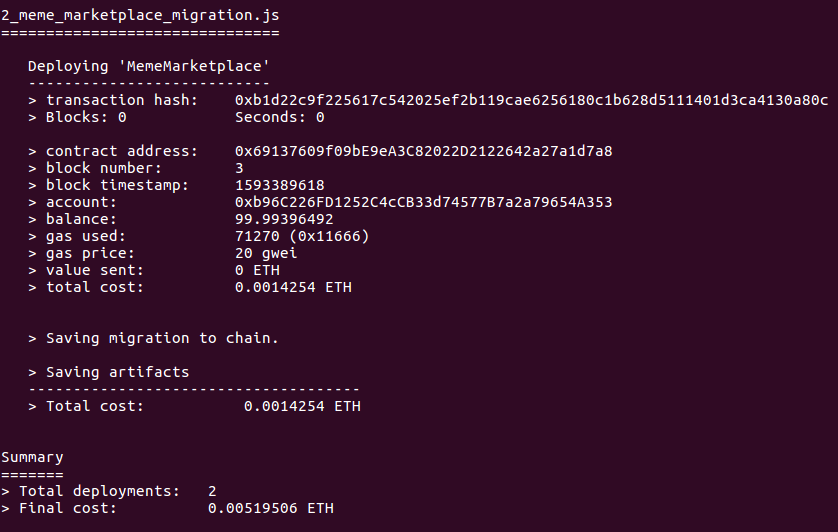

# Step 1 - Starting a blockchain network and deploying contracts

To create the Meme Marketplace, you first set up three components:

1. Ethereum blockchain and smart contract
2. React app
3. Authentication server

This section takes you through the setup of the blockchain network.

In case you run into any problems check out the [Troubleshooting section](./step-1-blockchain-and-contracts-setup.md#troubleshooting).

## Blockchain and Smart Contract Setup

The ERC 721 token contract can be written and deployed in [Truffle](https://www.trufflesuite.com/docs/truffle/getting-started/installation) or [Remix IDE](https://remix.ethereum.org/#optimize=false&evmVersion=null&version=soljson-v0.6.6+commit.6c089d02.js). This tutorial uses Truffle. If you wish to use Remix IDE, refer to their [documentation](https://remix-ide.readthedocs.io/en/latest).

1. Make sure you have a server with the Node Package Manager (NPM) installed. If you don’t have NPM, install [Node.js](https://nodejs.org/)
2. Install Truffle on your system using the Node Package Manager (NPM). Type the following command to install and setup remix.

```bash
npm install -g truffle
```

::: tip
Mac and Linux users may have to use "sudo" for installing the truffle globally. If you are on Windows, you may encounter some naming conflicts. Refer to this [documentation](https://www.trufflesuite.com/docs/truffle/getting-started/installation#recommendations-for-windows) for resolving the issue.
:::

3. Clone the Truffle project from Github. Run the following command to clone and go to the project folder.

```bash
git clone https://github.com/filecoin-shipyard/meme-nft-token
cd meme-nft-token
```

This repository includes a contract required by Truffle, it lives in [contract/MemeMarketplace.sol](https://github.com/filecoin-shipyard/meme-nft-token/blob/master/contracts/MemeMarketplace.sol).

::: tip
To learn more about the truffle project structure, see Truffle's [documentation](https://www.trufflesuite.com/docs/truffle/getting-started/creating-a-project).
:::

4. Install the project dependencies with the command bellow. This includes the OpenZeppelin contracts library (`@openzeppelin/contracts`).

```bash
npm ci
```

5. Install a CLI to deploy. You can deploy the [MemeMarketplace.sol](https://github.com/filecoin-shipyard/meme-nft-token/blob/master/contracts/MemeMarketplace.sol) contract to any network, but for development purposes, this tutorial uses [ganache-cli](https://www.npmjs.com/package/ganache-cli), which is a CLI-based local blockchain client that is built for development purposes.

Install [ganache-cli](https://www.npmjs.com/package/ganache-cli) using the Node Package Manager (NPM). Run the following command to install and start the local development blockchain.

```bash
npm i -g ganache-cli
ganache-cli
```

As you can see below, the ganache-cli creates 10 funded accounts (100 ETH in each account address). This tutorial uses one of these addresses and private key pair for transactions.

::: tip
Mac and Linux users may have to use "sudo" for installing the ganache-cli globally.
:::

If everything went as it should, your terminal displays messages like those below.


6. For use later in this tutorial, copy the "Mnemonic" and save that somewhere you can refer to it later as needed.

In the above screenshot, the "Mnemonic" is:

```bash
wing relax champion spatial rough weird bottom transfer slice dragon flower drill
```

::: tip
NOTE: The "Mnemonic" will be different for you, so use yours. Read this [article](https://kb.myetherwallet.com/en/security-and-privacy/what-is-a-mnemonic-phrase/) to learn more about mnemonics.
:::

Note that the local blockchain exposes an RPC endpoint at `127.0.0.1:8545`. Copy this as well where you can save it, so you can use this endpoint to deploy the contract and interact with the smart contract deployed on the blockchain via this RPC endpoint.

Now, as you have the local blockchain running you need to point your Truffle to the local blockchain RPC URL. In our case, the endpoint is `127.0.0.1:8545` (as shown in the above image). This is already configured on the project in the [truffle-config.js](https://github.com/filecoin-shipyard/meme-nft-token/blob/master/truffle-config.js) file.

7. To deploy the smart contract, open your terminal, and go into the root folder of the project. Run the following command:

```bash
truffle migrate
```

::: tip
To learn more about [compiling](https://www.trufflesuite.com/docs/truffle/getting-started/compiling-contracts) and [deploying](https://www.trufflesuite.com/docs/truffle/getting-started/running-migrations) contracts, refer to Truffle’s documentation.
:::

If everything went as it should, your terminal returns something similar to the screen below:



The thing to note here is the "contract address", which is `0x69137609f09bE9eA3C82022D2122642a27a1d7a8` in our case. **This will be different for you.**

8. Copy **and save the contract address somewhere safe**. You will need it in the next sections of the tutorial.

9. To manage the keys and sign transactions, we will use [Metamask](http://metamask.io/). [Download and install Metamask](https://metamask.io/download.html) from their website.

The following video explains how to:

- Download and install Metamask plugin.
- Importing an existing wallet (using the mnemonic that we saved above).
- Configuring the Metamask plugin to connect to the local blockchain network (`127.0.0.1:8545`)

@[youtube](https://youtube.com/watch?v=vbcy55J5xlU)

This completes the creation and deployment of the smart contract on a local blockchain.

## Troubleshooting

### ganache-cli: Error: Callback was already called

When trying to start `ganache-cli` you might run into this error:

```
Ganache CLI v6.10.1 (ganache-core: 2.11.2)
Error: Callback was already called.
    at /usr/src/meme-nft-token/node_modules/ganache-cli/build/ganache-core.node.cli.js:19:276
    at s.<anonymous> (/usr/src/meme-nft-token/node_modules/ganache-cli/build/ganache-core.node.cli.js:19:2238)
    at s.emit (events.js:314:20)
    at s.destroy (/usr/src/meme-nft-token/node_modules/ganache-cli/build/ganache-core.node.cli.js:39:744230)
    at finish (_stream_writable.js:658:14)
    at processTicksAndRejections (internal/process/task_queues.js:80:21)
```

This project is not compatible with Node v14. Try rolling back to Node v12.
