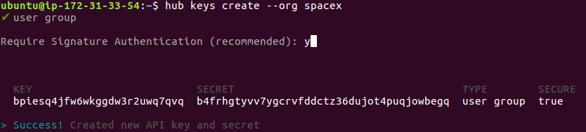
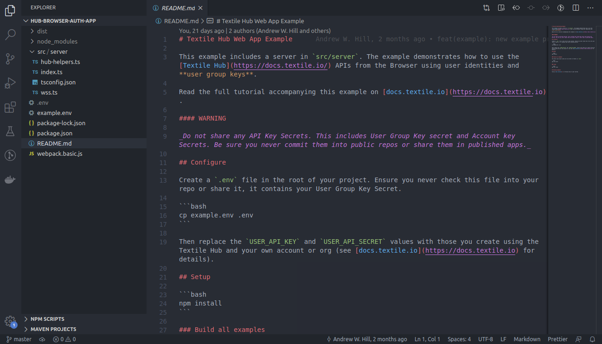

# Step 3 - Run the Hub Auth Server

## Requirements

1. [Node.js](https://nodejs.org/en/download/)
2. [Xcode CommandLineTools](https://developer.apple.com/library/archive/technotes/tn2339/_index.html#//apple_ref/doc/uid/DTS40014588-CH1-WHAT_IS_THE_COMMAND_LINE_TOOLS_PACKAGE_)

## Steps

Before starting the setup for the authentication server, you need to create API credentials to access the endpoints of the remote Textile hub.

To do that, you’ll need:

- [An account](https://docs.textile.io/hub/accounts/). This is your developer account on the Hub.
- [A user group key](https://docs.textile.io/hub/apis/). This is how your users will be able to access your Hub APIs. Consider creating the key in an organization, not as your personal account, so that you can invite collaborators later. You only need to create one _user group key_ for all the users of your app.
- [Typescript](https://webpack.js.org/guides/typescript/). The server is written in typescript.

Once you have set up these resources, you can start the server. The directions below walk you through this process.

1. Create an Account

Follow the [Textile documentation](https://docs.textile.io/hub/accounts/) to download, install, and initialize the latest Hub CLI.

2. Create an organisation

Execute the following command to create an organisation.

```bash
hub org create
```

The command line will prompt you to add an organisation name. For example: `spacex`.
Confirm your input by pressing `y`.

::: tip
You need to use the organisation name other than `spacex`.
:::


Your org is now created.

3. Create a user group key

After you have successfully created an organisation, run the following command to create a user group key for your org:

```bash
hub keys create --org spacex
```

1. You will be prompted to select either `account` or `user group`. Select the `user group`.
2. You will be prompted to select if you require Signature Authentication. Press `y` and enter.
3. If everything goes as expected, you will receive a `KEY` and a `SECRET`.
4. **Copy and save these details somewhere safe**. You will need them to start the authentication server.

::: tip
You need to use the organisation name that you created above.
:::



::: tip
Do not share any API Key Secrets. This includes User Group Key secret and Account key Secrets. Be sure you never commit them into public repos or share them in published apps.
:::

4. Install Typescript

Run the following command to install typescript:

```bash
npm i -g typescript
```

::: tip
Linux and Mac users will have to use sudo
:::

4. Clone the Hub Auth Server app:

```bash
git clone https://github.com/filecoin-shipyard/meme-marketplace
```

5. Open the _hub-browser-auth-app_ folder of the [meme-marketplace](https://github.com/filecoin-shipyard/meme-marketplace) project in a text editor.

```bash
cd meme-marketplace/hub-browser-auth-app

# now open the hub-browser-auth-app folder
```



6. Start the Server

Now that the resources are set up, you can start the server.

Run the following command to create a copy of _example.env_ file:

```bash
cp example.env .env
```

Replace the `your_api_key` and `your_api_secret` with `KEY` and `SECRET` generated by the hub CLI.

Run the following command to start the server:

```bash
npm run build:server
npm run start:server
```

The hub auth server is now up and running. The rest of this tutorial shows the functionality available in the Meme Marketplace app.
