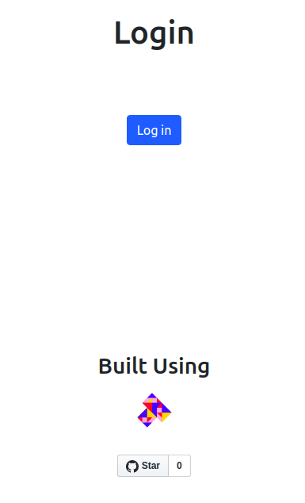

# Step 6 - Explore the Meme Marketplace App

This section provides an overview of the pages in the Meme Marketplace App:

- **Login**: Login to the app via hub auth server and Metamask plugin.
- **Create**: Interface to upload and register your memes.
- **Marketplace**: Displays a list of all the registered memes.

## Step 6a - Logging in

The login page:

- Connects the app with the Metamask plugin.
- Initiates the authentication process with the authentication server.
- Creates buckets that will be used to store memes.

Look at:

- [marketplace/src/pages/Login/index.js](https://github.com/filecoin-shipyard/meme-marketplace/blob/master/marketplace/src/pages/Login/index.js) to understand how UI works.
- [marketplace/src/redux/actions/hub.js](https://github.com/filecoin-shipyard/meme-marketplace/blob/master/marketplace/src/redux/actions/hub.js) to see how the app authenticates with the hub auth server.
- [hub-browser-auth-app/src/server/wss.ts](https://github.com/filecoin-shipyard/meme-marketplace/blob/master/hub-browser-auth-app/src/server/wss.ts) to see how the hub auth server communicates with Textile Hub to authenticate a client.

Here is a screenshot of the login page:



1. **Login and Create Bucket:** As discussed in Step 5, in [marketplace/src/pages/Login/index.js](https://github.com/filecoin-shipyard/meme-marketplace/blob/master/marketplace/src/pages/Login/index.js#L41), `loginAndCreateBucket` is called if Metamask plugin is available.

```jsx
<Fragment>
  <br />
  <h1>Login</h1>
  <br />
  <br />
  <br />
  <button
    id="login"
    className="btn btn-primary mb-2"
    onClick={() => loadWeb3(loginAndCreateBucket)}>
    Log in
  </button>
  <div style={{ position: 'absolute', bottom: '30px', width: '100%' }}>
    <Footer />
  </div>
</Fragment>
```

We have already covered how the authentication process works in [Step 5](./step-5-connecting-app-with-blockchain.md).

In [marketplace/src/redux/actions/hub.js](https://github.com/filecoin-shipyard/meme-marketplace/blob/master/marketplace/src/redux/actions/hub.js#L342) `hubClient.createBucket()` method is used to:

- Initialize a the Bucket API using `Buckets.withUserAuth(this.auth)`.
- Open a bucket named `memes` using `this.buckets.open('memes')`.

`hubClient.createBucket()` returns `this.buckets` which can be used to access the open bucket.

```js
createBucket = async () => {
  /** Initialize and open a Bucket */
  this.buckets = await Buckets.withUserAuth(this.auth)
  const root = await this.buckets.open('memes')
  this.bucketKey = root.key
  return this.buckets
}
```

## Step 6b: Create Meme

The create a Meme page:

- Collects the user input, uploads the meme to the Textile Bucket, and returns the CID of the uploaded meme.
- Creates an NFT to register the meme on the blockchain so that it can be uniquely identified by anyone with access to the blockchain.

Look at:

- [marketplace/src/pages/CreateMeme/index.js](https://github.com/filecoin-shipyard/meme-marketplace/blob/master/marketplace/src/pages/CreateMeme/index.js) to understand how to capture meme details from the UI.
- [marketplace/src/redux/actions/hub.js](https://github.com/filecoin-shipyard/meme-marketplace/blob/master/marketplace/src/redux/actions/hub.js) to understand how to upload and register meme on hub and blockchain respectively.

Here is a screenshot of the Create meme page:


**1: Uploading a meme to the bucket**: In [marketplace/src/pages/CreateMeme/index.js](https://github.com/filecoin-shipyard/meme-marketplace/blob/master/marketplace/src/pages/CreateMeme/index.js#L87), we use the HTML form to collect the `name` and `price` of the meme. The `Dropzone` component is used to capture the meme file. The captured file `Blob` is converted to `Uint8Array`. The `registerMeme` function takes `name`, `price`, `fileBuffer`, and `address` as parameters. Here the `address` is the connected account address from the Metamask plugin. The `await window.web3.eth.getAccounts()` function resolves to an array of connected account addresses, from which we take the first address: `addressArr[0]`.

When the user clicks the "Create Meme" button, the Metamask plugin will pop up asking for user's consent to sign and deploy the transaction to the blockchain on the user's behalf.

```jsx
<Fragment>
  <NavBar />
  <h1>Create a Meme</h1>
  <br />
  <br />
  <form style={{ marginLeft: '100px', marginRight: '100px' }}>
    <div className="form-row">
      <div className="form-group col-md-6">
        <label htmlFor="name">Meme Name</label>
        <input
          type="name"
          className="form-control"
          id="name"
          placeholder="HackFS meme"
          required
        />
      </div>
      <div className="form-group col-md-6">
        <label htmlFor="price">Meme Price</label>
        <input
          type="text"
          className="form-control"
          id="price"
          placeholder="1 ETH"
          required
        />
      </div>
    </div>
  </form>
  <br />
  <br />
  <Dropzone
    onDrop={acceptedFiles => {
      setFiles(acceptedFiles[0])
      document.getElementById(
        'dropArea'
      ).innerHTML = `${acceptedFiles[0].name} ready for upload`
    }}>
    {({ getRootProps, getInputProps }) => (
      <section>
        <div {...getRootProps()}>
          <input {...getInputProps()} />
          <p
            id="dropArea"
            style={{
              marginLeft: '48px',
              marginRight: '48px',
              height: '100px',
              border: '2px solid grey',
              borderRadius: '8px',
              padding: '24px',
              verticalAlign: 'middle',
              display: 'table-cell',
              width: '60%'
            }}>
            Drag 'n' drop some files here, or click to select files
          </p>
        </div>
      </section>
    )}
  </Dropzone>
  <br />
  <br />
  <button
    id="registerMeme"
    className="btn btn-primary mb-2"
    onClick={() => {
      const file = files
      const name = document.getElementById('name').value
      const price = document.getElementById('price').value
      var arrayBuffer, uint8Array
      var fileReader = new FileReader()
      fileReader.onload = async function () {
        arrayBuffer = this.result
        uint8Array = new Uint8Array(arrayBuffer)
        let addressArr = await window.web3.eth.getAccounts()
        registerMeme({
          address: addressArr[0],
          fileBuffer: uint8Array,
          name: name,
          price: price
        })
        document.getElementById('registerMeme').innerText = 'Creating Meme...'
      }
      fileReader.readAsArrayBuffer(file)
    }}>
    Create Meme
  </button>
  <br />
  <br />
  <div id="success" style={{ visibility: 'hidden' }}>
    <h6>🎉 Congratualations! Your Meme is Registered! 🎉</h6>
    <h6>
      Head to <Link to="/marketplace">Marketplace</Link> to checkout your emoji
    </h6>
  </div>
</Fragment>
```

In [marketplace/src/redux/actions/hub.js](https://github.com/filecoin-shipyard/meme-marketplace/blob/master/marketplace/src/redux/actions/hub.js#L387), `registerMeme` uses `hubClient.addFileToBucket` function to add a meme to a bucket.

```js
export const registerMeme = payload => async dispatch => {
  const { address, name, price, fileBuffer } = payload

  document.getElementById('registerMeme').innerText =
    'Adding meme to Textile Bucket...'

  // add meme to bucket
  const result = await hubClient.addFileToBucket(name, fileBuffer)

  document.getElementById('registerMeme').innerText =
    'Registering Meme NFT on Local Blockchain...'

  // register a meme token
  awardMemeToken(
    address,
    `${name},${price},${result.path.path}`,
    (err, res) => {
      if (err) {
        console.error(err)
        document.getElementById('registerMeme').innerText = 'Failed. Try Again!'
      } else {
        document.getElementById('registerMeme').innerText = 'Create Meme'
        document.getElementById('success').style.visibility = ''
      }
    }
  )
}
```

`hubClient.addFileToBucket` function uses `this.buckets.pushPath` which takes:

- `this.bucketKey`: The bucket key from [`createBucket`](https://github.com/filecoin-shipyard/meme-marketplace/blob/master/marketplace/src/redux/actions/hub.js#L346) function.
- `path`: The path where it will be stored in the bucket.
- `content`: The content to be stored in the bucket.
  The `raw` is a JSON object containing information about the uploaded data, such as the CID of the data.

```js
addFileToBucket = async (path, content) => {
  /**
   * Push the file to the root of the Files Bucket.
   */

  // Check if the Bucket Exists or not
  if (this.buckets) {
    const raw = await this.buckets.pushPath(this.bucketKey, path, content)
    return raw
  } else {
    console.error('Bucket does not exist')
    return null
  }
}
```

The `awardMemeToken` function discussed in [Step 5](./step-5-connecting-app-with-blockchain/#step-5d-sending-transaction-to-register-memes-on-blockchain) registers a meme on the contract. `awardMemeToken` takes:

- `address`: The address of the owner of the NFT token.
- `${name},${price},${result.path.path}`: This is the `tokenMetadata` which is a comma-separated string containing the details of the meme, such as, `name`, `price`, and CID (`result.path.path`) of the uploaded meme.

The meme is now uploaded to the hub and an associated NFT token is registered on the blockchain. The user now owns the meme on the blockchain.

## Step 6c - Marketplace

The marketplace displays of the memes available. The marketplace page:

- Displays the total count of the meme tokens.
- Displays the details of all meme tokens, including name, price, CID, and the owner.
- Fetches and displays the meme image from the Hub based on the CID of the memes.

Look at:

- [marketplace/src/pages/Marketplace/index.js](https://github.com/filecoin-shipyard/meme-marketplace/blob/master/marketplace/src/pages/Marketplace/index.js) to understand how the UI works.
- [marketplace/src/redux/actions/hub.js](https://github.com/filecoin-shipyard/meme-marketplace/blob/master/marketplace/src/redux/actions/hub.js) to understand how to fetch data back from blockchain and Textile Hub.

Here is a screenshot of the marketplace page:


**1. Retrieve the meme data back from blockchain**: In [marketplace/src/redux/actions/hub.js](https://github.com/filecoin-shipyard/meme-marketplace/blob/master/marketplace/src/redux/actions/hub.js#L416), `getMemeTokenList`:

- Fetches the total count (`totalSupply`) of the registered memes using `getTotalSupply` function discussed in [Step 5](./step-5-connecting-app-with-blockchain/#step-5e-sending-calls-to-fetch-meme-details-form-the-blockchain).
- Creates arrays of promises `metadataPromiseArr`, `ownerPromiseArr`, and uses `Promise.all` to resolve all the promises. The `memesTokenList` is an array of comma-separated `tokenMetadata` (as discusses above). The `memesOwnerList` is an array of the owners of the NFT tokens.
- Maps the data from `memesTokenList` and `memesOwnerList` into a single array containing information like `name`, `price`, `path`, and `owner` for each meme.

```js
export const getMemeTokenList = () => async dispatch => {
  // Get the total count of meme tokens
  const totalSupply = parseInt((await getTotalSupply())['0'])

  // Create a request to blockchain to get the meme metadata and owner for each token
  let metadataPromiseArr = []
  let ownerPromiseArr = []
  for (let i = 1; i <= totalSupply; i++) {
    metadataPromiseArr.push(getTokenMetadata(i))
    ownerPromiseArr.push(getTokenOwner(i))
  }

  let memesTokenList = await Promise.all(metadataPromiseArr)
  let memesOwnerList = await Promise.all(ownerPromiseArr)

  // Parse the fecthed metadata to get back the meme details
  memesTokenList = memesTokenList.map((token, index) => {
    token = token['0'].split(',')
    let owner = memesOwnerList[0]['0'].split(',')[0]
    return {
      name: token[0],
      price: token[1],
      path: token[2],
      owner: owner
    }
  })

  dispatch({
    type: types.GET_MEME_TOKEN_LIST,
    payload: {
      memesTokenList: memesTokenList,
      totalMemes: totalSupply
    }
  })
}
```

**2. Display memes on UI**: In [marketplace/src/pages/Marketplace/index.js](https://github.com/filecoin-shipyard/meme-marketplace/blob/master/marketplace/src/pages/Marketplace/index.js) we use all the details fetched by the `getMemeTokenList` method and display them on UI.

The UI displays:

- The total number of registered memes (`totalMemes`).
- Memes with details like meme name (`meme.name`), price (`meme.price`), owner address (`meme.owner`), and the meme image using the URL `https://hub.textile.io${meme.path}`.

The `meme.path` looks something like `/ipfs/bafkreiahrqbz4crhkgdaryw2uov6qi4k6ebq6kqnz2bux75cmcy54754wa`. By concatinating this `meme.path` with `https://hub.textile.io`, we get a URL that resolves to the meme image: [`https://hub.textile.io/ipfs/bafkreiahrqbz4crhkgdaryw2uov6qi4k6ebq6kqnz2bux75cmcy54754wa`](https://hub.textile.io/ipfs/bafkreiahrqbz4crhkgdaryw2uov6qi4k6ebq6kqnz2bux75cmcy54754wa)

```jsx
<Fragment>
  <NavBar />
  <h1>Meme Marketplace</h1>
  <br />
  <br />
  <h5>
    Total Registered Memes:{' '}
    {totalMemes !== null ? totalMemes : <p>Loading...</p>}
  </h5>
  <br />
  <br />
  <h4>Showcase</h4>
  {memesTokenList ? (
    memesTokenList.length > 0 ? (
      <Row gutter={40}>
        {memesTokenList.map((meme, index) => (
          <Col key={index} span={4}>
            <div className="card" style={{ width: '18rem' }}>
              
              <div className="card-body">
                <h5 className="card-title">{meme.name}</h5>
                <p className="card-text">{meme.price}</p>
                <font size="1">{meme.owner}</font>
                <br />
                <br />
                <a
                  target="_blank"
                  href={`https://hub.textile.io${meme.path}`}
                  className="btn btn-primary">
                  See Meme on Textile Hub
                </a>
              </div>
            </div>
          </Col>
        ))}
      </Row>
    ) : (
      <h6>
        No Memes in the Market! Try <Link to="/create">adding a meme!</Link>
      </h6>
    )
  ) : (
    <p>Loading...</p>
  )}
  <br />
  <br />
  <br />
  <br />
</Fragment>
```

The memes and their details are now listed on the UI.
