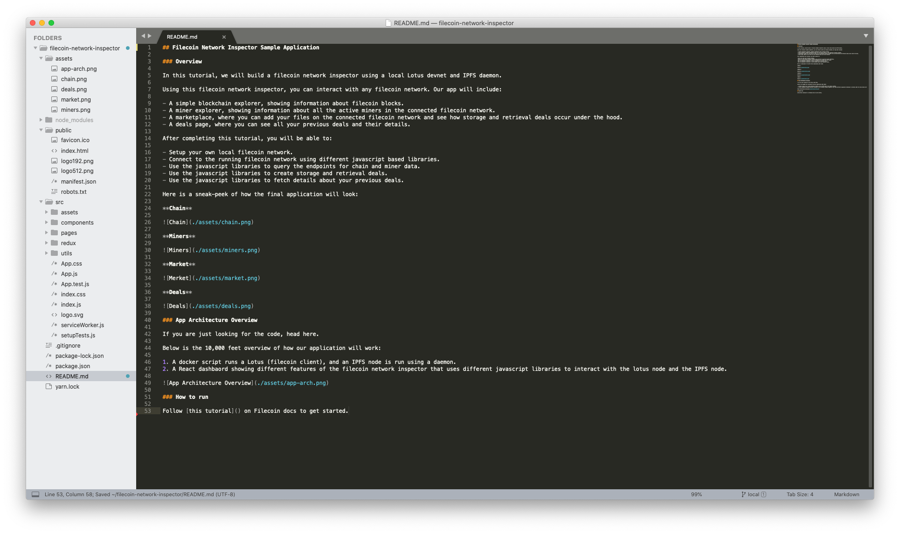

# Network inspector

This tutorial shows how to build a Filecoin network inspector using [lotus](https://github.com/filecoin-project/lotus/) via a [fork](https://github.com/filecoin-shipyard/lotus-devnet) of Textile’s [lotus-devnet](https://github.com/textileio/lotus-devnet), the [Lotus JS API client](https://github.com/filecoin-shipyard/js-lotus-client), and [go-ipfs](https://github.com/ipfs/go-ipfs/).

## Overview

The Filecoin network inspector interacts with several aspects of the Filecoin network that are exposed through Lotus’ JS API. The sample app in this tutorial will include:

- A simple chain explorer, showing information about Filecoin blocks.
- A miner explorer, showing information about all the active miners in the Filecoin network (in this example, this shows the miners in the local devnet).
- A marketplace, where you can add your files on the connected Filecoin network and see how storage and retrieval deals occur under the hood.
- A deals page, where you can see all your previous deals and their details.

After completing this tutorial, you will be able to:

- Setup your own local Filecoin development network (devnet).
- Connect to the running Filecoin network using different JavaScript-based libraries.
- Use the JavaScript libraries to query the endpoints for chain and miner data.
- Use JavaScript libraries to create storage and retrieval deals.
- Use JavaScript libraries to fetch details about your previous deals.

Here is a sneak-peek of how the final application will look:

@[youtube](https://youtu.be/lkx2Z3T649Y)

If you are just looking for the code, [you can visit the GitHub repo](https://github.com/filecoin-shipyard/filecoin-network-inspector/).

A high-level overview of our application architecture:

1. Docker script to run a [lotus](https://github.com/filecoin-project/lotus) node (Filecoin client) and local-devnet to mock interactions on a live network, like [testnet or mainnet](https://docs.filecoin.io/build/start-building/interacting-with-the-network/).
2. Active [go-ipfs](https://github.com/ipfs/go-ipfs/) daemon (IPFS client) to generate data CIDs and import to store on Filecoin.
3. React dashboard shows different features of the Filecoin network inspector. The dashboard uses various JavaScript libraries to interact with the lotus node and the go-ipfs node.


Before diving into the tutorial for this sample application, the next section gives you an understanding of how lotus and go-ipfs nodes interact.

## Lotus and go-ipfs interactions

[lotus](https://github.com/filecoin-project/lotus) is a Go implementation of the Filecoin protocol. There are several [protocol implementations](/build/core-products/protocol-implementations.md), including implementations in other languages such as Rust ([forest](https://github.com/chainsafe/forest) implementation) and C++ ([fuhon](https://github.com/filecoin-project/cpp-filecoin) implementation). The core lotus node runs the blockchain system, executes storage and retrieval deals, performs data transfers, supports block producer logic, and syncs and validates the Filecoin blockchain. Lotus also provides a separate process for storage mining. Filecoin storage miners contribute to the network by producing sector commitments and _Proofs-of-Spacetime_ to prove they have been correctly storing storage client data. Read more about the interactions between [storage miners and storage clients](/introduction/what-is-filecoin.md).

[go-ipfs](https://github.com/ipfs/go-ipfs) is a Go implementation of the [IPFS protocol](https://ipfs.io). There are also several IPFS implementations, including [js-ipfs](https://github.com/ipfs/js-ipfs).

lotus and go-ipfs nodes speak several of the same protocols: [libp2p](https://libp2p.io/) for networking, [bitswap](https://docs.ipfs.io/concepts/bitswap/#bitswap) and [graphsync](https://github.com/ipld/specs/blob/master/block-layer/graphsync/graphsync.md) for data transfer, [IPLD](https://ipld.io/) for data structures and formats, and more. Having active lotus and go-ipfs daemons on your machine enables a number of features. For example, you can import and preserve data that is discoverable through the IPFS public network [DHT](https://docs.ipfs.io/concepts/dht/#distributed-hash-tables-dhts) directly into your lotus node and onto the Filecoin network. To learn more about how Filecoin and IPFS interact, read our page on [IPFS and Filecoin](https://docs.filecoin.io/introduction/ipfs-and-filecoin/). To learn about how to enable IPFS/Filecoin node integrations, check out the [lotus docs](https://lotu.sh/en+ipfs-client-integration).


### Resources

- [More on lotus](https://lotu.sh/)
- [More on go-ipfs](https://docs.ipfs.io)

## Step 1 - Start lotus-devnet and go-ipfs

You can install and run lotus from source, as described in the [lotus docs](https://lotu.sh/en+getting-started), and then run a [local devnet](https://lotu.sh/en+setup-local-dev-net). For faster development cycles, this example uses a [fork](https://github.com/filecoin-shipyard/lotus-devnet) of Textile’s [localnet](https://github.com/textileio/lotus-devnet), which can be used to spin up lotus full nodes and lotus miners with mocked sector-builders (for faster storage mining processes), and to run a network with tunable parameters (e.g. block time). lotus-devnet is recommended for easier and faster development.

For this tutorial, please use the [lotus-devnet fork](https://github.com/filecoin-shipyard/lotus-devnet). For your own applications, please use [Textile’s localnet](https://github.com/textileio/lotus-devnet). See the full localnet docs [here](https://docs.textile.io/powergate/localnet/).

### Requirements

- Operating Systems: Linux or Mac
- [Docker Desktop](https://www.docker.com/products/docker-desktop) (latest version)
- [Docker Compose](https://docs.docker.com/compose/) (latest version)

### Steps

1. In your terminal, clone the lotus-devnet repo and create a local lotus-devnet.

```bash
git clone https://github.com/filecoin-shipyard/lotus-devnet
cd lotus-devnet
make devnet BIGSECTORS=true
```

In [filecoin-shipyard/lotus-devnet/docker-compose-devnet.yaml](https://github.com/filecoin-shipyard/lotus-devnet/blob/master/docker-compose-devnet.yaml), both the `services`: `lotus` and `ipfs` are started. In this setup, we are using [IPFS integration](https://lotu.sh/en+ipfs-client-integration), which supports making deals with data stored in IPFS, without having to re-import it into lotus.

The IPFS HTTP gateway running on `8080` within the container is exposed on `7070` on the host machine. This will be used to fetch data via filecoin retrieval deal.

```yaml
version: '3.7'

services:
  lotus:
    image: textile/lotus-devnet:v0.4.0
    ports:
      - 7777:7777
    environment:
      - TEXLOTUSDEVNET_SPEED=1500
      - TEXLOTUSDEVNET_BIGSECTORS=${BIGSECTORS}
      - TEXLOTUSDEVNET_IPFSADDR=/dns4/ipfs/tcp/5001
  ipfs:
    ports:
      - 7070:8080
```

::: tip
Note on `BIGSECTORS`: When running the devnet setup, the Lotus node is configured with a mocked sector builder, using either "small" or "big" sector sizes. The practical effects of this configuration are on the size of files you can store in the devnet and how quickly the storage deals will complete. Using `BIGSECTORS=false` will limit you to storing files of around 700 bytes and deals will complete in 30-60 seconds. Using `BIGSECTORS=true` will allow you to store files anywhere from 1Mb to 400Mb, but deals will complete in 3-4 minutes. Be sure to choose the value that makes sense for your development scenario (from [Textile’s documentation](https://docs.textile.io/powergate/localnet/)).
:::

2. In a new terminal window, install go-ipfs following these [docs](https://docs.ipfs.io/how-to/command-line-quick-start/).

3. Initialize the go-ipfs daemon, configure IPFS to accept CORS requests, and start running the IPFS daemon.

```bash
ipfs init
ipfs config --json API.HTTPHeaders.Access-Control-Allow-Origin '["*"]'
ipfs config --json API.HTTPHeaders.Access-Control-Allow-Methods '["GET", "POST"]'
ipfs config --json API.HTTPHeaders.Access-Control-Allow-Headers '["Authorization"]'
ipfs config --json API.HTTPHeaders.Access-Control-Expose-Headers '["Location"]'
ipfs config --json API.HTTPHeaders.Access-Control-Allow-Credentials '["true"]'
ipfs daemon
```

This IPFS node exposes:

- API endpoint on port `5001`.
- HTTP gateway on port `8080`.

::: tip
This IPFS node is used to demonstrate how to fetch data from an IPFS node which is not connected to a lotus node.
:::

You now have a running local devnet with lotus nodes and a local go-ipfs node.

## Step 2 - Run the React app

### Requirements

1. [Node.js](https://nodejs.org/en/download/)
2. [Xcode CommandLineTools](https://developer.apple.com/library/archive/technotes/tn2339/_index.html#//apple_ref/doc/uid/DTS40014588-CH1-WHAT_IS_THE_COMMAND_LINE_TOOLS_PACKAGE_)

### Steps

1. In a third terminal window, clone the React sample application and check out the `local` branch.

```bash
git clone https://github.com/filecoin-shipyard/filecoin-network-inspector
cd filecoin-network-inspector
git checkout local
```

2. Start the app.

```bash
npm install
npm start
```

This starts the Filecoin network inspector app and opens the application in your browser at [https://localhost:3000](https://localhost:3000).


::: tip
We have used [React](https://reactjs.org/) as our UI library an [Redux](https://redux.js.org/) for application state management. You can use any other library or framework to build such an app.
:::

Next, we walk through the different parts of the application to see how to integrate Filecoin features and functionality into your application.

## Step 3: Set up the lotus and go-ipfs API clients

In this and later sections, you will walk through the various parts of the sample application to see how the data from your local lotus node connects to the React frontend. You will start by connecting your application to the lotus and go-ipfs nodes.

Use any text editor to open the `filecoin-network-inspector` project. Multiple pages in the React app interact with the lotus instance.



### Step 3a: Set up the lotus API client

1. To connect the React app to the running lotus instance, install the following three JavaScript modules using the [node package manager](http://npmjs.com/):

- [@filecoin-shipyard/lotus-client-rpc](https://www.npmjs.com/package/@filecoin-shipyard/lotus-client-rpc): A low-level interface for making calls to the [lotus JSON-RPC API](https://lotu.sh/en+api).
- [@filecoin-shipyard/lotus-client-provider-browser](http://npmjs.com/package/filecoin-shipyard/lotus-client-provider-browser): An implementation of the lotus JS Client provider interface that connects to a lotus JSON-RPC API endpoint using WebSockets or HTTP.
- [@filecoin-shipyard/lotus-client-schema](https://www.npmjs.com/package/@filecoin-shipyard/lotus-client-schema): Package of .js files that describe methods exported by the lotus JSON-RPC API.

In your terminal, run the following commands:

```bash
npm i @filecoin-shipyard/lotus-client-rpc @filecoin-shipyard/lotus-client-provider-browser @filecoin-shipyard/lotus-client-schema
```

2. In [src/utils/lotus.js](https://github.com/filecoin-shipyard/filecoin-network-inspector/blob/local/src/utils/lotus.js), you can see how we use the above 3 libraries to create a lotus client for use anywhere in the application.

```js
import { LotusRPC } from '@filecoin-shipyard/lotus-client-rpc'
import { BrowserProvider } from '@filecoin-shipyard/lotus-client-provider-browser'
import { testnet } from '@filecoin-shipyard/lotus-client-schema'

export const getClient = (options = { nodeOrMiner: 'node', nodeNumber: 0 }) => {
  // API endpoint for local Lotus devnet
  const API = 'ws://localhost:7777'

  // Websocket endpoint for local Lotus devnet
  const wsUrl = API + `/${options.nodeNumber}/${options.nodeOrMiner}/rpc/v0`

  // Creating and returning a Lotus client that can be used anywhere in the app
  const provider = new BrowserProvider(wsUrl)
  return new LotusRPC(provider, {
    schema:
      options.nodeOrMiner === 'node' ? testnet.fullNode : testnet.storageMiner
  })
}
```

If you are using the local-devnet setup mentioned in [Step 1 - Start lotus-devnet and go-ipfs](#step-1-start-lotus-devnet-and-go-ipfs), then the value of `API` is correct. Note that if you are using another setup, you may need to change this value (depends on the setup).

The `wsUrl` shown in the code example above depends on which node you want to connect to:

- `nodeNumber`: The number/index of the lotus node
- `nodeOrMiner`: Type of lotus node, either miner or full node

In this case, set `nodeNumber` to 0 as this is the first (and only) lotus node you will be running. Set the `nodeOrMiner` option to `"node”` as you will run a lotus full node, but not a mining node.

### Step 3b: Set up the IPFS API client

1. To connect the React app to the IPFS instance, use [js-ipfs-http-client](https://github.com/ipfs/js-ipfs/tree/master/packages/ipfs-http-client#readme), a JS library that implements the IPFS [Core API](https://github.com/ipfs/js-ipfs/tree/master/docs/core-api) commands and executes them through a running IPFS node (whether go-ipfs or js-ipfs). This client library also implements a set of utility functions, described in detail[ here](https://www.npmjs.com/package/ipfs-http-client).

In your terminal, run the following command to install the library.

```bash
npm install --save ipfs-http-client
```

2. In [src/utils/ipfs.js](https://github.com/filecoin-shipyard/filecoin-network-inspector/blob/local/src/utils/ipfs.js), set `IPFS_API_ENDPOINT` to the port of your running go-ipfs node.

```js
import IpfsHttpClient from 'ipfs-http-client'
const IPFS_API_ENDPOINT = 'http://localhost:5001' // you can replace this with any other IPFS endpoint
export const ipfs = IpfsHttpClient(IPFS_API_ENDPOINT)
```

Note that your IPFS API endpoint may differ, depending on your node setup.

## Step 4: Explore the Filecoin Network Inspector App

This section provides an overview of the pages in the Filecoin Network Inspector App:

- **Chain**: Blockchain explorer for viewing Filecoin blocks.
- **Miners**: Displays the miners in the network.
- **Markets**: Fetch your wallet address and balance, store files, monitor storage and retrieval deals, and fetch data from the network.
- **Deals**: Monitor storage deals on the local network.

### Step 4a: Import the lotus client

You can look at [src/redux/actions/lotus.js](https://github.com/filecoin-shipyard/filecoin-network-inspector/blob/a94747f4967db2cde8bc563aa96675926d9c3193/src/redux/actions/lotus.js) to understand how data is captured from the lotus node.

1. In [src/redux/actions/lotus.js](https://github.com/filecoin-shipyard/filecoin-network-inspector/blob/a94747f4967db2cde8bc563aa96675926d9c3193/src/redux/actions/lotus.js#L3), import the lotus client.

```jsx
import { getClient } from '../../utils/lotus'
const client = getClient()
```

All pages in the application will make use of the client API for various types of chain data.

### Step 4b: Chain Page

The Chain page is a simple chain explorer that displays the JSON information contained in Filecoin blocks. Look at:

- [src/redux/actions/lotus.js](https://github.com/filecoin-shipyard/filecoin-network-inspector/blob/a94747f4967db2cde8bc563aa96675926d9c3193/src/redux/actions/lotus.js) to understand how data is captured from the lotus node
- [src/pages/Chain/index.js](https://github.com/filecoin-shipyard/filecoin-network-inspector/blob/a94747f4967db2cde8bc563aa96675926d9c3193/src/pages/Chain/index.js) to see how the data is displayed in the application UI

1. **Create a method to get Filecoin blocks:** In [src/redux/actions/lotus.js](https://github.com/filecoin-shipyard/filecoin-network-inspector/blob/a94747f4967db2cde8bc563aa96675926d9c3193/src/redux/actions/lotus.js#L36), create a method called `getChainStats`, which uses `client.chainNotify` and a callback function to listen for any changes in chain state. Each change is a new block containing information, such as block number (height), block CID, miner, parent block CID, messages contained in the block, and much more. You can read more about Filecoin data structures, including blocks, in the [Filecoin spec](https://filecoin-project.github.io/specs/#systems__filecoin_blockchain__struct).

```jsx
export const getChainStats = () => async dispatch => {
  client.chainNotify(changes => {
    dispatch({
      type: types.GET_CHAIN_STATS,
      payload: changes
    })
  })
}
```

2. **Create a method to get the most recent Filecoin block:** In [src/redux/actions/lotus.js](https://github.com/filecoin-shipyard/filecoin-network-inspector/blob/a94747f4967db2cde8bc563aa96675926d9c3193/src/redux/actions/lotus.js#L191), create a method called `getChainHead`, which uses `client.chainHead` to retrieve only the most recent block, rather than the entire chain.

```jsx
export const getChainHead = () => async dispatch => {
  const chainHead = await client.chainHead()
  dispatch({
    type: types.GET_CHAIN_HEAD,
    payload: chainHead
  })
}
```

3. **Display the chain data in the UI:** In [src/pages/Chain/index.js](https://github.com/filecoin-shipyard/filecoin-network-inspector/blob/a94747f4967db2cde8bc563aa96675926d9c3193/src/pages/Chain/index.js), use the `getChainStats` method you created to display the chain information on the Chain page.

```jsx
import React from 'react'
import { connect } from 'react-redux'
import { getChainStats } from '../../redux/actions/lotus'
import { Link } from 'react-router-dom'
import FilecoinGIF from '../../assets/filecoin.gif'
import ReactJson from 'react-json-view'

function Chain(props) {
  const { chain, getChainStats } = props
  if (chain.length === 0) {
    getChainStats()
  }
  return (
    <div style={{ margin: '18px' }}>
      <h1>Chain Explorer</h1>
      <div>
        {chain.length === 0 ? (
          <center>
            
          </center>
        ) : (
          chain.map((block, index) => (
            <div key={index} className="card" style={{ width: '52rem' }}>
              <div className="card-body">
                <h5 className="card-title">
                  Block {block[0].Val.Blocks[0].Height}
                </h5>
                <h6 className="card-subtitle mb-2 text-muted">
                  {block[0].Val.Cids[0]['/']}
                </h6>
                <p className="card-text">
                  <b>TimeStamp: </b> {block[0].Val.Blocks[0].Timestamp} <br />
                  <b>Parent Block: </b> {
                    block[0].Val.Blocks[0].Parents[0]['/']
                  } <br />
                  <b>ParentWeight: </b> {block[0].Val.Blocks[0].ParentWeight}{' '}
                  <br />
                  <b>Miner: </b>
                  <Link
                    to={`/miner/${block[0].Val.Blocks[0].Miner}`}
                    className="card-link">
                    {block[0].Val.Blocks[0].Miner}
                  </Link>
                </p>
                <br />
                <ReactJson src={block} collapsed={true} name="Block JSON" />
              </div>
            </div>
          ))
        )}
      </div>
    </div>
  )
}

const mapStateToProps = state => ({
  chain: state.app.chain
})

const mapDispatchToProps = dispatch => ({
  getChainStats: () => dispatch(getChainStats())
})

export default connect(mapStateToProps, mapDispatchToProps)(Chain)
```

### Step 4b: Miners Page

The Miners page displays information about the active miners in the connected Filecoin network. The local devnet you are running contains only a single miner (with miner ID `t01000`), while [public networks](https://docs.filecoin.io/build/start-building/interacting-with-the-network/) will contain many more miners. Look at:

- [src/redux/actions/lotus.js](https://github.com/filecoin-shipyard/filecoin-network-inspector/blob/a94747f4967db2cde8bc563aa96675926d9c3193/src/redux/actions/lotus.js) to understand how data is captured from the lotus node.
- [src/pages/Miners/index.js](https://github.com/filecoin-shipyard/filecoin-network-inspector/blob/a94747f4967db2cde8bc563aa96675926d9c3193/src/pages/Miners/index.js) to see how data about all miners is displayed in the application UI.
- [src/pages/Miner/index.js](https://github.com/filecoin-shipyard/filecoin-network-inspector/blob/a94747f4967db2cde8bc563aa96675926d9c3193/src/pages/Miner/index.js) to see how data about a single miner is displayed in the application UI (not covered in this tutorial, since there is only one miner on the current network).

1. **Create a method to list all miners:** In [src/redux/actions/lotus.js](https://github.com/filecoin-shipyard/filecoin-network-inspector/blob/a94747f4967db2cde8bc563aa96675926d9c3193/src/redux/actions/lotus.js#L177), create a method called `stateListMiners`, which uses `client.stateListMiners` and `client.stateMinerPower` from the lotus API. The `client.stateListMiners` function displays each miner’s ID and its power in the current network. Mining power is a reflection of the proven storage capacity of the miner based on their activity in the network over time.

```jsx
export const stateListMiners = () => async dispatch => {
  let result = await client.stateListMiners([])
  result = result.map(async miner => {
    let minerPow = await client.stateMinerPower(miner, [])
    return { name: miner, power: minerPow }
  })
  Promise.all(result).then(values => {
    dispatch({
      type: types.STATE_LIST_MINERS,
      payload: values
    })
  })
}
```

2. **Display the mining data in the UI:** In [src/pages/Miners/index.js](https://github.com/filecoin-shipyard/filecoin-network-inspector/blob/a94747f4967db2cde8bc563aa96675926d9c3193/src/pages/Miners/index.js), use the `stateListMiners` method you created to display information about Filecoin miners on the Miners page.

```jsx
import React, { Fragment } from 'react'
import { connect } from 'react-redux'
import { stateListMiners } from '../../redux/actions/lotus'
import FilecoinGIF from '../../assets/filecoin.gif'
import ReactJson from 'react-json-view'

function Miners(props) {
  const { miner, stateListMiners } = props
  if (Object.keys(miner).length === 0) {
    stateListMiners()
  }

  return (
    <Fragment>
      <h1>Miner Stats</h1>
      {miner.minerList ? (
        miner.minerList.map((miner, index) => (
          <div key={index} className="card" style={{ width: '42rem' }}>
            <div className="card-body">
              <h5 className="card-title">Name: {miner.name}</h5>
              <h6 className="card-subtitle mb-2 text-muted">Miner Details</h6>
              <ReactJson src={miner} collapsed={true} name="Miner Details" />
            </div>
          </div>
        ))
      ) : (
        
      )}
    </Fragment>
  )
}

const mapStateToProps = state => ({
  miner: state.app.miner
})

const mapDispatchToProps = dispatch => ({
  stateListMiners: () => dispatch(stateListMiners())
})

export default connect(mapStateToProps, mapDispatchToProps)(Miners)
```

### Step 4c: Markets Page

The Markets page allows you to store files directly through the UI. It also allows you to see information on your wallet balance and status of recent deals.


The Markets page contains the following functions:

- Fetch your wallet address and corresponding balance.
- Store files on the public IPFS and Filecoin networks.
- Monitor storage deal status.
- Fetch data from the Filecoin Network.
- Monitor your retrieval deal status.

Look at:

- [src/redux/actions/lotus.js](https://github.com/filecoin-shipyard/filecoin-network-inspector/blob/a94747f4967db2cde8bc563aa96675926d9c3193/src/redux/actions/lotus.js) to understand how data is captured from the lotus node
- [src/pages/Market/index.js](https://github.com/filecoin-shipyard/filecoin-network-inspector/blob/702255e6add860843d33bbd8373c5db8e3ad40ac/src/pages/Market/index.js) to see how Markets page functionality is displayed in the UI

The following instructions illustrate how to perform these functions.

#### Markets Page: Your Balance

The filecoin token (FIL) is the medium of exchange for storage on the Filecoin network. When you spin up [lotus-devnet](https://github.com/filecoin-shipyard/lotus-devnet) (and thus a local lotus node), your lotus node’s default wallet is seeded with a 500,000 FIL balance for testing on the devnet. FIL can be used to transact with other Filecoin network participants.

1. **Install a Filecoin unit conversion library:** In the core lotus API, most methods concerning balances return values in attoFIL (where 1 FIL = 10^18 attoFIL). To display the balance in FIL, install and import the [filecoin-number library](https://github.com/openworklabs/filecoin-number) using [NPM](https://www.npmjs.com/package/@openworklabs/filecoin-number) (`@openworklabs/filecoin-number`).

```bash
npm i @openworklabs/filecoin-number
```

2. **Get your wallet information:** In [src/redux/actions/lotus.js](https://github.com/filecoin-shipyard/filecoin-network-inspector/blob/a94747f4967db2cde8bc563aa96675926d9c3193/src/redux/actions/lotus.js), create a command called `getWalletDetails`.

`getWalletDetails` retrieves your wallet address using `nodeClient.walletDefaultAddress`, which returns the default wallet address associated with your node.

`getWalletDetails` retrieves your wallet’s balance using `nodeClient.walletBalance`. Ordinarily, this function returns the balance in attoFIL. We use the `toFIL` function to convert the balance to FIL units.

```
import { FilecoinNumber } from "@openworklabs/filecoin-number";
```

```jsx
export const getWalletDetails = () => async dispatch => {
  const nodeClient = getClient({ nodeNumber: 0, nodeOrMiner: 'node' })
  const defaultWalletAddress = await nodeClient.walletDefaultAddress()
  const balance = await nodeClient.walletBalance(defaultWalletAddress)
  const filBalance = new FilecoinNumber(balance, 'attofil')
  dispatch({
    type: types.GET_WALLET_DETAILS,
    payload: {
      address: defaultWalletAddress,
      balance: filBalance.toFil()
    }
  })
}
```

The wallet balance on this page will update as you create deals and pay for storage.

3. **Display your wallet information in the UI:** In [src/pages/Market/index.js](https://github.com/filecoin-shipyard/filecoin-network-inspector/blob/local/src/pages/Market/index.js#L50), use `getWalletDetails` to display your wallet address and balance.

```jsx
;<h3>Your Balance</h3>
{
  /* <button onClick={getWalletDetails}>Refresh Balance</button> */
}
{
  wallet ? (
    <div>
      <b>Wallet Address: </b> {wallet.address} <br />
      <b>Balance: </b> {wallet.balance} {' FIL'}
    </div>
  ) : (
    <span>Loading...</span>
  )
}
```

#### Markets Page: Store File on Filecoin Network

Look at:

- [src/redux/actions/lotus.js](https://github.com/filecoin-shipyard/filecoin-network-inspector/blob/a94747f4967db2cde8bc563aa96675926d9c3193/src/redux/actions/lotus.js) to understand how data is captured from the lotus node
- [src/pages/Market/index.js](https://github.com/filecoin-shipyard/filecoin-network-inspector/blob/702255e6add860843d33bbd8373c5db8e3ad40ac/src/pages/Market/index.js) to see how Markets page functionality is displayed in the UI

::: tip
Remember that the devnet is a local network that has been configured to work with small sectors. Only store small files (under 2KiB) on the local devnet.
:::

There are two main ways to store a file on the Filecoin network:

- [Importing a local file into the lotus node for storage](https://lotu.sh/en+storing-data#adding-a-file-locally-164086), then make a storage deal
- [Make a storage deal for data that is stored in IPFS](https://lotu.sh/en+ipfs-client-integration) -- This is the process used in the sample application.

To make a storage deal for data that is stored in IPFS:

- First store the file on the public IPFS network.
- This will return a CID for the file.
- Using the [IPFS/lotus integration](https://lotu.sh/en+ipfs-client-integration), create a Filecoin storage deal for the file using the same CID.

1. **Setup IPFS API client:** In [src/redux/actions/lotus.js](https://github.com/filecoin-shipyard/filecoin-network-inspector/blob/a94747f4967db2cde8bc563aa96675926d9c3193/src/redux/actions/lotus.js#L4), import the ipfs object returned by the `js-ipfs-http-client` in the [src/utils/ipfs.js](https://github.com/filecoin-shipyard/filecoin-network-inspector/blob/local/src/utils/ipfs.js#L3) file.

```js
import { ipfs } from '../../utils/ipfs'
```

2. **Create a method to upload the file to Filecoin:** In [src/redux/actions/lotus.js](https://github.com/filecoin-shipyard/filecoin-network-inspector/blob/a94747f4967db2cde8bc563aa96675926d9c3193/src/redux/actions/lotus.js#L59), create a method called `uploadToFilecoin`.

```jsx
export const uploadToFilecoin = payload => async dispatch => {
  // Adding file to IPFS
  const nodeClient = getClient({ nodeNumber: 0, nodeOrMiner: 'node' })

  for await (const result of ipfs.add(payload.fileBuffer)) {
    // Creating a Storage Deal with a Miner
    const dataRef = {
      Data: {
        TransferType: 'graphsync',
        Root: {
          '/': result.path
        },
        PieceCid: null,
        PieceSize: 0
      },
      Wallet: payload.defaultWalletAddress,
      Miner: payload.targetMiner,
      EpochPrice: payload.epochPrice,
      MinBlocksDuration: 300
    }

    const deal = await nodeClient.clientStartDeal(dataRef)

    document.getElementById('uploadToFilecoin').innerText =
      'Upload to Filecoin Network'

    dispatch({
      type: types.ADD_DATA_TO_FILECOIN,
      payload: {
        id: deal['/'],
        cid: result.path
      }
    })
  }
}
```

In this method, notice that you:

- Store the file on the public IPFS network with the `ipfs.add` function. The function returns an async iterable that yields objects describing the added data.
- Use a `for await` function to iterate over the data you added using `ipfs.add`, creating a `dataRef` object.
- Specify Filecoin storage deal parameters in the `dataRef` object, such as:
  - 1. `Data` : Information related to the data you want to store.
    - a) `TransferType`: The protocol used to transfer data to the miner
    - b) `Root`: The cid to store in a deal or retrieve
    - c) `PieceCid`: Optional
    - d) `PieceSize`: Optional
  - 2. `Wallet`: Address of the wallet which will be charged for the storage deal. This is your default address.
  - 3. `Miner`: ID of the preferred miner for storing the data.
  - 4. `EpochPrice`: Price (in attoFIL) per block/epoch (currently one epoch is 25 seconds) that you are willing to pay to store the data.
  - 5. `MinBlocksDuration`: The minimum duration for the storage deal, in block time.
- Make a storage deal on the Filecoin network using the `nodeClient.clientStartDeal` function with the `dataRef` object.

3. **Display file storage information in the UI:** In [src/pages/Market/index.js](https://github.com/filecoin-shipyard/filecoin-network-inspector/blob/local/src/pages/Market/index.js#L62), use `uploadToFilecoin` to trigger the file storage workflow for storage on IPFS and Filecoin.

```jsx
<h3>Store File on Filecoin Network</h3>
<input type="file" id="fileToUpload"></input>
<button
  id="uploadToFilecoin"
  onClick={() => {
    const file = document.getElementById("fileToUpload").files[0];
    var arrayBuffer, uint8Array;
    var fileReader = new FileReader();
    fileReader.onload = function () {
      arrayBuffer = this.result;
      uint8Array = new Uint8Array(arrayBuffer);
      uploadToFilecoin({
        fileBuffer: uint8Array,
        defaultWalletAddress: wallet.address,
        targetMiner: miner.minerList ? miner.minerList[0].name : "t01000",
        epochPrice: "2500",
      });
      document.getElementById("uploadToFilecoin").innerText =
        "Sending Deal...";
    };
    fileReader.readAsArrayBuffer(file);
  }}
>
  Upload to Filecoin Network
</button>
```

::: tip
Note that the local devnet has only 1 (fake) miner that can store your data -- as we saw in the Miners page. Therefore, by default, you choose that miner in this example. On testnet and mainnet, there will be thousands of available miners. When creating your app, you will need to provide your users with a way to select miners to store their data. You might choose to provide selection criteria such as cost, replication factor, geographical location, miner uptime, and reputation.
:::

::: tip
Once you have started a storage deal, notice that your wallet balance is slightly reduced. This is to pay both for the gas cost of the message that goes on-chain and to pay for the actual cost of storage. To check your wallet balance at regular intervals, use the `setInterval` function with `getWalletDetails`.
:::

#### Markets Page: Deal Status

Look at:

- [src/redux/actions/lotus.js](https://github.com/filecoin-shipyard/filecoin-network-inspector/blob/a94747f4967db2cde8bc563aa96675926d9c3193/src/redux/actions/lotus.js) to understand how data is captured from the lotus node
- [src/pages/Market/index.js](https://github.com/filecoin-shipyard/filecoin-network-inspector/blob/702255e6add860843d33bbd8373c5db8e3ad40ac/src/pages/Market/index.js) to see how Markets page functionality is displayed in the UI

1. **Create a method to list all deals for your node:** In [src/redux/actions/lotus.js](https://github.com/filecoin-shipyard/filecoin-network-inspector/blob/a94747f4967db2cde8bc563aa96675926d9c3193/src/redux/actions/lotus.js#L94), create a method called `getClientDeals`. Use the `nodeClient.clientListDeals` function to return the `clientDeals` array of all storage deals made through your lotus node (i.e. `nodeNumber: 0`).

```jsx
export const getClientDeals = () => async dispatch => {
  const nodeClient = getClient({ nodeNumber: 0, nodeOrMiner: 'node' })
  let clientDeals = await nodeClient.clientListDeals()
  clientDeals = clientDeals.map(deal => {
    let color
    switch (deal.State) {
      case 6:
        color = 'green'
        break
      case 22:
        color = 'red'
        break
      default:
        color = 'grey'
        break
    }
    return { ...deal, stateName: dealStateNames[deal.State], color: color }
  })
  dispatch({
    type: types.GET_CLIENT_DEALS,
    payload: clientDeals.sort(dynamicsort('DealID'))
  })
}
```

Once the storage deal has been triggered, it goes through various stages (listed in [src/redux/actions/lotus.js](https://github.com/filecoin-shipyard/filecoin-network-inspector/blob/a94747f4967db2cde8bc563aa96675926d9c3193/src/redux/actions/lotus.js#L7)):

```js
const dealStateNames = [
  // go-fil-markets/storagemarket/types.go
  'Unknown', // 0
  'ProposalNotFound', // 1
  'ProposalRejected', // 2
  'ProposalAccepted', // 3
  'Staged', // 4
  'Sealing', // 5
  'Active', // 6
  'Failing', // 7
  'NotFound', // 8
  // Internal
  'FundsEnsured', // 9 Deposited funds as neccesary to create a deal, ready to move forward
  'WaitingForDataRequest', // 10 Client is waiting for a request for the deal data
  'Validating', // 11 Verifying that deal parameters are good
  'AcceptWait', // 12 Deciding whether or not to accept the deal
  'Transferring', // 13 Moving data
  'WaitingForData', // 14 Manual transfer
  'VerifyData', // 15 Verify transferred data - generate CAR / piece data
  'EnsureProviderFunds', // 16 Ensuring that provider collateral is sufficient
  'EnsureClientFunds', // 17 Ensuring that client funds are sufficient
  'ProviderFunding', // 18 Waiting for funds to appear in Provider balance
  'ClientFunding', // 19 Waiting for funds to appear in Client balance
  'Publish', // 20 Publishing deal to chain
  'Publishing', // 21 Waiting for deal to appear on chain
  'Error', // 22 deal failed with an unexpected error
  'Completed' // 23 on provider side, indicates deal is active and info for retrieval is recorded
]
```

The `getClientDeals` function contains a switch case that determines the color of the state text in the UI according to the value of `deal.State` (`Active` = green, `Error` = red, all other states are grey). To poll deal state at regular intervals, use the `setInterval` function with `getClientDeals`.

If the deal is successful, the button will show an "Active" deal state (`deal.State = 6`) and the button text will show up green. Note that the request takes some time to execute (a few minutes in the case of devnet, and as long as several hours in the case of testnet and mainnet).

2. **Display deal state information in the UI:** In [src/pages/Market/index.js](https://github.com/filecoin-shipyard/filecoin-network-inspector/blob/702255e6add860843d33bbd8373c5db8e3ad40ac/src/pages/Market/index.js#L87), use the `deals` object to display information from `getClientDeals`.

```jsx
;<h3>Deal Status</h3>
{
  market.length !== 0 ? (
    deals.map((deal, index) => {
      if (recentProposalCIDs.includes(deal.ProposalCid['/'])) {
        return (
          <div key={index} className="card" style={{ width: '48rem' }}>
            <div className="card-body">
              <h5 className="card-title">DealID: {deal.DealID}</h5>
              <h6 className="card-subtitle mb-2 text-muted">
                Status: <font color={deal.color}>{deal.stateName}</font>
              </h6>
              <div className="card-text">
                {deal.Message.length !== 0 ? (
                  <p>
                    <font color="red">
                      <b>Error: {deal.Message}</b>
                    </font>
                  </p>
                ) : null}
                <p>
                  <b>CID: </b>
                  <a
                    href={`https://ipfs.io/ipfs/${
                      proposalCidToCID[deal.ProposalCid['/']]
                    }`}
                    target="_blank">
                    {proposalCidToCID[deal.ProposalCid['/']]}
                  </a>
                </p>
                <p>
                  <b>Piece CID: </b>
                  {deal.PieceCID['/']}
                </p>
                <p>
                  <b>Duration: </b>
                  {deal.Duration}
                </p>
                <p>
                  <b>Price Per Epoch: </b>
                  {deal.PricePerEpoch}
                </p>
                <p>
                  <b>Provider: </b>
                  <Link to={`/miner/${deal.Provider}`}>{deal.Provider}</Link>
                </p>
                <p>
                  <b>File Size: </b>
                  {deal.Size}
                </p>
              </div>
              <ReactJson src={deal} collapsed={true} name="Deal Details" />
            </div>
          </div>
        )
      }
    })
  ) : (
    <p>
      No Recent Deals. Upload something to Filecoin Network to see sweet-sweet
      deals :)
    </p>
  )
}
```

And voila! A successful deal.


### Markets Page: Fetching Data

Look at:

- [filecoin-network-inspector/local/src/pages/Market/index.js](https://github.com/filecoin-shipyard/filecoin-network-inspector/blob/local/src/pages/Market/index.js): To understand how the UI works.
- [filecoin-network-inspector/src/redux/actions/lotus.js](https://github.com/filecoin-shipyard/filecoin-network-inspector/blob/local/src/redux/actions/lotus.js): To understand how to create and execute a retrieval deal.

1. **Fetching Data from the IPFS Network**: In [filecoin-network-inspector/src/pages/Market/index.js](https://github.com/filecoin-shipyard/filecoin-network-inspector/blob/local/src/pages/Market/index.js#L111), a link redirects the user to the HTTP gateway, which fetches the CID (`proposalCidToCID[deal.ProposalCid['/']]`) data from the go-ipfs IPFS node.

```jsx
<a
  href={`http://localhost:8080/ipfs/${proposalCidToCID[deal.ProposalCid['/']]}`}
  target="_blank">
  {proposalCidToCID[deal.ProposalCid['/']]}
</a>
```

::: tip
There is no fee for retrieving data from IPFS.
:::

2. **Fetching data from the Filecoin Network**

To fetch data from Filecoin, you must create a retrieval deal with a node. It’s best to create a deal with a node that is storing the file, but you can create the retrieval deal with any Lotus node. Usually you will first scan the nodes to find the best one for making the deal, but that is unnecessary on the devnet as there is only one node.

To fetch data from Filecoin you will perform the following functions, described below:

1. Check for nodes that host the data you wish to receive.
2. Choose several nodes that could retrieve the data, and ask them for an offer for the retrieval.
3. Choose the node you want to fetch the data.
4. Create and execute an retreival offer.

#### Step 1: Checking for nodes that host the data

In [filecoin-network-inspector/src/redux/actions/lotus.js](https://github.com/filecoin-shipyard/filecoin-network-inspector/blob/local/src/redux/actions/lotus.js#L134), to check if a lotus node has your data locally, use the `nodeClient.clientHasLocal` function.

```js
// Check if the cid is available locally on the node or not
const hasLocal = await nodeClient.clientHasLocal({ '/': payload.cid })
```

This function will return `hasLocal`, a boolean value indicating whether a particular node has your data or not.

#### Step 2: Request offers for data retrieval

In [filecoin-network-inspector/src/redux/actions/lotus.js](https://github.com/filecoin-shipyard/filecoin-network-inspector/blob/local/src/redux/actions/lotus.js#L137), to check what node gives you the best deal for data retrieval, select a suitable nodes to query via `nodeClient.clientFindData` function to get an offer.

::: tip
As the setup used in this example only has 1 node, we query only 1 node. In case of devnet or mainnet, you would need to query more nodes to find a suitable retrieval offer.
:::

```js
// Fetch the retrieval offer from the lotus node
const offers = await nodeClient.clientFindData({ '/': payload.cid })
```

The `offers` array can have multiple offers. Following is an example of a single offer:

```json
{
  "Err": "",
  "Root": { "/": "QmZvDXX1ng6hKocK1HsnE2Ma8tTNBeSwoGjKLBqSfXuvjt" },
  "Size": 2032,
  "MinPrice": "4064",
  "PaymentInterval": 1048576,
  "PaymentIntervalIncrease": 1048576,
  "Miner": "t0100",
  "MinerPeerID": "12D3KooWQ2uwA1r6X3Gb2iYvChhHQXLzLEdKfwrv3uZiRMCssRTM"
}
```

Following is an explanation of the fields in the offer:

- `Err`: Error message.
- `Root`: The CID of the data to be retrieved.
- `Size`: Size of data to be retrieved in bytes.
- `MinPrice`: The minimum price at which the lotus node is willing to create a retrieval deal in FIL.
- `PaymentInterval`: TODO
- `PaymentIntervalIncrease`: TODO
- `Miner`: The name of the miner.
- `MinerPeerID`: PeerID of the miner.

#### Step 3: Choose the node for data retrieval

Based on the offers you receive choose the node (`Miner`, `MinerPeerID`) for the retrieval deal.

#### Step 4: Create a retrieval offer

In [filecoin-network-inspector/src/redux/actions/lotus.js](https://github.com/filecoin-shipyard/filecoin-network-inspector/blob/local/src/redux/actions/lotus.js#L139), the retrieval offer is your order for the data retrieval. When it is executed, the file is retrieved and you are charged the fee that you agreed upon for the retrieval. Following is an example of a `retrievalOffer`:

```js
const retrievalOffer = {
  Root: offers[0].Root,
  Size: offers[0].Size,
  Total: offers[0].MinPrice,
  PaymentInterval: offers[0].PaymentInterval,
  PaymentIntervalIncrease: offers[0].PaymentIntervalIncrease,
  Client: payload.walletAddress,
  Miner: offers[0].Miner,
  MinerPeerID: offers[0].MinerPeerID
}
```

The retrieval offer contains the data of the node you choose, based on the `offers` array.

#### Step 5: Create the retrieval deal

In [filecoin-network-inspector/src/redux/actions/lotus.js](https://github.com/filecoin-shipyard/filecoin-network-inspector/blob/local/src/redux/actions/lotus.js#L150),create the retrieval deal using `retrieveClient.clientRetrieve` function:

```js
const error = await nodeClient.clientRetrieve(retrievalOffer, null)
if (!error) {
  document.getElementById('fetchData').innerText = 'Data fetched Successfully'
  window.open(`http://localhost:7070/ipfs/${payload.cid}`, '_blank')
} else {
  document.getElementById('fetchData').innerText =
    'Error while fetching data. Try again.'
}
```

The `nodeClient.clientRetrieve` function executes the retrieval deal according to the conditions in `retrievalOffer` parameter and returns `error`, if there is one.

If there is no error, open a new browser tab using `window.open` with the URL: `http://localhost:7070/ipfs/${payload.cid}`. This URL fetches the retrieved data from the HTTP gateway endpoint exposed on port `7070` via the IPFS integration, [as discussed in step 1](#step-1-start-lotus-devnet-and-go-ipfs).

::: tip
This may take a few seconds on devnet, but it will take much longer on the mainnet.
:::

### Step 4d: Deals Page

The Deals page of the application displays the same information as the Deal Status page, but feel free to poke around the [Deals page source code](https://github.com/filecoin-shipyard/filecoin-network-inspector/blob/a94747f4967db2cde8bc563aa96675926d9c3193/src/pages/Deals/index.js) as well.

## Step 5: Shut down the application

To shut down the application:

1. Type `CTRL+C` in the terminal window running the lotus-devnet
2. Type `CTRL+C` in the terminal window running the ipfs daemon
3. Type `CTRL+C` in the terminal window running the React application
4. Exit the open browser window

And that's it! Congratulations on reading the tutorial until the end. You deserve a pat on the back!

## Summary

This tutorial walked you through building a React application that interacts with an IPFS node and a lotus node to store data on the Filecoin network and inspect information about the Filecoin blockchain.

The main topics covered:

- What is Lotus and how it interacts with an IPFS node.
- Setting up your own local Filecoin devnet.
- Using different JavaScript libraries to connect with any running Filecoin network.
- Using the JavaScript libraries to query the lotus node endpoints for wallet data.
- Using the JavaScript libraries to query the lotus node endpoints for chain data.
- Using the JavaScript libraries to query the lotus node endpoints for miner data.
- Using the JavaScript libraries to create storage deals.
- Using the JavaScript libraries to monitor storage deal status.
- Using the JavaScript libraries to create retrieval deals.
- Retrieving data from an IPFS node.
- Retrieving data from a lotus node.

If you're interested in diving into more of the details, visit the [Filecoin Network Inspector repo](https://github.com/filecoin-shipyard/filecoin-network-inspector/).
