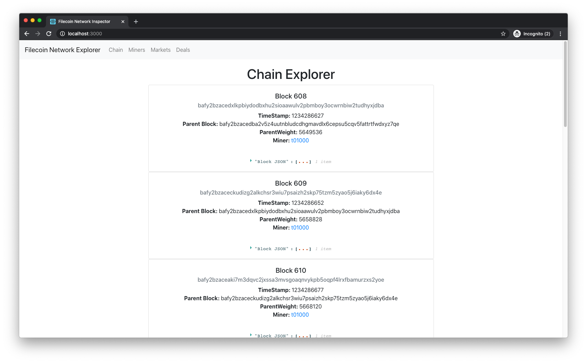

# Step 2 - Run the React app

## Requirements

1. [Node.js](https://nodejs.org/en/download/)
2. [Xcode CommandLineTools](https://developer.apple.com/library/archive/technotes/tn2339/_index.html#//apple_ref/doc/uid/DTS40014588-CH1-WHAT_IS_THE_COMMAND_LINE_TOOLS_PACKAGE_)

## Steps

1. In a third terminal window, clone the React sample application and check out the `local` branch.

```bash
git clone https://github.com/filecoin-shipyard/filecoin-network-inspector
cd filecoin-network-inspector
git checkout local
```

2. Start the app.

```bash
npm ci
npm start
```

This starts the Filecoin network inspector app and opens the application in your browser at `localhost:3000`.



::: tip
We have used [React](https://reactjs.org/) as our UI library an [Redux](https://redux.js.org/) for application state management. You can use any other library or framework to build such an app.
:::

Next, we walk through the different parts of the application to see how to integrate Filecoin features and functionality into your application.
