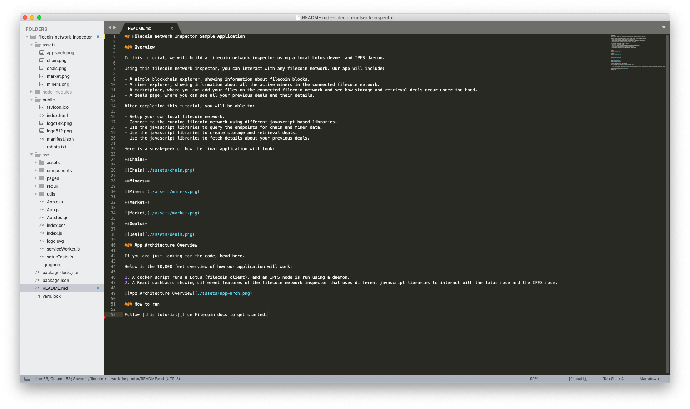

# Step 3: Set up the lotus and go-ipfs API clients

In this and later sections, you will walk through the various parts of the sample application to see how the data from your local lotus node connects to the React frontend. You will start by connecting your application to the lotus and go-ipfs nodes.

Use any text editor to open the `filecoin-network-inspector` project. Multiple pages in the React app interact with the lotus instance.



## Step 3a: Set up the lotus API client

1. To connect the React app to the running lotus instance, install the following three JavaScript modules using the [node package manager](http://npmjs.com/):

- [@filecoin-shipyard/lotus-client-rpc](https://www.npmjs.com/package/@filecoin-shipyard/lotus-client-rpc): A low-level interface for making calls to the lotus JSON-RPC API.
- [@filecoin-shipyard/lotus-client-provider-browser](https://www.npmjs.com/package/@filecoin-shipyard/lotus-client-provider-browser): An implementation of the lotus JS Client provider interface that connects to a lotus JSON-RPC API endpoint using WebSockets or HTTP.
- [@filecoin-shipyard/lotus-client-schema](https://www.npmjs.com/package/@filecoin-shipyard/lotus-client-schema): Package of .js files that describe methods exported by the lotus JSON-RPC API.

In your terminal, run the following commands:

```bash
npm i @filecoin-shipyard/lotus-client-rpc @filecoin-shipyard/lotus-client-provider-browser @filecoin-shipyard/lotus-client-schema
```

2. In [src/utils/lotus.js](https://github.com/filecoin-shipyard/filecoin-network-inspector/blob/local/src/utils/lotus.js), you can see how we use the above 3 libraries to create a lotus client for use anywhere in the application.

```js
import { LotusRPC } from '@filecoin-shipyard/js-lotus-client-rpc'
import { BrowserProvider } from '@filecoin-shipyard/js-lotus-client-provider-browser'
import { mainnet } from '@filecoin-shipyard/js-lotus-client-schema'

export const getClient = (options = { nodeOrMiner: 'node', nodeNumber: 0 }) => {
  // API endpoint for local Lotus devnet
  const API = 'ws://localhost:7777'

  // Websocket endpoint for local Lotus devnet
  const wsUrl = API + `/${options.nodeNumber}/${options.nodeOrMiner}/rpc/v0`

  // Creating and returning a Lotus client that can be used anywhere in the app
  const provider = new BrowserProvider(wsUrl)
  return new LotusRPC(provider, {
    schema:
      options.nodeOrMiner === 'node' ? mainnet.fullNode : mainnet.storageMiner
  })
}
```

If you are using the local-devnet setup mentioned in [Step 1 - Start lotus-devnet and go-ipfs](./step-1-start-lotus-devnet-and-go-ipfs.md), then the value of `API` is correct. Note that if you are using another setup, you may need to change this value (depends on the setup).

The `wsUrl` shown in the code example above depends on which node you want to connect to:

- `nodeNumber`: The number/index of the lotus node
- `nodeOrMiner`: Type of lotus node, either miner or full node

In this case, set `nodeNumber` to 0 as this is the first (and only) lotus node you will be running. Set the `nodeOrMiner` option to `"node”` as you will run a lotus full node, but not a mining node.

## Step 3b: Set up the IPFS API client

1. To connect the React app to the IPFS instance, use [js-ipfs-http-client](https://github.com/ipfs/js-ipfs/tree/master/packages/ipfs-http-client#readme), a JS library that implements the IPFS [Core API](https://github.com/ipfs/js-ipfs/tree/master/docs/core-api) commands and executes them through a running IPFS node (whether go-ipfs or js-ipfs). This client library also implements a set of utility functions, described in detail[ here](https://www.npmjs.com/package/ipfs-http-client).

In your terminal, run the following command to install the library.

```bash
npm install --save ipfs-http-client
```

2. In [src/utils/ipfs.js](https://github.com/filecoin-shipyard/filecoin-network-inspector/blob/local/src/utils/ipfs.js), set `IPFS_API_ENDPOINT` to the port of your running go-ipfs node.

```js
import IpfsHttpClient from 'ipfs-http-client'
const IPFS_API_ENDPOINT = 'http://localhost:5001' // you can replace this with any other IPFS endpoint
export const ipfs = IpfsHttpClient(IPFS_API_ENDPOINT)
```

Note that your IPFS API endpoint may differ, depending on your node setup.
