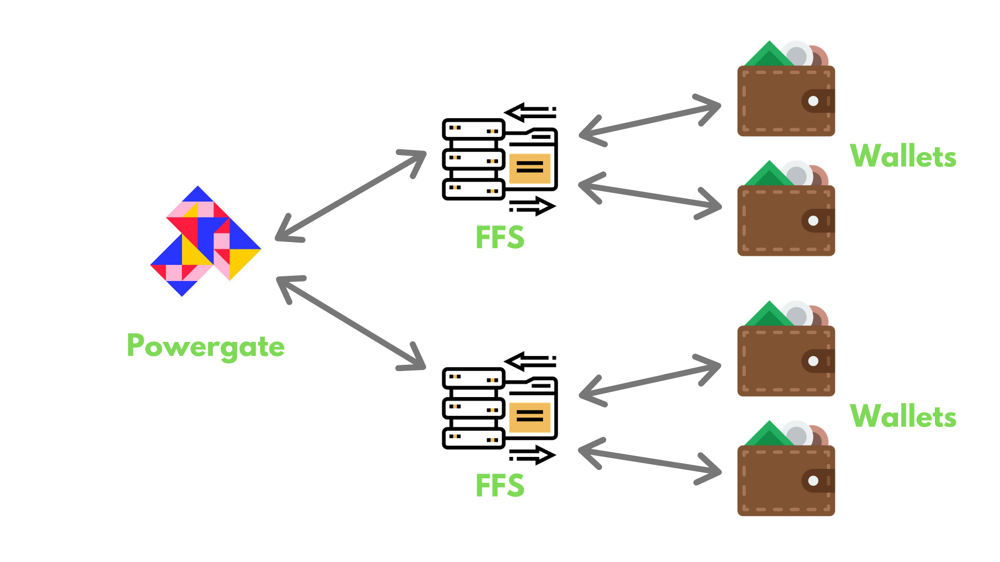
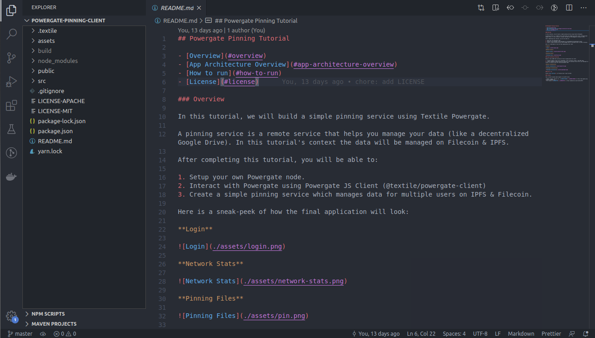
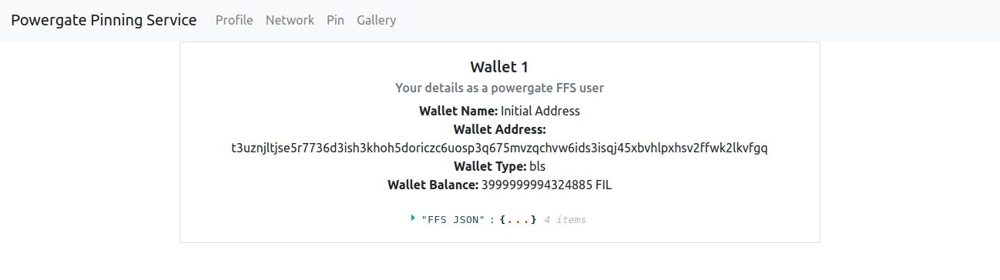

# Simple pinning service

This tutorial shows how to build a [simple pinning service](https://github.com/filecoin-shipyard/powergate-pinning-service) using [Textile Powergate](/build/core-products/powergate.md) via Textile's Powergate [Docker+ devnet](https://github.com/textileio/powergate/releases/download/v0.0.1-beta.10/powergate-docker-v0.0.1-beta.10.zip) setup (including a Powergate instance, a Lotus node and miner, and a go-ipfs node), and Textile [JS powergate-client](https://www.npmjs.com/package/@textile/powergate-client).

## Overview

A pinning service is a remote service that manages users’ data (like a decentralized Google Drive). In this tutorial's context, the data will be managed on Lotus and go-ipfs via Textile Powergate.

The Pinning service app will include:

- A login page to authenticate with the Powergate instance using JS powergate client.
- A Network page, displaying information about the Powergate instance, Lotus node, and the go-ipfs node.
- A Pinning page to manage storage and retrieval deals on the Filecoin network (devnet) using Powergate Filecoin File System (FFS).
- A Deals page, displaying details about all the storage deals created by the user of the application.

After completing this tutorial, you will be able to:

- Create a Powergate Docker+devnet setup.
- Authenticate and interact with the Powergate setup using JavaScript-based libraries.
- Use the JavaScript libraries to query the network-related information.
- Use JavaScript libraries to manage your storage and retrieval deals on devnet.
- Use JavaScript libraries to list details of all the deals made by a user.

Here is a sneak-peek of how the final application will look:

@[youtube](https://youtu.be/mQF0o2IFhVI)

If you are just looking for the code, [you can visit the Github repository](https://github.com/dappkit/powergate-pinning-service).

A high-level overview of our application architecture:

1. A docker-compose script runs a Powergate, a Lotus node (Filecoin client) and miner, and a go-ipfs node. This setup is meant to mock interactions on a live network, like testnet or mainnet.
2. A React dashboard shows different features of the pinning service that uses [Powergate JS Client](https://textileio.github.io/js-powergate-client/#powergate-js-client-textilepowergate-client) to interact with the powergate instance.


The next section describes Powergate and how it interacts with Lotus and go-ipfs nodes.

## Powergate and Its Interactions with Lotus and go-ipfs

Both Lotus and IPFS have several implementations for development in different environments, such as Go, JavaScript, Rust, etc. This tutorial focuses on the Go implementation.

- [go-ipfs](https://github.com/ipfs/go-ipfs) is a Go implementation of the [IPFS protocol](https://ipfs.io/).
- [Lotus](https://github.com/filecoin-project/lotus) is a Go implementation of the Filecoin protocol.

There are several [protocol implementations](/build/core-products/protocol-implementations.md) for Lotus, including implementations in other languages such as Rust ([forest](https://github.com/chainsafe/forest) implementation) and C++ ([fuhon](https://github.com/filecoin-project/cpp-filecoin) implementation). The core Lotus node runs the blockchain system, makes storage and retrieval deals, performs data transfers, supports block producer logic, and syncs and validates the chain. Lotus also provides a separate process for storage mining. Filecoin storage miners contribute to the network by producing sector commitments and _Proofs-of-Spacetime_ to prove they have been correctly storing storage client data. You can read more about the [interactions between storage miners and storage clients](/introduction/what-is-filecoin.md).

[go-ipfs](https://github.com/ipfs/go-ipfs) is a Go implementation of the [IPFS protocol](https://ipfs.io). There are also several IPFS implementations, including [js-ipfs](https://github.com/ipfs/js-ipfs).

[Powergate](https://docs.textile.io/powergate/) is a collection of libraries, modules, and configurations that can be used independently, and composed together to integrate Filecoin into your application or storage system. While developers can use the Lotus implementation, using Powergate makes it much easier and faster to develop applications on Filecoin.

Each Powergate instance can manage multiple users. Each user has access to a Filecoin File System (FFS). Each user’s data is safe in your FFS and no one can access the user’s data without their permission.

As storing files on Filecoin network (via FFS) involves paying the storing party in FIL (filecoin currency), every user needs a wallet to safely store the FILs. Each user can create multiple wallets within their FFS.

The diagram below illustrates how Powergate manages different FFS & wallets.



Benefits of using the Powergate include (from [Textile’s documentation](https://docs.textile.io/powergate/)):

- Ensure data stored on Filecoin is available on the IPFS network easily.
- Handle long-term storage deal management, including automated renew and repair.
- Make use of network indices to improve miner selection and deal creation.
- Manage Filecoin wallet addresses for one or many users.
- Easily configure, connect, and deploy Powergate, [Lotus](https://lotu.sh/), and [IPFS](https://ipfs.io/) together.

### Resources

- [More on lotus](https://lotu.sh/)
- [More on go-ipfs](https://docs.ipfs.io)
- [More on powergate](https://docs.textile.io/powergate/)

## Step 1 - Start Powergate docker compose scripts

The Powergate [documentation](https://docs.textile.io/powergate/) describes several ways to set up the Powergate. For the purpose of this tutorial, the easiest and fastest way is to run a **Docker + local devnet** setup. This configuration of Lotus runs a local devnet at high speed, specifically designed local testing and development. It's easy to use via a [devnet Docker compose configuration](https://github.com/textileio/powergate#devnet-mode).

### Requirements

To follow this tutorial you will need:

1. [Docker Desktop](https://www.docker.com/products/docker-desktop) and [Docker Compose](https://docs.docker.com/compose/) (preferably the latest versions)
2. **Powergate docker compose files**: The [Powergate releases page](https://github.com/textileio/powergate/releases) includes bundled Docker Compose files that use appropriate Docker image versions of Powergate, Lotus, and IPFS. Check [package-lock.json](https://github.com/dappkit/powergate-pinning-service/blob/master/package-lock.json) to see the appropriate release to download and run. Look for `@textile/grpc-powergate-client`. Its version number corresponds to the version of Powergate the underlying gRPC bindings were created from. For the following tutorial, the version is `0.0.1-beta.10`.

### Powergate docker compose setup

To set up Powergate:

1. Download the `powergate-docker-<version>.zip` from the appropriate release, in this case, [version v0.0.1-beta.10](https://github.com/textileio/powergate/releases/download/v0.0.1-beta.10/powergate-docker-v0.0.1-beta.10.zip).
2. Unzip the release, go into the created folder:

```bash
unzip powergate-docker-v0.0.1-beta.10.zip
cd powergate-docker-v0.0.1-beta
```

3. Expose port `8080` on the go-ipfs daemon so that we can access the HTTP gateway. (We use the HTTP gateway to fetch the files in our browser)
4. Open the _docker-compose-devnet.yaml_ file in your favorite editor, and add `- 8080:8080` in the `ports` section of `ipfs`

```yaml
ipfs:
  ports:
    - 5001:5001
    - 8080:8080
```

5. Close the editor after making the change.
6. Open the [Docker Desktop](https://www.docker.com/products/docker-desktop) and start Powergate using the provided Makefile:

```bash
BIGSECTORS=true make devnet
```

Powergate is now running.

::: tip
**Important note on BIGSECTORS:** When running the devnet setup, the Lotus node is configured with a mocked sector builder, using either "small" or "big" sector sizes. The configuration has practical effects on the size of files you can store in the devnet and how quickly the storage deals will complete. Using BIGSECTORS=false limits storage to files of approximately 700 bytes and deals execute in 30-60 seconds. Using BIGSECTORS=true allows storage of files from 1Mb to 400Mb, but deals execute in 3-4 minutes. Be sure to choose the value that makes sense for your development scenario.
:::

## Step 2 - Run the React app

### Requirements

1. [Node.js](https://nodejs.org/en/download/)
2. [Xcode CommandLineTools](https://developer.apple.com/library/archive/technotes/tn2339/_index.html#//apple_ref/doc/uid/DTS40014588-CH1-WHAT_IS_THE_COMMAND_LINE_TOOLS_PACKAGE_)

### Steps

1. Clone the React app:

```bash
git clone https://github.com/dappkit/powergate-pinning-service
```

2. Open the [powergate-pinning-service](https://github.com/dappkit/powergate-pinning-service) project in a text editor.
3. Run the following commands to start the app:

```bash
npm install
npm start
```

The pinning service app starts.

::: tip
This tutorial uses [React](https://reactjs.org/) as the UI library and [Redux](https://redux.js.org/) for application state management. You can use any other library or framework to build such an app.
:::

::: tip
**NOTE:** This sample app is just to showcase how to use Powergate. If you are using Powergate regularly, you may want to keep the powergate libraries in your backend.
:::

## Step 3 - Connecting to the Powergate & PouchDB Instance

The React app contains several pages which all interact with the Powergate instance. Before using the Powergate Pinning service, you need to connect to the running Powergate instance.

In this and later sections, you will walk through the various parts of the sample application to see how to connect and interact with the powergate instance using the React frontend. You will start by connecting your application to the powergate and PouchDB.

Use any text editor to open the `powergate-pinning-client` project. Multiple pages in the React app interact with the powergate instance.



### Step 3a - Connecting to the Powergate Instance

To connect the React app to the Powergate instance:

1. To connect the React app to the running powergate instance, install the following JavaScript module using the [node package manager](http://npmjs.com/):

```bash
npm i @textile/powergate-client
```

The module `@textile/powergate-client` lets you connect to Powergate instance in javascript environments such as Node, React Native, and web browsers.

2. In [src/utils/powergate.js](https://github.com/filecoin-shipyard/powergate-pinning-service/blob/master/src/utils/powergate.js), create a `getPowergateInstance()` function that returns the Powergate instance (using the `createPow` method) which can be used anywhere in the app.

```js
import { createPow, ffsOptions, ffsTypes } from '@textile/powergate-client'
var pow

const POW_HOST = 'http://localhost:6002' // or whatever powergate instance you want

export const getPowergateInstance = () => {
  if (pow) {
    // Return already existing powergate instance
    return pow
  } else {
    // Create a new powergate instance
    pow = createPow({ POW_HOST })
    return pow
  }
}

export const ffsOptions = ffsOptions
export const ffsTypes = ffsTypes
```

`ffsOptions` and `ffsTypes` are utility objects which are exported to be used in a function which we will explore in the next section of the tutorial.

::: tip
Notice the POW_HOST is set to "http://0.0.0.0:6002" (exposed by Powergate instance). This value is correct if you're running the Docker compose setup, but change it as needed if you're running Powergate elsewhere.
:::

The Powergate instance is connected and you can use it in the app.

### Step 3b - Connecting to the PouchDB Instance

1. To connect the React app to the PouchDB instance, install the following JavaScript module using the [node package manager](http://npmjs.com/):

```bash
npm i pouchdb
```

The module `pouchdb` lets you connect to PouchDB in javascript environments such as Node, React Native, and web browsers.

2. In [src/utils/powergate.js](https://github.com/filecoin-shipyard/powergate-pinning-service/blob/master/src/utils/powergate.js), create a PouchDB object and initilize a database named `my_database`:

```js
import PouchDB from 'pouchdb'
var db = new PouchDB('my_database')
```

3. In [src/utils/database.js](https://github.com/filecoin-shipyard/powergate-pinning-service/blob/master/src/utils/database.js) create the following functions:

- `addUser`: Saves new user details.

```js
export const addUser = user => {
  return new Promise((resolve, reject) => {
    db.put(user, function (err, response) {
      if (err) {
        console.log(err)
        reject(err)
      } else {
        console.log('Document created Successfully')
        console.log(response)
        resolve(response)
      }
    })
  })
}
```

- `getUser`: Fetches details of an existing user.

```js
export const getUser = address => {
  return new Promise((resolve, reject) => {
    db.get(address, function (err, doc) {
      if (err) {
        console.log(err)
        resolve(err)
      } else {
        console.log(doc)
        resolve(doc)
      }
    })
  })
}
```

- `updateUser`: Updates details of an existing user.

```js
export const updateUser = (address, user) => {
  return new Promise((resolve, reject) => {
    db.get(address, function (err, doc) {
      if (err) {
        console.log(err)
        reject(err)
      } else {
        db.put({ ...doc, user }, function (err, response) {
          if (err) {
            console.log(err)
            reject(err)
          } else {
            console.log('Document updated Successfully')
            console.log(response)
            resolve(response)
          }
        })
      }
    })
  })
}
```

::: tip
For development purposes we save the users locally (browser memory). You can also use the browser's `localStorage` or you can manage user data on an external database.
:::

The PouchDB is connected and you can use it in the app.

## Step 4 - Explore the Powergate Pinning Service App

This section provides an overview of the pages in the Powergate Pinning Service App:

- **Profile**: Displays the user wallet data.
- **Network**: Displays the network health, connected peers, miners, and their associated addresses.
- **Pin**: Allows a user to choose a file, customise Filecoin File System (FFS) configuration, upload the file to FFS, and monitor the status of the file.
- **Gallery**: Displays a list of all the files uploaded by the user and lets you download the files from the IPFS node or Filecoin node.

### Step 4a - Import the powergate client and database functions

You can look at [src/redux/actions/powergate.js](https://github.com/filecoin-shipyard/powergate-pinning-service/blob/master/src/redux/actions/powergate.js) to understand how data is captured from the powergate instance.

1. In [src/redux/actions/powergate.js](https://github.com/filecoin-shipyard/powergate-pinning-service/blob/master/src/redux/actions/powergate.js#L2), import the `getPowergateInstance` function, `ffsOptions`, and `ffsTypes`. Use `getPowergateInstance()` to create a powergate instance.

```jsx
import types from '../constants'
import {
  getPowergateInstance,
  ffsOptions,
  ffsTypes
} from '../../utils/powergate'
const pow = getPowergateInstance()
```

2. In [src/redux/actions/powergate.js](https://github.com/filecoin-shipyard/powergate-pinning-service/blob/master/src/redux/actions/powergate.js#L7), import `addUser`, `getUser` functions.

```jsx
import { addUser, getUser } from '../../utils/database'
```

#### Step 4b - Log in and create an FFS instance for the logged-in user

The Login page allows Powergate to manage data for multiple users using separate FFS for each user of the Pinning service. Login allows any kind of authentication service: OAuth services like Github, Google, Facebook, or an email-password database.

To maintain a decentralized setup, this tutorial uses [the Metamask browser extension](http://metamask.io/) and the Ethereum address as a unique identifier for each user. To get Metamask, find the add-in for your particular browser or [download Metamask here](https://metamask.io/).

Powergate supports multiple API endpoints, some of which can be accessed by an unauthenticated user, and other endpoints require authentication.

To send authenticated requests to Powergate instance, you need a token that can be passed with every request that needs authentication.


Look at:

- [src/utils/powergate.js](https://github.com/filecoin-shipyard/powergate-pinning-service/blob/master/src/utils/powergate.js) to understand how data is captured from the powergate instance.
- [src/pages/Login/index.js](https://github.com/filecoin-shipyard/powergate-pinning-service/blob/master/src/pages/Login/index.js) to see how the Login UI works.

1. **Get an Ethereum address from the user**: In [src/pages/Login/index.js](https://github.com/filecoin-shipyard/powergate-pinning-service/blob/master/src/pages/Login/index.js#L11):

- Check if the Metamask plugin is available or not. If not, create an alert that shows the user how to get the Metamask plugin.

```js
// Web3 Browser Detection
// To verify if the browser is running MetaMask, copy and paste the code snippet
// below in the developer console of your web browser:
if (typeof window.ethereum !== 'undefined') {
  console.log('MetaMask is installed!')
} else {
  alert(
    'Metamask is not installed. Get Metamask Plugin https://https://metamask.io/'
  )
}
```

- Fetch the Ethereum address from user's Metamask wallet:

```jsx
const loginWithMetamask = async createFFS => {
  const accounts = await window.ethereum.enable()
  const address = accounts[0]
  createFFS({ address: address })
}
```

The loginWithMetamask function in the [Login page](https://github.com/dappkit/powergate-pinning-service/blob/master/src/pages/Login/index.js#L47) gets the user's consent to access the Ethereum wallet address using `window.ethereum.enable()`. We call `createFFS` function to create an FFS instance for the logged-in user.

2. **Create a token for authenticated requests:** In [src/redux/actions/powergate.js](https://github.com/filecoin-shipyard/powergate-pinning-service/blob/master/src/redux/actions/powergate.js#L28), create `createFFS` function.

```js
export const createFFS = payload => async dispatch => {
  // Check for existing FFS token in database
  const user = await getUser(payload.address)
  let TOKEN
  if (user.token) {
    // If user already has an FFS token, use that
    pow.setToken(user.token)
    TOKEN = user.token
  } else {
    // If user does not have an FFS token, create one
    const { token } = await pow.ffs.create() // save this token for later use!
    pow.setToken(token)
    // Save new token
    await addUser({
      _id: payload.address,
      address: payload.address,
      token: token
    })
    TOKEN = token
  }

  dispatch({
    type: types.CREATE_FFS,
    payload: {
      address: payload.address,
      token: TOKEN
    }
  })
}
```

The `createFFS` function does the following:

- Creates a `token` for every new user using `pow.ffs.create()`
- Passes the generated `token` into `pow.setToken(token)`. Now, every request made from the app is authenticated.
- Saves the passed Ethereum address and the generated token in a PouchDB database using `addUser`, so the app can fetch and use the previously generated `token` for known users logging in.
- Checks if the user is already registered using `getUser`.
- Dispatches an event that saves the `address` and `token` into the local application state.

::: tip
This tutorial uses PouchDB for storing user data, but you can use any other method of storing users data (for example, browser localStorage)
:::

3. **Adding a button:** In [src/pages/Login/index.js](https://github.com/filecoin-shipyard/powergate-pinning-service/blob/master/src/pages/Login/index.js#L28), add a button that calls the `loginWithMetamask` function.

```jsx
<Fragment>
  <h1>Login</h1>
  <br />
  <br />
  <br />
  <button
    className="btn btn-primary mb-2"
    onClick={() => loginWithMetamask(createFFS)}>
    Login With Metamask
  </button>
  <div style={{ position: 'absolute', bottom: '30px', width: '100%' }}>
    <Footer />
  </div>
</Fragment>
```

Once you are logged in, you are directed to the _Networks_ page.

### Step 4c - Network Data

The networks page shows all the data that can be accessed by any **unauthenticated** user.


Look at:

- [src/utils/powergate.js](https://github.com/filecoin-shipyard/powergate-pinning-service/blob/master/src/utils/powergate.js) to understand how data is captured from the powergate instance.
- [src/pages/Network/index.js](https://github.com/filecoin-shipyard/powergate-pinning-service/blob/master/src/pages/Network/index.js) to see how the Network page UI works.

1. **Fetch network data**: In [src/redux/actions/powergate.js](https://github.com/filecoin-shipyard/powergate-pinning-service/blob/master/src/redux/actions/powergate.js#L10), `getNetworkStats()` function is used to fetch the following network data:

- **Network health:** Use `pow.health.check()` to get the health status of the powergate instance.
- **Node address and supported [MultiAddresses](https://multiformats.io/multiaddr/):** Use `pow.net.listenAddr()` to fetch the node id and supported multiaddresses.
- **Peers List and corresponding supported [MultiAddresses](https://multiformats.io/multiaddr/):** Use `pow.net.peers()` to fetch a list of peer(s), their node id(s), and their associated multiaddresses.
- **Miners List and their network-specific properties:** Use `pow.miners.get()` to fetch current chain details, list of miners, and their respective details.

```js
export const getNetworkStats = () => async dispatch => {
  const [respPeers, respAddr, respHealth, respMiners] = await Promise.all([
    pow.net.peers(),
    pow.net.listenAddr(),
    pow.health.check(),
    pow.miners.get()
  ])
  dispatch({
    type: types.STATS,
    payload: {
      peers: respPeers,
      address: respAddr,
      health: respHealth,
      miners: respMiners
    }
  })
}
```

2. **Display network data on UI**: In [src/pages/Network/index.js](https://github.com/filecoin-shipyard/powergate-pinning-service/blob/master/src/pages/Network/index.js#L24) we use the `getNetworkStats` function display the fetched data on the UI.

```jsx
<Fragment>
  <NavBar />
  <h1>Network Stats</h1>

  <div className="card" style={{ width: '42rem' }}>
    <div className="card-body">
      <h5 className="card-title">Node Health</h5>
      <h6 className="card-subtitle mb-2 text-muted">
        Health status of the powergate node
      </h6>
      <div className="card-text">
        {stats.health ? (
          stats.health.status === 1 ? (
            <b>
              <font color="green">HEALTHY</font>
            </b>
          ) : (
            <b>
              <font color="red">UNHEALTHY</font>
            </b>
          )
        ) : (
          <p>Loading...</p>
        )}
      </div>
    </div>
  </div>

  <div className="card" style={{ width: '42rem' }}>
    <div className="card-body">
      <h5 className="card-title">Node Address</h5>
      <h6 className="card-subtitle mb-2 text-muted">
        Node id and supported multiAddresses
      </h6>
      <div className="card-text">
        {stats.address ? (
          <div>
            <b>ID: </b> {stats.address.addrInfo.id} <br />
            <b>Supported MultiAddrs: </b> <ul>
              {stats.address.addrInfo.addrsList.map((addr, index) => (
                <li key={index}>{addr}</li>
              ))}{' '}
            </ul>
            <br />
          </div>
        ) : (
          <p>Loading...</p>
        )}
      </div>
    </div>
  </div>

  <div className="card" style={{ width: '42rem' }}>
    <div className="card-body">
      <h5 className="card-title">Peers</h5>
      <h6 className="card-subtitle mb-2 text-muted">
        List of powergate node peers
      </h6>
      <div className="card-text">
        {stats.peers ? (
          <div>
            {stats.peers.peersList.map((peer, index) => (
              <div key={index}>
                <h5>Peer {` ${index + 1}`} </h5>
                <b>ID: </b> {peer.addrInfo.id} <br />
                <b>Supported MultiAddrs: </b>{' '}
                <ul>
                  {peer.addrInfo.addrsList.map((addr, index) => (
                    <li key={index}>{addr}</li>
                  ))}
                </ul>
              </div>
            ))}
          </div>
        ) : (
          <p>Loading...</p>
        )}
      </div>
    </div>
  </div>

  <div className="card" style={{ width: '42rem' }}>
    <div className="card-body">
      <h5 className="card-title">Miners</h5>
      <h6 className="card-subtitle mb-2 text-muted">
        Miners details of our powergate setup
      </h6>
      <div className="card-text">
        {stats.miners ? (
          <div>
            <p>
              <b>Block Height: </b> {stats.miners.index.chain.lastUpdated}{' '}
              <br />
              <b>Online: </b> {stats.miners.index.meta.online} <br />
              <b>Offline: </b> {stats.miners.index.meta.offline}
            </p>
            <div>
              <h5>List of Miners</h5>
              {stats.miners.index.chain.minersMap.map((miner, index) => (
                <p key={index}>
                  <b>Miner {index + 1}</b>
                  <b>Name: </b> {miner[0]} <br />
                  <b>Power: </b> {miner[1].power} <br />
                  <b>Sector Size: </b> {miner[1].sectorSize} <br />
                  <b>Active Deals: </b> {miner[1].activeDeals}
                </p>
              ))}
            </div>
          </div>
        ) : (
          <p>Loading...</p>
        )}
      </div>
    </div>
  </div>
</Fragment>
```

### Step 4d - Profile data

The profile page shows the data related to your FFS and wallets. The profile page allows you to list all the wallets that a user controls. By default, a user has a single wallet, with a `name`, `address`, `type`, and `balance`.

The wallet type can be `bls`, `secp256k1`, and, `multisig`.



Look at:

- [src/utils/powergate.js](https://github.com/filecoin-shipyard/powergate-pinning-service/blob/master/src/utils/powergate.js) to understand how wallet data is captured from the powergate instance.
- [src/pages/Profile/index.js](https://github.com/filecoin-shipyard/powergate-pinning-service/blob/master/src/pages/Profile/index.js) to see how the Profile page UI works.

1. **Accessing the FFS details:** In [src/redux/actions/powergate.js](https://github.com/filecoin-shipyard/powergate-pinning-service/blob/master/src/redux/actions/powergate.js#L78) the `getFFSInfo` function is used to fetch the FFS `info` using `pow.ffs.info()`.

```js
export const getFFSInfo = () => async dispatch => {
  const { info } = await pow.ffs.info()
  dispatch({
    type: types.GET_FFS_INFO,
    payload: {
      ffsInfo: info
    }
  })
}
```

The `info` object looks something like this:

```json
{
  "id": "4a1a8fde-c829-4cc1-9927-87ae3f970f78",
  "defaultConfig": {
    "hot": {
      "enabled": true,
      "allowUnfreeze": false,
      "ipfs": { "addTimeout": 30 }
    },
    "cold": {
      "enabled": true,
      "filecoin": {
        "repFactor": 1,
        "dealMinDuration": 1000,
        "excludedMinersList": [],
        "trustedMinersList": [],
        "countryCodesList": [],
        "renew": { "enabled": false, "threshold": 0 },
        "addr": "t3uznjltjse5r7736d3ish3khoh5doriczc6uosp3q675mvzqchvw6ids3isqj45xbvhlpxhsv2ffwk2lkvfgq",
        "maxPrice": 0
      }
    },
    "repairable": false
  },
  "balancesList": [
    {
      "addr": {
        "name": "Initial Address",
        "addr": "t3uznjltjse5r7736d3ish3khoh5doriczc6uosp3q675mvzqchvw6ids3isqj45xbvhlpxhsv2ffwk2lkvfgq",
        "type": "bls"
      },
      "balance": 3999999994324885
    }
  ],
  "pinsList": ["QmcA4aAra7FKqxT2zUQuvnrN5nxe8LSfcUugtxnxNYXah9"]
}
```

We will study the `defaultConfig` in later parts of this section. The profile page uses the `balancesList` object the fetch:

- `name`: The name of the wallet.
- `addr`: The address of the wallet.
- `type`: The type of the wallet.
- `balance`: The balance of the respective wallet address.

::: tip
The value of the `balance` is in attoFIL (1 FIL = 10^18 attoFIL).
:::

To create additinal wallets for the user, use the `pow.ffs.newAddr` function:

```js
export const createWalletAddr = () => async dispatch => {
  const { addr } = await pow.ffs.newAddr('my wallet name', 'bls', false)
  dispatch({
    type: types.CREATE_WALLET_ADDRESSES,
    payload: {
      wallets: addr
    }
  })
}
```

The `pow.ffs.newAddr` function uses `pow.ffs.newAddr` function which takes 3 parameters:

- `name` (required): The name of the new wallet.
- `type` (optional): The type of the new wallet.
- `makeDefault` (optional): If set to `true`, the new wallet will be treated as the default wallet.

2. **Displaying FFS details on UI**: In [src/pages/Profile/index.js](https://github.com/filecoin-shipyard/powergate-pinning-service/blob/master/src/pages/Profile/index.js#L22), the `balanceList` data is displayed on the UI.

```jsx
<Fragment>
  <NavBar />
  {user.ffsInfo ? (
    user.ffsInfo.balancesList.map((wallet, index) => (
      <div key={index} className="card" style={{ width: '52rem' }}>
        <div className="card-body">
          <h5 className="card-title">Wallet {index + 1}</h5>
          <h6 className="card-subtitle mb-2 text-muted">
            Your details as a powergate FFS user
          </h6>
          <div className="card-text">
            <b>Wallet Name: </b> {wallet.addr.name} <br />
            <b>Wallet Address: </b> {wallet.addr.addr} <br />
            <b>Wallet Type: </b> {wallet.addr.type} <br />
            <b>Wallet Balance: </b> {wallet.balance} attoFIL <br />
          </div>
          <br />
          <div className="card-link">
            <ReactJson src={user.ffsInfo} collapsed={true} name="FFS JSON" />
          </div>
        </div>
      </div>
    ))
  ) : (
    
  )}
</Fragment>
```

### Step 4e - Adding data to IPFS and Filecoin

The Pin page shows how you can add data to your FFS and provides the data storage control features that are exposed through Powergate.


Look at:

- [src/utils/powergate.js](https://github.com/filecoin-shipyard/powergate-pinning-service/blob/master/src/utils/powergate.js) to understand how FFS data is captured from the powergate instance.
- [src/pages/Pin/index.js](https://github.com/filecoin-shipyard/powergate-pinning-service/blob/master/src/pages/Pin/index.js) to see how the Profile page UI works.

Following is the default FFS configuration:

```json
{
  "defaultConfig": {
    "hot": {
      "enabled": true,
      "allowUnfreeze": false,
      "ipfs": { "addTimeout": 30 }
    },
    "cold": {
      "enabled": true,
      "filecoin": {
        "repFactor": 1,
        "dealMinDuration": 1000,
        "excludedMinersList": [],
        "trustedMinersList": [],
        "countryCodesList": [],
        "renew": { "enabled": false, "threshold": 0 },
        "addr": "t3uznjltjse5r7736d3ish3khoh5doriczc6uosp3q675mvzqchvw6ids3isqj45xbvhlpxhsv2ffwk2lkvfgq",
        "maxPrice": 0
      }
    },
    "repairable": false
  }
}
```

The `defaultConfig` has 3 sections:

- `hot`: Controls IPFS data storage, or “hot” storage that is quickly accessible but not stored for the long term. Powergate considers data “hot” if it is stored on IPFS Network nodes that are not connected to the FIlecoin network. The following parameters can be set in the `hot` section:
  - `enabled`: If set to true, the data is stored on IPFS short-term storage.
  - `allowUnfreeze`: If set to true, FFS will automatically retrieve the data from the Filecoin network if the data is found on the IPFS network.
  - `addTimeout`: As we mentioned that IPFS Network is considered as "hot" storage, every time the network seeks data, it first searches IPFS. The timeout (in seconds) defines the amount of time for that initial search. If the network doesn’t don't find the data in the IPFS network before the timeout ends, it fetches the data from Filecoin.
- `cold`: Controls Filecoin data storage, that is the long-term “cold” storage. Filecoin is considered reliable for long-term cold storage of data because on Filecoin, individuals who want to store data pay for the data storage. In IPFS, data is not reliably stored because the nodes do not make a promise or receive compensation for the storage of data long term.
- `enabled`: If set to true, the data is stored on the Filecoin network.
- `repFactor`: The number of replicas to store on the Filecoin network.
- `dealMinDuration`: Minimum duration (in secs) of a deal, during which the user’s data will be stored by a miner.
- `excludedMinersList`: Array of miner addresses that you **do not want** to do a storage deal with.
- `trustedMinersList`: Array of miner addresses who are preferred for storage deals.
- `countryCodesList`: Array of country codes (region) preferred for storage deals.
- `renew`: When a deal expires, the renew option determines what to do.
  - `enabled`: If set to true, Powergate automatically renews the deal.
  - `threshold`: Number of epochs before deal expiration, the deal renewal should fire.
- `addr`: The address of the wallet debited for the storage deal.
- `maxPrice`: Maximum price you are willing to pay for a deal in attoFIL (1 FIL = 10^18 attoFIL).
- `repairable`: If set to true, when the configuration conditions are not met in the IPFS and Filecoin network, Powergate attempts to self-repair to satisfy the config conditions.

::: tip
This configuration can be set globally so that every deal by default uses this config. You can also pass this config (with different values) for a specific CID so that you can have different storage conditions for different data.
:::

1. **Accepting file and FFS configuration from the user**: To add a file to FFS, we need to accept a file and the FFS config from the user. In [src/pages/Pin/index.js](https://github.com/filecoin-shipyard/powergate-pinning-service/blob/master/src/pages/Pin/index.js#L60) the file and FFS config values are collected from the user using an HTML form.

The file then needs to be converted from `Blob` to `Uint8Array`, to be passed into `addFileToFFS` function.

```jsx
<button
  className="btn btn-primary mb-2"
  onClick={() => {
    const file = document.getElementById('fileToUpload').files[0]
    const enablePublicIPFS = document.getElementById('enablePublicIPFS').checked
    const allowUnfreeze = document.getElementById('allowUnfreeze').checked
    const enableFilecoinStorage = document.getElementById(
      'enableFilecoinStorage'
    ).checked
    const renew = document.getElementById('renew').checked
    const repairable = document.getElementById('repairable').checked

    const addTimeout = document.getElementById('addTimeout').value
    const replicationFactor = document.getElementById('replicationFactor').value
    const minDealDuration = document.getElementById('minDealDuration').value
    const excludedMinersString = document.getElementById('excludedMinersList')
      .value
    const trustedMinersString = document.getElementById('trustedMinersList')
      .value
    const countryCodesString = document.getElementById('countryCodesList').value
    const threshold = document.getElementById('threshold').value
    const maxPrice = document.getElementById('maxPrice').value

    let excludedMinersList = excludedMinersString.split(',')
    let trustedMinersList = trustedMinersString.split(',')
    let countryCodesList = countryCodesString.split(',')

    removeItem(excludedMinersList, '')
    removeItem(trustedMinersList, '')
    removeItem(countryCodesList, '')

    var arrayBuffer, uint8Array
    var fileReader = new FileReader()
    fileReader.onload = function () {
      arrayBuffer = this.result
      uint8Array = new Uint8Array(arrayBuffer)
      addFileToFFS({
        fileBuffer: uint8Array,
        withOverrideConfig: true,
        newConf: {
          hot: {
            enabled: enablePublicIPFS,
            allowUnfreeze: allowUnfreeze,
            ipfs: {
              addTimeout: parseInt(addTimeout)
            }
          },
          cold: {
            enabled: enableFilecoinStorage,
            filecoin: {
              repFactor: parseInt(replicationFactor),
              dealMinDuration: parseInt(minDealDuration),
              excludedMinersList: excludedMinersList,
              trustedMinersList: trustedMinersList,
              countryCodesList: countryCodesList,
              renew: {
                enabled: renew,
                threshold: parseInt(threshold)
              },
              addr: user.ffsInfo.defaultConfig.cold.filecoin.addr,
              maxPrice: parseInt(maxPrice)
            }
          },
          repairable: repairable
        }
      })
    }
    fileReader.readAsArrayBuffer(file)
  }}>
  Upload
</button>
```

2. **Uploading a file to IPFS and FFS**: In [src/redux/actions/powergate.js](https://github.com/filecoin-shipyard/powergate-pinning-service/blob/master/src/redux/actions/powergate.js#L109), the `addFileToFFS` function is used to:

- **Add Uint8Array file Buffer to IPFS ("hot") network**: The `pow.ffs.addToHot` adds the `Uint8Array` returns a CID that is used by `pow.ffs.pushConfig`.

- **Adding CID to FFS**: The `pow.ffs.pushConfig` adds the file (CID) to the FFS and returns a `jobId`. There are 2 optional parameters that allow you to pass an FFS config that overrides the `defaultConfig`. Following are the 2 optional parameters:

  - `ffsOptions.withOverrideConfig`: To take consent from the user (meaning we are not doing it by accident), powergate takes withOverrideConfig(true | false) as a parameter. To override the default FFS config, set it to true .
  - `ffsOptions.withConfig` : To override the default config, pass the new config into withConfig(newConfig)

- **Monitor the status of the job**: The `pow.ffs.watchJobs` function takes a callback function as a parameter, which is called when the status of the `jobId` changes. The switch case handles 3 cases:

  - `ffsTypes.JobStatus.JOB_STATUS_CANCELED`: A case when `jobId` is canceled.
  - `ffsTypes.JobStatus.JOB_STATUS_FAILED`: A case when `jobId` fails.
  - `ffsTypes.JobStatus.JOB_STATUS_SUCCESS`: A case when `jobId` succeeds.

- **Monitor the FFS events**: The `pow.ffs.watchLogs` function takes a callback function as a parameter, which is called when a new event is fired for the `jobId`.

```js
export const addFileToFFS = payload => async dispatch => {
  let jobId

  // First, add the file to IPFS Network
  const { cid } = await pow.ffs.addToHot(payload.fileBuffer)
  delete payload['fileBuffer']
  payload.cid = cid
  payload.newConf.cid = cid

  if (payload.withOverrideConfig) {
    // You want to override the default FFS config with new config
    jobId = (
      await pow.ffs.pushConfig(
        payload.cid,
        ffsOptions.withOverrideConfig(true),
        ffsOptions.withConfig(payload.newConf)
      )
    ).jobId
  } else {
    // You want to keep the default FFS config
    jobId = (await pow.ffs.pushConfig(payload.cid)).jobId
  }

  // watch the FFS job status to see the storage process progressing
  pow.ffs.watchJobs(job => {
    switch (job.status) {
      case ffsTypes.JobStatus.JOB_STATUS_CANCELED:
        dispatch({
          type: types.WATCH_LOGS,
          payload: job
        })
        break
      case ffsTypes.JobStatus.JOB_STATUS_FAILED:
        dispatch({
          type: types.WATCH_LOGS,
          payload: job
        })
        break
      case ffsTypes.JobStatus.JOB_STATUS_SUCCESS:
        dispatch({
          type: types.WATCH_LOGS,
          payload: job
        })
        break
      default:
        break
    }
  }, jobId)

  // watch all FFS events for a cid
  pow.ffs.watchLogs(logEvent => {
    dispatch({
      type: types.WATCH_LOGS,
      payload: logEvent
    })
  }, payload.cid)

  dispatch({
    type: types.ADD_FILE_TO_FFS,
    payload: {
      cid: payload.cid,
      status: ['cold'],
      jobId: jobId
    }
  })
}
```

3. **Displaying the deal status on the UI**: In [src/pages/Pin/index.js](https://github.com/filecoin-shipyard/powergate-pinning-service/blob/master/src/pages/Pin/index.js#L293), the `watchLogs` from `pow.ffs.watchLogs` are displayed on the UI to monitor the events (status) of the current storage deal. The file can be fetched back from the HTTP gateway of the IPFS node using the link `http://localhost:8080/ipfs/${log.cid}`.

```jsx
<Fragment>
  <h3>4. Deal Status</h3>
  {watchLogs.length > 0 ? (
    <div>
      {watchLogs.map((log, index) => (
        <div key={index} className="card" style={{ width: '48rem' }}>
          <div className="card-body">
            <h5 className="card-title">{log.msg}</h5>
            <h6 className="card-subtitle mb-2 text-muted">
              {new Date(log.time * 1000).toUTCString()}
            </h6>
            <p className="card-text">
              <b>Job ID: </b> {log.jid} <br />
              <b>CID: </b> <a
                href={`http://localhost:8080/ipfs/${log.cid}`}
                target="_blank">
                {log.cid}
              </a> <br />
            </p>
          </div>
        </div>
      ))}
    </div>
  ) : (
    <p>
      No Recent Deals. Upload something to Filecoin Network to see sweet-sweet
      deals :)
    </p>
  )}
</Fragment>
```

### Step 4f - Fetch data back from IPFS and FFS via powergate instance

The Gallery page displays the files stored. The page has 2 sections:

- **Get data from IPFS:** In this section, you fetch the data from the "hot" IPFS Network. This is suitable for most of the purposes (as long as the data is available on IPFS Network) as it's quickly accessible. This tutorial uses the HTTP Gateway of the IPFS node to fetch the data from IPFS Network through port 8080 that you exposed in the docker-compose file.
- **Get Data from Filecoin File System (FFS):** In this section, you fetch the data from the "cold" Filecoin Network. This is a suitable way when the data is not available on the IPFS network.

::: tip
Fetching data from Filecoin network has some fees (in FIL) associated. Retrieval fees are deducted from the associated wallet address.
:::


Look at:

- [src/utils/powergate.js](https://github.com/filecoin-shipyard/powergate-pinning-service/blob/master/src/utils/powergate.js) to understand how to fetch data back from IPFS and FFS via powergate instance.
- [src/pages/Gallery/index.js](https://github.com/filecoin-shipyard/powergate-pinning-service/blob/master/src/pages/Gallery/index.js) to see how the Profile page UI works.

1. **Fetch data back from IPFS:** In [src/redux/actions/powergate.js](https://github.com/filecoin-shipyard/powergate-pinning-service/blob/master/src/redux/actions/powergate.js#L78) the `getFFSInfo` function is used to fetch the FFS `info` using `pow.ffs.info()`. The `pinList` (which is a part of `info`) is a list of CID(s) pinned to the IPFS node.

```json
"pinsList": ["QmcA4aAra7FKqxT2zUQuvnrN5nxe8LSfcUugtxnxNYXah9"]
```

The files can be accessed using the IPFS HTTP Gateway exposed on port `8080`.

2. **Displaying links to files on UI**: In [src/pages/Gallery/index.js](https://github.com/filecoin-shipyard/powergate-pinning-service/blob/master/src/pages/Gallery/index.js#L49), the files can be accessed using the link `http://localhost:8080/ipfs/${pin}`, where `pin` is the CID of a file.

```jsx
<Fragment>
  <h3>Get data from IPFS</h3>
  {user.ffsInfo ? (
    user.ffsInfo.pinsList.length > 0 ? (
      <div>
        {user.ffsInfo.pinsList.map((pin, index) => (
          <div key={index} className="card" style={{ width: '48rem' }}>
            <div className="card-body">
              <h5 className="card-title">File {index + 1}</h5>
              <h6 className="card-subtitle mb-2 text-muted">{pin}</h6>
              {/* <p className="card-text">Some quick example text to build on the card title and make up the bulk of the card's content.</p> */}
              <a
                href={`http://localhost:8080/ipfs/${pin}`}
                className="card-link"
                target="_blank"
                download>
                Download file from IPFS
              </a>
            </div>
          </div>
        ))}
      </div>
    ) : (
      <h6>
        No files stored! Try <Link to="/pin">adding a file</Link>
      </h6>
    )
  ) : (
    
  )}
</Fragment>
```

3. **Fetching files back from FFS**: In [src/redux/actions/powergate.js](https://github.com/filecoin-shipyard/powergate-pinning-service/blob/master/src/redux/actions/powergate.js#L200), the `getDataFromFFS` function uses `pow.ffs.get` takes the CID of the data as input, and fetches the data back in `Uint8Array` format. This `Uint8Array` data is then converted into [DOMString](https://developer.mozilla.org/en-US/docs/Web/API/DOMString) (containing a URL representing the object given in the parameter) so that it can be downloaded in the browser.

```js
export const getDataFromFFS = payload => async dispatch => {
  const bytes = await pow.ffs.get(payload.cid)
  console.log(bytes)

  let blob = new Blob([bytes], { type: 'octet/stream' })
  let url = window.URL.createObjectURL(blob)

  dispatch({
    type: types.GET_DATA_FROM_FFS,
    payload: {
      cid: payload.cid,
      url: url
    }
  })
}
```

4. **Downloading files from FFS using UI**: In [src/pages/Gallery/index.js](https://github.com/filecoin-shipyard/powergate-pinning-service/blob/master/src/pages/Gallery/index.js#L80), the CID of the data is accepted as an input from the user and then passed to `getDataFromFFS` to fetch back the data from FFS. The [DOMString](https://developer.mozilla.org/en-US/docs/Web/API/DOMString) is displayed on the UI as a link which lets the user to download or view the file.

```jsx
<Fragment>
  <h3>Get Data from Filecoin File System (FFS)</h3>
  <input type="text" id="getFromFFS" placeholder="Add CID here" />
  <button
    className="btn btn-primary mb-2"
    onClick={() => {
      const cid = document.getElementById('getFromFFS').value
      getDataFromFFS({ cid: cid })
    }}>
    Get Data from FFS
  </button>
  <br />
  {ffsFiles ? (
    <div>
      {ffsFiles.map((file, index) => (
        <p key={index}>
          <a href={file.url} target="_blank">
            Download {file.cid} from Filecoin
          </a>
          <br />
          <br />
        </p>
      ))}
    </div>
  ) : null}
</Fragment>
```

And that's it! Congratulations on reading the tutorial until the end. You deserve a pat on the back!

## Shutting down

After you have explored the app, feel free to shut down the docker containers using the following steps:

1. Go into the powergate-docker-v0.0.1-beta folder

```bash
cd powergate-docker-v0.0.1-beta
```

1. Run the following command to stop all the containers gracefully

```bash
make down
```

## Summary

In this tutorial, you learned to manage data on IPFS and Filecoin using Powergate.

We learned about:

- Powergate and its benefits
- How to set up your Powergate development environment
- How to connect any javascript-based app with a Powergate instance
- How to authenticate users with Powergate
- How to fetch network details (un-authenticated requests) from Powergate endpoints
- How to fetch FFS info (authenticated request) including FFS config, wallet list and other info from Powergate endpoints
- How to configure storage options using FFS config
- How to add data to FFS, and how to override the default FFS config for a specific CID
- How to monitor the job and deal status of data added to FFS
- How to fetch data from IPFS Network and Filecoin Network

If you're interested in diving into more of the details, visit the [Simple Pinning Service repo](https://github.com/filecoin-shipyard/powergate-pinning-service).
