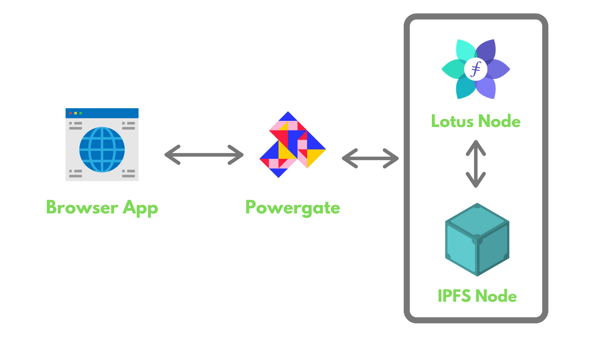

# Simple Pinning Service Overview

This tutorial shows how to build a [simple pinning service](https://github.com/filecoin-shipyard/powergate-pinning-service) using [Textile Powergate](../../powergate.md) via Textile's Powergate [Docker+ devnet](https://github.com/textileio/powergate/releases/download/v0.0.1-beta.10/powergate-docker-v0.0.1-beta.10.zip) setup (including a Powergate instance, a Lotus node and miner, and a go-ipfs node), and Textile [JS powergate-client](https://www.npmjs.com/package/@textile/powergate-client).

A pinning service is a remote service that manages users’ data (like a decentralized Google Drive). In this tutorial's context, the data will be managed on Lotus and go-ipfs via Textile Powergate.

The Pinning service app will include:

- A login page to authenticate with the Powergate instance using JS powergate client.
- A Network page, displaying information about the Powergate instance, Lotus node, and the go-ipfs node.
- A Pinning page to manage storage and retrieval deals on the Filecoin network (devnet) using Powergate Filecoin File System (FFS).
- A Deals page, displaying details about all the storage deals created by the user of the application.

After completing this tutorial, you will be able to:

- Create a Powergate Docker+devnet setup.
- Authenticate and interact with the Powergate setup using JavaScript-based libraries.
- Use the JavaScript libraries to query the network-related information.
- Use JavaScript libraries to manage your storage and retrieval deals on devnet.
- Use JavaScript libraries to list details of all the deals made by a user.

Here is a sneak-peek of how the final application will look:

@[youtube](https://youtu.be/mQF0o2IFhVI)

If you are just looking for the code, [you can visit the Github repository](https://github.com/dappkit/powergate-pinning-service).

A high-level overview of our application architecture:

1. A docker-compose script runs a Powergate, a Lotus node (Filecoin client) and miner, and a go-ipfs node. This setup is meant to mock interactions on a live network, like nerpa or mainnet.
2. A React dashboard shows different features of the pinning service that uses [Powergate JS Client](https://textileio.github.io/js-powergate-client/#powergate-js-client-textilepowergate-client) to interact with the powergate instance.

The next section describes Powergate and how it interacts with Lotus and go-ipfs nodes.
