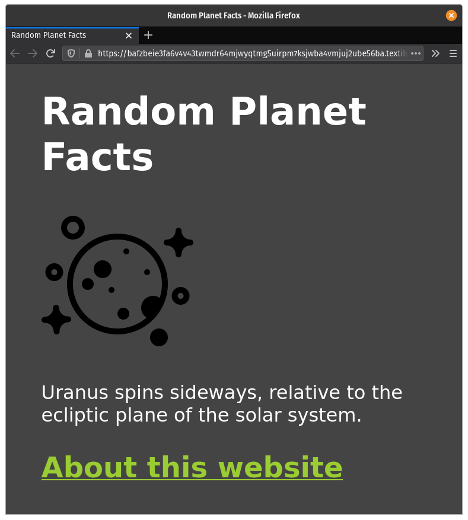

# Start building

Want to quickly host your website on Filecoin? Textile is the easiest way to get up and running quickly. Everything you need is contained in one executable you can run from the command-line. By the end of this guide you'll have a website hosted on IPFS and Filecoin.

## Get Textile

Textile is an executable run from the command-line that gives you access to APIs and CLIs. Essentially, Textile makes it incredibly easy to start building on the Filecoin network.

1. Download the latest release of [Textile Hub from GitHub](https://github.com/textileio/textile/releases/latest). Ignore the `buck` packages for now. We'll download them later:

   ```bash
   wget https://github.com/textileio/textile/releases/download/v1.0.14/hub_v1.0.14_linux-amd64.tar.gz
   ```

1. Unzip the tar:

   ```bash
   tar xvzf hub_v1.0.14_linux-amd64.tar.gz

   > LICENSE
   > README.md
   > install
   > hub
   ```

1. Run the `install` script:

   ```bash
   ./install
   ```

1. Test that everything installed correctly:

   ```bash
   hub --help

   > The Hub Client.
   > Usage:
   > hub [command]
   >
   > ...
   ```

## Create an account

Textile requires you to have an account before you can interact with it's APIs.

1. Create a new account:

   ```bash
   hub init
   ```

1. Choose a username and enter your email address.
1. Follow the link in the confirmation email from Textfile to complete your account.

## Create a bucket

Now we're ready to put your site into a bucket. Buckets are kind of like code repositories.

1. Move to the folder where you will be storing your code:

   ```bash
   cd ~/code/random-planet-facts
   ```

   If you don't have a site ready to upload but still want to play around with Textile, you can download the Random Planet Facts site:

   ```bash
   wget https://github.com/johnnymatthews/random-planet-facts/archive/master.zip
   unzip master
   cd random-planet-facts-master
   ```

1. Create the bucket:

   ```bash
   hub bucket init
   ```

   You can also use the shorter `buck` command if you prefer.

1. Choose a name for your bucket. This step is optional, but it makes it easier to manage multiple buckets if they all have descriptive names.
1. Do not encrypt your bucket. Since we need the files to be publically readable, encrypting them would be problematic.
1. Press `enter` when prompted to create a new ThreadDB table.
1. After a few seconds, the hub will output some links:

   ```bash
   > Your bucket links:
   > https://hub.textile.io/thread/bafkqumgkptlghdd3tq2b7ty7nmbqlqzu4iswudgi7nu7h7u274e6oki/buckets/bafzbeie3fa6v4v43twmdr64mjwyqtmg5uirpm7ksjwba4vmjuj2ube56ba Thread link
   > https://hub.textile.io/ipns/bafzbeie3fa6v4v43twmdr64mjwyqtmg5uirpm7ksjwba4vmjuj2ube56ba IPNS link (propagation can be slow)
   > https://bafzbeie3fa6v4v43twmdr64mjwyqtmg5uirpm7ksjwba4vmjuj2ube56ba.textile.space Bucket website
   > Success! Initialized /home/johnny/Desktop/random-planet-facts-master as a new empty bucket
   ```

   The main link we're interested in is the _Bucket website_. If you open it in a browser right now, though, you'll be met with an error saying Textile couldn't find an `index.html`. We're going to fix that in the next step.

## Push your files

1. Tell hub to grab all the files in this directory and push them into the bucket:

   ```bash
   hub bucket push

   > new file:  about.html
   > new file:  index.html
   > new file:  moon-logo.png
   > new file:  style.css
   > Push 4 changes: y
   > ? [y/N] y
   > + about.html: bafkreicps65wplcvcazj4hsmaljka6qei74t76whthoax73g47w7jaxs2i
   > + index.html: bafkreiakkl4pazn6oo3udujibt36teiwaau62dcr4dasza6xxhvkn3lqte
   > + moon-logo.png: bafkreihfdfxxerdwnbzocptacs4wbsc22uikpqz6peuzf42cgpfy3u5y7m
   > + style.css: bafkreiblwodafe2vsgs6ex5ikis5rmft7gyrniigcgyi3y24kvjeezhyd4
   > bafybeifledeasvymgvy6jrn7grlvpjepk7rpnx5jm7ons4kzoyforwp5ji
   ```

1. That's it!

## View your site

Now that all your stuff is ready, we should be able to view it in a browser!

1. View the links your bucket has assigned:

   ```bash
   hub bucket links

   > Your bucket links:
   > https://hub.textile.io/thread/bafkqumgkptlghdd3tq2b7ty7nmbqlqzu4iswudgi7nu7h7u274e6oki/buckets/bafzbeie3fa6v4v43twmdr64mjwyqtmg5uirpm7ksjwba4vmjuj2ube56ba Thread link
   > https://hub.textile.io/ipns/bafzbeie3fa6v4v43twmdr64mjwyqtmg5uirpm7ksjwba4vmjuj2ube56ba IPNS link (propagation can be slow)
   > https://bafzbeie3fa6v4v43twmdr64mjwyqtmg5uirpm7ksjwba4vmjuj2ube56ba.textile.space Bucket website
   ```

1. Open the `_Bucket website_ link in a browser to view your site:

   

## Next steps
