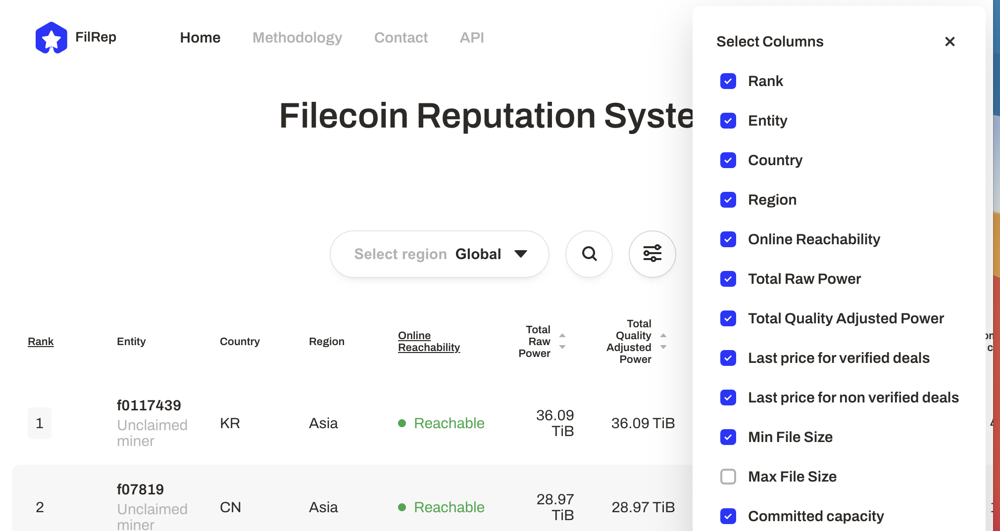
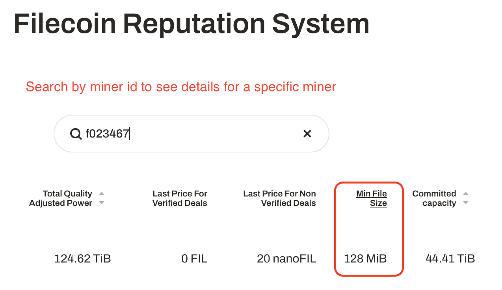

# Store data

Start storing your data on the Filecoin network. This section covers packaging your data, importing it into your local Lotus lite-node, finding a storage provider through the MinerX program, creating a storage deal, and then waiting for the deal to complete! 

:::danger
Do not store personal data on the Filecoin network, even if it's encrypted. Only store public and static data on the Filecoin network. Access control is on the project roadmap.
:::

## Things to note

As you're going through this section, make a note of the following variables: 

| Variable | Description | Example |
| --- | --- | --- |
| Payload CID | The content identifier of the data that you want to store using Filecoin. | `bafk2bzaceajz56zudni2hli7id6jvvpo5n4wj5eoxm5xwj2ipthwc2pkgowwu` |
| Miner ID #1 | The unique identifier for each storage provider. You need to have two storage provider IDs for this tutorail. | `f01000`
| Miner ID #2 | The unique identifier for each storage provider. You need to have two storage provider IDs for this tutorail. | `f01000`
| Deal CID | The content identifier for a deal made with a storage provider. | `bafyreict2zhkbwy2arri3jgthk2jyznck47umvpqis3hc5oclvskwpteau` | 

## Prepare your data

For this tutorial, we're going to create a dummy 5GB file full of random data.

1. Create a block of random data to _pad_ the total size of our payload:

    If you're on macOS, run:

    ```shell
    dd if=/dev/urandom of=5gb-filecoin-payload.bin bs=1m count=4096 
    ```

    If you're on Linux, run: 

    ```shell
    dd if=/dev/urandom of=padded-5gb-filecoin-payload.bin bs=1M count=4096
    ```

We now have our payload file ready to be stored using the Filecoin network.

## Add data to Lotus

We need to tell our Lotus lite-node which file we want to store using Filecoin.

1. Import the payload into the `lotus daemon` using the `import` command: 

    ```shell
    lotus client import ~/5gb-filecoin-payload.bin 
    ```

    Lotus creates a distributed-acyclic-graph (DAG) based off the payload. This process takes a few minutes. Once it's complete Lotus will output the payload CID.

    ```shell
    > Import 3, Root bafykb...
    ```

1. Make a note of the CID `bafykb...`; we'll use it in an upcoming section.

Now that Lotus knows which file we want to use, we can create a deal with a Filecoin storage provider to store our data!

## Find a storage provider 

We need to find a suitable storage provider or storage providers before we can store our data. The Filecoin network allows storage providers to compete by offering different terms for pricing, acceptable data sizes, and other important deal parameters. It's also important to consider the storage provider's location; the closer the storage provider is to you, the faster the storage and retrieval process will be. 

We're going to use the MinerX program to find a couple of storage providers, and then cross check their information with a third-party storage provider reputation system.

:::tip
Storing your data on more than one storage provider decreases your chance that your data will be lost at any point. Increasing the number of storage providers you use increases your data redundancy.
:::

### MinerX 

The MinerX program is a collection of geographically diverse storage providers that are willing to accept low-cost or free storage deals from users. The idea is that these storage providers will bootstrap the Filecoin network. The more storage providers that offer storage in different parts of the world, the faster we can work toward Filecoin’s underlying mission to store humanity’s most important information. You can [find out more about the MinerX program from the Filecoin Blog](https://filecoin.io/blog/posts/filecoin-minerx-fellowship-program/).

Let's find a couple of storage providers to store our data.

1. Go to [plus.fil.org/miners](https://plus.fil.org/miners/).
1. Using the table, find a couple of storage providers that suits your needs. For the sake of this tutorial, look for storage providers that:
    a. Offer verified-data deals for 0 FIL.
    a. Are close to you.
1. Once you have found a couple of suitable storage providers, make a note of their _miner IDs_ from the **Miner ID** column:

    

    Some storage providers list multiple miner IDs. For these storage providers, just copy one of the IDs:

    

1. Write down the IDs of the storage providers you want to use. We'll be referring to these IDs in the next section.

### Miner reputation systems 

The MinerX program is a great resource, but it represents a small portion of the entire Filecoin mining community. Filecoin reputation systems like [FilRep](https://filrep.io) can help you compare storage providers based on their past performance and provide useful information about the deal parameters that a storage provider will accept. Using FilRep you can compare storage provider metrics like location, storage power in the network, pricing, and overall success rate.

We're going to use FilRep to check that the minimum deal size of the storage providers we selected fit the size of our file.

1. Go to [https://filrep.io](https://filrep.io).
1. Click the **Settings** toggle to display a list of all available storage provider details.
1. Make sure that the **Min File Size** column is selected:

    

1. Now you can search for the storage providers you found before, using the miner ID. 

    

1. If the minimum file size shown for any of your storage providers is larger than your dataset, go back to [the previous section](#minerx) and select a new storage provider.

## Create a deal 

To complete this section, you need the **payload CID** you received after running `lotus client import` and the ID of a storage provider you want to use.

1. Start the interactive deal process:

    ```shell
    lotus client deal
    ```

    The interactive deal assistant will now ask you some questions.

1. Specify the CID of the file you want to backup on Filecoin. This is the CID that you got from running `lotus client import ~/filecoin-payload.tar`:

    ```shell
    Data CID (from lotus client import): bafykbz...
    ```

1. Wait for Lotus to finish building the `.car` file.

    ```shell
    > .. calculating data size 
    ```

    The duration of this process depends on the size of your file and the specification of your Lotus node. In tests, Lotus took around 20 minutes to build the `.car` file of a ~7.5GB file with an 4-core CPU and 8GB RAM. These specifications are common for most end-user laptops.

1. Enter the number of days you want to keep this file on Filecoin. The minimum is 180 days:

    ```shell
    > Deal duration (days): 180 
    ``` 

1. Tell Lotus whether or not this is a Filecoin Plus deal. Since you signed up to Filecoin Plus in an earlier step, select `yes` here:

    ```shell
    > Make this a verified deal? (yes/no): yes
    ```

1. Enter the miner IDs from the previous section with an empty space seperating the two IDs: 

    ```shell
    > Miner Addresses (f0.. f0..), none to find: f01000 f01001 
    ```

1. Enter `0` if you are asked how much FIL we are willing to spend for this storage deal:

    ```shell
    > Maximum budget (FIL): 0
    ```

    Since you picked two storage providers accepting 0 FIL deals for verified storage deals, and you are a _verified client_, you don't need to spend any FIL here!

1. If asked, specify how many storage providers you want your file to be replicated over. Since you entered two miner IDs, select `2`: 

    ```shell
    Deals to make (1): 2 
    ```

1. Confirm your transaction:

    ```shell
    > -----
    > Proposing from f136b5uqa73jni2rr745d3nek4uw6qiy6b6zmmvcq
    >         Balance: 2 FIL
    > 
    > Piece size: 8GiB (Payload size: 7.445GiB)
    > Duration: 7200h0m0s
    > Total price: ~0 FIL (0 FIL per epoch)
    > Verified: true
    > 
    > Accept (yes/no): yes
    ```

1. Lotus will returns a **Deal CID**:

    ```shell
    .. executing
    Deal (f01000) CID: bafyreict2zhkbwy2arri3jgthk2jyznck47umvpqis3hc5oclvskwpteau
    ```

1. Take a note of the **deal CID** `bafyre...`.

## Check the deal status 

We need to wait for the storage providers to accept our deal and _seal_ the data. This process can take up to 24 hours to complete, depending on how much data we asked the storage provider to store.

1. List successful and pending deals by using the `list-deals` command:

    ```shell
    lotus client list-deals
    ```

    If you cannot see your deal in the list, the deal may have failed. Use `--show-failed` to see failed deals:

    ```shell
    lotus client list-deals --show-failed
    ```

### Deal states

Because of the complex nature of Lotus and the Filecoin network, deals can be in one of many different states. The following table is the list of states that a deal should enter, assuming there are no errors. This list is in chronological order, from when the deal is first created, to when it has completed successfully:

| State | Description |
| --- | --- |
| StorageDealUnknown | The current status of a deal is undefined or unknown. This could be because your full-node is out of sync. |
| StorageDealReserveClientFunds | The client is checking that it has enough FIL for the deal.|
| StorageDealClientFunding | The client has deposited funds into the StorageMarketActor and is waiting for the funds to appear. |
| StorageDealFundsReserved | Your FIL has been deposited into escrow and is ready to be used to pay for the deal. |
| StorageDealStartDataTransfer | The storage provider is ready to accept data from the client Lotus node. |
| StorageDealTransferring | data is being transferred from the client Lotus node to the storage provider. |
| StorageDealCheckForAcceptance | The client is waiting for a storage provider to seal and publish a deal. |
| StorageDealProposalAccepted | The storage provider intends to accept a storage deal proposal; however, the storage provider has not made any commitment to do so at this point. |
| StorageDealAwaitingPreCommit | A deal is ready and must be pre-committed. |
| StorageDealSealing | The storage provider, is sealing data into a sector. The larger your data payload, the longer this will take. |
| StorageDealActive | The data is in a sealed sector, and the storage provider can provide the data back to you. |
| StorageDealExpired | A deal has passed its final epoch. The storage provider could still have the data available but is under no obligation to provide it to anyone. |

The following deal states mean there was a failure somewhere along the line, in alphabetical order: 

| State | Description |
| --- | --- |
| StorageDealAcceptWait | The storage provider is running custom decision logic to decide whether or not to accept the deal. The deal will have this status until the custom logic comes to a decision. |
| StorageDealError | There has been an unforeseen error. No further updates will occur. |
| StorageDealFailing | Something has gone wrong in a deal. Once data is cleaned up, the deal will finalize. |
| StorageDealProposalNotFound | Your full-node cannot find the deal you are looking for. This could be because it doesn't exist, or your full-node is out of sync. |
| StorageDealProposalRejected | The storage provider, has chosen not to accept this deal. The storage provider may have provided a reason alongside this status message, but not always. |
| StorageDealRejecting | The storage provider has rejected the deal. This comes immediately before StorageDealProposalRejected. |
| StorageDealValidating | The storage provider is validating that the deal parameters are good for a proposal. |

The following deal states are informational, and do not mean that a deal has failed. This list is in alphabetical order:

| State | Description |
| --- | --- |
| StorageDealClientTransferRestart | A storage deal data transfer from a client to a storage provider has restarted after a pause, likely caused by StorageDealProviderTransferAwaitRestart. |
| StorageDealFinalizing | All the data is within the sector, and the storage provider is performing the final checks to make sure that all the data is correct. |
| StorageDealProviderFunding | The storage provider has deposited funds into StorageMarketActor and is waiting for the funds to appear. |
| StorageDealProviderTransferAwaitRestart | The storage provider restarted while data was being transferred from the client to the storage provider. Once the storage provider is back online, it will wait for the client to resume the transfer. |
| StorageDealPublish | The deal is ready to be published on-chain. |
| StorageDealPublishing | The deal has been published but is yet to appear on-chain. |
| StorageDealReserveProviderFunds | The storage provider is checking that it has enough FIL for the deal. |
| StorageDealSlashed | The data was in a sector, and the storage provider got slashed for failing to prove that the data was available. |
| StorageDealStaged | The deal has been published, and data is ready to be put into a sector. At this point, the storage provider has fully committed to storing your data. |
| StorageDealVerifyData | All the data has been transferred, and the storage provider is now attempting to verify it against the PieceCID. |
| StorageDealWaitingForData | Either a manual transfer is occurring, or the storage provider has not received a data-transfer request from the client. |

These lists come from the [Lotus project GitHub repository](https://github.com/filecoin-project/go-fil-markets/blob/master/storagemarket/dealstatus.go).

## Next steps

Now that you've added some data onto the Filecoin network [we can move into retrieving data →](./retrieve-data)

