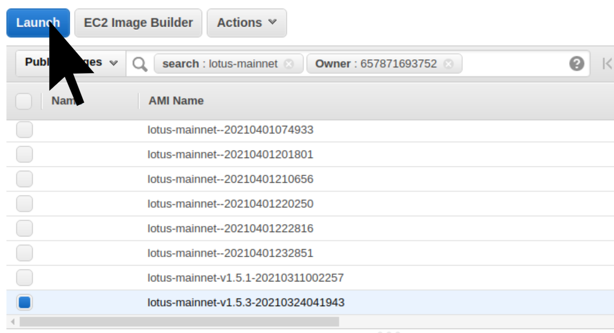

# {{ $frontmatter.title }}

{{ $frontmatter.description }}. Running Lotus on a cloud provider is a quick way to get up and running. Using these images, you can be up and running with a fully synced node in less than half an hour without compiling Lotus on your local machine.

## Cloud Providers

### DigitalOcean

The easiest and cheapest path is to use [the one-click application in the DigitalOcean marketplace](https://marketplace.digitalocean.com/apps/filecoin-lotus?refcode=f37c84619fb2). In addition to being a one-click deployment, you will receive a $100 credit with DigitalOcean for using the provided referral link.

<a href="https://marketplace.digitalocean.com/apps/filecoin-lotus?refcode=f37c84619fb2" alt="DigitalOcean Logo"></a>

After deploying, log into your new DigitalOcean Droplet as `root` using the password you provided when creating a "Droplet" (virtual machine) with Lotus pre-installed:

```
ssh root@<your_droplet_public_ipv4>
```

#### Using the DigitalOcean API to deploy Lotus

You can also spin up Lotus nodes programmatically. For example, to create a 4GB filecoin-lotus Droplet in the SFO2 region, you can use the following curl command:

```
curl -X POST -H 'Content-Type: application/json' \
-H 'Authorization: Bearer '$TOKEN'' \
-d '{"name":"a_name","region":"sfo2","size":"s-2vcpu-4gb",
"image":"protocollabs-filecoinlotus-20-04"}'  "https://api.digitalocean.com/v2/droplets"
```

### Amazon Web Services

We publish AMIs on a regular basis for each of the [filecoin networks](https://networks.filecoin.io/). To use one of these images, just search for one of our AMIs. You can use this [example link which populates a search for Lotus in the `us-west-2` region](https://us-west-2.console.aws.amazon.com/ec2/v2/home?region=us-west-2#Images:visibility=public-images;search=lotus-mainnet;ownerAlias=657871693752;sort=name).

<a href="https://us-west-2.console.aws.amazon.com/ec2/v2/home?region=us-west-2#Images:visibility=public-images;search=lotus-mainnet;ownerAlias=657871693752;sort=name" alt="AWS Logo"></a>



After you launch your AWS instance, you should log in with the 'ubuntu' account.
The filecoin instance runs a host-based firewall (UFW) which blocks all incomming ports except
for port 22 and 5678 (libp2p). This works well if you want to place your instance behind a permissive security group.

```
ssh ubuntu@<your_instance_public_ipv4>
```

## Using the image

As soon as the instance is started, it will download a large file containing the last 2000 state roots. During this time the lotus API will not be up, but lotus _is_ working. After about 20 minutes, the state root download will complete and lotus will start normally. This process happens automatically. You don't need to do anything for lotus to start.

If you're interested in seeing what's going on, you can view lotus's logs in the systemd journal.

(optional)

```
journalctl -u lotus-daemon
```

While the stateroot file is downloading, systemctl will show the status of this job as `Activating`.

(optional) Notice the this job is not started yet. Don't worry, it will transition into an active state after the stateroot file is imported.

```
[mainnet ~] ⨎ systemctl status lotus-daemon

● lotus-daemon.service - Lotus Daemon
   Loaded: loaded (/lib/systemd/system/lotus-daemon.service; disabled; vendor preset: enabled)
   Active: activating (start-pre) since Sat 2021-04-03 01:36:03 UTC; 7s ago
Cntrl PID: 1088 (bash)
    Tasks: 11 (limit: 9513)
   Memory: 600.8M
   CGroup: /system.slice/lotus-daemon.service
           ├─1088 bash /usr/local/bin/lotus-init.sh
           └─1101 lotus daemon --import-snapshot https://fil-chain-snapshots-fallback.s3.amazonaws>


```

After about 20 minutes, the stateroot snapshot will have completed its download and lotus will start normally.

---

**NOTE**
The stateroot download only happens once, when your instance is initially started. Any future restarts that may occur will not download the stateroot again, so startup will be much faster.

---

Now that the stateroot has been downloaded successfully, you can interact with the lotus network.

```
[mainnet ~] ⨎ lotus net peers
<see current peers here>
```
