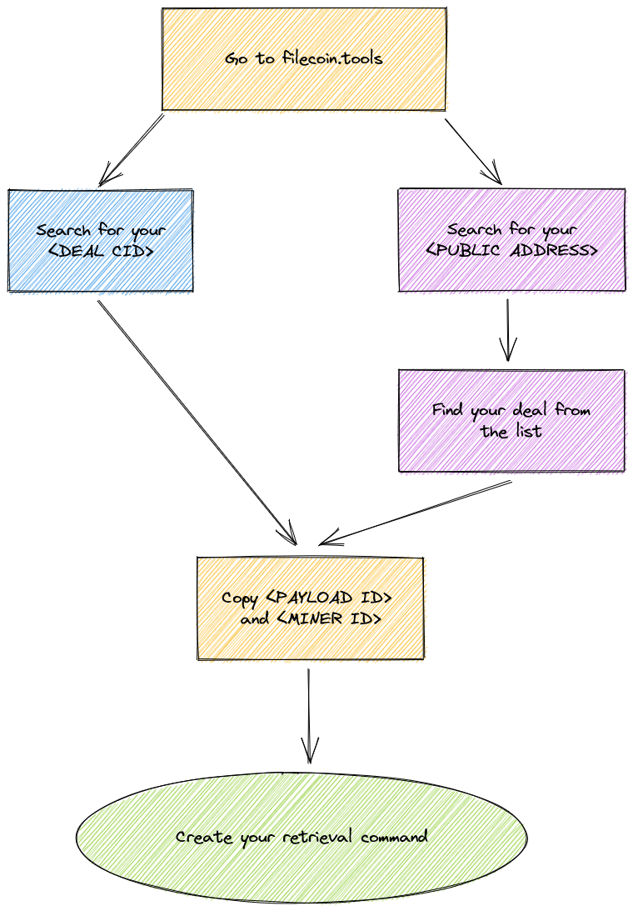
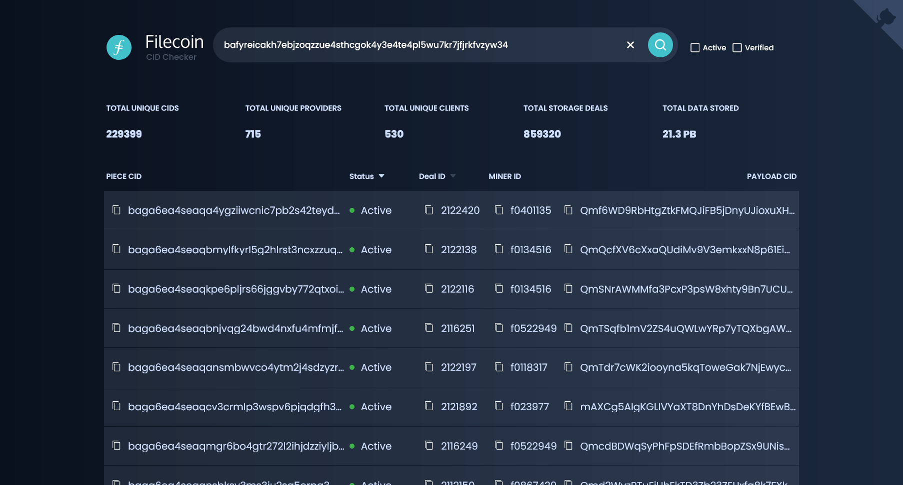

# Find deal information

There are different ways to find information for a particular deal. Each method has benefits and drawbacks, depending on your situation. This page covers using the `filecoin.tools` website, and also using Lotus to find your deals. 

## Using `filecoin.tools`

The filecoin.tool website shows information on Filecoin miners, clients, deals, and addresses. You can use it to find out pretty much anything happening on the Filecoin network. We're going to use it to find our past deals. The easiest way to find deal information using this site is by searching for your **deal CID**, but you can also find deal information using your **address**.



### Using the **deal CID**

When you create a deal with Filecoin, you get given a **deal CID** once it has been submitted:

```shell
lotus client deal

> Data CID (from lotus client import): bafykbzaced6cquoemdi6ulw5pb5jmk4ntmhf3pc3pjtdj2bp75bd7gzo5bnu2
> Deal duration (days): 180
> Miner Addresses (f0.. f0..), none to find: f0127896
> Accept (yes/no): yes
> .. executing
> Deal (f0127896) CID: bafyreicakh7ebjzoqzzue4sthcgok4y3e4te4pl5wu7kr7jfjrkfvzyw34
```

You can use this **deal CID** `bafyreica...` to find your deal information.

1. Go to [filecoin.tools](https://filecoin.tools).
1. Enter your **deal CID** into the search bar and press `ENTER ↵` to search:

    

1. Copy your public address to your clipboard. If you are connect to a Lotus node you can view your public address by using `lotus wallet list`:


    ```shell
    lotus wallet list

    # Address                                    Balance  Nonce  Default  
    # f136b5uqa73jni2rr745d3nek4uw6qiy6b6zmmvcq  10 FIL   0      X  
    ```

1. Go to [filecoin.tools](https://filecoin.tools).
1. Paste your public address in the search bar and press `enter` to search:

    

1. Click on one of the rows to view the details of that deal:

    

