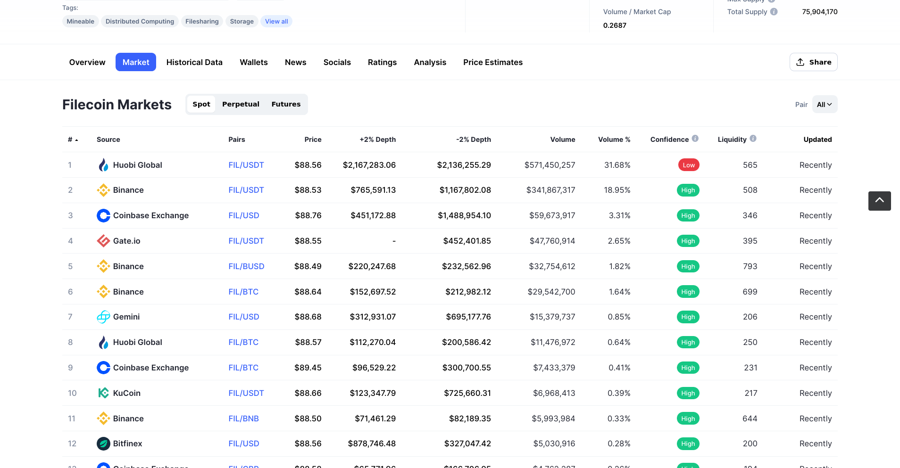

# Paid retrieval

When you store data with a storage-provider, you must pay to have your data stored! Similarly, when you want to retrieve your data back from the storage-provider, you must pay a retrieval fee. This fee covers the expenses of unsealing your data and sending it back to you! This page covers the end-to-end process of paid retrieval.

This page covers the following steps:

1. Get your public address from your Lotus node.
1. Find an exchange to buy FIL from.
1. Send FIL from your exchange to your public address.
1. Get the deal information from the deal you made on a previous page.
1. Send a retrieval request to get your data.

:::tip Free retrieval
It will soon be possible to retrieve data back from a storage-provider for free, with some caveats. However, that process is still under development.
:::

## Things to note

As you're going through this section, make a note of the following variables:

| Variable | Description | Example |
| --- | --- | --- |
| Your public address | The public part of your Filecoin address. | `bafk2bzaceajz56zudni2hli7id6jvvpo5n4wj5eoxm5xwj2ipthwc2pkgowwu` |

## Get your public address

1. Reconnect to your Lotus lite-node if you disconnected or closed the terminal since completing the previous page:

    ```shell
    FULLNODE_API_INFO=wss://api.chain.love lotus daemon --lite
    ```

    This command will continue to run. Enter any following commands in a new terminal window.

1. List all the addresses on this Lotus lite-node:

    ```shell
    lotus wallet list

    > Address                                    Balance  Nonce  Default  
    > f16mwizoeloamhp4dea4uy367mlihddw2mflnb5vy  0 FIL    0      X  
    ```

## Purchase FIL from an exchange 

A cryptocurrency exchange, or simply just _exchange_ is a service that lets you swap cash for cryptocurrency, cryptocurrency for cash, or even one cryptocurrency for another cryptocurrency. They work similarly to currency exchanges that you find at airports, where you can swan your home currency for one of the countries you are traveling to. If you have purchased cryptocurrency before, you have likely used an exchange before.

There are lots of exchanges that allow users to buy, sell, and trade FIL. Websites like [coinmarketcap.com](https://coinmarketcap.com/currencies/filecoin/markets/) keep track of which exchanges support which cryptocurrencies. You can use these lists to help make a decision on which exchange to use.



Once you have found an exchange you want to use, you will have to create an account with that exchange. Many changes have strict verification and Know-Your-Customer (KYC) processes in place, so it may take a few days to create your account. However, most large exchanges are able to verify your information in a few minutes.

Purchasing cryptocurrency varies from exchange to exchange, but the process is usually something like this:

1. Add funds to your exchange account in your local currency (USD, EUR, YEN, etc.).
1. Exchange your local currency for FIL at a set price.

## Send FIL from your exchange

Once you have FIL in your exchange account, you should be able to send some to the public address you made with your Lotus node. Again, the process for this is different for every exchange, but in general, it goes something like:

1. Submit a withdrawal request with the exchange, including:
    - How much FIL you would like to withdraw.
    - Where you want the FIL to be sent to. This value should be the public address `bafk2...` you made with your Lotus node.
1. Wait for the withdrawal to finish.

Some exchanges place a limit on how much you can withdraw at once. The exchange may also place a time-lock on your withdrawal.

Once the withdrawal from your exchange completes, and the Filecoin network processes the transaction, you will be able to see the funds in your Lotus address by using `lotus wallet list`:

```shell
lotus wallet list

> Address                                    Balance  Nonce  Default  
> f16mwizoeloamhp4dea4uy367mlihddw2mflnb5vy  10 FIL   0      X
```

It may take a few minutes for your FIL to show up in your Lotus address. If you do not see the FIL in your Lotus address 30 minutes after the withdrawal is complete from your exchange, get in touch with your exchange's support team for help.

## Get storage deal information

Now that you have FIL in your Lotus address for the retrieval, you just need to grab the information from the storage deal you originally made. You need two pieces of information to retrieve data from a miner:

- The _Data CID_, sometimes called the _label_. This is the content identifier for all the data stored in a single deal.
- The _Provider ID_ with whom you made to original deal to store the data. This is sometimes called the _Miner ID_. 

If you are still connected to the same Lotus node that originally made the deal, this process is very simple. Lotus nodes keep a log of all the deals it has made.

1. List the deals that this node has made:

    ```shell
    lotus client list-deals --verbose

    > Created          DealCid                                                      DealId  Provider  State                     On Chain?  Slashed?  PieceCID                                                          Size       Price           Duration  TransferChannelID                                                                                                              TransferStatus  Verified  Message
    > May 11 22:54:45  bafyreigbt6ymhierghhjba6htch6immn6qnnrcku3z7masnmhgm5ibdiya  0       f0100 StorageDealFundsReserved  N          N         baga6ea4seaqelwsq2q4z7utvxdwpunid773rwxfzkvxckmr3nvztssczmkux2fi  7.938 GiB  0 FIL           522077
    ```

    Lotus spits out a lot of information here. If you find it hard to read, try adding `| less -S` onto the end of the command. This will force the terminal to display the output horizontally. In this view, you can use the arrow keys to scroll left and right. Press `q` to exit this view.

1. Make a note of the `DealCid` and the `Provider`. In the example above, the `DealCid` is `baftyr...` and the `Provider` is `f01001`. 

:::warning Working from a different Lotus node
If you need to find deal information about a particular address, but you don't have access to the Lotus node that originally made the deal, then the steps are slightly different. The easiest way to get the above information is to use an external tool like [filfox.io](https://filfox.io). Take a look at the [retrieving data section](../../store/lotus/retrieve-data/) for more information.
:::

You can now move onto creating a retrieval request.

## Create a retrieval request

The retrieval command is fairly simple. We just need to add the _Provider ID_ and _Data CID_ we got from the previous step and where we want to save the downloaded file.

1. Use the `retrieve` command to request data from a miner:

    ```shell
    lotus client retrieve --miner <PROVIDER ID> <DATA CID> ~/output-file
    ```

    Replace `<PROVIDER ID>` and `<DATA CID>` in the above command with your _Provider ID_ and _Data CID_, respectively. For example:

    ```shell
    lotus client retrieve --miner f02147 baga6ea4seaqelwsq2q4z7utvxdwpunid773rwxfzkvxckmr3nvztssczmkux2fi ~/output-file
    ```

1. After submitting `retrieve` command, your Lotus lite-node will send the retrieval deal to the storage provider and wait for a response:

    ```shell
    > Recv: 0 B, Paid 0 FIL, ClientEventOpen (DealStatusNew)
    > Recv: 0 B, Paid 0 FIL, ClientEventDealProposed (DealStatusWaitForAcceptance)
    > Recv: 120 B, Paid 0 FIL, ClientEventBlocksReceived (DealStatusWaitForAcceptance)
    > ...
    ```

    This can take some time, depending on how congested the network is and how much load this storage provider is under. You must keep the `lotus daemon` running. Once the request has been received and processed by the storage provider, your Lotus lite-node will start downloading the data to your computer.

1. Wait for the download to complete. Again, the speed of this process depends on your connection to the miner and the size of your download. When creating this tutorial, it took us around 3 minutes to download a 5GB file from a miner.
1. Once the download is complete, you should have a file in your home directory called `output-file`.

And that's it! You have just completed a paid retrieval of a file stored on the Filecoin network.

