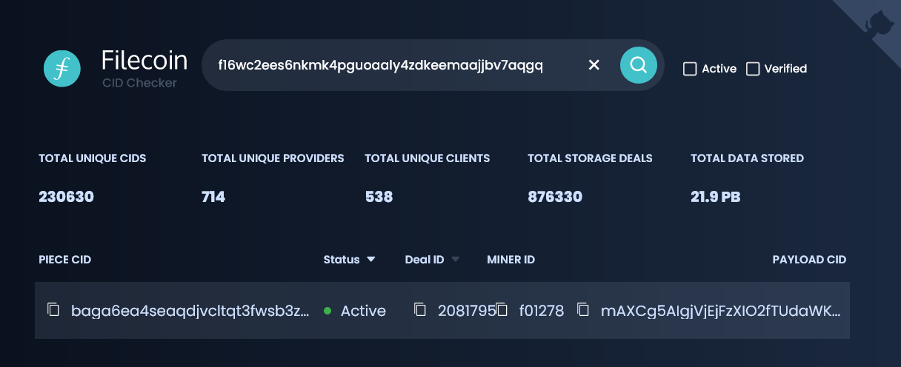
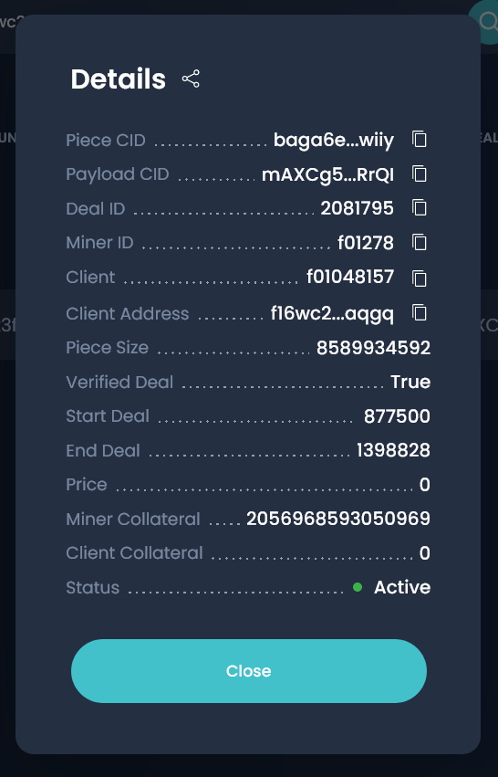

# Retrieve data

In the previous step, you stored some data on the Filecoin network. It takes anywhere from 24 to 48 hours for a storage provider to _seal_ the data, so if you finished the previous step moment ago, then your data likely isn't available for download just yet. But don't worry, you can still follow this page through to retrieve some data we already put on the Filecoin network. 

## Check address balance

Before you can retrieve data from a storage provider, you need to check that you have enough FIL to pay for the retrieval.

1. List all the addresses on this Lotus lite-node:

    ```shell
    lotus wallet list
    ```

    Lotus will output something like:

    ```shell
    > Address                                    Balance  Nonce  Default  
    > f16mwizoeloamhp4dea4uy367mlihddw2mflnb5vy  10 FIL   0      X  
    ```

    Any balance above 0.1 FIL is enough to retrieve the data we are requesting in this tutorial. 

:::warning Low or no balance
If you do not have enough FIL, you need to transfer some FIL to this account. You can either do this by using a cryptocurrency exchange or having a friend send you FIL. The address `f1...` listed when you run `lotus wallet list` is your public address; use this when requesting money from an exchange or your friend.

Check out the [Managing assets section](../../../about-filecoin/managing-assets) for information on [withdrawing FIL from an exchange →](../../../about-filecoin/managing-assets/#exchanges)
:::

## Get the deal information

Before you can send a retrieval request, you need to collect some information to structure the command. You will need:

| Variable | Description |
| --- | --- |
| `MINER ID` | This is the ID of the storage provider where the data is stored. |
| `DATA CID` | The `DATA CID`. This is also sometimes called the `PAYLOAD CID`. |
| `ADDRESS` | The public address that was originally used to create the storage deal. |

1. Copy this address to your clipboard: `f16wc2ees6nkmk4pguoaaly4zdkeemaajjbv7aqgq`.

    :::tip Using your own address
    If you want to retrieve data that you stored using your own address, then simply list your address using `lotus wallet list` and copy your address. You will not be able to retrieve data that was stored less than 24 hours ago.
    :::

1. Go to [filecoin.tools](https://filecoin.tools).
1. Paste in the address in the search bar and press `ENTER` to search for deals made by that address:

    

1. Click a deal to view information about that specific deal:

    

1. Make a note of the **Payload CID** and the **Miner ID**. You'll need both of these to create the retrieval command in the next step.

## Send a retrieval request

The structure for a retrieval command is:

```shell
lotus client retrieve --miner <MINER ID> <DATA CID> ~/output-file
```

1. Using the template above, create the command substituting the variables you got in the previous step. You're command should look something like this: 

    ```shell
    lotus client retrieve --miner f01278 mAXCg5AIgjVjEjFzXIO2fTUdaWKEGmeOevU76fzC/JgNp37oRrQI output-file
    ```

1. Run the command. After submitting this command, your Lotus lite-node will send the retrieval deal to the storage provider and wait for a response:

    ```shell
    > Recv: 0 B, Paid 0 FIL, ClientEventOpen (DealStatusNew)
    > Recv: 0 B, Paid 0 FIL, ClientEventDealProposed (DealStatusWaitForAcceptance)
    > Recv: 120 B, Paid 0 FIL, ClientEventBlocksReceived (DealStatusWaitForAcceptance)
    > ...
    ```

1. Wait for the process to finish:

    ```shell
    > Recv: 1.231 GiB, Paid 0.000000002569142626 FIL, ClientEventAllBlocksReceived (DealStatusSendFundsLastPayment)
    > Recv: 1.231 GiB, Paid 0.000000002644070646 FIL, ClientEventPaymentSent (DealStatusFinalizing)
    > Recv: 1.231 GiB, Paid 0.000000002644070646 FIL, ClientEventComplete (DealStatusCompleted)
    > Success
    ```

    This process can take some time, depending on how congested the network is and how much load this storage provider is under. You must keep the `lotus daemon` running. Once the request has been received and processed by the storage provider, your Lotus lite-node will start downloading the data to your computer.

1. That's it!

This is the end of the Filecoin _store and retrieve_ tutorial series!
