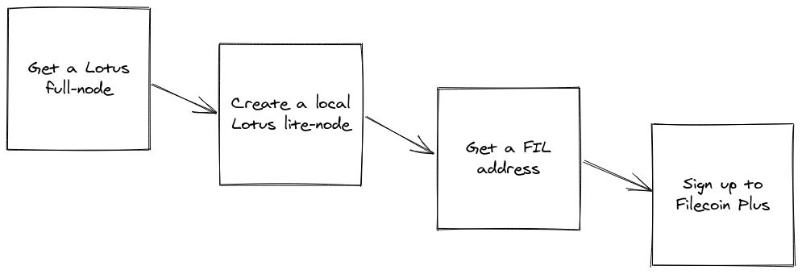

# Set up

Before you begin storing any data on the Filecoin network, you need to run through a few steps to get everything set up. This section covers getting access to a Lotus full-node, creating a Lotus lite-node on your computer, getting a FIL address, and signing up to Filecoin+. 



::: tip What is Lotus?
Programs that interact with the Filecoin network are called _implementations_, and [Lotus](../../get-started/lotus) is a command-line interface (CLI) implementation. There are [other implementation](../../get-started#filecoin-implementations) being created alongside Lotus, however Lotus is the only Filecoin implementation created and maintained by Protocol Labs.
:::

## Things to note

As you're going through this section, make a note of the following variables:

| Variable | Description | Example |
| --- | --- | --- |
| Your Filecoin address | The public part of your Filecoin address. This address is what other users can use to send your FIL. | `f1fwavjcfb32nxbczmh3kgdxhbffqjfsfby2otloi` |

## Get a full-node 

A Lotus full-node is a computer running the `lotus daemon`. Full-nodes are unique because they have complete access to the Filecoin blockchain. The computer specifications required to run a Lotus full-node are relatively high and might be out of reach for most end-user laptops and PCs. 

Usually, we'd have to _spin up_ a full-node, but we're going to use a Lotus full-node provided by Protocol Labs for this tutorial. This node, called `api.chain.love`, is only for practice sessions like this tutorial and should not be relied upon for any production or development purposes.

:::tip
If you've got a full-node that you'd prefer to use, feel free to use that instead! Just replace `api.chain.love` with your full-node IP address throughout this tutorial.
:::

## Install a lite-node

A lite-node lets your computer interact with the Filecoin network without having to run a resource-intensive full-node! Lite-nodes can do things like sign messages and talk to storage providers, but any processes that need data from the blockchain must come from a full node. Luckily, lite-nodes automatically route any blockchain-based requests to a full-node. For this tutorial, you're going to run a Lotus lite-node on your local computer and have it connect to a full-node managed by Protocol Labs.


To install a Lotus lite-node on your computer, you must have the tools required to _build_ a Lotus binary from the GitHub repository.

| [MacOS](#macos) | [Ubuntu](#ubuntu) |
| --- | --- |

Take a look at the [Get started page](../../get-started) to learn how to install Lotus on other operating systems. 

### MacOS

This section covers how to install a Lotus lite-node on MacOS. If you are running Ubuntu, head to the [Ubuntu installation section ↓](#ubuntu)

:::tip MacOS version
You can install Lotus on MacOS 10.11 (El Capitan, 2015) or higher.
:::

#### Dependencies for MacOS

Follow these steps to install the project dependencies specifically for MacOS:

1. Check if you have Xcode installed:

    ```shell
    xcode-select --version

    > xcode-select version 2384.
    ```

    Any version above 2339 will work.

    :::warning
    If the above command returns an error, you likely don't have Xcode installed. Run the following command to install Xcode:

    ```shell
    sudo rm -rf /Library/Developer/CommandLineTools 
    xcode-select --install

    > Password:
    > xcode-select: note: install requested for command line developer tools
    ```
    :::

1. Check if you have [Homebrew](https://brew.sh/) installed:

    ```shell
    brew --version 

    > Homebrew 3.0.11
    ```

    Any version of Homebrew will work, but version 3.0.0 and above is preferred.

    :::warning
    If the above command returns an error, you likely don't have Homebrew installed. Run the following command to install Homebrew:

    ```shell
    /bin/bash -c "$(curl -fsSL https://raw.githubusercontent.com/Homebrew/install/HEAD/install.sh)"
    ```

    If you run into errors installing Homebrew, there may be something wrong with your macOS installation. Check out the [Homebrew documentation](https://brew.sh/) for more information on how you can it installed.
    :::

1. Use Homebrew to install the following packages:

    ```shell
    brew install go bzr jq pkg-config rustup hwloc
    ```

Next up, you'll install a Lotus lite-node on your computer.

#### Install Lotus

The installation steps are different depending on which CPU your Mac is using:

- [AMD and Intel-based Macs](#amd-and-intel-based-macs)
- [M1-based Macs](#m1-based-macs)

If you are unsure which CPU your Mac is using, check out the [troubleshooting steps](./troubleshooting/#which-cpu-does-my-mac-have).

##### AMD and Intel-based Macs

1. Download the Lotus repository from GitHub:

    ```shell
    git clone https://github.com/filecoin-project/lotus.git
    cd lotus
    ```

1. Build the `lotus` binary, but don't run anything just yet:

    ```shell
    make clean && make all
    sudo make install
    ```

    If you run into errors here, it may be because your computer did not install some dependencies properly. Check out the [Troubleshooting](troubleshooting) section, or see the [Lotus GitHub repository](https://github.com/filecoin-project/lotus) for more help.

1. You should now have the `lotus` executable ready to run on your computer. 

    ```shell
    lotus --version

    > lotus version 1.7.0
    ```

[Head over to the next section to run your Lotus lite-node ↓](#run-a-lotus-lite-node)

##### M1-based Macs

Because of the novel architecture of the M1-based Mac computers, you must set some specific environment variables before creating the `lotus` executable.

1. Clone the [Lotus repository](https://github.com/filecoin-project/lotus) from GitHub: 

    ```shell   
    git clone https://github.com/filecoin-project/lotus
    cd lotus
    ```

1. Pull-in the submodules:

    ```shell
    git submodule update --init --recursive
    ```

1. Create necessary environment variable to allow Lotus to run on ARM architecture:

    ```shell
    export GOARCH=arm64
    export CGO_ENABLED=1
    export LIBRARY_PATH=/opt/homebrew/lib
    ```

1. Move into the `extern/filecoin-ffi` directory and checkout to the `m1-portable` branch:

    ```shell
    cd extern/filecoin-ffi
    git fetch -a
    git checkout m1-portable
    ```

1. Create the `filecoin-ffi` executables:

    ```shell
    make clean
    make
    ```

1. Move back to the root Lotus directory and create the `lotus` daemon:

    ```shell
    cd ../../
    make lotus
    ```

[Head down to the next section to run your Lotus lite-node ↓](#run-a-lotus-lite-node)

### Ubuntu

This section covers how to install a Lotus lite-node on Ubuntu. If you are running MacOS, head to the [MacOS installation section ↑](#macos).

1. Update your local `apt` repository:

    ```shell
    sudo apt update -y
    ```

1. Install the following packages:

    ```shell
    sudo apt install mesa-opencl-icd ocl-icd-opencl-dev gcc git bzr jq pkg-config curl clang build-essential hwloc libhwloc-dev wget -y && sudo apt upgrade -y
    ```

1. Install Rust:

    ```shell
    curl --proto '=https' --tlsv1.2 -sSf https://sh.rustup.rs | sh
    ```

1. Install Go and add `/usr/local/go/bin` to your `PATH`:

    ```shell
    wget -c https://golang.org/dl/go1.16.2.linux-amd64.tar.gz -O - | sudo tar -xz -C /usr/local
    ```

1. Add `/usr/local/go/bin` to your `PATH`:

    ```shell
    sudo echo "export PATH=$PATH:/usr/local/go/bin" >> ~/.bashrc && source ~/.bashrc
    ```

1. Clone the Lotus GitHub repository:

    ```shell
    git clone https://github.com/filecoin-project/lotus.git
    cd lotus/
    ```

1. Build the `lotus` executable:

    ```shell
    make clean all

    > rm -rf  build/.filecoin-install build/.update-modules  lotus lotus-miner lotus-worker lotus-shed lotus-gateway lotus-seed lotus-pond lotus-townhall lotus-fountain lotus-chainwatch lotus-bench lotus-stats lotus-pcr lotus-health lotus-wallet lotus-keygen testground
    > make -C extern/filecoin-ffi/ clean
    > make[1]: Entering directory '/root/lotus/extern/filecoin-ffi'
    > ...
    > go run github.com/GeertJohan/go.rice/rice append --exec lotus-worker -i ./build 
    ```

1. Install Lotus:

    ```shell
    sudo make install

    > bash: go: command not found
    > expr: syntax error: unexpected argument ‘1015005’
    > install -C ./lotus /usr/local/bin/lotus
    > install -C ./lotus-miner /usr/local/bin/lotus-miner
    > install -C ./lotus-worker /usr/local/bin/lotus-worker
    ```

1. You should now have the `lotus` executable ready to run on your computer. 

    ```shell
    lotus --version

    > lotus version 1.7.0
    ```

[Head onto the next section to run your Lotus lite-node ↓](#run-a-lotus-lite-node)

## Run a Lotus lite-node 

Now that you have Lotus ready to run, you can start a Lotus lite-node on your computer and connect to the `api.chain.love` Lotus full-node! 

:::warning
Just as a reminder, `api.chain.love` is a Lotus full-node managed by Protocol Labs. It's ideal for use in this tutorial, but do not use it for development or in a production environment.
:::

1. Open a terminal windows and run the `lotus daemon --lite` command, using `api.chain.love` as the full-node address: 

    ```shell
    FULLNODE_API_INFO=wss://api.chain.love lotus daemon --lite

    > 2021-04-10T13:34:07.170-0400  INFO    main    lotus/daemon.go:214 lotus repo: /home/johnny/.lotus
    > ...
    ```

    :::warning
    The above command uses [secure WebSockets `wss`](https://tools.ietf.org/html/rfc6455) to connect to the node. If you are **not** using `api.chain.love`, you will likely be using IPv4 or IPv6 instead and should replace `wss` with `ip4` or `ip6`, respectively.
    :::

1. MacOS users may see a warning regarding Lotus. Select **Accept incoming connections** if you see a warning.

    The Lotus daemon will continue to run. You must run further commands from a separate terminal window.

## Get a FIL address

Filecoin addresses are similar to regular bank account numbers. Other users can use your address to send you FIL, and you can use your address to pay storage providers for storing and retrieving your data. 

There are two parts to a Filecoin address: the public address and the private key. You can freely share your public address with anyone, but you should never share your private key. We're not going to view any private keys in this tutorial, but it's essential to understand the difference between your public address and your private key.

1. Open a new terminal window and create an address using the `lotus wallet new` command:

    ```shell
    lotus wallet new 

    > f1fwavjcfb32nxbczmh3kgdxhbffqjfsfby2otloi
    ```

    Lotus outputs your public address. Public addresses always start with `f1`.

1. Make a note of this address. We'll use it in an upcoming section.

## Filecoin Plus

Storage providers get paid either by receiving FIL directly from users for storing their data, winning block rewards from the network, or both!

Getting paid from users is straightforward. If a storage client called Laika wants to store some data, and Albert is a storage provider, the two of them can create a deal to store Laika's data for `X` amount of time for `Y` FIL.

Block rewards are randomly given to a storage provider every 30 seconds. The more data that a storage provider is _storing_, the higher their chances of winning the block reward. You can think of it like this: if a storage provider accepts a deal from a user to store 5GB of data, they have 5 chances to win the block reward for each 30 second round.

Data cap acts as a kind of _multiplier_ for block rewards. If a storage provider accepts a deal from a user with data cap attached - also known as — _verified deal_ —, then the Filecoin network treats that deal as though it's 10x as big as it is. So a 5GB deal gives the storage miner 50 chances to win the block reward instead of the usual 5 chances. Some storage providers find data cap so valuable that they're willing to make verified deals without charging any FIL! You can find a list of these storage providers using the [Filecoin Plus miner registry](https://plus.fil.org/miners/).

### Sign up

Signing up to Filecoin Plus is easy and free!

:::tip
You need a GitHub account that is at least 180 days old. If you don't have a GitHub account that's old enough, [get in touch with the team on Filecoin Slack](https://filecoin.io/slack/).
:::

1. Go to [plus.fil.org](https://plus.fil.org).
1. Under **Clients**, click **Proceed**.
1. Under **Get verified**, click **Get Verified**.
1. Click **Automatic Verification**.
1. In the `Request` field, enter the address you got in the previous section.

## Next steps

Now that we've got all the set up out of the way, we can move onto [storing data with the Filecoin network →](./store-data.md) 

