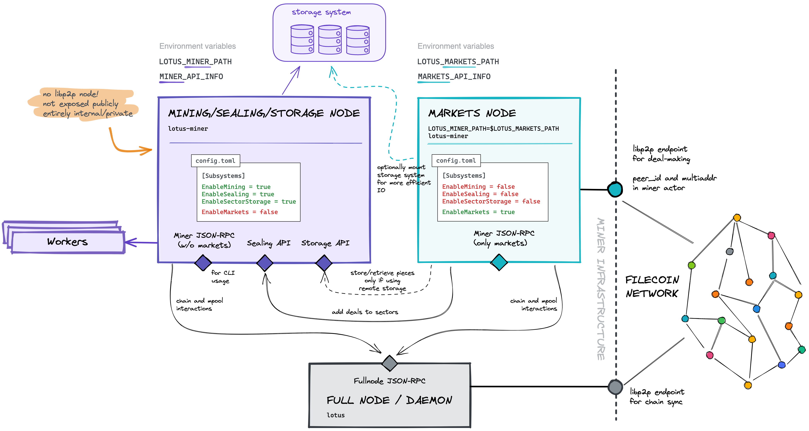

# {{ $frontmatter.title }}

{{ $frontmatter.description }}

[[TOC]]

## Concepts

Lotus performs mining operations, such as sealing files into sectors, calculating proofs over
those files and submitting the proofs on chain.
Lotus also performs markets operations, providing storage and serving retrievals to clients.

It is now possible to run mining and markets subsystems in separate processes. Service providers can
accept storage and retrieval deals without impacting ongoing mining operations. The markets process
communicates with the mining process over JSON-RPC.

It is **highly recommended** to run the mining and markets processes on separate physical or virtual machines so that:
- the machine hardware can be targeted according to the typical workload of the process
- only the machine running the markets process exposes public ports

However it is still advantageous to run the processes separately on the same machine to
isolate them - for example the storage service provider can stop and restart the markets
process without affecting an ongoing Winning PoSt Window PoSt on the miner. 

The steps below will guide you through the procedure to backup your mining node, create
an initial configuration for your brand new markets node, disable markets functionality
on the mining node, and bring both the mining and markets nodes online.

## Architecture

The following diagram summarizes the architecture of a split miner/markets
deployment:



As you can see, only the markets and the fullnode/daemon run a libp2p host and
expose public ports to the Internet. The mining/sealing/storage node stays
entirely private. This confers protection and reduces operational risk.

The markets node speaks to the mining/sealing/storage node through the sealing
and storage APIs, mainly to hand off pieces for sealing coming from storage
deals, as well as to fetch pieces to serve retrievals.

Both the markets and the mining/sealing/storage nodes need access to the
JSON-RPC endpoint of the daemon in order to query the chain and the state tree,
as well as to push messages to the network via the mpool.

As you will see below, the `lotus` and `lotus-miner` CLI commands need access to
all JSON-RPC endpoints. Remember that JSON-RPC endpoints are private and are not
exposed publicly (unless you operate a public fullnode or a gateway node!)

Another aspect worth mentioning is that both the markets and the
mining/sealing/storage nodes can be configured to share the storage system
(disk array, or filesystem), either locally when they're running on the same
machine, or as network mounts when running on separate machines. This setup
enables more efficient access and reduces network IO loads.

## Splitting the `lotus-miner` monolith into Subsystem

::: tip
This feature is available in lotus v1.11.1 and up.
:::

This document explains how to split an existing monolith `lotus-miner` node into multiple processes to take advantage of this new architecture.

### Configuration

Lotus v1.11.1 introduced the notion of `subsystems` in the `lotus-miner` process.
Currently there are 4 subsystems that can be enabled or disabled in the `config.toml` file:

```toml
[Subsystems]
#  EnableMining = true
#  EnableSealing = true
#  EnableSectorStorage = true
#  EnableMarkets = true
```

These options are set to `true` by default and you are running a `lotus-miner` monolith under this setting. Until now, the monolith `lotus-miner` process
has been responsible for all functionality.

`subsystems` can be enabled and disabled individually per process within each node's own config file. There are only two combinations that are supported right now:

1. The `markets` node - a `lotus-miner` process responsible for handling the storage market
 subsystem, and all functionality related to serve storage and retrieval deals;

```toml
[Subsystems]
  EnableMining = false
  EnableSealing = false
  EnableSectorStorage = false
  EnableMarkets = true
```

2. The `mining/sealing/proving` node - a `lotus-miner` process responsible for Filecoin mining,
sector storage, sealing and proving;

```toml
[Subsystems]
  EnableMining = true
  EnableSealing = true
  EnableSectorStorage = true
  EnableMarkets = false
```

When a `lotus-miner` instance is configured as a `markets` node, it exposes
a libp2p interface. The libp2p ports should be publically available so that
the node can be dialed by clients that wish to make storage and retrieval deals.

This guide won't go into details on how to make the endpoint connectable, as this ultimately depends on your network infrastructure and equipment, refer to the [lotus-miner connectivity guide](https://docs.filecoin.io/mine/lotus/connectivity/#frontmatter-title) for more details. Generally speaking, configuring static port mappings on your external-facing router, and ensuring your markets node has an internal static IP address and port should be sufficient, in addition to adjusting any firewalls that may be present.


::: tip  
When a `lotus-miner` instance is configured as a `mining/sealing/proving` node,
**it does not receive requests and should not be publicly exposed on the Internet**.  
**The `markets` node communicates with the `mining/sealing/proving` node via its
JSON RPC interface.** Just to reiterate, the `mining/sealing/proving` no longer runs a libp2p interface, and the `markets` and `mining/sealing/proving` do not communicate over libp2p, but through HTTP and/or Websockets (JSON-RPC interface).  
:::

## Split the Market Process

### Preparation and Backup

Before splitting the markets service process from the monolith miner process,
we need to **backup** the miner's metadata repository. Stop the `lotus daemon` and `lotus-miner`, then
**restart** both of them with the `LOTUS_BACKUP_BASE_PATH` environment variable:

::: tip
In this guide, we are replacing the the backup file in the `/tmp` folder as it is a temporary file that is just used to initialize the markets node, it's not used afterwards.
:::

1. in the machine running the full node:

```shell
lotus daemon stop
export LOTUS_BACKUP_BASE_PATH=/tmp
```
2. in the machine running the miner node:

```shell
lotus-miner stop
export LOTUS_BACKUP_BASE_PATH=/tmp
```

3. Restart both daemon and lotus-miner
4. Create the backup on the machine running the miner node
   
```shell
lotus-miner backup /tmp/backup.cbor
```

### Split the Market Subsystem

#### Step 1. Create a seed config.toml for the markets service

To initialize the markets service we need to create a seed `config.toml` for
the markets node. Note: It is a temporary file and only used for initialize the market node, full configuration file will be loaded automatically upon initialization **without** overiding the sections set in this step.

First create a `config.toml` file in a location of your choice(your market node needs to have access to read it), in this tutorial we will place it in the `/tmp` directory on your market machine as it is a temporary file)

Enable the market subsystem and add the sessions that are related to the market process in [lotus miner configuration ](https://docs.filecoin.io/mine/lotus/miner-configuration/#api-section) in to the `/tmp/config.toml`.

If you intend to run the `mining/sealing/proving` node on the same machine as the
`markets` node, make sure that their `[API]` listener addresses** do not clash**.
By default the `lotus-miner` API server listens to port 2345, so in the example
configuration above for the `markets` process, we change the configuration for the
`markets` node API server to listen to `127.0.0.1:8787`.

Make sure you adjust the `[Libp2p]` section on the `markets` node accordingly - **it
needs to be publicly accessible so that clients can make storage and retrieval
deals with your system.**


::: tip 
If you were previously running a lotus miner monolith process, copy over the `Dealmaking` session from `~/.lotusminer/config.toml` to preserve your configuration! If you want to initialize the market nodes with the default dealmaking configuration, you can skip this section.
:::


```toml
[Subsystems]
  EnableMining = false
  EnableSealing = false
  EnableSectorStorage = false
  EnableMarkets = true

[API]
  # Endpoint where the markets process will serve JSON-RPC requests
  ListenAddress = "/ip4/127.0.0.1/tcp/8787/http"
  RemoteListenAddress = "127.0.0.1:8787"

[Libp2p]
  # Endpoint for libp2p requests (public)
  ListenAddresses = ["/ip4/0.0.0.0/tcp/24001", "/ip6/::/tcp/24001"]
  AnnounceAddresses = ["/ip4/12.34.56.78/tcp/24001"]

[Dealmaking]
  # When enabled, the miner can accept online deals
  ConsiderOnlineStorageDeals = true
  # When enabled, the miner can accept offline deals
  ConsiderOfflineStorageDeals = true
  # When enabled, the miner can accept retrieval deals
  ConsiderOnlineRetrievalDeals = true
  # When enabled, the miner can accept offline retrieval deals
  ConsiderOfflineRetrievalDeals = true
  # When enabled, the miner can accept verified deals
  ConsiderVerifiedStorageDeals = true
  # When enabled, the miner can accept unverified deals
  ConsiderUnverifiedStorageDeals = true
  # A list made of Data CIDs to reject when making deals
  PieceCidBlocklist = []
  # Maximum expected amount of time getting the deal into a sealed sector will take
  # This includes the time the deal will need to get transferred and published
  # before being assigned to a sector
  # for more info, see below.
  ExpectedSealDuration = "24h0m0s"
  # When a deal is ready to publish, the amount of time to wait for more
  # deals to be ready to publish before publishing them all as a batch
  PublishMsgPeriod = "1h0m0s"
  # The maximum number of deals to include in a single publish deals message
  MaxDealsPerPublishMsg = 8
  # A command used for fine-grained evaluation of storage deals (see below)
  Filter = "/absolute/path/to/storage_filter_program"
  # A command used for fine-grained evaluation of retrieval deals (see below)
  RetrievalFilter = "/absolute/path/to/retrieval_filter_program"
```

::: info
The `[Libp2p]` section of the `config.toml` on the `mining/sealing/proving` node
can be removed because it will no longer be running a Libp2p node, as we explained above.
:::

#### Step 2. Disable the Market Subsystem on the `mining/sealing/proving` miner process

1. On your `mining/sealing/proving` machine, update your `~/.lotusminer/config.toml` to set the `EnableMarkets` option to `false`.

```toml
[Subsystems]
  EnableMining = true
  EnableSealing = true
  EnableSectorStorage = true
  EnableMarkets = false
```

#### Step 3. Initialize a `markets` service repository

1. Create authentication tokens for the markets nodes and they will be used by the `markets` node to make JSON-RPC
calls to the `mining/sealing/proving` node.

```shell
export APISEALER=`lotus-miner auth api-info --perm=admin`
export APISECTORINDEX=`lotus-miner auth api-info --perm=admin`
```

2. Initialize the `markets` node. This performs a one-time setup of the markets node.
Part of that setup includes updating the `peer id` in the miner actor by submitting
a message on chain. This is necessary so that storage and retrieval clients know that
this miner's **deal-making** endpoint is now publicly dialable/reachable on a new
address (the new `markets` node).

::: warning
Make sure your main mining process is running before you run the following step.
:::

For this tutorial, we will us ~/.lotusmarkets` as the markets repository paths. You **do not** need to manually create the folder in advance. 

```shell
lotus-miner --markets-repo=~/.lotusmarkets init service --type=markets \
                                                        --api-sealer=$APISEALER \
                                                        --api-sector-index=$APISECTORINDEX \
                                                        --config=/tmp/config.toml \
                                                        /tmp/backup.cbor
```

3. If during this procedure, you ended up changing the `multiaddr` of your `markets`
process to a different host and/or port, you must update miner's `multiaddr` on-chain.
Otherwise, clients wishing to make deals with you will no longer be able to connect to
your node.

::: tip
`multiaddr` onchain should be the same as the `ListenAddresses` you set in the `Libp2p` section of the config.toml on your market node.
:::

```shell
lotus-miner actor set-addrs <NEW_MULTIADDR>
```

4. After you have finished initializing the `markets` node repository, you must restart the `mining/sealing/proving` node for the configuration changes to take effect.

#### Step 4. Consider configuring storage.json on the markets node

If you had [customized storage locations](https://docs.filecoin.io/mine/lotus/custom-storage-layout/#frontmatter-title)
for your monolith miner, consider either:
1. copying the `~/.lotusminer/storage.json` file to the `~/.lotusmarket`
   directory, if both miner and markets are running on the same machine and have
   access to the same paths.
2. adjusting `~/.lotusmarket/storage.json` to point to network mounts shared
   with the miner, if both processes are running on separate machines.

This will enable the markets process to access unsealed pieces directly from
those locations, instead of streaming them to/through the miner node over the
network, thus reducing network IO loads.

#### Step 5. **Optional**: Move the DAG store directory to the markets node repository

If you have initialized the dagstore, you can optionally move the DAG store
directory to the lotus markets repository, to carry over the indices you have
already built up.

::: tip
Dagstore has not been introduced in v1.11.1 yet, we will update the docs once its available in Lotus.
:::

```shell
mv ~/.lotusminer/dagstore ~/.lotusmarkets/
```

#### Step 6. Start the `markets` miner process with the markets subsystem

Start the `markets` node with the environment variable `LOTUS_MINER_PATH` pointing to the `markets` node repo.

Note that `lotus-miner run` interacts with either the the `markets` or `mining/sealing/proving` repository
depending on the `LOTUS_MINER_PATH` environment variable!

```shell
LOTUS_MINER_PATH=~/.lotusmarkets lotus-miner run
```

And that's it, you have successfully set up your market subsystem! 


## Calling commands

The `lotus-miner` CLI commands have been refactored to target the correct subsystem node, depending on issued command. For example:

1. If you call `lotus-miner storage-deals list`, `lotus-miner` *knows* to target the `markets` process.
2. If you call `lotus-miner sectors list`, `lotus-miner` *knows* to target the `mining/sealing/proving` process.

### Environment Variables

In addition to the [existing environment variables](https://docs.filecoin.io/mine/lotus/miner-setup/#checklist-before-launch) for `lotus-miner`, `MARKETS_API_INFO` and `LOTUS_MARKETS_PATH` were introduced for the market subsystem:
- `LOTUS_MARKETS_PATH` is the location of your market repository.
- `MARKETS_API_INFO` is the location of the market node.

::: tip
You can learn how to use a different lotus node [here](https://docs.filecoin.io/mine/lotus/miner-lifecycle/#using-a-different-lotus-node).
:::

When splitting miner and markets subsystems, we **recommend** adding `.bashrc` (or equivalent) with the API address / path for your markets node. You can mix and match, for example, the configuration inside the machine running the markets node:

```
FULLNODE_API_INFO=...
MINER_API_INFO=...
LOTUS_MARKETS_PATH=...
```

A client configuration inside the machine running the `mining/sealing/proving` or `lotus-worker` node that wants to interact with the market node and the full node:

```
FULLNODE_API_INFO=...
MINER_API_INFO=...
MARKETS_API_INFO=...
LOTUS_MINER_PATH=...
LOTUS_MARKETS_PATH=...
```

A client configuration that speaks to all nodes remotely:

```
FULLNODE_API_INFO=...
MINER_API_INFO=...
MARKETS_API_INFO=...
```

### Interact with the Market Node from Other Process

For commands that are present in all `lotus-miner` processes, by default the CLI targets the `mining/sealing/proving` process, but you can explicitly target the `markets` process with the `--call-on-markets` flag. This is the case for `log` and `auth` commands, for example.

In order to take advantage of this functionality, you should configure the following environment variable for both `mining/sealing/proving` miner (or lotus-worker) and the `markets` miner, in your run-commands file (`.bashrc`, `.zshrc`, etc.):

```shell
export LOTUS_MARKETS_PATH=~/.lotusmarkets
export LOTUS_MINER_PATH=~/.lotusminer
```

If one of these nodes is on a **remote** machine, you should set the relevant API_INFO environment variables like below:

```shell
# <market_api_token> is located in $LOTUS_MINER_PATH/token
export MARKETS_API_INFO=<market_api_token>/ip4/<lotus_miner_market_node_ip>/tcp/<lotus_miner_market_node_port>/http

# <miner_api_token> is located in $LOTUS_MINER_PATH/token
export MINER_API_INFO=<miner_api_token>:/ip4/<lotus_miner_node_ip>/tcp/<lotus_miner_node_port>/http
```

Now that you have both a `markets` miner process and a `mining/sealing/proving` miner process running, you can confirm that you can interact with each respective process with the following:

1. Get miner info
```shell
lotus-miner info
```

1. Get the peer identity of the `markets` miner process
```shell
lotus-miner --call-on-markets net id
```

2. Get a list of storage deals from the `markets` miner process
```shell
lotus-miner storage-deals list
```

3. Get a list of sectors from the `mining/sealing/proving` miner process
```shell
lotus-miner sectors list
```

## Rollback to `lotus-miner` monolith process

If you want to revert the changes listed above and go back to running `lotus-miner` as a single process, run the following:

1. Shut both `mining/sealing/proving` and `markets` node down.
   
2. Make sure that the `mining/sealing/proving` node is publicly exposed, as we will be enabling the markets subsystem on it. Set up the addresses in the [`Libp2p` section](https://docs.filecoin.io/mine/lotus/miner-configuration/#libp2p-section) of the `~/$LOTUS_MINER_PATH/config.toml` 
   
3. In the `mining/sealing/proving` repository, update the `config.toml` and set `EnableMarkets` option to `true`
```toml
[Subsystems]
  EnableMining = true
  EnableSealing = true
  EnableSectorStorage = true
  EnableMarkets = true
```

4. **Optional**: Move back the DAG store directory to the monolith miner node repository if you have initialized dagstore before:

```shell
mv ~/.lotusmarkets/dagStore ~/$LOTUS_MINER_PATH/
```

5. Backup and restore the metadata related to storage deals from the `markets` instance back to the monolith miner instance. Given that storage deals metadata would have changed on the `markets` instance in case you accepted storage deals while running multi-services architecture, we have to copy it back to the monolith miner instance.

Build the `lotus-shed` binary if you haven't done that before:
```shell
make lotus-shed
```
then run

```shell
lotus-shed market export-datastore --repo ~/.lotusmarkets --backup-dir /tmp/deals-backup

lotus-shed market import-datastore --repo ~/$LOTUS_MINER_PATH --backup-path /tmp/deals-backup/markets.datastore.backup
```

6. Restart the `mining/sealing/proving` node (with the default LOTUS_MINER_PATH, which should point to your `mining/sealing/proving` node repo). Note that `lotus-miner` interacts with a given repository depending on the `LOTUS_MINER_PATH` environment variable!

```shell
lotus-miner run
```

7. Fetch the node identity. This is necessary as you have to update your miner's peer identity on-chain, as it was changed to the identity of the markets node during the initialising of the markets service repository.

```shell
lotus-miner net id
```

8. Update the miner's peer id and multiaddr on-chain with the result from the previous step.

```shell
lotus-miner actor set-peer-id 12D3XXXXX
```

As soon as the message is confirmed, clients will know to look for the node identity of your `mining/sealing/proving` node, which now also runs the `markets` subsystem, i.e. currently all Lotus subsystems.

`multiaddr` onchain should be the same as the `ListenAddresses` you set in the `Libp2p` section of the config.toml on your `mining/sealing/proving` node now. If it's changed, update it by running:

```shell
lotus-miner actor set-addrs <NEW_MULTIADDR>
```

9. Update the `Addresses` section of the markets `config.toml` to be the same as same the mining/sealing/proving node.

```toml
[Addresses]  
    PreCommitControl = ["f00XX1"]  
    CommitControl = ["f00XX2"]  
    TerminateControl = []  
    DealPublishControl = ["f00XX3"] 
    DisableOwnerFallback = false  
    DisableWorkerFallback = false 
```
 
Typically, if you initialize the markets node from the `config.toml` used in the mining/sealing/proving node, the settings in this section will be the same as in the mining/sealing/proving node. If you are already running a subsystem and have changed the configuration in this area, copy the changes to the markets node. If you do not copy the changes, the `DealPublishControl` configuration will not affect, and `DealPublish` costs will be deducted from the worker wallet.
