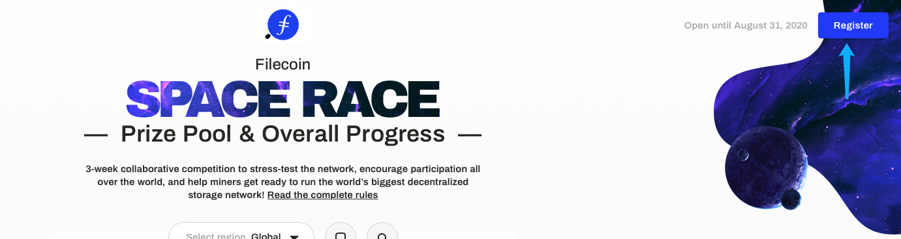

# The Filecoin Space Race

The testnet incentives program (also known as the 'Space Race') is a collaborative competition intended to stress-test the network, encourage participation all over the world, and help miners get ready to run the world’s biggest decentralized storage network.

## Structure and rules

The competition’s basic structure is simple: for three weeks, miners will compete to onboard as much storage capacity as possible to the network. The top 100 miners globally, as well as the top 50 miners from each continent, will earn Filecoin rewards based on how much storage they and the network achieve during the test period.

A miner’s “location,” for regional leaderboards, is the physical location of the mining operation. Operations split between multiple regions must run multiple miners. Miners will be required to submit documentation verifying their location claims. Claiming to be from a different location will disqualify you from rewards and leaderboard inclusion.

## How do I participate?

**The competition period will begin Monday, August 24th at 22:00 UTC** and is open for 3 weeks, ending Monday, September 14th at 21:59 UTC. To participate in the competition, run 1 or more miners on the [Testnet](https://docs.filecoin.io/how-to/networks/#testnet). You can track your progress on the [Space Race Competition Dashboard](https://spacerace.filecoin.io/).


You'll also need to complete these steps to be eligible for rewards:

- Maintain a deal success average of 80% or greater for both storage and retrieval deals.
- Demonstrate at least one [sector upgrade](#how-do-i-demonstrate-a-sector-upgrade) per miner.
- Register your miner(s) by submitting your individual or company info via the [Competition Dashboard](https://spacerace.filecoin.io/). After submitting the registration form, it will generate a message for your miner to sign and submit. Miners that qualify for rewards will also need to pass an AML/KYC check after the competition ends. [**Note:** Standard registration (for miners already mining) closed at 22:00 UTC, Monday, August 31. Late registration (for new miners not seen on chain before and who don't have another miner in the race) is open until **22:00 UTC, Thursday, Sept 10th**.]

For help or additional questions, join the [#space-race](https://filecoinproject.slack.com/archives/C0179RNEMU4) channel on the [Filecoin Slack](https://filecoin.io/slack).

## What are the possible rewards?

Prizes will be awarded for both storage rewards and block rewards.

### Storage Rewards

The top 50 miners in each region and globally are eligible to split a reward pool of up to 4mm FIL, depending on regional network storage achieved.

| Total FIL rewards (global pool) | Global network storage achieved |
| ------------------------------- | ------------------------------- |
| 100k FIL                        | 5 PiB                           |
| 200k FIL                        | 10 PiB                          |
| 300k FIL                        | 25 PiB                          |
| 500k FIL                        | 50 PiB                          |
| 1MM FIL \*                      | 100 PiB                         |

- Only unlocked if each region achieves at least 1PiB of storage

| Total FIL rewards (regional pool) | Regional network storage achieved |
| --------------------------------- | --------------------------------- |
| 25k FIL                           | 10 TiB                            |
| 50k FIL                           | 100 TiB                           |
| 100k FIL                          | 1 PiB                             |
| 250k FIL                          | 5 PiB                             |
| 500k FIL                          | 10 PiB                            |

### Block Rewards

The top 20 FIL-denominated block reward producers who are also eligible to receive Space Race rewards will share a reward pool of 100k FIL on a pro rata basis. For example, if you receive 100,000 FIL in block rewards, and the top 20 producers cumulatively receive 2,000,000 FIL, you would be eligible to receive an additional 5,000 FIL. Like other competition rewards, any FIL received will vest linearly over six months. During the Space Race, miners can check their total block rewards mined on the [Block Reward Dashboard](https://reward.testnet.filecoin.io/d/P_Q13JnMz/top-miners-by-block-reward?orgId=1&refresh=25s&from=now-30m&to=now&kiosk).

Any rewards earned will be encoded into the genesis block and will vest linearly over six months from mainnet launch.

## Frequently asked questions

#### What branch and network will be used for the Space Race?

The Space Race competition will run on the [Testnet](https://docs.filecoin.io/how-to/networks/#testnet) network.

#### Where can I get test FIL?

You can get FIL from the [faucet](https://spacerace.faucet.glif.io).

#### How do I register for the Space Race?

Start mining and once you've committed at least one sector, go to [Space Race Dashboard](https://spacerace.filecoin.io/) and click `Register` in the top right corner!



#### Where can I track Space Race progress and Testnet network stats?

The [Competition Dashboard](https://spacerace.filecoin.io/) is where you can track Space Race storage progress and register your miner(s).

Block Rewards standings are listed on the [Block Rewards Dashboard](https://reward.testnet.filecoin.io/), and network stats on the [Testnet Network Stats](https://stats.testnet.filecoin.io/) page.

#### I can't find my miner on the Space Race dashboard. Anything else I need to do?

The [Space Race Dashboard](https://spacerace.filecoin.io) shows miners with at least one sealed sector.

To check if your miner has finished sealing its first sector, run `lotus state active-sectors <minerId>`. This will return a list of sectors that have finished sealing. As long as the output is not empty, it means you have a sector sealed. Your miner id should show up on the dashboard within 5 minutes of sealing its first sector.

#### How is the "location" of a mining operation determined?

The “location” of a storage mining operation is the location of the storage and sealing hardware for the operation. Since the hardware is what matters, it is not acceptable to relay from hardware in Continent A to a Lotus node in Continent B and try to claim Continent B rewards.

Thus, to verify location claims, the Filecoin team will be implementing a custom-built software suite running during the competition, and will be doing hands-on verification during and after the competition. **Please do not try to “spoof” your location – we have many layers of detection in place and a team in place to ensure fairness**; if you are thinking about using a proxy or a VPN to hide your location, think again.

Any miner found misrepresenting their location will result in a _total forfeiture of all rewards_, across all associated miners.

#### If I rent a server in EU from US, can I compete in the EU region?

Your region is determined by the physical location of the storage and sealing hardware. It might not be cost effective, but yes, it is permissible to run your mining operation on a rented service anywhere in the world. However, it is NOT acceptable to obscure your miner location via a proxy or similar service."

#### Is a static IP required?

A public IP is required so that your miner can make storage and retrieval deals and compete in Space Race. This can achieved through a static IP, or a relay or VPN. The majority of deal errors found during calibration period werre caused by IP address and other connectivity issues, so we highly recommend following the [Improving connectivity](https://docs.filecoin.io/mine/connectivity/) steps.

#### How exactly is deal success measured?

Once your miner is online, the dealbot will automatically begin making storage and retrieval deals. Only deals made through the dealbot count towards deal success rate for this competition. To qualify for rewards, your miner must show >=80% success in both storage and retrieval deals during the competition period.

To see a detailed log of all deal attempts for your miner, visit the [Space Race Dashboard](https://spacerace.filecoin.io) and search for your miner ID.

#### How are regional and global storage achieved measured?

Each region (regional or global) unlocks additional FIL rewards by collectively adding more storage to the network. Miners with any deal success rate count toward the regional and global storage mounts. However, winners in each region will need to meet deal success rate minimums (described above) to be eligible for rewards.

#### Can I run multiple miners?

Yes, you can combine your competition results from multiple miners within the same region. Once the competition begins, register all your miners with the same email address. Then, email mining@filecoin.io during the first week of the competition and ask for those miners to be combined on the leaderboard. **The deadline for combining actors is Wednesday, September 2nd at 22:00 UTC.** The miners will be displayed together under a common name (your company name, for example) and treated as **ONE** miner for purposes of calculating rankings, average deal success rates, and rewards.

#### How are rewards distributed?

If you’re eligible for rewards, someone from CoinList will reach out to your provided email address shortly after the competition to conduct AML/KYC and coordinate delivery of the tokens. You will have the option to receive rewards directly to your wallet. You will need to provide a government photo ID and may be asked for additional details.

#### Is there a minimum miner size to receive rewards?

There's no hard minimum for the Space Race.

#### How do I prioritize deals from competition bots?

By default, Lotus nodes accept all inbound deals that match their criteria. However, during the Space Race competition, miners may want to limit the clients to avoid spam deals from malicious agents.

To filter deals based on certain parameters, modify the `~/.lotusminer/config.toml` file to include a `Filter` param. This param should be a shell command that will be run when processing a deal proposal. Deals are accepted if the `Filter`'s exit code is 0. For any other exit code, deals will be rejected.

```
~/.lotusminer/config.toml

[Dealmaking]
Filter = <shell command>

## Reject all deals
Filter = "false"

## Accept all deals
Filter = "true"

## Only accept deals from the 4 competition dealbots (requires jq installed)
Filter = "jq -e '.Proposal.Client == \"t1nslxql4pck5pq7hddlzym3orxlx35wkepzjkm3i\" or .Proposal.Client == \"t1stghxhdp2w53dym2nz2jtbpk6ccd4l2lxgmezlq\" or .Proposal.Client == \"t1mcr5xkgv4jdl3rnz77outn6xbmygb55vdejgbfi\" or .Proposal.Client == \"t1qiqdbbmrdalbntnuapriirduvxu5ltsc5mhy7si\" '"
```

You can also write advanced deal filters based on any field in deal info (for example, you may wish to accept only `VerifiedClient` deals). Deal info is piped into `stdin` as JSON.

#### Will the bot retry a deal if it fails mid-way?

The answer is no — the bot will do a new deal later instead. It is difficult to tell the exact retry times, because the timings scale up and down with the power of individual miners. Moreover we reserve the right to change some of the retry parameters as the race progresses. All in all, remember that the race is designed to maximally stress-test the network layer, and reveal various failure modes, so that future applications built on top will be able to make correct risk tradeoffs. The 80% success rate has been selected by careful evaluation of the current state of lotus.

In short, it is expected that you may not be able to hit 100% throughout the entire competition. Focus on keeping your head above 90%, and keeping your PoSTs flowing!

#### How do I change gas fees?

If you would like to change the default gas fees to accelerate your messages, edit the `~/.lotusminer/config.toml` config file.

```
[Fees]
  MaxPreCommitGasFee = "0.05 FIL"
  MaxCommitGasFee = "0.05 FIL"
  MaxWindowPoStGasFee = "50 FIL"
```

## Why did my miner power suddenly drop?

Here are some of the common reasons that your power can suddenly drop:

1. Your PoSt messages are blocked by other messages which leads to not submitting PoSt for a deadline/window. To fix this, you can follow this [guide](https://github.com/filecoin-project/lotus/blob/master/documentation/en/mining.md#separate-address-for-windowpost-messages) and setup an separate address just for windowPoSt messages.

2. Your sector data is corrupted and PoSt cannot be generated with bad underlying data. Unfortunately, we currently have no easy way to detect corrupted sectors, and the entire *runPost* fails even if only one sector is marked as faulty with the current proof APIs. However, the proofs team is working on getting our miners better APIs to mitigate this issue!

3. For smaller miners, when all sectors are put into a single window, missing just one deadline/window wipes out all the power for 24 hours. Power will automatically recover if a valid WindowPoSt is submitted 24 hours later, when the missed deadline reopens. Just make sure that your miner is running and has enough CPU for PoSt.

4. Chain/miner nodes crashed. Check `lotus sync wait` in this case, if your `Taget Height` is not equal to `Height` or status is not `Completed`, that means you are not fully synced.
   
#### How do I demonstrate a sector upgrade?

To be eligible for Space Race rewards, you will need to demonstrate at least _one_ sector upgrade per miner.

1. Run `lotus-miner sectors list`.
2. From the results, find a CommittedCapacity sector. It will look like this: `1: Proving sSet: YES active: YES tktH: XXXX seedH: YYYY deals: [0]`. In this case, `1` represents the sector number.
3. Use that sector number to run `./lotus-miner sectors mark-for-upgrade $SECTOR_NUMBER`.
4. There is **no immediate feedback** that `mark-for-upgrade` has succeeded or failed. However, within 24 hours, the `active: YES` should change to `active: NO`. This result will also be visible on the calibration/competition Dashboard.

**Notice:** At the moment, there is a small bug that causes to the `lotus-miner sectors mark-for-upgrade $SECTOR_NUMBER` command to **possibly** be ignored when attempting to seal said sector. This will be fixed after the race begins, but in the meantime, have no fear: sealing can be attempted multiple times without any adverse effects.

To check if your sector upgrade was successful:

- After the next sector featuring deals from the dealbot completes sealing, find out which sector was replaced with a CC sector:

```
for s in $( seq $( lotus-miner sectors list | wc -l ) ) ; do lotus-miner sectors status --log $s | grep -Eo 'ReplaceCapacity":true' && echo $s; done`
```

- The replaced CC sector should list the chain-height at which it will become inactive:

```
lotus-miner sectors status --on-chain-info $SECTOR_NUMBER | grep OnTime
```

- If the deal is marked as successful on the dashboard but the above commands do not return the expected result, simply repeat steps #1-3 above.

#### How do I force a WaitDeals sector to start sealing?

Run `lotus-miner sectors seal <sector id>`.

#### Why is my deal success rate below 80%?

Deals can fail due to various reasons. To see the deal logs for your miner, go to [Space Race Dashboard](https://spacerace.filecoin.io/), search for your miner id, and click `Open Logs`. See the [Improving Connectivity > Common Errors](https://docs.filecoin.io/mine/connectivity/#common-errors) section for detailed explanations and recommended fixes for each error.

#### My sector is stuck in X stage. How can I remove it?

In lotus v0.5.6 and later, you can remove a sector by running `lotus-miner sectors remove --really-do-it <sector id>`. Warning: This will cause you to lose all power and collateral for the removed sector.


#### Why is my miner receiving any deals?

You need to seal at least one sector before starting to receive deals.

## Additional notes

- If a bug is identified during the competition that threatens the validity of the power table, the Filecoin team may end the competition early. Rewards will still be awarded for the period prior to the discovery of the bug. If such a bug is responsibly disclosed to the Filecoin team, the team reporting it will be eligible for rewards of up to 250k FIL, depending on the severity and practicality of the bug, as determined by the Filecoin team.

- While we don’t expect it, in the unlikely event that Protocol Labs or the Filecoin Foundation determine in their sole discretion that legal or regulatory issues prevent the delivery of any portion of rewards, the rewards may be restructured, postponed, or cancelled.
