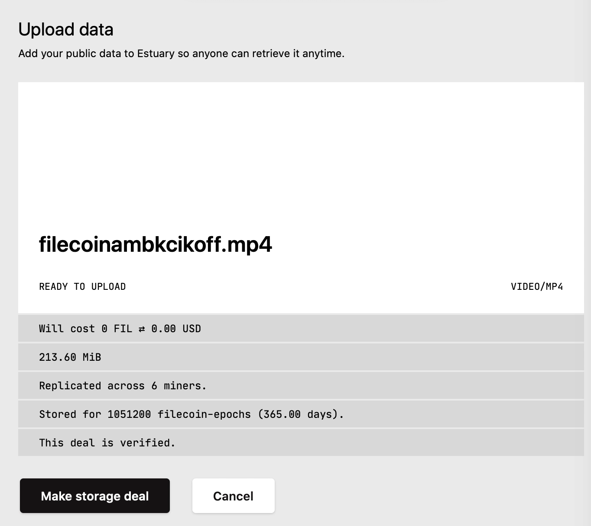
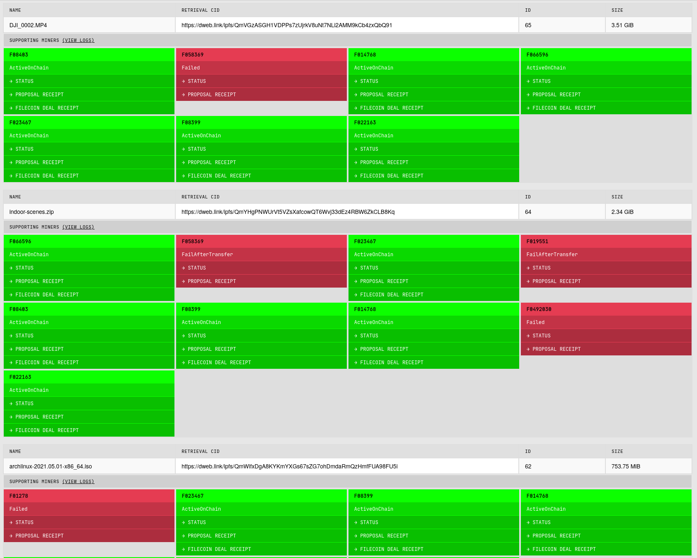
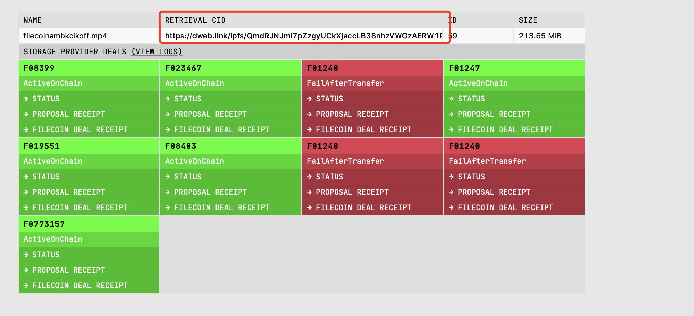

# {{ $frontmatter.title }}

{{ $frontmatter.description }} [Estuary](https://estuary.tech) automates storage activities with Filecoin and allows users to store public data on the Filecoin Network and retrieve it from anywhere, anytime, for free. 

Estuary is built by [ARG](https://arg.protocol.ai/) and is completely open source and available at [https://github.com/application-research/estuary](https://github.com/application-research/estuary).

You can read more about Estuary in the [Estuary docs](https://docs.estuary.tech).

To try Estuary, join #arg in [Filecoin Slack](https://filecoinproject.slack.com/ssb/redirect), ask for an user invite and sign up [here](https://estuary.tech/sign-up)! 

## Store Data on Filecoin

If you want to quickly upload any data that is to be hosted on IPFS and stored on the Filecoin network:

1. Go to [estuary.tech](https://estuary.tech) and log in.
2. Select **Deals** from the sidebar menu.
3. Click **Upload data** and select the file you want to upload and create a storage deal for. Once the file is successfully uploaded, Estuary will output the cost for storing the data on the Filecoin Network, in both [FIL](https://docs.filecoin.io/reference/glossary/#fil) and USD, size of the data, amount of the storage providers that the file is store, duration of the storage and wether the[ deal is verified](https://spec.filecoin.io/#section-algorithms.verified_clients).

   

4. If your file is larger than 3.57Gib, that's it, you can then click "Make storage deal" and Estuary will first host the file on IPFS and attempt to make storage deals with 6 storage providers! To check your deal information, select **Deals** from the sidebar menu.

 

5. If your data is less than 3.57Gib, it will be hosted on IPFS first and placed in the `Staging Zone`, a storage deal will be made a few hours later for the data to be stored on Filecoin Network.
   

## Retrieve Your Data

Your data is retrievable as soon as a deal is created. Simply go to your deal page by selecting **Deals** from the sidebar menu, find the file you want to retrieve and click the link under `RETRIEVAL CID` and you will get the data at any minute!

 

::: tip
Your data is retrievable even it is in [Staging Zone]((#staging-zone))! Just select **Staging** from the sidebar menu and click the link under `RETRIEVAL CID` to get your data!
:::

## Additional resources

- [Estuary Github repository](https://github.com/application-research/estuary)
- [Estuary documentation](https://docs.estuary.tech)
- [Build with Estuary](https://docs.filecoin.io/build/estuary/)
- [Sample application built with Estuary](https://github.com/application-research/estuary-www)
- [Who is ARG](https://arg.protocol.ai)

