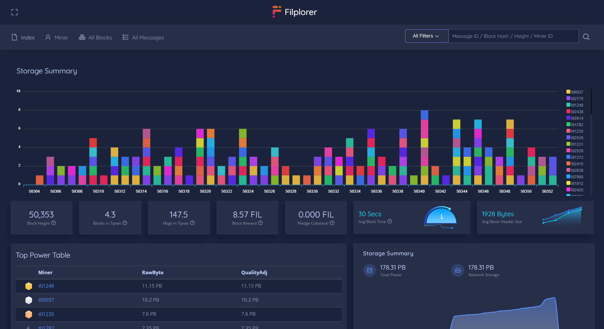

# Explore the Filecoin chain

To get information about the chain you can check the available commands using:

```bash
$ lotus chain --help
```

In this section you can find the Block Explorers.

## Filscan

[Filscan](https://filscan.io/)


## Filscout

[Filscout](https://filscout.io/)


## Filplorer

[Filplorer](https://filplorer.com/)



## 1475 Explorer

[1475 Explorer](https://1475ipfs.com/#/blockBrowser)


## Filfox

[Filfox](https://filfox.io/)


