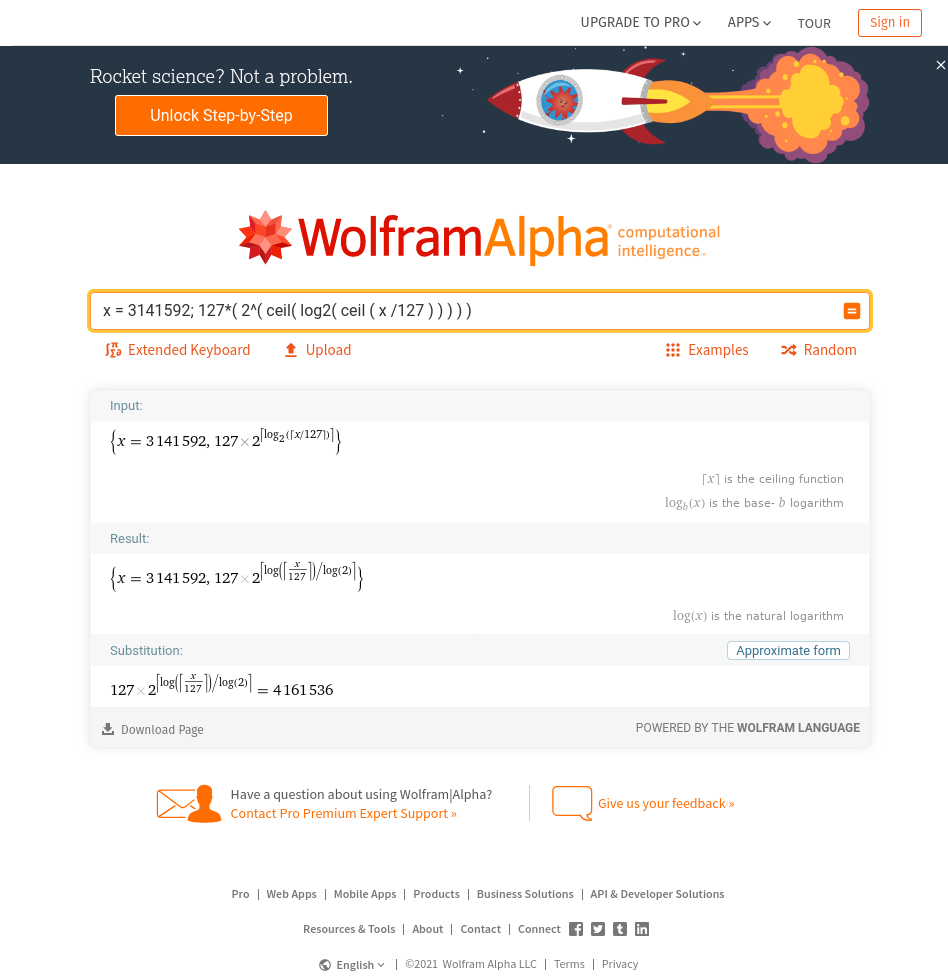

# {{ $frontmatter.title }}

{{ $frontmatter.description }}

This guide assumes you are familiar with the [normal storage deal workflow](store-data.md).

[[TOC]]

## Maximizing storage per sector

In Filecoin, **files must be smaller than the sector in which they are stored**.

Usually sectors are incorrectly described as being 32 gigabytes or 1 megabyte, where in reality they are 32 gibibytes (GiB) and 1 mebibyte (MiB) respectively. Thus a 32GiB sector has 2^30 bytes (1,073,741,824 bytes) instead of 1,000,000,000 bytes.

However, **not all the space in a sector can be used effectively**. For each 256 bits, 2 bits are reserved for proof processes. Thus the usable size of the sector is:

<center>
<b>sector-size * 254 / 256**</b>
</center>

Here is a quick table:

| Sector Size | Usable size          |
| ----------- | -------------------- |
| 2KiB        | 2,032 bytes          |
| 8MiB        | 8,323,072 bytes      |
| 512MiB      | 532,676,608 bytes    |
| 32GiB       | 34,091,302,912 bytes |
| 64GiB       | 68,182,605,824 bytes |

## Deals with offline data transfer

Filecoin's offline data transfer feature is recommended for petabyte-scale datasets and larger. This allows users with very large datasets to complete the data transfer step offline (e.g. by shipping hard drives from the client to the storage miner), while the storage deal continues to work as intended on-chain.

It is implemented via a flag on the storage deal command that tells the client not to transfer the data over the network, and provides a piece CID (a unique identifier describing the data) to the miner instead, which a miner must then match for the deal to go through. This gives the client node flexibility in how it can set up the deal — for example, passing miners a specific location on a hard drive for the data they can use to generate the piece CID.

### Generate a unique piece CID

1. Use the Lotus client to generate a CAR file of the input without importing:

```sh
lotus client generate-car <inputPath> <outputPath>
```

2. Use the Lotus client to generate the piece CID:

```sh
lotus client commP <inputCarFilePath>
```

### Calculate the datasize

1. Take the final car size `ls -l data.car`
1. Round it up to the nearest power of 2. This is your padded piece size.
1. Divide by 128, multiply by 127. this is your unpadded piece size.
1. Go to [Wolfram Alpha](https://www.wolframalpha.com).
1. Enter `x = SIZE_IN_BYTES; 127*( 2^( ceil( log2( ceil ( x /127 ) ) ) ) )` and changing `SIZE_IN_BYTES` to your value.
1. You solution can be found under **Substitution**:



Propose the offline deal with the miner:

```sh
lotus client deal --manual-piece-cid=CID --manual-piece-size=datasize <Data CID> <miner> <price> <duration>
```

### Transfer the data to the miner offline

This can be done several ways, such as shipping hard drives from the client to the storage miner.

### Finalizing: The miner's role

The miner can import the data and deal manually with:

```sh
lotus-miner storage-deals import-data <dealCid> <carFilePath>
```

Once the first Proof of Spacetime (PoSt) hits the chain, the storage deal is considered active.
