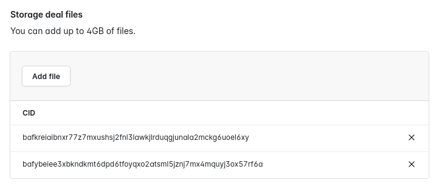
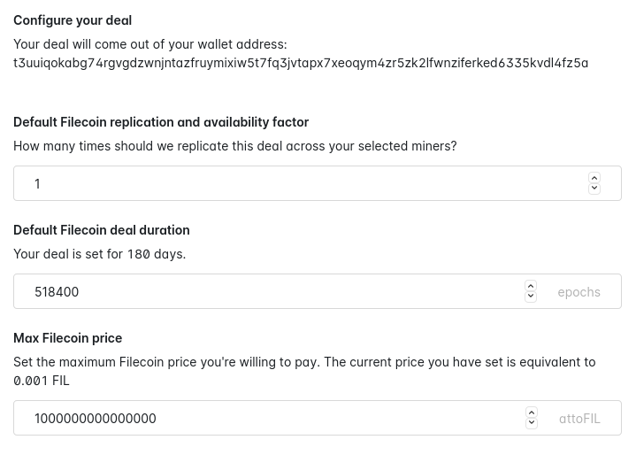
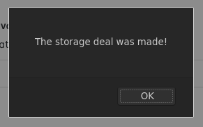

# {{ $frontmatter.title }}

{{ $frontmatter.description }} It is the first open-source file storage application designed to encourage collaboration and research across a distributed network. Slate's creation is a first step towards enabling a thriving network for data storage and transactions powered by IPFS, Filecoin, and Textile that is open and usable for everyone.

You can try out Slate at [slate.host](https://slate.host). Early members get 50GB of free storage!

## Create a one-off storage deal

If you want to quickly upload some data to the Filecoin network without first hosting it on IPFS, you can create a one-off storage deal directly through Slate.

1. Go to [slate.host](https://slate.host/) and log in.
1. Select **Storage Deal** from the sidebar menu.
1. Under **Storage deal files**, click **Add file** and select the file you want to create a storage deal for. For each file you add, Slate will output a CID.

   

1. You can further configure your deal to change things like the replication factor, deal duration, and maximum Filecoin price. Changing these values is optional, and the default values are most likely adequate for most users.

   

1. If you want to encrypt your data, check the **Encrypt this storage** box. If this box is not checked, **the files you uploaded will be available to anyone with the CIDs**. Do not check this box if you intend to share the files you selected.
1. Finally, click **Make storage deal** to instruct Slate to attempt to make a storage deal. An alert box confirms that your deal was successful.

   

#### Include or ignore specific miners

If you have a specific miner that you would like to send your request to, you can enter their Miner ID by clicking **Add miner** under the **Miners** section. Slate will attempt to create a deal with miners listed here first. If Slate cannot create a deal with the miners you select, it will attempt to create a deal with other miners on the network. Go to **Filecoin** > **Miners** to see a list of trusted miners.

Likewise, you can specify miners you do not want to create deals with. Enter the Miner IDs for each miner you want to ignore. Slate will not attempt to make any storage deals with these miners.

## Additional resources

- [Github repository](https://github.com/filecoin-project/slate)
- [Slate Design System documentation](https://slate.host/_/system)
- [Slate Design System repository](https://github.com/filecoin-project/slate-react-system)
- [Slate: a research platform built on Textile's Powergate and Buckets](https://www.youtube.com/watch?v=FJjPMKRy8xQ)
- [How Slate works](https://www.youtube.com/watch?v=FJjPMKRy8xQ) (video)
- [Using the Slate API with IPFS and Filecoin](https://www.youtube.com/watch?v=Rknj2GqvJtg) (video)
- [Twitter](https://twitter.com/_slate)
- [Textile](https://textile.io)
