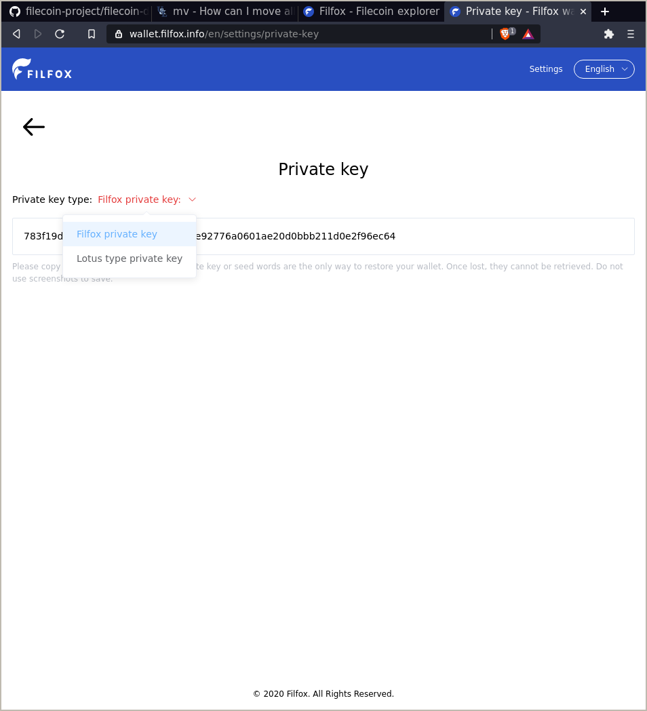

# Storage and retrieval using Filecoin+

This guide is split into six steps:

1. Generate a FIL address.
1. Sign up to Filecoin+.
1. Import your data.
1. Create a deal. 
1. Retrieve your data. 

This tutorial contains some words and phrases that you might not be familiar with:

| Word | Definition |
| --- | --- |
| Wallet | A collection of addresses. Think of each wallet as a folder, and each address as a single file in that folder. |
| Address | A string of letters and numbers that other users can send FIL to. |
| Filecoin (upper-case `f`) | The network that transactions and storage deals take place on. |
| filecoin (lower-case `f`) | The cryptocurrency that the Filecoin network runs on. |
| FIL | The shorthand representation of the filecoin cryptocurrency. |
| Private key | A string of letters and numbers that programs use to interact with the Filecoin network. Keep your private key safe and don't share it with anyone. |

## Generate a FIL address 

To send and receive data on Filecoin you need to have FIL. But before you can get FIL you need somewhere to put that FIL. There are several ways to get an address; the simpliest of which is by using a service called FilFox to create a wallet and get an address through a website. This guide assumes that you haven't already created a wallet using FilFox.

1. Go to [filfox.info](https://filfox.info).
1. Select **Wallet**.
1. Click **Create wallet**.
1. Read and accept the security warning and FilFox agreement. Click **Confirm**.
1. Chose a strong password. This password cannot be reset, so make sure you remember it. We cover why this is important in moment. 
1. FilFox will now generate and show you your _seed words_. These words, collectively known as your _seed phrase_ are incredibly important, and we'll discuss them in a moment. For now, just write down your seed words in order on a piece of paper.
1. Click **Next**.
1. Select each seed word in order. 
1. Click **Next**.
1. You should now be greeted with an empty wallet! 

You now have a Filecoin wallet, but right now you can only access it through the FilFox website. We want to use it on a Lotus node, so we need to _export_ the wallet from FilFox.

1. Click **Settings**.
1. Select **Private key**.
1. Enter your password and click **Confirm**.
1. Click the **Private key type** drop-down menu and select **Lotus type private key**.

    

1. Your private key is the long string of letters and numbers. Highlight the whole key and copy it to your clipboard.
1. Open a terminal window.
1. Create a file called `my-filfox-key` and enter the key you just copied:

    ```shell
    echo 7b2254... >> ~/my-filfox-key
    ```

    Make sure to replace `7b2254...` with the private key you just copied from FilFox.

You now have a file called `my-filfox-key` with your private key in it. We can use this file later to process transactions on the Filecoin network.

### Passwords and seed-phrases

<!-- TODO:

- Your password and seed-phrase are two very different things.
- Your wallet is saved as a cookie in your browser. Your password encrypts this cookie.
- Your seed-phrase is a linguistic representation of your wallets _private key_. Your wallet is the only wallet with that exact same arrangement of words. If someone else gets access to your seed-phrase, they have complete access to your wallet and thus can rinse you dry.

-->

## Sign up to Filecoin+

<!-- 
    What Filecoin+ is.
    Who it's for.
    Why it exists.
-->

1. Go to [plus.fil.org](plus.fil.org).
1. Select **Clients**.
1. Get verified through GitHub.

### Get DataCap

DataCap is a value assigned to your wallet that tells miners how much bonus storage you have available.

1. Enter the Filecoin address you want to send the DataCap to. 

### Encrypt your data (optional)

This step is completely optional. 

Filecoin does not automatically encrypt your data for you before storing it onto the Filecoin network. You can, of course, encrypt your data yourself before storing the data to Filecoin. Each encryption method has different tradeoffs, but if you would like to encrypt your data before storing to Filecoin, consider following [this guide from gnupg.com](https://www.gnupg.org/gph/en/manual/x110.html). 

### Import you data

1. Tell Lotus that you'd like to add a file to the Filecoin network:

    ```shell
    lotus client import ~/space-walk.tar.gz.gpg 
    ```

    Keep a note of the root CID that Lotus outputs:

    ```shell
    > Import 3, Root bafykb...
    ```

1. That's it! Super simple.

### Create a deal 

1. Start the interactive deal process:

    ```shell
    lotus client deal
    ```

    The interactive deal assistant will now as you some questions.

1. Specify the CID of the file you want to backup on Filecoin. This is the CID that you got from running `lotus client import ~/space-walk.tar.gz.gpg`:

    ```shell
    Data CID (from lotus client import): bafykbz...
    ```

1. Wait for Lotus to finish building the `.car` file.

    ```shell
    > .. calculating data size 
    ```

    The duration of this process depends on the size of your file and the specification of your Lotus node. Lotus took around 25 minutes to build the `.car` file of a ~7.5GB file with an 8-core CPU and 16GB RAM.

1. Enter the number of days you want to keep this file on Filecoin for. The minimum is 180 days:

    ```shell
    > Deal duration (days): 365 
    ``` 

1. Tell Lotus whether or not this is a Filecoin+ deal. Since we signed up to Filecoin+ and added some DataCap to our wallet in an earlier step, we select `yes` here:

    ```shell
    > Make this a verified deal? (yes/no): yes
    ```

    Make sure that your [wallet has DataCap](#get-datacap) before attempting to create a verified deal.


1. If you have a particular miner you want to use, enter their miner ID now. Otherwise, press `enter` and have Lotus query all available miners: 

    ```shell
    > Miner Addresses (f0.. f0..), none to find: 
    > .. getting miner list
    > * Found 1422 miners with power
    ```

    Once Lotus finds all available miners, it asks them if they are willing to accept your `.car` file:

    ```shell
    > .. querying asks
    > * Queried 1372 asks, got 402 responses
    > Found 356 candidate asks
    > Proposing from f136b5uqa73jni2rr745d3nek4uw6qiy6b6zmmvcq, Current Balance: 2 FIL
    ```

1. Specify how much you are willing to spend to host this file on Filecoin:

    ```shell
    > Maximum budget (FIL): 0.5
    > 298 asks within budget
    ```

    Lotus has found 298 miners that are willing to take our file for a price _below_ our maxium spend.

1. Specify how many miners you want your file to be replicated over. The default it one. 
    
    ```shell
    Deals to make (1): 1
    ```

    The more deals you want to make, the more this transaction will cost. If you want to pay 0.5 FIL to store 1 file over 3 miners, then the transaction will cost 1.5 FIL in total (`0.5 * 3 = 1.5)`.

1. Lotus will select a miner to use:

    ```shell
    .. Picking miners
    ```

1. Confirm your transaction:

    ```shell
    > -----
    > Proposing from f136b5uqa73jni2rr745d3nek4uw6qiy6b6zmmvcq
    >         Balance: 2 FIL
    > 
    > Piece size: 8GiB (Payload size: 7.445GiB)
    > Duration: 7200h0m0s
    > Total price: ~0 FIL (0 FIL per epoch)
    > Verified: true
    > 
    > Accept (yes/no): yes
    ```

1. Lotus sends your transaction to the blockchain, and returns a transaction ID:

    ```shell
    .. executing
    Deal (f023978) CID: bafyreict2zhkbwy2arri3jgthk2jyznck47umvpqis3hc5oclvskwpteau
    ```

<!--
## Notes

Here's a collection of stuff I got stuck on, got confused about, or just didn't like.

### Deal states are confusing

We need to list out what the different _deal states_ mean. Like, mine is currently on `StorageDealClientFunding`. Is that good? In fact, we should probably list exactly what each item in this table means:

```
lotus client list-deals

> DealCid      DealId  Provider  State                     On Chain?  Slashed?  PieceCID     Size       Price             Duration  Verified  
> ...efwnzpxq  0       f0127354  StorageDealClientFunding  N          N         ...tun3yeoi  7.938 GiB  0.0002093832 FIL  523458    true  
```

### Calculating data size

Calculating data size takes quite a long time, and there's no output saying that it's still processing or loading. Also, if you start the deal making process but then cancel out after Lotus has calculated the data size, and then try to remake a deal using the same CID, Lotus tries to calculate the data size all over again! Why can't Lotus just check if it's already calculated the data size of that CID?

It took about 25 minutes to calculate the data size of a ~7.5GB file on an 8 core 16GB Digital Ocean droplet.

### From the deal making process:

```shell
root@ubuntu-s-4vcpu-8gb-tor1-01:~# lotus client local                                         
1: bafykbzacec2qg6o25kxnyx7hndxdfcfj2qlnv3bzb4pjefuf42dsx5wjjmc2g @/root/the-lord-of-the-rings
-trilogy.tar.gz.gpg (import)                                                                  
2: <nil> @/root/list (import)                                                                 
root@ubuntu-s-4vcpu-8gb-tor1-01:~# lotus client deal                                          
Data CID (from lotus client import): bafykbzacec2qg6o25kxnyx7hndxdfcfj2qlnv3bzb4pjefuf42dsx5wj
jmc2g                                                                                         
.. calculating data size                                                                      
Deal duration (days): ^CERROR: EOF 
root@ubuntu-s-4vcpu-8gb-tor1-01:~# lotus client deal                                          
Data CID (from lotus client import): bafykbzacec2qg6o25kxnyx7hndxdfcfj2qlnv3bzb4pjefuf42dsx5wj
jmc2g                                                                                         
.. calculating data size                                                                      
Deal duration (days): 300 
Make this a verified deal? (yes/no): yes
Miner Addresses (f0.. f0..), none to find: 
.. getting miner list
* Found 1422 miners with power[k1;5A
.. querying asks
* Queried 1372 asks, got 402 responses
Found 356 candidate asks
Proposing from f136b5uqa73jni2rr745d3nek4uw6qiy6b6zmmvcq, Current Balance: 2 FIL
Maximum budget (FIL): 0.5
Error: parsing FIL: unrecognized suffix: "\x02\x1b[1;5A\x1bkkk0.5"
Proposing from f136b5uqa73jni2rr745d3nek4uw6qiy6b6zmmvcq, Current Balance: 2 FIL
Maximum budget (FIL): 0.5
298 asks within budget
Deals to make (1): 1
.. Picking miners
-----
Proposing from f136b5uqa73jni2rr745d3nek4uw6qiy6b6zmmvcq
        Balance: 2 FIL

Piece size: 8GiB (Payload size: 7.445GiB)
Duration: 7200h0m0s
Total price: ~0 FIL (0 FIL per epoch)
Verified: true

Accept (yes/no): yes
.. executing
Deal (f023978) CID: bafyreict2zhkbwy2arri3jgthk2jyznck47umvpqis3hc5oclvskwpteau

```
-->
