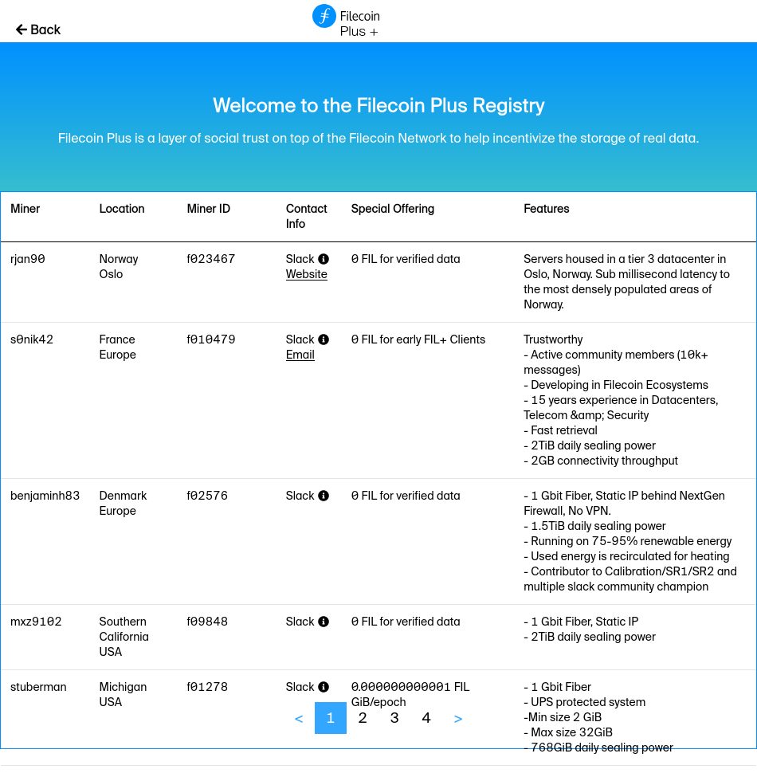

# Storage and retrieval using Filecoin+

This tutorial contains some words and phrases that you might not be familiar with:

| Word | Definition |
| --- | --- |
| Wallet | A collection of addresses. Think of each wallet as a folder, and each address as a single file in that folder. |
| Address | A string of letters and numbers that other users can send FIL to. |
| Filecoin (upper-case `F`) | The network that transactions and storage deals take place on. |
| filecoin (lower-case `f`) | The cryptocurrency that the Filecoin network runs on. |
| FIL | The shorthand representation of the filecoin cryptocurrency. |
| Private key | A string of letters and numbers that programs use to interact with the Filecoin network. Keep your private key safe and don't share it with anyone. |
| [Block explorer](/get-started/explore-the-network/#block-explorers) | A service, usually a website, that lets you view details of a blockchain such as transactions, deals, and addresses. |

The Filecoin storage and retrival process is split into three main parts: the set-up, storing you data, and retrieving your data. Each part has several sub-processes that we need to follow.

1. Set up:

    a. Get access to a Lotus full-node.
    a. Start a Lotus lite-node on your local computer.
    a. Get a FIL address.
    a. Sign up to Filecoin+.

1. Store data: 

    a. Package your data.
    a. Import your data into Lotus.
    a. Find a miner through the MinerX program.
    a. Create a storage deal.
    a. Wait for the deal to complete.

1. Retrieve data:

    a. Create a retrieval deal.
    a. Download your data.

## Set up

<!-- TODO: Explain all the steps we're going to do in this section. -->

### Get access to a Lotus full-node

A Lotus full-node is a computer running the `lotus daemon`. Full-nodes are special because they have complete access to the Filecoin blockchain. The computer specifications required to run a Lotus full-node are higher than most end-user laptops and PCs, which is why we recommend running a Lotus full-node on a remote server, or connecting to a service that has Lotus full-nodes ready for you!

Choose one:

1. Set up your own Lotus full-node on a remote server.
1. Connect to a node-hosting service.

#### Set up your own Lotus full-node

<!-- TODO: How to install Lotus on a Ubuntu server. -->

#### Connect to a node-hosting service

<!-- TODO: How to sign up to a node-hosting service. -->

### Install a Lotus lite-node on your local computer

<!-- TODO: Copy the installation instructions from the Lotus lite-node page. -->

### Get a FIL address

<!-- TODO: Generate a FIL address using the local Lotus lite-node. -->


### Sign up to Filecoin+

<!-- TODO: Explain what Filecoin+ is, who it's for, and why it exists. -->

1. Go to [plus.fil.org](plus.fil.org).
1. Select **Clients**.
1. Get verified through GitHub.

DataCap is a value assigned to your wallet that tells miners how much bonus storage you have available.

1. Enter the Filecoin address you want to send the DataCap to. 

### Next steps

Now that we've got all the set up out of the way, we can move onto storing data with the Filecoin network. 

## Store data

Now we can get started with _storing_ the stuff we want to archive on Filecoin. We first need to prepare it into a format that Lotus can manage.

### Prepare your data

We want to store the [ISS_COORDS_2021-03-25 dataset](https://data.nasa.gov/Space-Science/ISS_COORDS_2021-03-25/qti9-kibp) from NASA. This data represents the best estimated real-time trajectory and local sightings opportunities for the International Space Station as generated by the Trajectory Operations and Planning flight controllers at Johnson Space Center. 

This dataset constist of the following files:

```shell
ISS_COORDS_2021-03-25
├── ISS.OEM_J2K_EPH.txt
├── XMLsightingData_citiesINT01.xml
├── XMLsightingData_citiesINT02.xml
├── XMLsightingData_citiesINT03.xml
├── XMLsightingData_citiesINT04.xml
├── XMLsightingData_citiesINT05.xml
├── XMLsightingData_citiesUSA01.xml
├── XMLsightingData_citiesUSA02.xml
├── XMLsightingData_citiesUSA03.xml
├── XMLsightingData_citiesUSA04.xml
├── XMLsightingData_citiesUSA05.xml
├── XMLsightingData_citiesUSA06.xml
├── XMLsightingData_citiesUSA07.xml
├── XMLsightingData_citiesUSA08.xml
├── XMLsightingData_citiesUSA09.xml
├── XMLsightingData_citiesUSA10.xml
├── XMLsightingData_citiesUSA11.xml
├── XMLsightingData_natparksUSA01.xml
└── XMLsightingData_natparksUSA02.xml
```

1. Download the ISS_COORDS_2021-03-25 dataset, extract it, and move the files into a new folder called `filecoin-package`:

    ```shell
    cd ~
    wget IPFS_LINK_TO_DATASET
    tar -xvzf ISS_COORDS_DATASET.tar.gz
    mkdir ~/filecoin-payload-folder
    mv ISS_COORDS_DATASET/* ~/filecoin-payload-folder 
    ```

1. Move out of the `filecoin-payload-folder` and pack everything into a `.tar` file:

    ```shell
    cd ~
    tar -cvf ~/filecoin-payload.tar ~/filecoin-payload-folder
    ```

We now have our payload file ready to be stored using the Filecoin network.

### Add data to Lotus

We need to tell our Lotus lite-node which file we want to store using Filecoin.

1. Import the payload into the `lotus daemon` using the `import` command: 

    ```shell
    lotus client import ~/filecoin-payload.tar 
    ```

    Lotus creates a distributed-asyclic-graph (DAG) based off the payload. This process takes a few minutes. Once's it's complete Lotus will output the root CID of the payload.

    ```shell
    > Import 3, Root bafykb...
    ```

1. Make a note of the CID. We'll be using it in an upcoming section.

Now that Lotus knows which file we want to use, we can create a deal with a Filecoin miner to store our data!

## Find a miner through the MinerX program

<!-- TODO: explain what the MinerX program is, why it exists, and why we need to use it instaed of using vanilla-Filecoin. -->

1. Go to [plus.fil.org/miners](https://plus.fil.org/miners/).
1. Using the table, find a miner that suits your needs. For the sake of this tutorial, look for a miner that is:
    a. Close to you.
    a. Offering verfied-data deals for 0 FIL.
1. Once you have found a suitable miner, copy their `miner_id` from the **Miner ID** column:

    

    Some miners list multiple miner IDs. For these miners, just copy one of the IDs:

    

1. Write down ID of the miner you want to use. We'll be referring to it in the next section.

## Create a deal 

1. Start the interactive deal process:

    ```shell
    lotus client deal
    ```

    The interactive deal assistant will now ask you some questions.

1. Specify the CID of the file you want to backup on Filecoin. This is the CID that you got from running `lotus client import ~/filecoin-payload.tar`:

    ```shell
    Data CID (from lotus client import): bafykbz...
    ```

1. Wait for Lotus to finish building the `.car` file.

    ```shell
    > .. calculating data size 
    ```

    The duration of this process depends on the size of your file and the specification of your Lotus node. Lotus took around 25 minutes to build the `.car` file of a ~7.5GB file with an 8-core CPU and 16GB RAM.

1. Enter the number of days you want to keep this file on Filecoin for. The minimum is 180 days:

    ```shell
    > Deal duration (days): 365 
    ``` 

1. Tell Lotus whether or not this is a Filecoin+ deal. Since we signed up to Filecoin+ and added some DataCap to our wallet in an earlier step, we'll select `yes` here:

    ```shell
    > Make this a verified deal? (yes/no): yes
    ```

1. Enter the miner ID from the previous section: 

    ```shell
    > Miner Addresses (f0.. f0..), none to find: f3141592654 
    ```

    <!-- TODO: find out what happens after you throw in a MINER_ID. -->

1. Enter `0` when asked how much FIL we are willing to spend for this storage deal:

    ```shell
    > Maximum budget (FIL): 0.5
    ```

    <!-- TODO: find out what happens after you throw in a MINER_ID. -->

    Normally, we would enter a value of around `0.5 FIL` here. However, since we picked a miner that is accepting 0 FIL deals for verified storage deals, and we are a verified client, then we don't actually need to spend any FIL here!

1. Specify how many miners you want your file to be replicated over. The default it one 

    ```shell
    Deals to make (1): 1
    ```

1. Confirm your transaction:

    ```shell
    > -----
    > Proposing from f136b5uqa73jni2rr745d3nek4uw6qiy6b6zmmvcq
    >         Balance: 2 FIL
    > 
    > Piece size: 8GiB (Payload size: 7.445GiB)
    > Duration: 7200h0m0s
    > Total price: ~0 FIL (0 FIL per epoch)
    > Verified: true
    > 
    > Accept (yes/no): yes
    ```

1. Lotus will returns a **Deal CID**:

    ```shell
    .. executing
    Deal (f023978) CID: bafyreict2zhkbwy2arri3jgthk2jyznck47umvpqis3hc5oclvskwpteau
    ```

### Wait for the deal to complete

We need to wait for the miner to accept our deal and _seal_ the data. This process can take up to 24 hours to complete, depending on how much data we asked the miner to store.

1. List successful and pending deals by using the `list-deals` command:

    ```shell
    lotus client list-deals
    
    >
    ```
    <!-- TODO: show what happens when you list the deals. -->

    If you cannot see your deal in the list, the deal may have failed. Use `--list-failed` to see failed deals:

    ```shell
    lotus client list-deals --list-failed

    > 
    ```

    <!-- TODO: show what happens when you list failed the deals. -->

<!-- TODO: add a conclusiong to the storage deal steps. -->

## Retrieve

<!--
## Notes

Here's a collection of stuff I got stuck on, got confused about, or just didn't like.

### Deal states are confusing

We need to list out what the different _deal states_ mean. Like, mine is currently on `StorageDealClientFunding`. Is that good? In fact, we should probably list exactly what each item in this table means:

```
lotus client list-deals

> DealCid      DealId  Provider  State                     On Chain?  Slashed?  PieceCID     Size       Price             Duration  Verified  
> ...efwnzpxq  0       f0127354  StorageDealClientFunding  N          N         ...tun3yeoi  7.938 GiB  0.0002093832 FIL  523458    true  
```

### Calculating data size

Calculating data size takes quite a long time, and there's no output saying that it's still processing or loading. Also, if you start the deal making process but then cancel out after Lotus has calculated the data size, and then try to remake a deal using the same CID, Lotus tries to calculate the data size all over again! Why can't Lotus just check if it's already calculated the data size of that CID?

It took about 25 minutes to calculate the data size of a ~7.5GB file on an 8 core 16GB Digital Ocean droplet.

### From the deal making process:

```shell
root@ubuntu-s-4vcpu-8gb-tor1-01:~# lotus client local                                         
1: bafykbzacec2qg6o25kxnyx7hndxdfcfj2qlnv3bzb4pjefuf42dsx5wjjmc2g @/root/the-lord-of-the-rings
-trilogy.tar.gz.gpg (import)                                                                  
2: <nil> @/root/list (import)                                                                 
root@ubuntu-s-4vcpu-8gb-tor1-01:~# lotus client deal                                          
Data CID (from lotus client import): bafykbzacec2qg6o25kxnyx7hndxdfcfj2qlnv3bzb4pjefuf42dsx5wj
jmc2g                                                                                         
.. calculating data size                                                                      
Deal duration (days): ^CERROR: EOF 
root@ubuntu-s-4vcpu-8gb-tor1-01:~# lotus client deal                                          
Data CID (from lotus client import): bafykbzacec2qg6o25kxnyx7hndxdfcfj2qlnv3bzb4pjefuf42dsx5wj
jmc2g                                                                                         
.. calculating data size                                                                      
Deal duration (days): 300 
Make this a verified deal? (yes/no): yes
Miner Addresses (f0.. f0..), none to find: 
.. getting miner list
* Found 1422 miners with power[k1;5A
.. querying asks
* Queried 1372 asks, got 402 responses
Found 356 candidate asks
Proposing from f136b5uqa73jni2rr745d3nek4uw6qiy6b6zmmvcq, Current Balance: 2 FIL
Maximum budget (FIL): 0.5
Error: parsing FIL: unrecognized suffix: "\x02\x1b[1;5A\x1bkkk0.5"
Proposing from f136b5uqa73jni2rr745d3nek4uw6qiy6b6zmmvcq, Current Balance: 2 FIL
Maximum budget (FIL): 0.5
298 asks within budget
Deals to make (1): 1
.. Picking miners
-----
Proposing from f136b5uqa73jni2rr745d3nek4uw6qiy6b6zmmvcq
        Balance: 2 FIL

Piece size: 8GiB (Payload size: 7.445GiB)
Duration: 7200h0m0s
Total price: ~0 FIL (0 FIL per epoch)
Verified: true

Accept (yes/no): yes
.. executing
Deal (f023978) CID: bafyreict2zhkbwy2arri3jgthk2jyznck47umvpqis3hc5oclvskwpteau

```
-->
