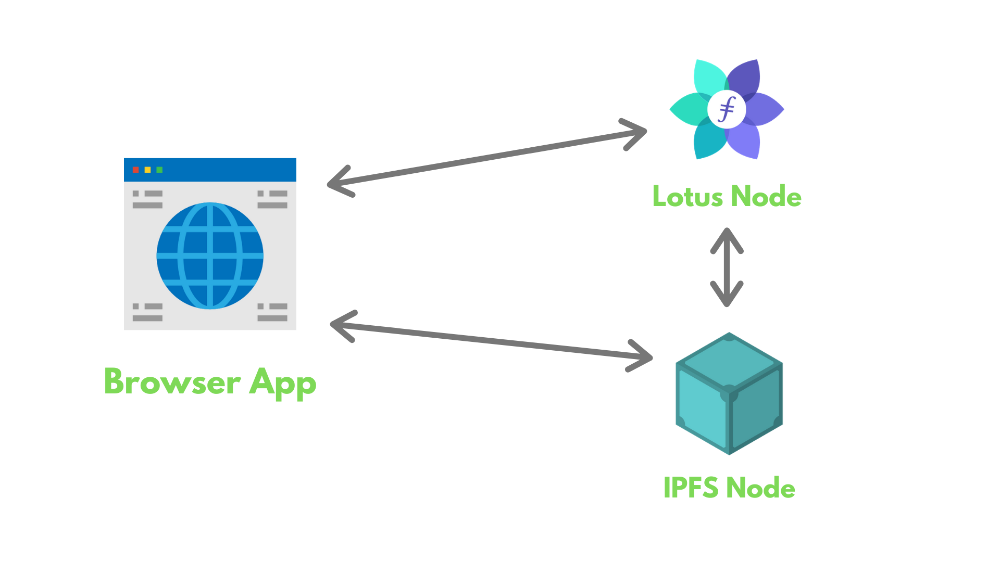

# Filecoin Network Inspector Tutorial

This tutorial shows how to build a Filecoin network inspector using [lotus](https://github.com/filecoin-project/lotus/) via a [fork](https://github.com/filecoin-shipyard/lotus-devnet) of Textile’s [lotus-devnet](https://github.com/textileio/lotus-devnet), the [Lotus JS API client](https://github.com/filecoin-shipyard/js-lotus-client), and [go-ipfs](https://github.com/ipfs/go-ipfs/).

The Filecoin network inspector interacts with several aspects of the Filecoin network that are exposed through Lotus’ JS API. The sample app in this tutorial will include:

- A simple chain explorer, showing information about Filecoin blocks.
- A miner explorer, showing information about all the active miners in the Filecoin network (in this example, this shows the miners in the local devnet).
- A marketplace, where you can add your files on the connected Filecoin network and see how storage and retrieval deals occur under the hood.
- A deals page, where you can see all your previous deals and their details.

After completing this tutorial, you will be able to:

- Setup your own local Filecoin development network (devnet).
- Connect to the running Filecoin network using different JavaScript-based libraries.
- Use the JavaScript libraries to query the endpoints for chain and miner data.
- Use JavaScript libraries to create storage and retrieval deals.
- Use JavaScript libraries to fetch details about your previous deals.

Here is a sneak-peek of how the final application will look:

@[youtube](https://youtu.be/lkx2Z3T649Y)

If you are just looking for the code, [you can visit the GitHub repo](https://github.com/filecoin-shipyard/filecoin-network-inspector/).

A high-level overview of our application architecture:

1. Docker script to run a [lotus](https://github.com/filecoin-project/lotus) node (Filecoin client) and local-devnet to mock interactions on a live network, like [testnet or mainnet](https://docs.filecoin.io/build/start-building/interacting-with-the-network/).
2. Active [go-ipfs](https://github.com/ipfs/go-ipfs/) daemon (IPFS client) to generate data CIDs and import to store on Filecoin.
3. React dashboard shows different features of the Filecoin network inspector. The dashboard uses various JavaScript libraries to interact with the lotus node and the go-ipfs node.

Before diving into the tutorial for this sample application, the next section gives you an understanding of how lotus and go-ipfs nodes interact.
