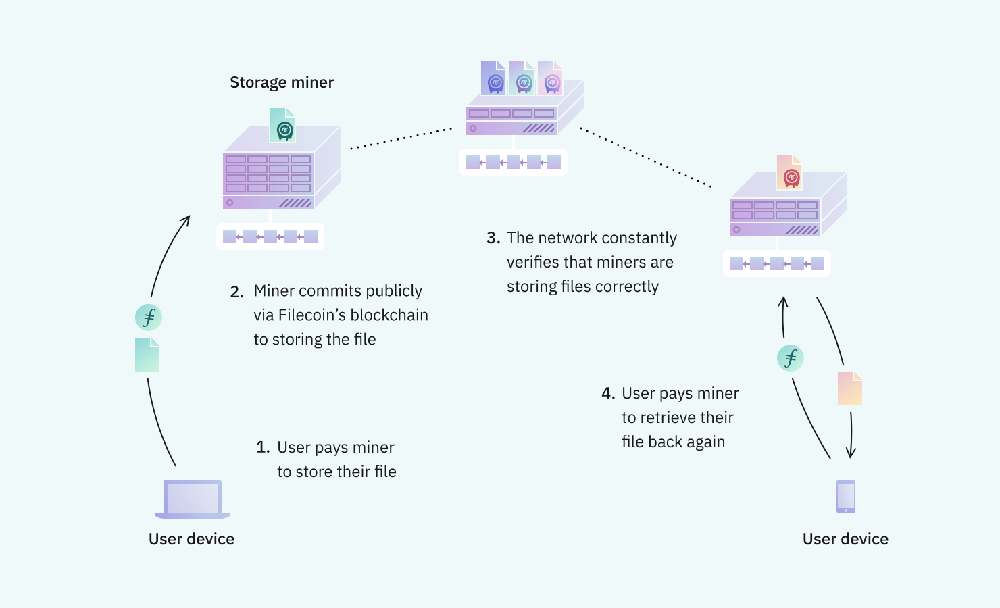

# 什么是 Filecoin？

**Filecoin 是一种点对点的文件存储网络，它内建了经济激励机制，使得文件可以始终被妥善存储。**

在 Filecoin 网络中，用户向为他们存储文件的存储矿工付钱。存储矿工是负责存储文件并能够证明它们正确存储了文件的计算机。任何有文件存储需求，或想通过提供存储空间赚钱的人都可以加入到 Filecoin。可用存储空间和价格不受任何单一的公司控制。恰恰相反，Filecoin 的开放市场让任何人都可以参与提供文件存储和检索服务。

Filecoin 包括一个区块链和本地的加密货币（FIL）。存储矿工通过存储文件赚取一定单位的 FIL。Filecoin 的区块链记录着发送和接收 FIL 的交易，同时也记录着代表存储矿工妥善存储了文件的证明。

### 对于用户

Filecoin 使用户能够以极具竞争力的价格存储他们的文件，并验证他们的文件被正确存储。

用户可以在成本、冗余和速度之间选择最符合需求的存储矿工。Filecoin 的软件程序可以与网络上的任何矿工协商存储。与中心化存储系统不同，Filecoin 不需要为每一个提供者实现不同的 API。

用户可以随时在 Filecoin 的区块链上查看证明信息，去验证他们文件是否被妥善的存储。

::: callout
[在 ProtoSchool 了解存储验证相关内容](https://proto.school/#/verifying-storage-on-filecoin)
:::

### 对于存储提供者

Filecoin 使存储提供者能够在一个开放的市场中销售他们的存储空间。

存储提供者是那些运行矿机赚取加密货币的个人或组织。矿机可以是任何具有空闲磁盘空间的联网计算机，也可以是具有大量专门为 Filecoin 构建的存储空间的专用系统。Filecoin 的区块链奖励的是那些为网络提供有用存储的矿工，而不是用来完成浪费资源的工作量证明的计算。

存储提供者实现 Filecoin 协议后就可以访问整个市场的 Filecoin 用户。他们不需要设计自己的存储 API，也不需要宣传自己的产品，因为这些事务都由 Filecoin 的协议和网络进行处理。Filecoin 通过消除准入壁垒，联结独立的存储提供者实现繁荣的去中心化生态系统。
