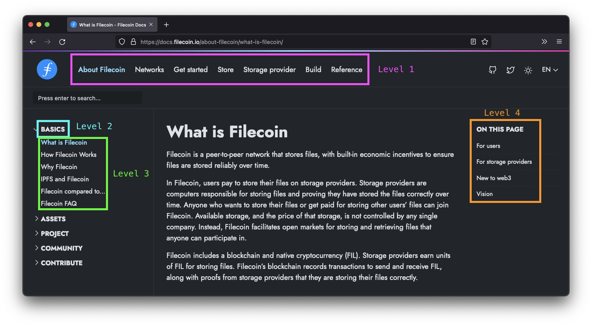

# Protocol Labs docs platform

This repository contains the base platform to build a docs site from. This platform is built using Hugo and started life in the [Doks repo](https://github.com/h-enk/doks).

## Install

1. Clone this repo and move into the folder:

    ```shell
    git clone https://github.com/protocol/pl-docs-platform && cd pl-docs-platform
    ```

1. Install the NPM dependencies:

    ```shell
    npm install
    ```

1. Start a local server to view the website:

    ```shell
    npm run start
    ```

1. Open [`localhost:1313` in a browser](http://localhost:1313) to view the site.
1. Done!

## Map

This is how the website is organized in terms of menus and pages:



1. Level 1 is the topbar navigation.
1. Level 2 is the dropdown sections on the sidebar navigation.
1. Level 3 is the pages below the dropdown sections in the sidebar navigation.
1. Level 4 is the table of contents on the right of the page. This is automatically generated on each page and is not manually configurable.

## Commands

Use the following terminal commands to create new sections and pages.

### Topbar section

To create a new topbar section, run:

```shell
npm run create -- --kind topbar-item <topbar item name>
```

To create a new level 1 section called _Basics_, run:

```shell
npm run create -- --kind topbar-item basics
```

#### Add to the topbar menu

To add this new topbar section to the topbar menu, you must add the following in `./config/_default/menus/menus.en.toml`:

```toml
[[main]]
  name = "<topbar item name>"
  url = "/<topbar-item-name>"
  weight = 1
```

To add the _Basics_ section to the topbar nav that sends to users to `/basics/install/windows/` add:

```toml
[[main]]
  name = "Basics"
  url = "/basics/install/windows/"
  weight = 1
```

The lower the `weight` number, the further left the item will appear.

### Sidebar dropdown

To create a new sidebar dropdown, run:

```shell
npm run create -- --kind sidebar-dropdown <topbar section>/<sidebar name>
```

To create a new level 2 section called _Install_ under the _Basics_ topbar section, run:

```shell
npm run create -- --kind sidebar-dropdown basics/install
```

### Page

To create a new page, run:

```shell
npm run create -- --kind page <topbar section>/<sidebar dropdown>/<page title>
```

To create a new level 3 page called _Windows_ under the _Basics_ topbar section in the _Install_ dropdown, run:

```shell
npm run create -- --kind page basics/install/windows
```

## Todo

- [x] Rename this repo to something less generic.
- [x] Figure out why Search doesn't seem to be working.
- [x] Replace topbar gradient bar with a progress bar.
- [x] Create shortcode for codeblock tabs.
- [x] Fix missing fonts.
- [ ] Add in better pictures of dogs.
- [ ] Automate favicon creation.
- [ ] Automate adding item to topbar using `npm run create ...` commands.
- [ ] Let user set homepage or not.
