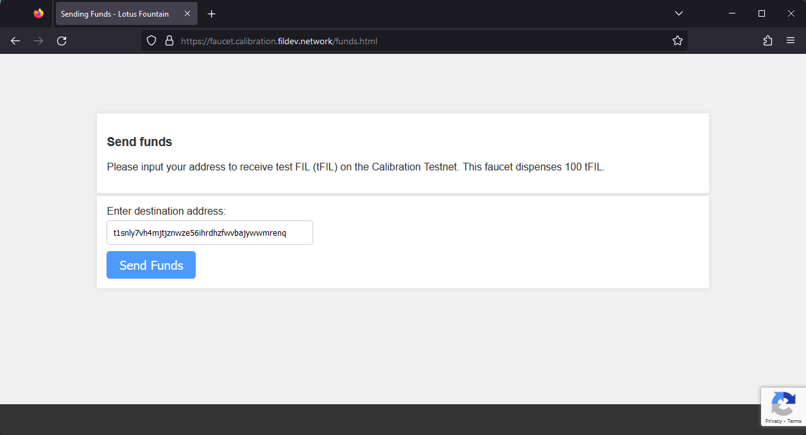
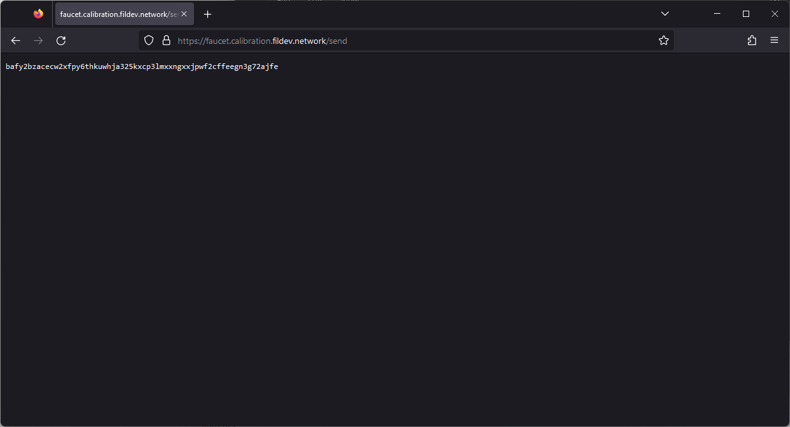
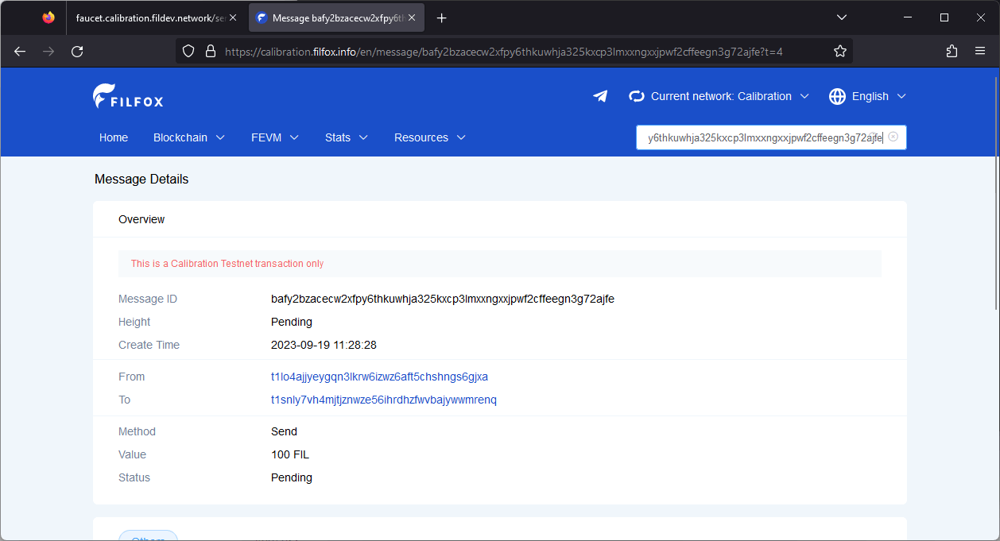

# Get test tokens

## Calibration testnet

MetaMask is one of the easier ways to manage addresses on the Calibration testnet. MetaMask uses the `t4` [address type](../filecoin-evm-runtime/address-types.md), which allows developers to create and manage Solidity contracts easily. Follow the [MetaMask setup guide](../../basics/assets/metamask-setup.md) if you havn’t set up an address in your MetaMask wallet yet.

1. In your browser, open MetaMask and copy your address to your clipboard.
2. Go to [faucet.calibnet.chainsafe-fil.io](https://faucet.calibnet.chainsafe-fil.io) and click **Send Funds**.
3.  Paste your address into the address field and click **Send funds**:

    
4.  The webpage will give you a transaction ID:

    
5.  You can copy this ID into a block explorer to track the progress of your transaction:

    

That’s all there is to it! Getting `tFil` is easy!

## Local testnet

Before we begin, you must have a local testnet running. Follow the [Run a local network guide](https://docs.filecoin.io/networks/local-testnet/set-up/) if you haven’t got a local testnet set up yet.

1. Change directory to where you created the `lotus` and `lotus-miner` binaries. If you followed the [Run a local network guide](https://docs.filecoin.io/networks/local-testnet/set-up/) these binaries will be in `~/lotus-devnet`:

```shell
cd ~/lotus-devnet
```

2. View the wallets available on this node with `lotus wallet list`:

```shell
./lotus wallet list
```

3. Create the send request with `lotus send`, supplying the pre-mined `t3q4o...` address as the `--from` address, the new `t1snl...` address as the receiving address, and the amount of FIL we want to send:

```shell
./lotus wallet list
./lotus send --from <PRE-MINED ADDRESS> <TO ADDRESS> <VALUE>
```

For example:

```shell
./lotus send --from t3q4o7gkwe7p7xokhgws4rwntj7yqfhpj5pm6cqc7dycl7cwk4uvgh2odwdvge5re7ne5gcc6xluifss5uu5cq t1snly7vh4mjtjznwze56ihrdhzfwvbajywwmrenq 2000
```

4. Check the balance of your new `t1snl...` address with `lotus wallet balance`:

```shell
./lotus wallet balance <ADDRESS>
```

For example:

```shell
./lotus wallet balance t1snly7vh4mjtjznwze56ihrdhzfwvbajywwmrenq
```

If you want to manage your local testnet tokens in MetaMask you will need to create a `t4` address. You can create a `t4` address using `lotus wallet new deleated`. Once you have a `t4` address you can [connect MetaMask to your local testnet](https://docs.filecoin.io/basics/assets/metamask-setup/) to see the new balance within the MetaMask extension.


[Was this page helpful?](https://airtable.com/apppq4inOe4gmSSlk/pagoZHC2i1iqgphgl/form?prefill\_Page+URL=https://docs.filecoin.io/smart-contracts/developing-contracts/get-test-tokens)
