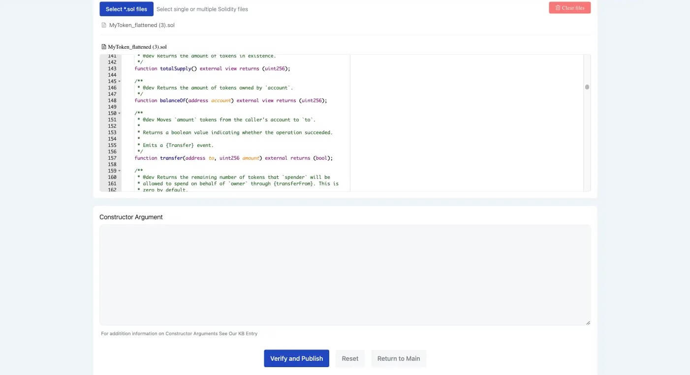

# Verify a contract

## Verification tools

The following FEVM-compatible chain explorers offer contract verification tools. For more information, click the appropriate link below.

* [Filfox](https://filfox.info/en/contract)
* [Starboard](https://fvm.starboard.ventures/explorer/verifier)
* [Beryx](https://beryx.zondax.ch/contract\_verifier)

## Verification tutorial with Filfox

The following guide walks you through the process of contract verification using the [Filfox](https://filfox.info/en/contract) explorer.

### Prerequisites

* A smart contract (`.sol` file)
* [Remix](https://remix.ethereum.org/)

### Procedure
#### Via. API (Recommended)

This section provides detailed documentation for the Filfox Contract Verification API. The API allows you to verify your smart contracts programmatically, and is the recommended method for verifying contracts. Below, you will find information on how to use the API, including the available endpoints, request and response formats, and example code snippets.

Please refer to the [documentation](https://filfox.info/api/v1/docs/static/index.html) for more information on how to verify contracts using the Filfox API.

**API Endpoint**

The Filfox Contract Verification API is available on both the mainnet and the calibration network. The endpoints for these networks are as follows:

- Mainnet: `https://filfox.info/api/v1/tools/verifyContract`
- Calibration: `https://calibration.filfox.info/api/v1/tools/verifyContract`

**Parameters**

The API accepts several parameters that you need to provide in your request. These parameters are detailed in the table below:

| Parameter       | Type        | Required | Default   | Description                                                                 | Example                                                                 |
|-----------------|-------------|----------|-----------|-----------------------------------------------------------------------------|-------------------------------------------------------------------------|
| address         | string      | No       | -         | The contract address, supporting 0x, f0, and f4 addresses                   | '0xB4C47eD546Fc31E26470a186eC2C5F19eF09BA41' or 'f02804637' or 'f410fwtch5vkg7qy6ezdqugdoylc7dhxqtosbhvnbwmq' |
| language        | string      | Yes      | 'Solidity'| The programming language used for the contract. Currently, only Solidity is supported | -                                                                       |
| compiler        | string      | Yes      | 'latest'  | The compiler version used to compile the contract                           | 'v0.7.6+commit.7338295f'                                                |
| optimize        | boolean     | Yes      | false     | Indicates whether optimization was used during compilation                  | -                                                                       |
| optimizeRuns    | number      | Yes      | 200       | The number of optimization runs if optimization was used                    | -                                                                       |
| optimizerDetails| string      | Yes      | ''        | A stringified JSON object detailing the optimizer components                | '{"constantOptimizer":true,"cse":true,"deduplicate":true,"inliner":true,"jumpdestRemover":true,"orderLiterals":true,"peephole":true,"yul":false}' |
| sourceFiles     | SourceFiles | No       | -         | The source files of the contract                                            | -                                                                       |
| license         | string      | Yes      | 'No License (None)' | The license type of the contract                                            | 'MIT License (MIT)'                                                     |
| evmVersion      | string      | Yes      | 'default' | The version of the EVM to compile for                                       | 'shanghai'                                                              |
| viaIR           | boolean     | Yes      | false     | Indicates whether to use the Yul intermediate representation during compilation | true                                                                    |
| libraries       | string      | Yes      | ''        | A stringified JSON object for libraries used in the contract                | '{"file_1.sol":{"library_1_name":"0x123..."}}'                           |
| metadata        | string      | Yes      | ''        | A stringified JSON object for metadata settings                             | '{"bytecodeHash":"none"}'                                               |

**Examples**

Here is an example of how to use the API to verify a contract:

```bash
curl --location --request POST 'https://filfox.info/api/v1/tools/verifyContract' \
  --header 'Content-Type: application/json' \
  --data-raw '{
  "address": "f02835916",
  "language": "Solidity",
  "compiler": "v0.8.17+commit.8df45f5f",
  "optimize": true,
  "optimizeRuns": 200,
  "optimizerDetails": "",
  "sourceFiles": {
    "filename1.sol": {
      "content": "contract A { function f() public { } }"
    },
    "filename2.sol": {
      "content": "contract B { function g() public { } }"
    }
  },
  "license": "",
  "evmVersion": "default",
  "viaIR": false,
  "libraries": "",
  "metadata": ""
}'
```

**Common Return Values**

See below for a list of common success and error codes (and their meanings):


**Verify ok**

```json
{
  "success": true,
  "errorCode": 0,
  "contractName": "xxx",
  "initCode": "xxx",
  "abi": "xxx"
}
```

Your contract is now verified.
​
**Source files not found**

```json
{
  "success": false,
  "errorCode": 1,
}
```

No source file was provided.
​
**Contract initcode not found**
{
  "success": false,
  "errorCode": 2,
}

Please contact Filfox on Telegram/Slack if you encounter this error.
​
**Load remote compiler failed**
{
  "success": false,
  "errorCode": 3,
}

The compiler version string must be in the long format. For example, if you would like to use version v0.7.6, you need to include the commit hash of the release like this: `v0.7.6+commit.7338295f`. Please try again later with the correct compiler version string if you encounter this error.
​
**Verify failed**
{
  "success": false,
  "errorCode": 4,
  "contractName": "xxx",
  "initCode": "6080604052348015610010...",
  "byteCode": "6080604052348015610010..."
}

Compiled bytecode doesn't match the contract's initcode, please make sure all source files and compiler configs are correct.
​
**Unsupported language**
{
  "success": false,
  "errorCode": 5,
}

Only support Solidity for now.
​
**Contract already verified**
{
  "success": false,
  "errorCode": 6,
}

The contract you are trying to verify has already been verified before.
​
**Compilation error**
{
  "success": false,
  "errorCode": 7,
  "errorMsg": "DeclarationError: Identifier not found or not unique..."
}

There is something wrong with your source files, please fix it and try again.
​
#### Via. UI

1. Open Remix:


2. In the **File Explorer** sidebar tab, under **contracts**, right click on the contract you want to verify.
3.  From the menu, select **generate UML** to flatten the `<contract-name>.sol` file and ensure that all components and tasks are included.

    A new contract with the name `<contract-name>_flattened.sol` is generated below your original contract.
4. Ensure that the license and Solidity version in the flattened contract is the same as in your original contract.
5. Click **Save**.
6. Right click on `<contract-name>_flattened.sol`.
7. In the menu, click **Download** to save the file.
8. Note the following information, as you will need it later:
   * The address of your deployed contract
   * The contract license type (if any)
   * The Solidity compiler version
9. Navigate to [Filfox](https://filfox.info/en/contract).
10. In the form, enter the information noted previously for the deployed contract you would like to verify:
    * The address
    * The license type
    * The compiler version


11. Click **Continue**.
12. Click \*_Select .sol files_.
13. Select your flattened `.sol` file.
14. Click **Verify and Publish**.



    Success! Your contract is now verified.


15. To view your verified contract:
    1. Enter the address of the contract in the [Filfox search bar](https://filfox.info/).


    2.  Scroll down the contract page and select the **Contract** tab.

        A **Contract Source Code Verified** banner is displayed, along with contract information and source code. You can also [view other verified contracts on Filfox](https://filfox.info/en/stats/verified-contracts).


