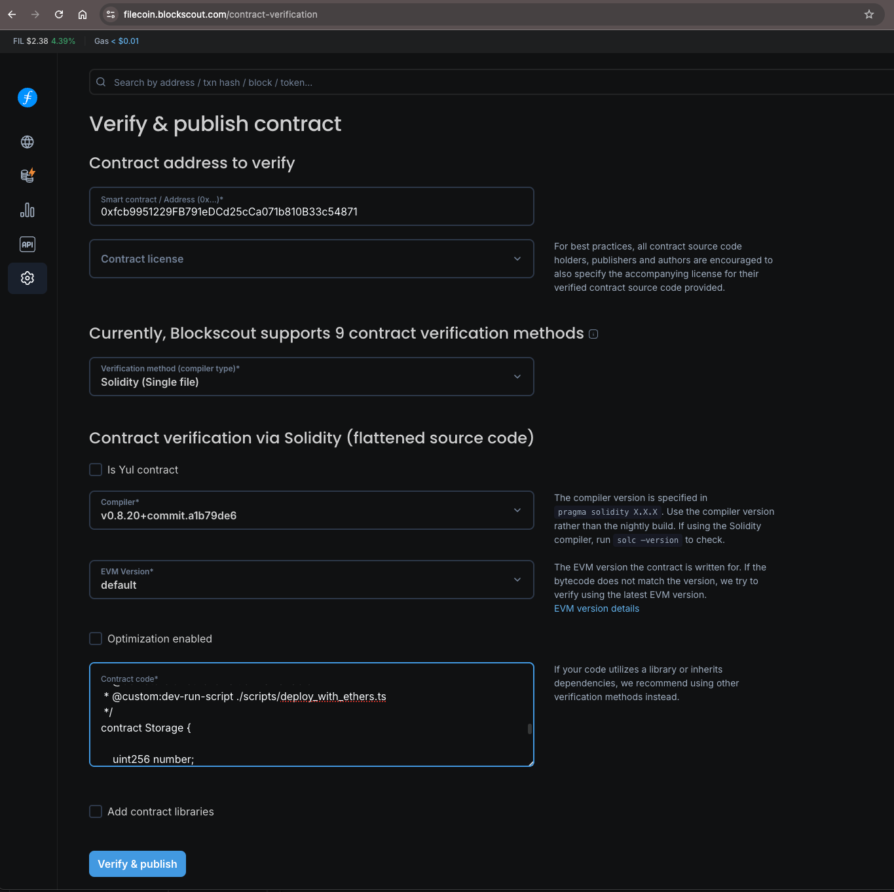
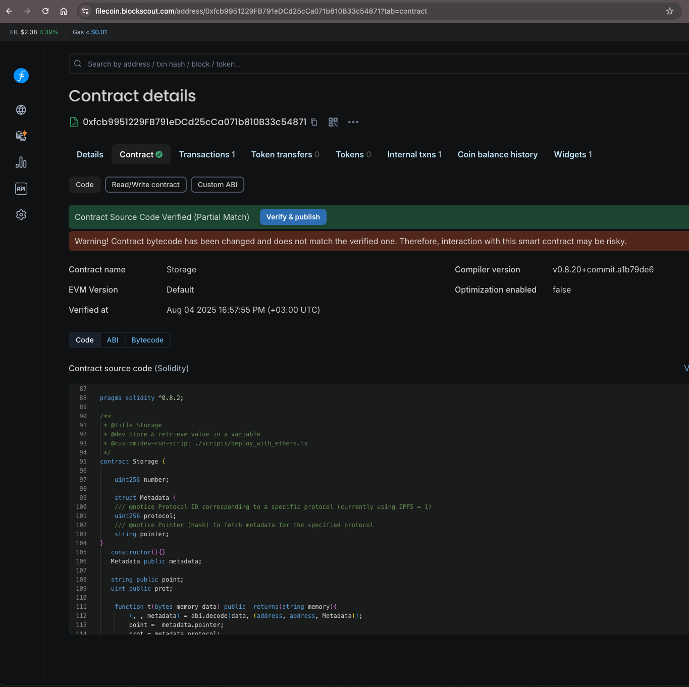

# Contract Verification with Blockscout

The following guide walks you through the process of contract verification using the [Blockscout](https://filecoin.blockscout.com/) explorer.

## Prerequisites

- A deployed smart contract on Filecoin
- Your contract's source code (`.sol` file)
- [Remix IDE](https://remix.ethereum.org/) for flattening contracts
- Contract deployment details (address, compiler version, license, optimization settings)

## Step-by-Step Verification Process

### Step 1: Prepare Your Contract Source Code

1. **Open Remix IDE:**

2. **Flatten your contract:**
   - In the **File Explorer** sidebar, under **contracts**, right-click on your contract
   - Select **Flatten** from the menu
   - This creates a `<contract-name>_flattened.sol` file with all dependencies included

3. **Verify contract details:**
   - Ensure the license and Solidity version match your original contract
   - Click **Save** to save the flattened contract

4. **Download the flattened contract:**
   - Right-click on `<contract-name>_flattened.sol`
   - Select **Download** to save the file locally

5. **Gather required information:**
   - Contract deployment address
   - Contract license type (optional)
   - Solidity compiler version used for deployment
   - Optimization settings (enabled/disabled and runs count)

### Step 2: Submit for Verification
6. **Access Blockscout verification page:**
   - Navigate to the [Blockscout Contract Verification](https://filecoin.blockscout.com/contract-verification) page

7. **Fill in contract information:**
   - Enter your contract's deployment address
   - Select the appropriate license type (optional)
   - Choose verification method: `Solidity (Single file)`
   - Enter the compiler version used for deployment
   - Paste the source code from your `<contract-name>_flattened.sol` file
   - Configure the `Optimization enabled` checkbox to match your deployment settings

8. **Submit for verification:**
   - Click **Verify & Publish** to submit your contract

### Step 3: Verification Complete

Upon successful verification, Blockscout will display a success message and redirect you to your verified contract dashboard where you can view the source code and interact with your contract.

[Was this page helpful?](https://airtable.com/apppq4inOe4gmSSlk/pagoZHC2i1iqgphgl/form?prefill_Page+URL=https://docs.filecoin.io/smart-contracts/developing-contracts/verify-a-contract)
