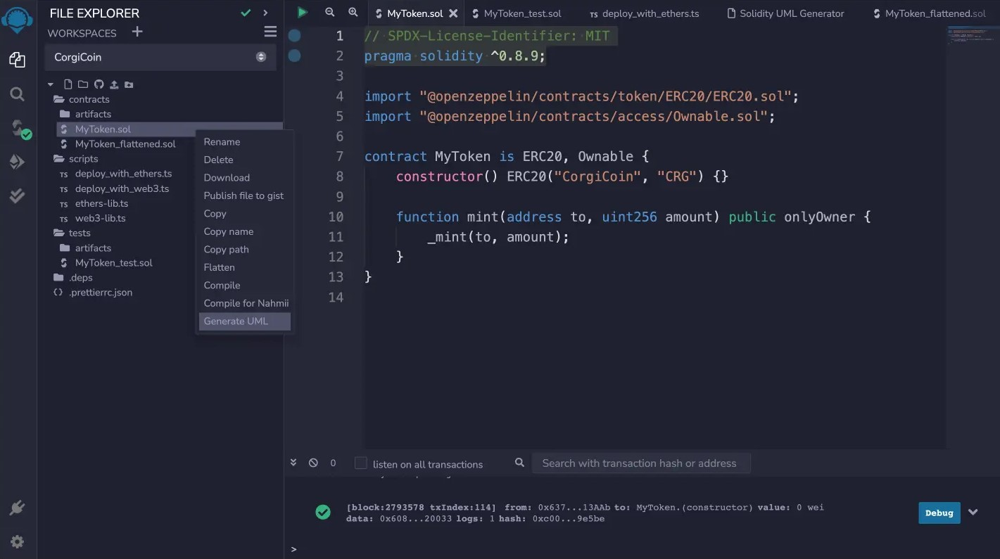
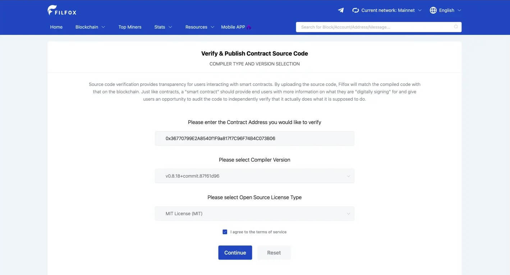
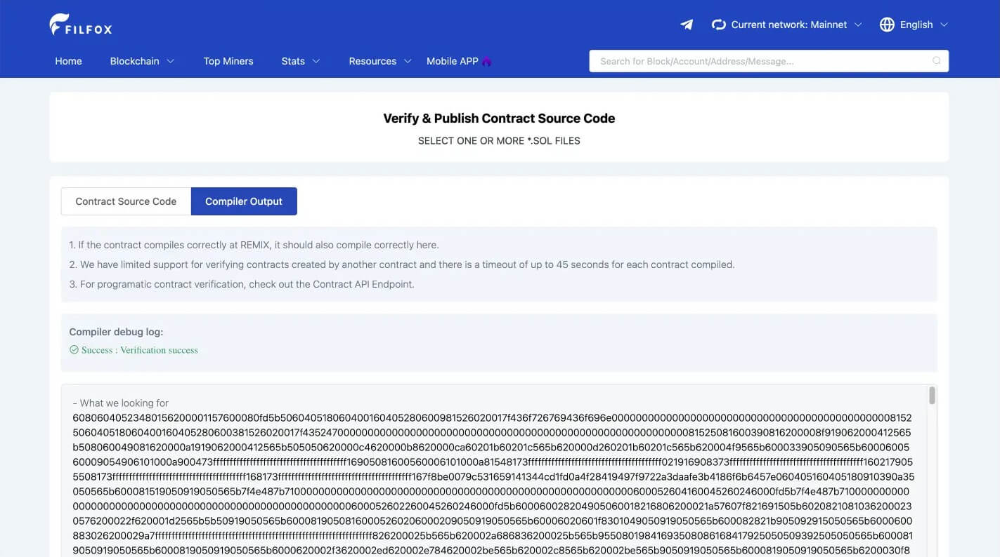
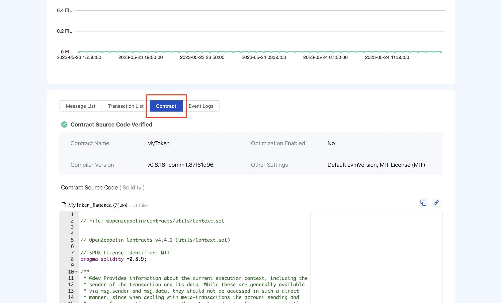
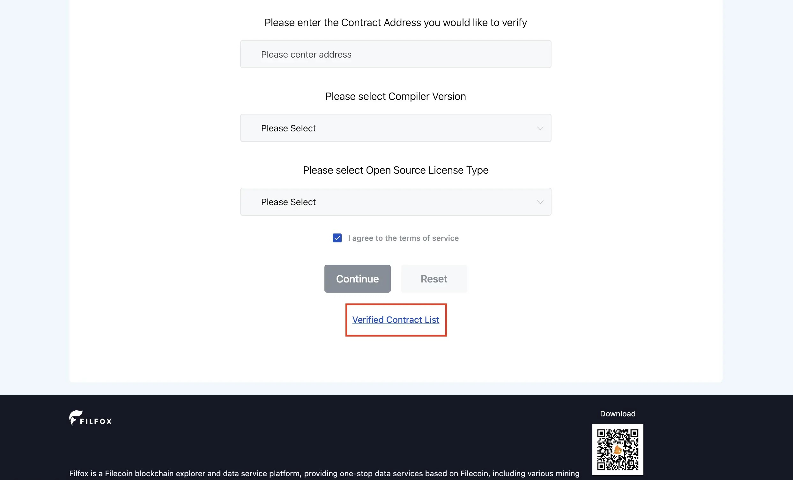

# Contract Verification with Filfox

The following guide walks you through the process of contract verification using the [Filfox Contract Verification](https://filfox.info/en/contract) page.

## Prerequisites

- A deployed smart contract on Filecoin
- Your contract's source code (`.sol` file)
- [Remix IDE](https://remix.ethereum.org/) for flattening contracts
- Contract deployment details (address, compiler version, license)

## Step-by-Step Verification Process

### Step 1: Prepare Your Contract Source Code

1. **Open Remix IDE:**

2. **Flatten your contract:**
   - In the **File Explorer** sidebar, under **contracts**, right-click on your contract
   - Select **Flatten** from the menu
   - This creates a `<contract-name>_flattened.sol` file with all dependencies included

3. **Verify contract details:**
   - Ensure the license and Solidity version match your original contract
   - Click **Save** to save the flattened contract

4. **Download the flattened contract:**
   - Right-click on `<contract-name>_flattened.sol`
   - Select **Download** to save the file locally

5. **Gather required information:**
   - Contract deployment address
   - Contract license type (if any)
   - Solidity compiler version used for deployment

### Step 2: Submit for Verification

6. **Access Filfox verification page:**
   - Navigate to the [Filfox Contract Verification](https://filfox.info/en/contract) page
7. **Fill in contract information:**
   - Enter your contract's deployment address
   - Select the appropriate license type
   - Choose the compiler version used for deployment

8. **Upload source code:**
   - Click **Continue** to proceed
   - Click **Select .sol files**
   - Choose your flattened `.sol` file
   - Click **Verify and Publish** to submit

### Step 3: Verification Complete

Once submitted, Filfox will process your verification request. Upon successful verification, you'll see a success message confirming your contract is now verified.

## Viewing Your Verified Contract

1. **Navigate to your contract:**
   - Enter your contract address in the [Filfox search bar](https://filfox.info/)
   - This will take you to your contract's page

2. **View verification status:**
   - Scroll down and select the **Contract** tab
   - Look for the **Contract Source Code Verified** banner
   - Your contract's source code and ABI will now be publicly visible

3. **Explore verified contracts:**
   - Browse [other verified contracts on Filfox](https://filfox.info/en/fevm/verified-contracts)
   - Learn from verified contract examples in the ecosystem

[Was this page helpful?](https://airtable.com/apppq4inOe4gmSSlk/pagoZHC2i1iqgphgl/form?prefill_Page+URL=https://docs.filecoin.io/smart-contracts/developing-contracts/verify-a-contract/web-interface/filfox)
