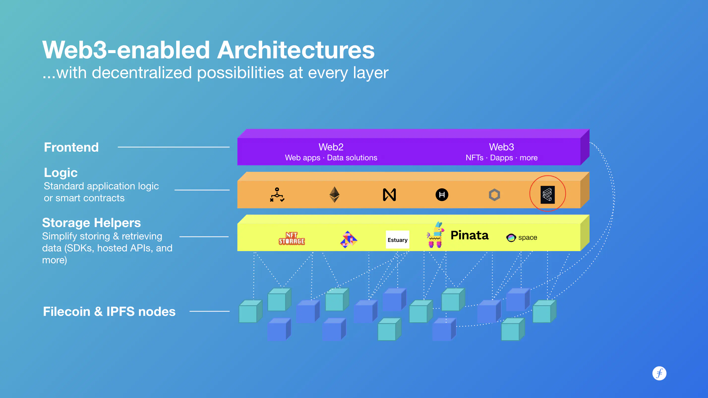

# Fundamentals

## Develop on Filecoin

Filecoin combines the benefits of content-addressed data leveraged by IPFS with blockchain-powered storage guarantees. The network offers robust and resilient distributed storage at massively lower cost compared to current centralized alternatives.

Developers choose Filecoin because it:

* is the world’s largest distributed storage network, without centralized servers or authority
* offers on-chain proofs to verify and authenticate data
* is highly compatible with [IPFS](https://ipfs.tech/) and content addressing
* is the only decentralized storage network with petabyte-scale capacity
* stores data at extremely low cost (and keeps it that way for the long term)

## Filecoin and IPFS

How do Filecoin and IPFS work together? They are complementary protocols for storing and sharing data in the distributed web. Both systems are open-source and share many building blocks, including content addressing (CIDs) and network protocols (libp2p).

IPFS does not include built-in mechanisms to incentivize the storage of data for other people. To persist IPFS data, you must either run your own IPFS node or pay a provider.

This is where Filecoin comes in. Filecoin adds an incentive layer to content-addressed data. Storage deals are recorded on-chain, and providers must submit proofs of storage to the network over time. Payments, penalties, and block rewards are all enforced by the decentralized protocol.

Filecoin and IPFS are designed as separate layers to give developers more choice and modularity, but many tools are available for combining their benefits. This diagram illustrates how these tools (often called storage helpers) provide developer-friendly APIs for storing on IPFS, Filecoin, or both.

## Filecoin and smart contracts

You can improve speed and reduce gas fees by storing smart contract data on Filecoin. With Filecoin, the data itself is stored off-chain, but is used to generate verifiable CIDs and storage proofs that are recorded on the Filecoin chain and can be included in your smart contracts. This design pairs well with multiple smart contract networks such as Ethereum, Polygon, Avalanche, Solana, and more. Your smart contract only needs to include the compact content ids.

## Get started

Let’s get building. Choose one of the following APIs. These are all storage helpers, or tools and services that abstract Filecoin’s robust deal making processes into simple, streamlined API calls.

* [Chainsafe Storage API](https://docs.storage.chainsafe.io/) - for projects needing S3 compatibility
* [NFT.storage](https://nft.storage/) - for NFT data
* [Web3.storage](https://web3.storage/) - for general application data

Examples:

* [Polygon tutorial](https://github.com/protocol/nft-website/blob/main/docs/tutorial/mint-nftstorage-polygon.md)
* [Flow tutorial](https://github.com/protocol/nft-website/blob/main/docs/tutorial/flow-nft-marketplace.md)
* [Avalanche tutorial](https://github.com/protocol/nft-website/blob/main/docs/tutorial/avax-nft.md)
* [Using IPFS & Filecoin on Harmony](https://docs.harmony.one/home/developers/tutorials/ipfs-filecoin)

## Additional resources

* [Filecoin integrations for Web3 infrastructure](https://www.youtube.com/watch?v=Q0oe6i7d1u4) (video)
* [What is an IPFS Pinning Service?](https://medium.com/pinata/what-is-an-ipfs-pinning-service-f6ed4cd7e475) (Pinata explainer)
* [IPFS documentation: Persistence, permanence and pinning](https://docs.ipfs.tech/concepts/persistence/)
* [Developing on Filecoin](https://www.youtube.com/watch?v=aGCpq0Xf-w8) (video)
* Textile tools: [video](https://www.youtube.com/watch?v=IZ8M9m9\_uJY) and [documentation](https://docs.textile.io/)
* [Building decentralized apps using Fleek’s Space daemon](https://www.youtube.com/watch?v=pWJ5fty-7mA) (video)

[Was this page helpful?](https://airtable.com/apppq4inOe4gmSSlk/pagoZHC2i1iqgphgl/form?prefill\_Page+URL=https://docs.filecoin.io/smart-contracts/fundamentals)
